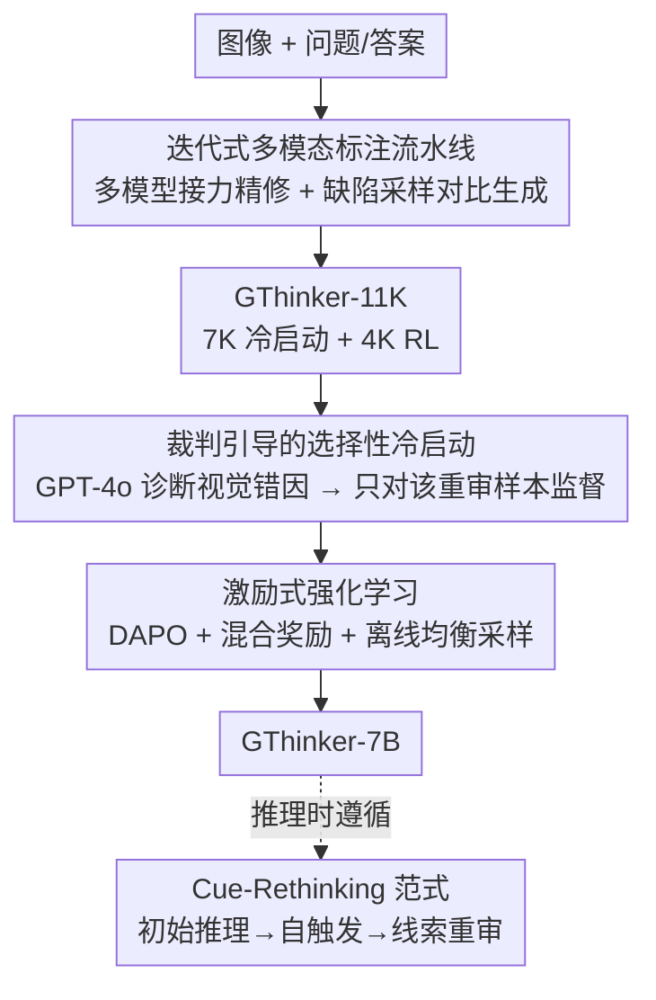

# GThinker: Towards General Multimodal Reasoning via Cue-Guided Rethinking

**会议**: CVPR 2026  
**论文**: [CVF Open Access](https://openaccess.thecvf.com/content/CVPR2026/html/Zhan_GThinker_Towards_General_Multimodal_Reasoning_via_Cue-Guided_Rethinking_CVPR_2026_paper.html)  
**代码**: https://github.com/jefferyZhan/GThinker (有)  
**领域**: 多模态VLM  
**关键词**: 多模态推理, 视觉惯性, 视觉线索重审, 强化学习, 冷启动  

## 一句话总结
GThinker 针对 MLLM "文本逻辑无懈可击却被错误的初始视觉判断带偏" 的视觉惯性问题，提出一种自由形式、以视觉线索为锚点并能自触发重审线索的 Cue-Rethinking 推理范式，再用"标注流水线 + 裁判引导选择性冷启动 + 激励式 RL"两阶段训练把这套能力灌进 Qwen2.5-VL-7B，在 M3CoT 上达到 81.5% 反超 o4-mini。

## 研究背景与动机
**领域现状**：开源 MLLM（如 Qwen2.5-VL）借助 CoT 与 RLVR（带可验证奖励的强化学习，如 DeepSeek-R1 路线）已在数学、科学等文本密集推理上逼近闭源模型。主流做法要么用结构化 CoT 模板（LLaVA-CoT、Mulberry 的固定步骤/树搜索），要么用 RLVR 强化文本推理链的反思。

**现有痛点**：作者发现一个跨领域的根本缺陷——**视觉惯性（Visual Inertia）**：模型在文本上下文里很擅长反复反思，却会无批判地"咬死"最初的视觉解读，即使后续出现矛盾也极少回头修正。论文用一个磁铁例子说明：模型完整地背出了"同极相斥、异极相吸"的物理定律（文本逻辑完美），但把它套在了一个错误的初始视觉判断上，于是必然答错。

**核心矛盾**：现有范式都不对症。结构化 CoT 模板太死板，视觉不一致的形态又多又微妙，模板根本兜不住；RLVR 擅长打磨语言推理链，但其奖励信号天然只盯最终答案的文本正确性，**不具备触发"回头重看视觉证据"的机制**。也就是说，问题出在视觉证据本身需要被重审，而这两类方法都只在文本层面打转。

**本文目标**：让模型既保留强文本逻辑，又获得"自适应视觉重审"能力，且要解决两个子问题——(1) 设计一种灵活、不破坏推理流畅性的重审范式；(2) 让模型学会**何时**该触发重审（不是每题都重审）。

**切入角度**：把"标注视觉线索 + 按需重审线索"做成推理过程的内生部分，而不是外挂一个固定模板或全局反思触发器。

**核心 idea**：用自由形式推理 + 显式视觉线索标签（`<vcues_*>`）+ 自触发的线索重审，替代僵化 CoT 模板与纯文本 RLVR，从根上对治视觉惯性。

## 方法详解

### 整体框架
GThinker 的输入是图像 + 问题，输出是带显式视觉线索标注与（按需）线索重审过程的推理链 + 最终答案。整套方案分两条线：**推理范式**这条线定义模型该"长什么样地思考"（Cue-Rethinking Pattern）；**训练管线**这条线负责把这套范式真正灌进一个 7B 基座（Qwen2.5-VL-7B），分三步——先用迭代式多模态标注流水线造出 GThinker-11K 数据，再用裁判引导的选择性冷启动教会模型"怎么按范式想 + 何时该重审"，最后用激励式强化学习（DAPO）把这套能力泛化到各类任务上。下面的框架图自上而下就是这条训练流向，三个贡献节点分别对应后面的关键设计 2/3/4，而设计 1（Cue-Rethinking Pattern）是贯穿始终的目标范式。

### 关键设计

**1. Cue-Rethinking Pattern：把"标注视觉线索 + 按需重审"做成自由形式推理的内生环节**

这是对治视觉惯性的核心机制，针对"固定模板兜不住多样视觉不一致、RLVR 不会回看视觉证据"这个痛点。它不强制任何推理结构，而是把推理切成三个阶段。**初始推理**：模型可用任意已学会的文本策略（逐步演绎、反思、知识驱动逻辑），唯一约束是必须把推理锚定在视觉证据上，并用 `<vcues_*> </vcues_*>` 标签把引用到的视觉线索显式标出来（`*` 是线索编号）——这个轻量约束既保留了自由度，又为后续重审提供了明确的锚点。**线索重审触发**：初始推理结束后，模型**自触发**一段重审提示（如 "Let's check each visual cue and the corresponding reasoning before the final answer"）。作者刻意不在标出线索后立刻重审，而是等推理跑完再回头，目的是保持推理的自然流畅与全局上下文。**基于线索的重审**：模型回看所有标注过的视觉线索，检查不一致，必要时修正或补充线索并更新对应推理，再给出最终答案。论文图 2 的例子很直观——初始把图形拼成"螃蟹"（红色错误线索），重审阶段把红色三角识别为虾头、淡紫平行四边形是虾身、蓝粉块是虾尾（绿色修正线索），最终改判为"虾"。关键在于重审是**按需（on demand）**的，不是每题强制，这与下面的训练设计直接呼应。

**2. 迭代式多模态标注流水线：用多模型接力 + 缺陷采样对比生成造出带重审过程的高质量数据**

针对的痛点是：现有重审/反思数据要么启发式构造缺乏多样性，要么从图像 caption 生成、导致推理偏文本、视觉信息严重不足。流水线分两支。**迭代精修支**：把图像、问题、答案一起喂给先进多模态模型，用精心设计的 prompt 让它生成"标注关键视觉线索 + 演绎 + 自反思"的推理过程；再做迭代精修——前一个模型的输出作为后一个模型的上下文，让后者纠错、精炼、补充（论文用 GPT-4o、o1、o3 接力，互补各自强项）。**重审标注支（"缺陷采样—对比—生成"）**：为得到含视觉线索重审的样本，先用高温采样收集多样的"错误推理样本"，再让 o3 把这些缺陷样本与已精修的正确标注做**对比**，从而生成带 cue-rethinking 过程的新样本——这样比人工编造重审过程更少幻觉。经自动校验后产出 7,358 条样本，每条都标注了"是否包含视觉线索重审过程"，这正是下一步选择性训练所需的标签。

**3. 裁判引导的选择性冷启动：用 LLM-as-judge 把失败案例转成"何时该重审"的学习信号**

针对的痛点是：对所有样本一律强制重审是次优的，而随机挑一部分样本重审又忽略了样本间差异和模型自身能力——模型不仅要学**怎么**重审，更要学**何时**该触发重审。做法是先用基座模型在训练集上跑一遍初始 rollout，再用 LLM-as-judge（消融后选 GPT-4o）输入"问题 + 答案 + 模型回答"，**诊断错误是否源于视觉线索缺陷**。对那些"因视觉推理错误而失败"的样本，就用带 cue-rethinking 过程的详细标注去监督；其余样本则用不带重审的常规推理标注监督。与拒绝采样直接丢掉错误回答不同，这种做法**把特定失败转化为有价值的学习信号**，让模型学到"恰恰是什么样的情形需要重审"。冷启动用 7K 标注数据、全局 batch 128、学习率 5e-6、训 3 epoch。

**4. 激励式强化学习：DAPO + 混合奖励 + 离线均衡采样，把重审能力泛化到多领域**

冷启动打好底后，用带可验证奖励的 RL 鼓励探索、跨任务泛化。算法采用 DAPO（在 GRPO 基础上引入 Clip-Higher、动态采样保证稳定，再用 token 级策略梯度损失与超长奖励整形细化长链监督），目标函数为

$$J(\theta) = \mathbb{E}_{(q,a)\sim D,\ \{o_i\}_{i=1}^{G}\sim \pi_{\text{old}}(\cdot|q)}\left[\frac{1}{\sum_{i=1}^{G}|o_i|}\sum_{i=1}^{G}\sum_{t=1}^{|o_i|}\min\big(r_{i,t}(\theta)\hat{A}_{i,t},\ \text{clip}(r_{i,t}(\theta),1-\varepsilon_{\text{low}},1+\varepsilon_{\text{high}})\hat{A}_{i,t}\big)\right]$$

其中 $r_{i,t}(\theta)=\frac{\pi_\theta(o_{i,t}|q,o_{i,<t})}{\pi_{\theta_{\text{old}}}(o_{i,t}|q,o_{i,<t})}$，优势用组内归一化 $\hat{A}_{i,t}=\frac{R_i-\text{mean}(\{R_i\})}{\text{std}(\{R_i\})}$。两个关键工程点：**混合奖励**——不再把 QA 死限制成多选 + 精确字符串匹配，而是支持三类题型：多选用精确匹配、数学题用 Math-Verify 抽取验证、开放式题引导模型把答案归纳成词/短语/短句再匹配（回答超长时退化为编辑距离），从而在不另起一个奖励模型的前提下兼顾题型多样性与奖励效率；外加 think-answer 结构的格式奖励。**离线均衡采样**——RL 前先抽取图像+问题的联合 embedding 做聚类采样（关注图文本身而非人工细粒度分类），再对剩余样本 rollout（n=16）丢掉模型始终答不对的样本（多半是源数据标注错误或过难），最终得到 4K 高质量 RL 数据。RL 阶段 rollout=16、batch 64、学习率 1e-6、训 170 步。

### 一个完整示例
以论文图 5 的童书识别题为例，可看清范式怎么实际发生：问题问"放着毛绒玩具的书架上最可能是哪类书"，选项含动物涂色书/故事图画书/地理章节书/动物纸板书。**初始推理**标出 `<vcues_1>` 有只袜子猴毛绒玩具、`<vcues_2>` 书名是《小王子》《时间的皱折》《夏洛的网》、`<vcues_3>` 玩具和书放一起像儿童阅读场景，于是初判为"故事图画书"。**自触发重审**后，模型回看每条线索：修正 `<vcues_2>`——这些其实是面向中年级读者的章节书/小说，不是图画书或纸板书，于是排除 B、D；又**补充** `<vcues_4>`——书旁还有一个地球仪，暗示对世界/地理的兴趣。综合修正后的线索，最终改判为"地理章节书（C）"。这个过程把"线索标注→自触发→修正/补充线索→更新结论"的闭环具象化了。

## 实验关键数据

GThinker-7B 基于 Qwen2.5-VL-7B，在 4 节点 × 8×H100 上训练约 9 小时。

### 主实验

| 基准 | 指标 | GThinker-7B | 对比基线 | 提升 |
|--------|------|------|----------|------|
| M3CoT（综合）| Overall | **81.5** | Qwen2.5-VL-7B 62.4 | +19.1 |
| M3CoT | Overall | 81.5 | LLaVA-CoT-11B 56.0 | +25.5 |
| M3CoT | Overall | 81.5 | o4-mini 80.9（闭源）| +0.6（反超）|
| M3CoT | Overall | 81.5 | 前 SOTA InternVL2.5-MPO-8B 73.3 | +8.2 |
| MMStar / RealWorldQA | 平均 | 66.4 / 70.1 | Qwen2.5-VL-7B | 平均 +2.1 |
| MMMU-Pro | acc | 40.7 | Qwen2.5-VL-7B 38.3 | +2.4 |
| MathVista | acc | 72.7 | Qwen2.5-VL-7B 68.2 | +4.5 |

在 M3CoT 上不仅超过所有开源模型，更反超闭源 o4-mini；且避免了不少 RL 模型的通病——某些领域涨、另一些域反而掉到基座以下（如 VLAA-Thinker、MM-Eureka 在 MMStar 上掉点），GThinker 则全面一致提升。

### 消融实验

GThinker 各组件逐步叠加（M3CoT，单位 %）：

| 配置 | Sci. | Com. | Math | Overall | 说明 |
|------|------|------|------|---------|------|
| Qwen2.5-VL-7B | 57.6 | 80.8 | 60.6 | 62.4 | 基座 |
| Qwen2.5-VL-7B-Zero | 63.3 | 81.6 | 49.0 | 64.2 | 仅 DAPO，无冷启动 |
| + 模式引导冷启动 | 73.1 | 79.3 | 46.9 | 73.6 | 较基座 +11.2 |
| └ w/o 裁判引导选择性训练 | 68.0 | 82.0 | 42.7 | 68.4 | 去掉后掉 5.2 |
| + 激励式 RL | 82.5 | 83.7 | 71.0 | 81.5 | 再 +6.9 |
| └ w/o 离线均衡采样 | 82.2 | 84.2 | 60.2 | 80.4 | 去掉后掉 1.1 |

数据流水线消融（Table 3，M3CoT）：仅用 caption+question 文本输入 63.5；换成本文多模态生成（无迭代精修）69.6；再加迭代精修 73.6（额外 +4.0）。裁判模型消融（Table 5）：GPT-4o 给出 M3CoT 81.5 / MMStar 66.4，开源 Qwen2.5-VL-72B 稍弱但仍达 81.1 / 65.7，远高于基线 62.4 / 63.9，说明该策略对不同能力的裁判都有效。

### 关键发现
- **裁判引导选择性训练贡献最大的"何时重审"信号**：去掉它冷启动从 73.6 掉到 68.4（-5.2），印证"把失败案例转成学习信号"比随机选样重审更有效。
- **视觉重审无法靠纯 RLVR 诱导**：仅用 DAPO 的 Qwen2.5-VL-7B-Zero 只有 64.2，远低于完整 81.5，证明 cue-rethinking 与文本中心反思本质不同，需要两阶段配方专门灌入。
- **数学域提升尤为显著**：从基座 60.6 到 71.0，说明精确的视觉线索锚定是形式化推理的关键地基，而非只对常识题有用。
- **离线均衡采样在数学题上作用突出**：去掉后 Math 从 71.0 跌到 60.2，说明 RL 数据的难度/类型均衡对难域很敏感。

## 亮点与洞察
- **"视觉惯性"这个问题定义本身很有洞察力**：用磁铁例子点出"文本逻辑完美 + 视觉前提错误 = 必然错"，把一个长期被 RLVR 论文忽略的失败模式讲透，比单纯刷分更有价值。
- **`<vcues_*>` 标签 + 延迟自触发重审是个轻巧且可迁移的 trick**：不破坏自由形式推理流畅性，只加一个显式锚点和一个"想完再回头检查"的触发器，就把视觉证据纳入可重审对象——这种"先标记后批判"的思路可迁移到任何需要回溯中间证据的推理任务。
- **"缺陷采样—对比—生成"造重审数据很巧**：与其让模型凭空编造重审（易幻觉），不如先采集真实错误再让强模型对比正确答案生成修正轨迹，天然贴近真实失败分布。
- **混合奖励 + 离线均衡采样**让 RLVR 不再被多选+精确匹配框死，把开放式题也纳入可验证奖励，是把 RL 推到 general 场景的实用工程。

## 局限与展望
- 模型规模主要验证在 7B（32B 与更多基线放在附录），跨规模的扩展性正文未充分展开。
- 标注流水线高度依赖 GPT-4o/o1/o3 等强闭源模型接力，复现成本与可获得性是现实约束；裁判也以 GPT-4o 为佳，开源裁判虽可用但稍弱。
- 平均增益 +2.1% 是在多个基准上取均值，单看部分基准（如 MathVision 26.6 vs 基座 25.1）提升较小，⚠️ 不同基准难度不可直接横向比大小。
- 重审是否被恰当触发依赖裁判诊断质量，诊断偏差可能让"该重审却没监督"的样本漏掉，这部分缺乏端到端的触发准确率分析。

## 相关工作与启发
- **vs 结构化 MCoT（LLaVA-CoT / Mulberry / Virgo）**：它们用固定步骤模板、树搜索、长链自反思，但局限于结构化、逻辑密集任务，难泛化到开放域；GThinker 用自由形式 + 线索重审，不预设步骤，兼顾可解释性与泛化。
- **vs RLVR 反思方法（MM-Eureka / VLAA-Thinker / R1-OneVision）**：它们靠结果奖励隐式强化文本逻辑与自反思，但很少回看视觉证据，且常在某些域涨、另一些域掉；GThinker 把视觉线索重审做成推理内生环节，并用两阶段训练保证全面一致提升。
- **vs 显式全局重思方法**：部分工作用触发器对整条推理链做整体 rethink，偏语言/知识连贯性；GThinker 的重审专门指向视觉证据本身，且是自适应的，直接对症视觉惯性。

## 评分
- 新颖性: ⭐⭐⭐⭐⭐ 提出并系统对治"视觉惯性"，Cue-Rethinking 范式定义清晰、切口独到。
- 实验充分度: ⭐⭐⭐⭐ 多基准 + 逐组件消融 + 裁判/数据消融充分，但跨规模与触发准确率分析略缺。
- 写作质量: ⭐⭐⭐⭐ 问题动机讲得透、图例直观，个别句子有笔误但不影响理解。
- 价值: ⭐⭐⭐⭐⭐ 7B 反超 o4-mini 且全面一致提升，范式与数据构造思路均可迁移。

<!-- RELATED:START -->

## 相关论文

- [\[CVPR 2026\] OpenMMReasoner: Pushing the Frontiers in Multimodal Reasoning with an Open and General Recipe](openmmreasoner_pushing_the_frontiers_in_multimodal_reasoning_with_an_open_and_ge.md)
- [\[CVPR 2026\] R-C2: Cycle-Consistent Reinforcement Learning Improves Multimodal Reasoning](r-c2_cycle-consistent_reinforcement_learning_improves_multimodal_reasoning.md)
- [\[CVPR 2026\] TimeLens: Rethinking Video Temporal Grounding with Multimodal LLMs](timelens_rethinking_video_temporal_grounding_with_multimodal_llms.md)
- [\[CVPR 2026\] R-4B: Incentivizing General-Purpose Auto-Thinking in MLLMs via Bi-Mode Annealing and Reinforce Learning](r-4b_incentivizing_general-purpose_auto-thinking_in_mllms_via_bi-mode_annealing_.md)
- [\[CVPR 2026\] Rethinking VLMs for Image Forgery Detection and Localization](rethinking_vlms_for_image_forgery_detection_and_localization.md)

<!-- RELATED:END -->
