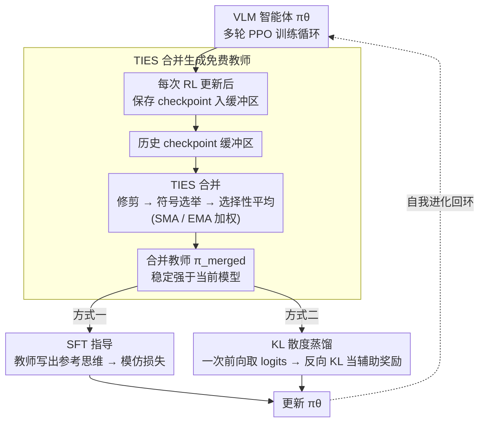

# GTR-Turbo: Merged Checkpoint is Secretly a Free Teacher for Agentic VLM Training

**会议**: CVPR 2026  
**arXiv**: [2512.13043](https://arxiv.org/abs/2512.13043)  
**代码**: [https://github.com/TongWei1105/GTR-Turbo](https://github.com/TongWei1105/GTR-Turbo)  
**领域**: 多模态VLM / Agent / 强化学习  
**关键词**: VLM智能体, 多轮强化学习, 模型合并, 知识蒸馏, 自我进化

## 一句话总结
本文提出 GTR-Turbo，通过将 RL 训练过程中的历史 checkpoint 经 TIES 合并产生"免费教师模型"来指导后续训练（可选 SFT 或 KL 蒸馏方式），在多个视觉智能体任务上匹配甚至超过依赖 GPT-4o 等外部教师的 GTR 方法，同时减少 50% 训练时间和 60% 计算成本。

## 研究背景与动机

1. **领域现状**：基于 VLM 的多轮强化学习（RLVR）是训练视觉智能体的新范式，但面临奖励稀疏、长时域信用分配等核心挑战。GTR 等方法引入外部教师模型（如 GPT-4o）在每一步提供思维过程指导，有效解决了"思维崩塌"（thought collapse）问题。
2. **现有痛点**：GTR 依赖昂贵的外部教师（GPT-4o），训练 15000 步需要约 \$147、86 小时；使用较弱教师（如 Qwen2.5-VL-7B）则完全无法提供有效指导；换用 72B 模型虽然可行但更慢（110h）且仍需 API 费用。
3. **核心矛盾**：要获得好的训练效果必须有强大教师，但强大教师意味着高成本和低可扩展性。能否让模型"自产自销"——从自己的训练历史中获得教师？
4. **本文目标**：消除对外部特权模型的依赖，实现自包含、可扩展的 VLM 智能体自我进化训练。
5. **切入角度**：关键洞察——RL 训练过程中产生的历史 checkpoint 经合并后，性能稳定地优于当前模型（如图2所示），天然可充当教师。这源于模型合并在更平滑的损失曲面上优化、有效保留历史经验的特性。
6. **核心 idea**：将 RL 训练过程中的历史 checkpoint 合并为免费教师模型，替代昂贵的外部 API 教师。

## 方法详解

### 整体框架
GTR-Turbo 在标准的多轮 PPO 训练循环之上增加了三个关键步骤：(1) 每次 RL 更新后保存 checkpoint 到缓冲区；(2) 使用 TIES 合并方法将缓冲区中的所有历史 checkpoint 合并为一个**免费教师**模型；(3) 用该合并教师指导后续 RL 训练——指导方式二选一，要么走 **SFT 指导**（GTR-Turbo-SFT），要么走 **KL 散度蒸馏**（GTR-Turbo-KL）。更新后的模型又被存入缓冲区，使合并教师随训练不断变强，形成自我进化的正反馈回环。整个过程不需要任何外部模型调用。

### 关键设计

**1. TIES 合并生成"免费教师"：把训练历史攒成一个比当前模型更强的指导者**

整篇方法的支点是一个反直觉的观察：RL 训练途中保存下来的那些历史 checkpoint，单独看都不如最新模型，但把它们合并起来却稳定地比当前模型更强（图2）。GTR-Turbo 直接把这个合并模型当教师用——对第 $k$ 次更新，教师是历史模型的加权和 $\pi_{\text{merged}}^{(k)} = \sum_{i=1}^{k-1} w_i \pi_\theta^{(i)}$，权重既可以用等权的简单移动平均（SMA），也可以用偏向新模型的指数移动平均（EMA）。合并不是简单线性平均，而是用 TIES 三步法消除参数干扰：先**修剪**，每个模型只保留变化幅度 top-k% 的参数、其余清零；再**符号选举**，对每个参数位用多数投票定下正负号；最后只对符号一致的参数做选择性平均。之所以要这么绕，是因为不同 checkpoint 在同一参数上常常一个想往正、一个想往负，直接平均会让这些冲突项互相抵消、把有用信号也磨平；TIES 先剔除冗余、再统一方向，留下的才是各 checkpoint 真正共识的更新。图13 验证了它确实优于朴素线性平均。

**2. SFT 指导（GTR-Turbo-SFT）：用最小改动把外部教师换成合并教师**

第一种用法几乎是对原始 GTR 的"原地替换"。每步 RL 之后，把同样的观测喂给合并教师，让它生成一段参考思维 $\hat{th}$ 存进重放缓冲；PPO 更新时在原目标上叠一个监督模仿损失，让学生去对齐这段思维：

$$\min_\theta \; \mathbb{E}\,\mathcal{L}_{\text{PPO}}(o,a) + \mathbb{E}\,\mathcal{L}_{\text{SFT}}(o, \hat{th})$$

格式奖励和 DAgger 这些 GTR 原有的技巧都照旧保留。它的好处是改动极小、即插即用，缺点也很明显——SFT 是 one-hot 监督，只告诉学生"该说哪个 token"，把教师分布里的不确定性信息全丢了，这也是下面 KL 版本要解决的。

**3. KL 散度蒸馏（GTR-Turbo-KL）：用一次前向传播传递软标签，还顺带鼓励探索**

KL 版本不再让教师真的把思维自回归地"写出来"，而是只做一次前向传播拿到 logits，省掉了整段解码开销。它衡量学生与教师在思维 token 上的反向 KL 散度，取负后当作辅助奖励塞进 PPO 的优势函数：

$$A' = A^{\pi_\theta}(o,a) - \text{RevKL}(\pi_\theta, \pi_{\text{merged}}; th)$$

KL 值会被 clip 到 $[0, +\infty)$，避免出现负值反向误导优化。和 SFT 相比，这里传的是教师在所有候选 token 上的完整概率分布而非一个硬标签，约束更柔和——学生只在偏离教师太远时受罚，仍保有自己探索的空间；加上省去自回归生成，训练还更快。值得强调的是，KL 只作用在思维（thinking）token 上、不约束动作（action），因为动作探索的自由度恰恰是智能体发现新策略的关键。

### 损失函数 / 训练策略
- 基座模型：Qwen2.5-VL-7B（SFT 初始化）
- 使用 LoRA 微调智能体，合并教师部署在另一块 GPU 上
- Points24 训练 30000 步，ALFWorld 训练 20000 步（分别为前人工作的 2x 和 4x 预算）
- 2 块 40GB NVIDIA GPU

## 实验关键数据

### 主实验 — Points24 卡牌博弈

| 方法 | 成功率(%) | 回合回报 |
|------|----------|---------|
| GPT-4o | 2.5 | -6.35 |
| Qwen2.5-VL-72B | 5.6 | -5.69 |
| RL4VLM | 3.5 | -13.3 |
| GTR (GPT-4o教师) | 44.5 | 0.53 |
| **GTR-Turbo (SFT)** | 48.0 | 1.32 |
| **GTR-Turbo (KL)** | **53.5** | **2.39** |

### 效率对比

| 环境 | 方法 | 成功率 | 训练时间 | 额外成本 |
|------|------|--------|---------|---------|
| Points24 | GTR | 41% | 191h | $307.78 |
| Points24 | GTR-Turbo(KL) | **54%** | **89h** | $114.81 |
| ALFWorld | GTR | 16% | 164h | $145.76 |
| ALFWorld | GTR-Turbo(KL) | 15% | **78h** | $100.62 |

### 消融实验

| 配置 | 关键发现 |
|------|---------|
| 静态初始模型做KL参考 | 无法实现稳定提升，验证了动态合并的必要性 |
| Rejection Sampling | 在 Points24 上完全失败，无法生成正确轨迹供模仿 |
| 指导思维+动作 | 效果变差，因为限制了动作探索的自由度 |
| 线性平均 vs TIES | TIES 更优，有效缓解冗余参数干扰 |
| KL clip vs abs vs K3 | clip 方法最优，控制 KL 值的幅度实现更细粒度更新 |

### 关键发现
- KL 蒸馏版本全面优于 SFT 版本——更快、更强、更省
- 只指导思维（thinking）不指导动作（action）至关重要，因为智能体需要行为探索来发现新策略
- 合并教师持续自我进化：随着训练进行，合并教师也越来越强，形成正反馈循环
- GTR-Turbo(KL) 的训练时间与最简单的 RL4VLM 相当，但效果远超

## 亮点与洞察
- **"免费午餐"的巧妙发现**：RL 训练的历史 checkpoint 合并后天然是比当前模型更好的教师，这个洞察简单而深刻。类似于 SWA（Stochastic Weight Averaging）在监督学习中的泛化提升效果
- **KL 蒸馏替代自回归生成**：一次前向传播替代完整的自回归解码，不仅更快且效果更好。说明 soft 标签比 hard 标签在自我进化场景中更有效
- **思路可迁移**：这个"历史 checkpoint 合并做教师"的 trick 理论上适用于任何多轮 RL 训练场景，不限于 VLM 智能体

## 局限与展望
- 在 ALFWorld 这种极长时域（50+ 步）任务上，合并教师的优势不如 Points24 明显，因为缺乏外部 domain knowledge
- 仍需额外一块 GPU 部署合并教师，虽然比 API 便宜但不是零成本
- 合并间隔、TIES 参数的选择需要调优
- 未探索将合并教师与小规模外部教师结合使用的混合方案

## 相关工作与启发
- **vs GTR**: GTR 用 GPT-4o 作教师，效果好但极贵。GTR-Turbo 用自身合并 checkpoint 免费替代，成本降 60%，Points24 上效果反而更好
- **vs RL4VLM**: 直接 PPO 训练导致思维崩塌，模型输出变得重复模板化。GTR-Turbo 通过思维指导有效解决此问题
- **vs Rejection Sampling**: RS 依赖模型自身能生成正确轨迹，但在困难任务中这一前提不成立。RL 探索 + 合并教师指导是更好的组合

## 评分
- 新颖性: ⭐⭐⭐⭐ 合并 checkpoint 做教师的想法简洁优雅，KL蒸馏替代SFT也是好设计
- 实验充分度: ⭐⭐⭐⭐⭐ 两个环境、多种消融、成本分析、训练曲线全面
- 写作质量: ⭐⭐⭐⭐ 动机推导清晰，图示直观
- 价值: ⭐⭐⭐⭐⭐ 大幅降低 VLM 智能体训练成本，实用性极强

<!-- RELATED:START -->

## 相关论文

- [\[CVPR 2026\] PAS: A Training-Free Stabilizer for Temporal Encoding in Video LLMs](pas_a_training-free_stabilizer_for_temporal_encoding_in_video_llms.md)
- [\[CVPR 2026\] DRS-GUI: Dynamic Region Search for Training-Free GUI Grounding](drs-gui_dynamic_region_search_for_training-free_gui_grounding.md)
- [\[CVPR 2026\] Pointing at Parts: Training-Free Few-Shot Grounding in Multimodal LLMs](pointing_at_parts_training-free_few-shot_grounding_in_multimodal_llms.md)
- [\[CVPR 2026\] Generate, Analyze, and Refine: Training-Free Sound Source Localization via MLLM Meta-Reasoning](generate_analyze_and_refine_training-free_sound_source_localization_via_mllm_met.md)
- [\[CVPR 2026\] LLMind: Bio-inspired Training-free Adaptive Visual Representations for Vision-Language Models](llmind_bio-inspired_training-free_adaptive_visual_representations_for_vision-lan.md)

<!-- RELATED:END -->
