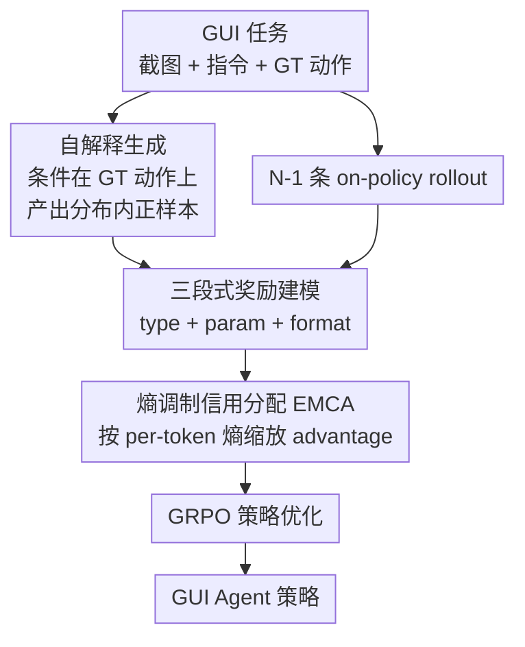

# GUI-SAGE: Enhancing GUI Automation with Self-Explanatory Learning

**会议**: CVPR 2026  
**论文**: [CVF Open Access](https://openaccess.thecvf.com/content/CVPR2026/html/Tang_GUI-SAGE_Enhancing_GUI_Automation_with_Self-Explanatory_Learning_CVPR_2026_paper.html)  
**代码**: 无  
**领域**: 多模态VLM / GUI Agent / 强化学习  
**关键词**: GUI自动化, RLVR, 自解释学习, 熵调制信用分配, 分布兼容性

## 一句话总结
针对 GUI 强化学习中"任务太难时所有 rollout 全失败、advantage 全为 0 学不动"的问题，GUI-SAGE 让模型在 ground-truth 动作做提示的条件下"给自己讲清楚这个动作为什么对"，产生分布内（in-distribution）的正样本，再用熵调制信用分配按预测置信度放大/抑制梯度，使 3B 模型在 AndroidControl / GUI-Odyssey 上达到 81.1% 平均成功率，超过更大的 7B baseline。

## 研究背景与动机
**领域现状**：用 RLVR（reinforcement learning with verifiable rewards）训练 GUI agent 是当前主流——agent 在多步交互中执行 click / swipe / type 等动作，只靠"任务是否完成"的二值奖励学习，不需要密集人工标注，沿用了数学推理里 GRPO 那套验证奖励范式。

**现有痛点**：GUI 任务的动作空间是组合爆炸的——要在高分辨率屏幕上选对坐标、选对动作类型、输对文本。当任务难度超过模型能力，on-policy 探索几乎采不到正确动作，于是一组 rollout 全部失败、全拿 0 奖励，组内归一化后 advantage 全为 0，等于没有任何学习信号。作者称之为**零优势陷阱（zero-advantage trap）**，实测早期训练 73.2% 的任务都落进这个陷阱（Table 5），长按 / terminate 这类稀疏动作更高达 87.7%。

**核心矛盾**：直觉上的解法是引入更强模型（如 Gemini 2.5 Pro、Qwen2.5-VL-72B）的专家示范来"喂"正确轨迹，但作者发现这在 GUI 上反而有害。根因是**分布失配**：专家的推理用的是当前策略理解不了的概念，模型给专家 token 分配极低 log-probability（Figure 3a），熵急剧飙升并持续维持在 1.0 附近（Figure 3c），训练在"模仿看不懂的模式"和"维持原行为"之间反复横跳，学不到可执行的知识。更糟的是，只要混进一个专家样本，连同批次其他 rollout 的 log-probability 都会被拉低近一半（Figure 3b）。

**本文目标**：在不破坏分布兼容性的前提下，给那些 on-policy 探索失败的任务注入可靠的正向学习信号，同时区分置信度不同的样本，避免对所有同奖励样本一视同仁。

**核心 idea**：与其从外部借专家轨迹，不如让模型**自己解释**——把 ground-truth 动作作为提示喂给模型，让它用自己的词汇说清"为什么这个动作是对的"。由于条件里已经给了正确动作，生成的轨迹一定执行正确动作（保证非零奖励），又因为用的是模型自己的概念，熵保持稳定。作者进一步把熵当成置信度的天然代理，做细粒度的信用分配。

## 方法详解

### 整体框架
GUI-SAGE 把 GUI 自动化建模成序列决策：给定任务描述 $t$ 和初始屏幕 $s_0$，agent 在每步观察截图 $s_i$，从策略 $\pi_\theta(a_i \mid t, s_i, a_{<i})$ 采样动作（动作空间含 click / long press / swipe / type / system button / open / wait / terminate），到达终止或最大步数时拿一个稀疏二值奖励 $R \in \{0,1\}$。

整个框架由两个组件协同，都围绕"熵感知学习"展开。第一步，对每个训练任务，在 $N$ 个采样里放 $N{-}1$ 条普通 on-policy rollout 加 1 条**自解释样本**（self-explanation，条件在 ground-truth 动作上生成），保证至少有一个可靠正样本，破除零优势陷阱；同时因为自解释用模型自己的语言，熵不会像专家示范那样炸开。第二步，对这一批样本逐 token 算熵，用**熵调制信用分配（EMCA）**把组内归一化 advantage 按置信度重新缩放——低熵（自信）的样本放大更新、高熵（不确定探索）的样本压低更新，最后把调制后的 advantage 喂进 GRPO 目标做策略优化。

### 关键设计

**1. 自解释生成：用"解释对的动作"替代"探索找对动作"**

这一步直接针对零优势陷阱。给定任务 $t$、状态 $s$ 和 ground-truth 动作 $a^*$，让模型以 $a^*$ 为额外上下文采样一条推理轨迹 $c$ 和动作 $a$：

$$(c, a) \sim \pi_\theta(c, a \mid t, s, a^*)$$

这个条件化机制把学习目标从"动作发现"换成"动作解释"——模型不再在巨大动作空间里盲目探索，而是去阐述"为什么这个给定动作能完成任务"。因为 $a^*$ 引导生成，轨迹保证产出正确动作，从而**构造性地**保证训练里有非零奖励。训练时对每个任务收集 $N{-}1$ 条普通 rollout $\{(c_j, a_j)\}_{j=1}^{N-1} \sim \pi_\theta(\cdot \mid t, s)$ 加一条自解释样本 $(c_{se}, a_{se}) \sim \pi_\theta(\cdot \mid t, s, a^*)$。和专家示范的本质区别在于：自解释用的是模型自己的词汇和概念结构，因此 log-probability 不会塌、熵保持在和 on-policy rollout 相当的水平（稳定在 0.5 左右），而专家 CoT 持续高熵在 1.0——这正是"分布内 vs 分布外"的差距。

**2. 熵调制信用分配（EMCA）：用熵当置信度代理，区别对待样本质量**

标准 RL 对同奖励样本分配相同信用，忽略了置信度的巨大方差——自信的正确预测、自信的错误、不确定的探索被等同对待，但它们对策略质量传递的信息完全不同。EMCA 把预测置信度显式纳入 advantage 计算。先对每条轨迹算平均 per-token 熵 $H$，在批次内归一化：

$$H_{\text{norm}} = \frac{H - \min(H)}{\max(H) - \min(H)}$$

再做指数衰减得到熵调制因子（期望在当前批次所有样本上算，起归一化作用）：

$$g_H = \frac{\exp(-H_{\text{norm}})}{\mathbb{E}[\exp(-H_{\text{norm}})]}$$

调制后的 advantage 为 $A_{\text{mod}} = A \cdot g_H$，其中 $A$ 是原始组内归一化 advantage。效果是：低熵预测（无论对错）拿到放大更新——自信正确的快速巩固、系统性错误被强惩罚；高熵探索被衰减，防止不确定动作的噪声梯度污染训练。它必须和设计 1 配合才成立——只有自解释先把熵稳住，熵才能成为可靠的置信度信号，否则像专家示范那样满批高熵，调制就失去区分度。

**3. 三段式奖励 + GRPO 集成：让稀疏二值奖励变得可学**

奖励函数同时评估动作正确性和输出结构，由三部分组成。动作类型奖励 $R_{\text{type}}$ 验证预测的动作类型是否匹配 GT（匹配为 1 否则 0）；动作参数奖励 $R_{\text{param}}$ 按动作类型分别处理——坐标类动作（click/swipe/long press）用基于距离的奖励，文本输入（type）用 token 级 F1；格式奖励 $R_{\text{format}}$ 检查推理是否包在 `<think>` 标签、动作是否包在 `<tool_call>` 标签内。总奖励为

$$R = w_1 \cdot R_{\text{format}} + w_2 \cdot (R_{\text{type}} + R_{\text{param}})$$

策略更新把上面的成果集成进 GRPO：每个任务 $N$ 个样本（$N{-}1$ rollout + 1 自解释）的 advantage 先按组内均值方差归一化

$$A_i = \frac{R(i) - \text{mean}(\{R(j)\}_{j=1}^N)}{\text{std}(\{R(j)\}_{j=1}^N)}$$

再经 EMCA 得到 $A_{\text{mod},i}$，最终优化目标为带 clip 的 PPO 式目标加 KL 正则：

$$J(\theta) = \mathbb{E}_{\tau \sim \pi_{\theta_{\text{old}}}}\Big[\sum_t \min\big(r_t(\theta) A_{\text{mod},t},\ \text{clip}(r_t(\theta), 1-\epsilon, 1+\epsilon) A_{\text{mod},t}\big) - \beta D_{\text{KL}}[\pi_\theta \| \pi_{\text{ref}}]\Big]$$

其中 $r_t(\theta) = \pi_\theta(a_t \mid s_t)/\pi_{\theta_{\text{old}}}(a_t \mid s_t)$ 是重要性采样比。⚠️ 公式 9 中 $r_t$ 的具体定义以原文为准（原文记号略有歧义）。实践中训练设 $w_1 = w_2 = 1.0$ 并省略 KL 惩罚项。

### 损失函数 / 训练策略
基座模型为 Qwen2.5-VL（3B / 7B），在 VLM-R1 框架内训练，约 40K 训练样本来自 AndroidControl 与 GUI-Odyssey 训练集。8×A100-80G 训练 3 epoch，学习率 1e-6，train batch size 8，每条指令采样 8 个 response，省略 KL 惩罚；用 Flash Attention 2、bfloat16、梯度检查点；推理用温度 0 的确定性生成。

## 实验关键数据

### 主实验
三个 benchmark（AndroidControl 的 Low/High 设置 + GUI-Odyssey）的平均步成功率（Step SR）对比：

| 模型 | 类型 | AC-Low SR | AC-High SR | GUI-Odyssey SR | Avg SR |
|------|------|-----------|-----------|----------------|--------|
| InfiGUI-R1-3B | RL | 91.1 | 70.7 | 64.7 | 75.5 |
| AgentCPM-GUI-8B | SFT | 90.2 | 69.2 | 75.0 | 78.1 |
| UI-Venus-Navi-7B | SFT | 92.4 | 76.1 | 71.5 | 80.0 |
| **GUI-SAGE-3B** | RL | 93.4 | 75.4 | 74.6 | **81.1** |
| **GUI-SAGE-7B** | RL | 93.7 | 76.8 | 75.8 | **82.1** |

3B 模型平均 SR 比同规模 InfiGUI-R1-3B 高 5.6%（GUI-Odyssey 74.6% vs 64.7%、动作类型准确率 92.1% vs 81.6% 提升尤其明显），还反超更大的 UI-Venus-Navi-7B（80.0%）和 AgentCPM-GUI-8B（78.1%）。在真机 benchmark AndroidWorld（116 任务）上，3B/7B 分别达 19.8%/23.3% SR，远超各自的 Qwen2.5-VL 基座。

### 消融实验
提示格式消融（均用标准 GRPO、不加 EMCA，隔离提示格式的影响）：

| 配置 | AC-Low SR | AC-High SR | Avg | 说明 |
|------|-----------|-----------|-----|------|
| Vanilla-GRPO | 89.7 | 70.4 | 80.1 | 无提示，纯探索 |
| ATH（只给动作类型） | 90.8 | 71.9 | 81.4 | +1.3% |
| APH（只给动作参数） | 91.2 | 72.4 | 81.8 | +1.7% |
| Self-Explanation（完整 GT 动作） | 91.9 | 74.2 | **83.1** | 信息最全，最优 |

奖励权重消融（GUI-SAGE-3B）：

| $w_1$（format） | $w_2$（action） | AC-Low SR | AC-High SR | Avg SR |
|------|------|-----------|-----------|--------|
| 0.2 | 0.8 | 93.1 | 74.9 | 83.5 |
| **1.0** | **1.0** | 93.4 | 75.4 | **84.2** |
| 0.8 | 0.2 | 92.9 | 74.6 | 83.7 |

### 关键发现
- **零优势陷阱实锤**：early training（0-100 步）73.2% 样本拿全 0 奖励，整体（0-300 步）67.9%；稀疏动作更严重——long press 91.3%、terminate 87.6% 落进陷阱，平均 87.7%。这是 GUI-SAGE 要解决的核心病灶。
- **自解释 vs 专家 CoT**：专家 CoT 全程高熵（~1.0）且压低其他 rollout 的 log-probability 近一半；自解释熵快速下降稳定在 0.5，且单提示完整 GT 动作（Self-Explanation）优于只给类型/参数的部分提示，说明信息越完整、模型越能专注"解释为什么对"。
- **训练动态**：1500 步对比 Vanilla-GRPO，后者熵迅速塌到 0.2（过早收敛）、response 从 130 token 缩到 50；GUI-SAGE 熵稳定在 0.46、response 稳定在 95 token，且稀疏的 terminate 奖励从 1.5 稳步升到 2.0+，而 Vanilla-GRPO 一直卡在 1.0。
- **EMCA 贡献**：作者报告 EMCA 带来约 +1.1% 增益，且在分布内样本上提升最大；等权奖励（$w_1=w_2=1.0$，84.2%）优于偏重 format 或偏重 action 的设置。

## 亮点与洞察
- **"自解释"是个很巧的换框**：把"探索发现正确动作"这个组合爆炸难题，换成"在已知答案下解释为什么对"这个模型本就擅长的任务——既保证非零奖励，又因为用自己的语言而保持分布内。比起借外部专家轨迹，这是更聪明的"自给自足"正样本来源。
- **把熵同时当两件事用**：熵既是分布兼容性的检测器（专家示范熵飙升暴露失配），又是置信度的代理（同奖励样本里低熵=自信、高熵=瞎猜），EMCA 据此做细粒度信用分配，一个量身兼两职，思路干净。
- **可迁移性**：自解释 + 熵调制这套机制不绑定 GUI——任何 on-policy RLVR 在难任务上遇到零优势陷阱（数学推理、代码、工具调用）都可以试"条件在 ground-truth 上自解释生成正样本"，再用熵调制区分样本质量。

## 局限与展望
- 自解释依赖每个训练样本都有 ground-truth 动作（来自 AndroidControl/GUI-Odyssey 的轨迹标注），对没有专家轨迹标注的任务不适用，本质仍是一种利用标注的方式而非纯探索。
- 真机 AndroidWorld 上的绝对成功率仍很低（3B 19.8%、7B 23.3%），说明离线 benchmark 的高 SR 到动态真实环境有明显落差，方法对长程动态任务的泛化还远不够。
- ⚠️ EMCA 的熵归一化是批次内 min-max + 指数衰减，对 batch 组成较敏感（小 batch 或样本质量同质时区分度会下降），论文未充分讨论这一稳健性。
- 改进方向：把自解释做成可迭代/课程式（随训练推进减少对 GT 的依赖）、或把熵调制扩展到 token 级而非序列平均，可能进一步提升对长轨迹的信用分配精度。

## 相关工作与启发
- **vs LUFFY / ExGRPO（off-policy 经验注入）**：它们假设外部经验落在兼容分布内——LUFFY 用更强模型的推理轨迹做 off-policy 梯度，ExGRPO 回放模型自己成功的 rollout。本文证明在 GUI 上更强模型的专家轨迹严重分布失配（熵飙升、训练不稳），改用条件在 GT 上的自解释规避这一问题。
- **vs InfiGUI-R1 / UI-R1 / GUI-R1（GUI RLVR）**：它们都用规则奖励做 on-policy RLVR，但在难任务上同样会掉进零优势陷阱。GUI-SAGE 用分布内引导补上失败任务的学习信号，因此 3B 就能反超它们甚至更大的 7B/8B SFT 模型。
- **vs DAgger（分布偏移）**：DAgger 靠迭代聚合专家数据纠正分布偏移，仍是引入外部专家；本文走的是"自生成分布内引导"的路线，不需要反复查询外部专家。

## 评分
- 新颖性: ⭐⭐⭐⭐ "自解释生成分布内正样本"+"熵同时当失配检测器和置信度代理"是一个清爽且有洞察的组合。
- 实验充分度: ⭐⭐⭐⭐ 三 benchmark 主结果 + 提示格式/奖励权重消融 + 零优势/训练动态分析齐全，唯真机 AndroidWorld 绝对值偏低。
- 写作质量: ⭐⭐⭐⭐ 痛点（零优势陷阱、分布失配）→ 解法 → 验证的逻辑链清晰，图表支撑到位。
- 价值: ⭐⭐⭐⭐ 让小模型在 GUI 自动化上反超大模型，且方法可迁移到其他难任务 RLVR 场景。

<!-- RELATED:START -->

## 相关论文

- [\[CVPR 2026\] Training High-Level Schedulers with Execution-Feedback Reinforcement Learning for Long-Horizon GUI Automation](training_high-level_schedulers_with_execution-feedback_reinforcement_learning_fo.md)
- [\[CVPR 2026\] DRS-GUI: Dynamic Region Search for Training-Free GUI Grounding](drs-gui_dynamic_region_search_for_training-free_gui_grounding.md)
- [\[CVPR 2026\] MVP: Multiple View Prediction Improves GUI Grounding](mvp_multiple_view_prediction_improves_gui_grounding.md)
- [\[CVPR 2026\] HiconAgent: History Context-aware Policy Optimization for GUI Agents](hiconagent_history_context-aware_policy_optimization_for_gui_agents.md)
- [\[CVPR 2026\] GUIDE: A Benchmark for Understanding and Assisting Users in Open-Ended GUI Tasks](guide_a_benchmark_for_understanding_and_assisting_users_in_open-ended_gui_tasks.md)

<!-- RELATED:END -->
