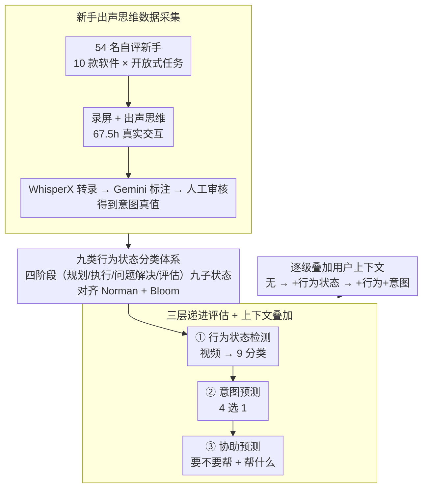

# GUIDE: A Benchmark for Understanding and Assisting Users in Open-Ended GUI Tasks

**会议**: CVPR 2026  
**arXiv**: [2603.25864](https://arxiv.org/abs/2603.25864)  
**代码**: [https://guide-bench.github.io/](https://guide-bench.github.io/)  
**领域**: 多模态VLM / 人机交互 / GUI智能体  
**关键词**: GUI理解, 用户行为检测, 意图预测, 协助预测, 新手用户

## 一句话总结
本文提出 GUIDE 基准，包含 120 个新手用户在 10 款软件上的 67.5 小时屏幕录像和出声思维标注，定义了行为状态检测、意图预测、协助预测三个分层任务，评估发现当前最强多模态模型在理解用户行为和判断协助需求上表现有限（行为检测仅 44.6% 准确率），但提供结构化用户上下文可显著提升性能（协助预测最高提升 50.2pp）。

## 研究背景与动机

1. **领域现状**：现有 GUI 智能体主要聚焦"全自动化"——给定目标，自动执行点击和键盘操作完成任务。学术界的 VideoGUI、AssistGUI 和工业界的 Microsoft Copilot、Figma Make 等都走这条路线。
2. **现有痛点**：全自动化忽视了用户的真实工作方式——在开放式创作/分析任务中，用户需要探索、迭代、试错、修改想法。用户做了多次 undo 可能不是"冗余操作"，而是在形成偏好。自动化智能体会将这些视为等效行为而跳过。
3. **核心矛盾**：现有基准都基于专家演示的封闭任务，评估"能否重复做同样的事"；但真正需要协助的是新手用户的开放式探索过程。相似的操作序列可能源于完全不同的意图——重复 undo 可能是困惑，也可能是刻意优化。
4. **本文目标**：(1) 收集新手用户在开放式任务中的真实行为数据；(2) 评估模型能否理解用户在做什么、为什么这样做、是否需要帮助。
5. **切入角度**：将 GUI 协助拆解为三个递进层次——理解(行为)→推理(意图)→行动(协助)，对齐 Norman 的行动七阶段理论和 Bloom 认知层级。
6. **核心 idea**：构建一个以新手用户开放式 GUI 交互为中心的三层递进评估基准，揭示结构化用户上下文对有效协助的关键作用。

## 方法详解

### 整体框架
GUIDE 不是一个模型，而是一套"以新手用户为中心"的评估基准，目标是测出 MLLM 到底能不能看懂用户在做什么、想要什么、何时需要帮。整套基准沿一条采集→建词汇→搭任务的链路成形：先把 54 名自评新手用户在 10 款软件上做开放式任务的过程连同他们的出声思维录下来，得到 67.5 小时带"内心独白"的真实交互；再把这些散乱行为归纳成一套九类行为状态的分类词汇，让"用户此刻在干嘛"有了可标注、可评测的标签；最后基于这套词汇搭出行为状态检测、意图预测、协助预测三个层层递进的任务，并允许逐级把用户上下文喂给模型，量化每一层理解对最终"会不会帮"的贡献。

### 关键设计

**1. 新手出声思维数据采集：把"内隐意图"变成可评测的 ground truth**

协助型智能体最该理解的恰恰是用户卡壳、试错、反复 undo 的时刻，但过去的 GUI 数据全是专家流畅演示，根本没有这种"真实困惑"的样本。GUIDE 因此从 Prolific 招募 54 名自评新手（技能 1–5 分、均值 2.8），让每人在指定软件上至少花 20 分钟完成像"做一份 PPT 自我介绍"这样没有标准答案的开放任务，同时录屏并要求出声讲出自己当下在想什么。出声思维的价值在于：用户的意图本来是藏在脑子里的，无法从光标轨迹反推，而把它说出来就成了可对照的"意图真值"。原始语音先用 WhisperX 转录，再由 Gemini-2.5-Pro 生成初始标注、人工逐条审核，最终行为标注一致率 96.1%、意图保留 88.68%、协助标注保留 78.89%，保证了这批"困惑场景"标签的可靠性。

**2. 九类行为状态分类体系：给"用户此刻在干嘛"一套有认知理论支撑的词汇**

要评测模型懂不懂用户，先得有一套描述用户状态的标签，否则一切无从打分。GUIDE 把开放式操作归纳为四大阶段下的九个子状态：规划阶段（目标设定、规划任务）、执行阶段（执行操作、探索与决策）、问题解决阶段（困惑/求助、调试/修正、挫折感）、评估阶段（检查进度、完善作品）。这套划分不是拍脑袋定的——它对齐 Norman 的行动七阶段（规划→执行→评估）和 Bloom 认知层级，把"用户从想做到做完再回看"的认知流程映射成可观测的行为标签；其中"困惑/求助""挫折感""调试/修正"这几类正是协助系统最关心的求助信号。词汇本身由三位作者五轮迭代、再与 Gemini 独立生成的版本合并校验得到，兼顾人工经验与覆盖度。

**3. 三层递进评估 + 上下文叠加：定位模型到底卡在哪一层**

有了数据和词汇，GUIDE 把"理解用户"拆成认知上由浅入深的三个任务。第一层行为状态检测，只给视频、做 9 分类，判断用户当前处于哪个行为状态；第二层意图预测，做 4 选 1 单选，推断用户此刻想达成的目标；第三层协助预测，先二分类判断"要不要帮"，再 4 选 1 判断"帮什么"。三层递进的意义在于可以精确定位瓶颈——模型是看不懂行为、推不出意图，还是判断不了协助需求。更关键的是每一层都支持逐级叠加上下文：从无上下文，到补上一段行为状态、补当前行为状态、再补行为+意图，把用户理解一层层喂进去，从而量化"结构化用户上下文"本身对协助决策的增益。正是这个叠加设计让实验得以揭示——模型不是不会帮，而是不了解用户。

### 损失函数 / 训练策略
本文是评估基准而非训练方法，不涉及训练。评估采用零样本设置，覆盖 8 个 MLLM（Gemini-2.5-Flash/Pro、GPT-4o/mini、Claude-4.5-Sonnet、Qwen3-VL-8B、InternVideo2.5-8B、InternVL3-8B），每段视频均匀采样 32 帧，且不使用语音转录（模拟模型只能"看屏幕"的真实部署场景）。

## 实验关键数据

### 主实验 — 各任务准确率

| 模型 | 行为检测 | 意图预测 | 协助需求检测 | 协助内容预测 |
|------|---------|---------|------------|------------|
| Claude-4.5-Sonnet | **44.61%** | **71.39%** | 39.49% | **55.00%** |
| Gemini-2.5-Pro | 42.44% | 67.80% | **69.82%** | 52.74% |
| GPT-4o | 36.32% | 61.19% | 49.69% | 45.95% |
| Qwen3-VL-8B | 37.97% | 62.70% | 52.83% | 46.06% |
| InternVL3-8B | 22.57% | 46.11% | 34.94% | 27.03% |

### 上下文增强效果（协助需求检测准确率）

| 模型 | 无上下文 | +行为状态 | +行为+意图 | 提升幅度 |
|------|--------|---------|-----------|---------|
| GPT-4o-mini | 46.05% | 78.92% | **82.26%** | +36.21pp |
| GPT-4o | 49.69% | **87.79%** | 87.91% | +38.22pp |
| Gemini-2.5-Pro | 69.82% | 84.73% | 82.38% | +14.91pp |
| Claude-4.5-Sonnet | 39.49% | 58.56% | 59.43% | +19.94pp |
| InternVideo2.5-8B | 34.36% | 35.35% | 35.25% | +0.89pp |

### 关键发现
- **行为检测是最难的任务**：最强模型也仅 44.6%，模型最常犯的错是将"挫折/调试"误判为"执行操作"——即忽视用户困难的微妙信号
- **意图预测相对最好做**，但严格指标 MBAcc 下降明显，说明模型常"蒙对"但不稳定
- **结构化上下文效果惊人**：提供行为状态后，GPT-4o 的协助需求检测 F1 从 47.73 飙升到 90.19
- **开源小模型严重落后**：InternVideo2.5 和 InternVL3 的协助需求检测 recall 接近 0%，几乎将所有需要帮助的情况都误判为不需要
- **在线渐进设置**：看到更多视频（25%→100%）时性能持续提升，说明时间上下文对理解用户行为很重要

## 亮点与洞察
- **评估视角的转变**：从"模型能否替用户完成任务"转向"模型能否理解用户需要什么"，这是 GUI 智能体研究的重要方向转移。现有基准都假设目标固定，但真实用户的目标是动态变化的
- **上下文的分层实验设计**：通过逐级叠加行为/意图上下文，精确量化了每层用户理解对最终协助决策的贡献。GPT-4o-mini 从 46% 到 82% 的跃升说明"不是模型不会帮忙，是它不了解用户"
- **新手用户数据的独特价值**：专家演示是"正确做法"，新手行为才是"真实需求场景"。这个insight可迁移到教育AI、医疗AI等需要理解非专家用户的领域

## 局限与展望
- 分类体系的 9 类可能不够细粒度，例如"探索与决策"覆盖范围过广
- 评估仅用 32 帧采样，可能丢失快速操作或微妙的犹豫信号
- 语音标注依赖出声思维，有些用户可能不擅长表达内心想法，导致标注噪声
- 仅评估离线推理能力，未验证实时在线协助场景的可行性
- 数据集规模（120 段）对于训练模型可能不够，但作为评估基准是合适的

## 相关工作与启发
- **vs VideoGUI/AssistGUI**: 它们用专家教学视频做封闭任务自动化；GUIDE 用新手自然行为做开放式用户理解，方向和数据源都不同
- **vs ProactiveVA**: ProactiveVA 在可视化分析场景做主动协助；GUIDE 覆盖 10 款通用软件，更通用但不做实际干预
- **vs OSWorld/AndroidWorld**: 这些是全自动化的 GUI 操控基准；GUIDE 强调人在回路、理解与协助而非替代

## 评分
- 新颖性: ⭐⭐⭐⭐⭐ 首个聚焦新手用户行为理解的 GUI 基准，三层递进框架设计精巧
- 实验充分度: ⭐⭐⭐⭐ 8 个模型、多种上下文配置、在线/离线设置，但缺少训练实验
- 写作质量: ⭐⭐⭐⭐⭐ 逻辑清晰，表格丰富，理论对齐（Norman/Bloom）增加说服力
- 价值: ⭐⭐⭐⭐⭐ 揭示了当前 MLLM 在用户理解上的巨大差距，为协助型智能体指明方向

<!-- RELATED:START -->

## 相关论文

- [\[CVPR 2025\] OpenING: A Comprehensive Benchmark for Judging Open-ended Interleaved Image-Text Generation](../../CVPR2025/multimodal_vlm/opening_a_comprehensive_benchmark_for_judging_open-ended_interleaved_image-text_.md)
- [\[ACL 2025\] CrafText Benchmark: Advancing Instruction Following in Complex Multimodal Open-Ended World](../../ACL2025/multimodal_vlm/craftext_benchmark_advancing_instruction_following_in_complex_multimodal_open-en.md)
- [\[ECCV 2024\] Towards Open-ended Visual Quality Comparison](../../ECCV2024/multimodal_vlm/towards_open-ended_visual_quality_comparison.md)
- [\[ICLR 2026\] Decoding Open-Ended Information Seeking Goals from Eye Movements in Reading](../../ICLR2026/multimodal_vlm/decoding_open-ended_information_seeking_goals_from_eye_movements_in_reading.md)
- [\[CVPR 2026\] ENC-Bench: A Benchmark for Evaluating MLLMs in Electronic Navigational Chart Understanding](enc-bench_a_benchmark_for_evaluating_multimodal_large_language_models_in_electro.md)

<!-- RELATED:END -->
