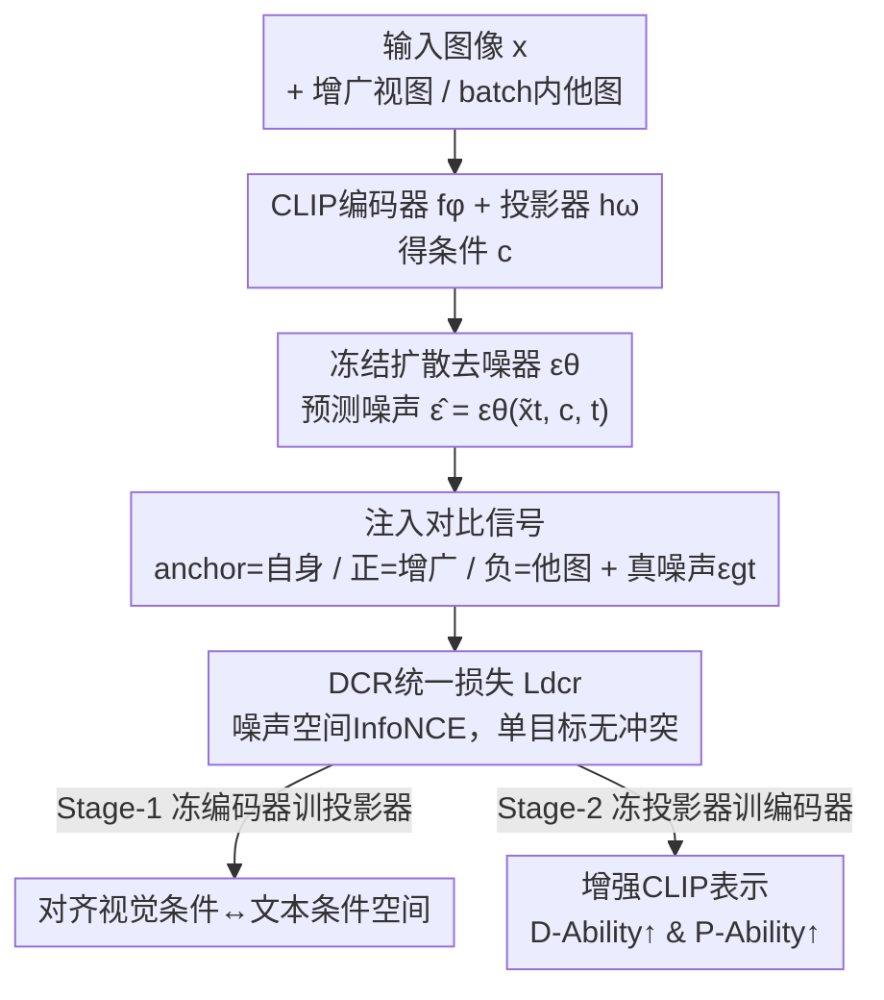

# Guiding Diffusion-based Reconstruction with Contrastive Signals for Balanced Visual Representation

**会议**: CVPR 2026  
**论文**: [CVF Open Access](https://openaccess.thecvf.com/content/CVPR2026/html/Han_Guiding_Diffusion-based_Reconstruction_with_Contrastive_Signals_for_Balanced_Visual_Representation_CVPR_2026_paper.html)  
**代码**: https://github.com/boyuh/DCR  
**领域**: 多模态VLM / 表示学习 / 扩散模型  
**关键词**: CLIP视觉编码器, 扩散重建, 对比学习, 梯度冲突, 表示增强  

## 一句话总结
为了让 CLIP 视觉编码器同时具备"分得开类别"（判别力）和"看得清细节"（细粒度感知力），本文提出 DCR：不再让扩散模型去重建原图（只补细节、伤判别），而是把对比信号注入到扩散模型**预测的噪声**上构成一个统一损失，用单一目标同时优化两种能力、绕开了朴素组合两个 loss 时的梯度冲突，在 6 个 CLIP backbone 和下游 MLLM 上一致涨点。

## 研究背景与动机
**领域现状**：CLIP 视觉编码器是绝大多数多模态大模型（MLLM）的"眼睛"，被当作冻结模块提供图像表示。但它的图文对齐是相对粗糙的自监督，理解能力有限，已成为下游性能的瓶颈。社区把这种理解能力拆成两个互补维度：**判别力（D-Ability）**——能把不同类别在特征空间里分得开（同类聚拢、异类推远），关系到识别、检索、开放词表迁移；**细粒度感知力（P-Ability）**——能保留颜色、方向、数量、结构这些细节，关系到多模态问答、指令跟随、以视觉为中心的推理。

**现有痛点**：增强 CLIP 有两条路且各自偏科。传统做法用各种对比学习微调编码器，主要强化判别力；近期兴起的扩散反馈（DIVA / GenHancer / un2CLIP）把 CLIP 特征当条件去重建图像，重建得越像、说明表示越完整，从而提升细粒度感知力。问题是后者**缺类别监督**，纯重建对判别力几乎没增益、甚至会损害它——论文 Fig.1(d) 显示扩散重建方法在判别维度上不进反退。

**核心矛盾**：一个直觉的修法是"重建 loss + 对比 loss"线性加权一起训。但作者实测发现这种朴素组合并不 work：两个目标关注的东西根本不在一个层面——对比 loss 盯着 CLIP **特征**的可分性，重建 loss 盯着**图像级**重建一致性，二者的梯度方向经常打架。论文统计在 OpenAI CLIP ViT-L 上训练时，**86.3% 的步**两个 loss 的梯度余弦相似度为负（即冲突），且随训练越往后冲突越严重；结果是更"容易"的对比 loss 主导、重建 loss 被压制无法收敛，训练震荡甚至特征坍塌。

**核心 idea**：与其在两个异质目标之间做加权平衡，不如把问题在根上解决——**用单一目标**。DCR 的关键改动是：不再用"重建图像 ↔ 原图"的图像级一致性，而是把对比监督施加在**扩散模型对各张图预测出的噪声**上。anchor 是图像自身条件下预测的噪声，正样本是其增广视图条件下的噪声，负样本是 mini-batch 内其它图像条件下的噪声。一个对比 loss 统一了两件事，既满足对比约束（判别力）又等价于重建一致性（感知力），梯度冲突自然消失。

## 方法详解

### 整体框架
DCR 要解决的核心问题是"如何用一个损失同时把判别力和感知力都拉起来"。它复用一个**预训练且冻结**的条件扩散模型（Stable Diffusion v2.1）作为"裁判"，整个 pipeline 是：输入图像 → CLIP 视觉编码器 $f_\phi$ 抽特征 $z$ → 投影器 $h_\omega$ 把 $z$ 映射成扩散模型能读懂的条件 $c$ → 冻结的去噪器 $\epsilon_\theta$ 在某个加噪步 $t$ 下预测噪声 $\hat\epsilon=\epsilon_\theta(\tilde x_t, c, t)$。关键在于：对同一张加噪 latent，用**不同图像的条件**会预测出**不同的噪声**，于是作者在"预测噪声"这个空间里构造对比三元组（anchor / positive / negatives），用一个统一的对比损失 $L_{dcr}$ 去训练 CLIP 编码器，而扩散模型全程不动。

训练分两阶段，先对齐投影器、再增强编码器（见下方框架图）：先冻结编码器只训投影器（把视觉条件对齐到扩散模型原本的文本条件空间），再冻结投影器只训编码器（这时梯度直接重塑特征结构）。

### 关键设计

**1. 噪声空间对比三元组：把对比信号注入扩散预测的噪声而非原图**

这是 DCR 的灵魂，针对的是"朴素加权两个 loss 会梯度冲突"这个根因。朴素法的对比 loss 作用在 CLIP 特征 $z$ 上、重建 loss 作用在图像像素上，是两个异质目标。DCR 把战场统一搬到**扩散去噪器预测的噪声 $\hat\epsilon$** 上。给定图像 $x$：anchor 是用自身特征做条件预测的噪声 $\hat\epsilon=\epsilon_\theta(x_t, h_\omega(f_\phi(\tilde x)), t)$；正样本 $\hat\epsilon^+$ 是用其增广视图 $x^+=a(x)$（随机裁剪 / 颜色抖动）做条件预测的噪声；负样本 $\{\hat\epsilon_-^j\}$ 是 mini-batch 内其它图像 $x_j$ 做条件预测的噪声；此外把扩散的**真值噪声** $\epsilon^{gt}$ 也作为一个辅助正目标提供更丰富监督。直觉是：扩散模型的本质就是预测噪声，在预测噪声上做对比，等于逼着编码器去"感知作为条件的视觉表示之间的细微差异"——同类的条件要产出相似噪声、异类的条件要产出不同噪声，从而判别力和感知细节被同一个动作捎带着一起优化。

**2. DCR 统一损失：用一个 InfoNCE 同时满足两个目标**

有了三元组，损失定义为噪声空间的 InfoNCE。记 $d(u,v)=\exp(\mathrm{sim}(u,v)/\tau)$，$\mathrm{sim}$ 为余弦相似度，正集 $P=\{\hat\epsilon^+, \epsilon^{gt}\}$、负集 $N=\{\hat\epsilon_-^k\}_{k=1}^{N-1}$、$C=P\cup N$，则

$$L_{dcr} = -\frac{1}{2}\sum_{p\in P}\log\frac{d(\hat\epsilon, p)}{\sum_{c\in C} d(\hat\epsilon, c)}.$$

它只有一个优化方向，因此**结构上不可能再有梯度冲突**——这正是相比朴素加权 $L_{joint}=\lambda_{con}L_{con}+\lambda_{rec}L_{rec}$（86.3% 步数梯度打架）的本质区别。论文还给了理论支撑：**定理 1** 证明在温和假设下，特征空间的类内/类间散度 $S_{inner}, S_{inter}$ 可被噪声空间对应量控制（$S_{inner}\le \tfrac{1}{m^2}S^{(\epsilon)}_{inner}$，$S_{inter}\ge \kappa S^{(\epsilon)}_{inter}-\eta S^{(\epsilon)}_{inner}$），所以 $L_{dcr}\downarrow$ 会带来类内收紧、类间拉开（满足判别目标）；**定理 2** 证明当负样本与 anchor 充分分开时，DCR loss 退化为缩放后的重建 loss $L_{dcr}=\lambda\lVert\epsilon_\theta(x_t,h_\omega(f_\phi(\tilde x)),t)-\epsilon^{gt}_t\rVert_2^2+c$（等价于重建一致性目标）。一个 loss、两个能力，理论上同时握住。⚠️ 定理常数 $m,\kappa,\eta$ 的具体形式以原文附录为准。

**3. 两阶段冻结训练：先对齐投影器再增强编码器**

扩散模型原本是吃**文本**条件的，直接喂图像条件它读不懂。所以 Stage-1 冻结 CLIP 编码器、只训投影器 $h_\omega$，学一个把视觉引导对齐到原扩散模型文本引导空间的映射，保证冻结的去噪器能正确解读图像条件；Stage-2 反过来冻结投影器、只训编码器 $f_\phi$（用 LoRA，rank 16），此时来自 $L_{dcr}$ 的梯度直接精修编码器产出的特征结构——同类特征被引导去产出相似的预测噪声、异类产出不同的。消融显示两阶段显著优于端到端（MMVP 33.30 vs 25.93），原因是先把投影器/重建质量打好底，编码器增强才有意义。全程扩散模型 $\epsilon_\theta$ 冻结，因此训练开销远低于 GenHancer / un2CLIP 那种从头重训专用生成模型的做法。

### 损失函数 / 训练策略
单一损失即上面的 $L_{dcr}$。实现细节：单卡 A100-80G；SD v2.1 作扩散 backbone，投影器是两层 MLP；按 GenHancer 做法**只保留 [CLS] token、丢掉 patch token**作条件输入；训练集 CC3M；AdamW（weight decay 0.01），Stage-1/Stage-2 学习率分别 $1\times10^{-4}$ / $1\times10^{-5}$；Stage-2 用 LoRA rank 16 微调编码器；batch size 16，总步数 4600。

## 实验关键数据

### 主实验
评测在 6 个 CLIP backbone 上做：P-Ability 用 MMVP-VLM（9 类细粒度视觉模式），D-Ability 用 6 个数据集的零样本聚类（NMI/ACC/ARI）。对比 DIVA、GenHancer、un2CLIP（后两者还要自己重训生成模型，DCR 直接复用预训练 SD）。

| 能力维度 | Backbone | 指标 | Original | DIVA | GenHancer | un2CLIP | 本文 DCR |
|----------|----------|------|----------|------|-----------|---------|----------|
| P-Ability | OpenAI ViT-L@224 | MMVP-VLM Avg | 19.2 | 25.9 | 31.8 | 32.6 | **33.3** |
| P-Ability | OpenAI ViT-L@336 | MMVP-VLM Avg | 20.0 | 25.2 | 29.6 | 30.4 | **31.1** |
| P-Ability | MetaCLIP ViT-H@224 | MMVP-VLM Avg | 25.2 | 31.8 | 37.0 | - | **37.8** |
| P-Ability | SigLIP ViT-SO@224 | MMVP-VLM Avg | 37.8 | 40.7 | 42.2 | - | **43.0** |
| D-Ability | OpenAI ViT-L@224 | 聚类 Avg NMI/ACC/ARI | 0.71/0.61/0.49 | 0.71/0.60/0.48 | 0.65/0.55/0.41 | 0.70/0.62/0.48 | **0.76/0.67/0.54** |
| D-Ability | SigLIP ViT-SO@224 | 聚类 Avg NMI/ACC/ARI | 0.78/0.70/0.57 | 0.77/0.69/0.57 | 0.74/0.64/0.52 | - | **0.83/0.76/0.65** |

P-Ability 上 DCR 在 OpenAI ViT-L@224 比原始模型涨 14.1%、MetaCLIP ViT-L@224 涨 8.9%，且即便对手用了专用生成模型也被 DCR 超过。值得注意的是 D-Ability 上 GenHancer 在多个聚类数据集（如 ImageNet-1K、CIFAR-10）反而掉到原始模型以下（印证"纯重建伤判别力"），而 DCR 是唯一两个维度都稳定提升的。

下游 MLLM（LLaVA-1.5 / Vicuna-7B，直接替换视觉编码器、训练配置不变）也验证了迁移性：

| Benchmark | Original | DIVA | GenHancer | un2CLIP | 本文 DCR |
|-----------|----------|------|-----------|---------|----------|
| MMVP-MLLM Acc | 24.7 | 31.3 | 30.7 | 31.3 | **31.3** |
| NaturalBench G-Acc | 17.6 | 22.3 | 24.4 | - | **25.3** |
| CV-Bench 2D (COCO) | 60.9 | 63.4 | 63.6 | 65.1 | **65.5** |
| CV-Bench 3D | 58.7 | 60.2 | 63.2 | 61.2 | **63.5** |

### 消融实验
全部在 OpenAI CLIP ViT-L@224 上做。

| 配置 | MMVP ACC (P) | 聚类 NMI/ACC/ARI (D) | 说明 |
|------|--------------|----------------------|------|
| Naive（两 loss 线性加权） | 22.96 | 0.72/0.65/0.50 | 判别力略增但感知力被梯度冲突压垮 |
| **DCR（统一损失）** | **33.30** | **0.76/0.67/0.54** | 两维度同时最优 |
| End-to-End 训练 | 25.93 | 0.73/0.65/0.51 | 不分阶段 |
| **Two-Stage 训练** | **33.30** | **0.76/0.67/0.54** | 先对齐投影器再增强编码器 |

### 关键发现
- **统一损失是涨点主因**：朴素加权法 MMVP 只有 22.96%（被梯度冲突压制），换成 DCR 单目标直接到 33.30%，同时聚类指标也更好——验证"在根上用一个目标"的判断。
- **两阶段 > 端到端**：先把投影器/重建质量打好底，编码器增强才有效（MMVP 33.30 vs 25.93）。
- **扩散 backbone 越强越好，但不是越大越好**：SD-1.4→1.5→2.1 一致提升，SD-2.1 最佳；SD-XL 虽数据更大更优，但它用双编码器条件结构，被换成单一图像 embedding 后潜力发挥不出来，反而掉点——提示条件结构的匹配比模型规模更关键。
- **细粒度/纹理偏向的数据集增益最明显**：D-Ability 在 Caltech-101、DTD 上提升尤其突出，在 CIFAR-10、ImageNet 这类通用集上保持稳健。

## 亮点与洞察
- **把"两个异质目标的平衡"转化为"单目标"**：最 aha 的点是不去调 $\lambda_{con}/\lambda_{rec}$ 权重做平衡，而是换战场——在扩散预测噪声上做对比，让判别和重建变成同一个动作的两面。梯度冲突不是被"调和"而是被"消除"。
- **诊断先于方法**：作者先用梯度余弦相似度（86.3% 步为负）量化"冲突确实存在"，再据此设计统一损失，方法动机扎实而非拍脑袋。这种"先量化病因再开药"的思路可迁移到任何多目标/多任务训练。
- **理论给了等价性而非只给 bound**：定理 2 直接证明 DCR loss 在负样本可分时退化为缩放重建 loss，把"对比形式"和"重建目标"在数学上接起来，让"一个 loss 管两件事"不只是直觉。
- **工程友好**：复用冻结的预训练 SD + LoRA 微调编码器，相比 GenHancer/un2CLIP 重训生成模型，训练成本低、可作即插即用模块增强任意 CLIP。

## 局限与展望
- **只用 [CLS] token 作条件**：跟随 GenHancer 丢掉所有 patch token，可能丢失空间细节信息；对需要密集空间感知的任务（分割、检测）是否够用存疑，论文未充分讨论。
- **判别力依赖 batch 内负样本**：负样本来自 mini-batch 其它图像而非显式类别标签，batch size 固定为 16 偏小，类内/类间假设在小 batch 下能否稳定成立值得关注；理论定理也建立在"负样本与 anchor 充分分开"等温和假设上。⚠️ 假设的现实满足程度以原文附录验证为准。
- **条件结构敏感**：SD-XL 双编码器条件无法发挥说明 DCR 对扩散 backbone 的条件接口有耦合，换更强但结构不同的生成器未必直接受益。
- **下游 MLLM 增益偏小**：MMVP-MLLM 上 DCR 与 DIVA/un2CLIP 打平（都是 31.3），常规 MLLM benchmark（POPE/SciQA）上提升有限，视觉表示增强到下游推理的传导仍有损耗。

## 相关工作与启发
- **vs DIVA**：DIVA 首创用 CLIP embedding 条件化扩散做视觉反馈、靠重建一致性精修表示，但纯重建无类别监督、判别力几乎不涨甚至下降。DCR 把监督从图像级重建换成噪声级对比，统一了判别与感知，且不需要改动重建以外的架构。
- **vs GenHancer / un2CLIP**：二者都把重建做得更精（GenHancer 扩到离散 latent 空间，un2CLIP 解决 CLIP 特征空间与生成 latent 的不匹配），但**从头重训专用生成模型**、开销大，且仍偏重细粒度重建、判别力被忽视（聚类上常掉到原始 CLIP 以下）。DCR 直接复用预训练 SD + LoRA，成本低，且是唯一两个维度都稳涨的。
- **vs 朴素对比+重建加权**：这是最直接的 baseline，也是 DCR 的"反面教材"——它揭示了异质目标线性加权的梯度冲突陷阱，给所有"想同时优化判别与生成/重建"的工作提了个醒：与其调权重，不如想办法把两目标折叠进同一个损失。

## 评分
- 新颖性: ⭐⭐⭐⭐⭐ 把对比信号注入扩散预测噪声、用单目标消除梯度冲突，视角新且有理论支撑
- 实验充分度: ⭐⭐⭐⭐ 6 个 backbone + 判别/感知双维度 + 下游 MLLM + 消融齐全，但 batch size 偏小、MLLM 增益有限
- 写作质量: ⭐⭐⭐⭐⭐ 病因诊断（梯度冲突统计）→ 方法 → 理论等价性，逻辑链清晰
- 价值: ⭐⭐⭐⭐ 即插即用增强任意 CLIP、训练成本低，对多目标表示学习有方法论启发

<!-- RELATED:START -->

## 相关论文

- [\[CVPR 2026\] MOON2.0: Dynamic Modality-balanced Multimodal Representation Learning for E-commerce Product Understanding](moon20_dynamic_modality-balanced_multimodal_representation_learning_for_e-commer.md)
- [\[CVPR 2026\] Cubic Discrete Diffusion: Discrete Visual Generation on High-Dimensional Representation Tokens](cubic_discrete_diffusion_discrete_visual_generation_on_high-dimensional_represen.md)
- [\[CVPR 2026\] VQRAE: Representation Quantization Autoencoders for Multimodal Understanding, Generation and Reconstruction](vqrae_representation_quantization_autoencoders_for_multimodal_understanding_gene.md)
- [\[CVPR 2026\] WikiCLIP: An Efficient Contrastive Baseline for Open-domain Visual Entity Recognition](wikiclip_an_efficient_contrastive_baseline_for_open-domain_visual_entity_recogni.md)
- [\[ECCV 2024\] X-Former: Unifying Contrastive and Reconstruction Learning for MLLMs](../../ECCV2024/multimodal_vlm/x-former_unifying_contrastive_and_reconstruction_learning_for_mllms.md)

<!-- RELATED:END -->
