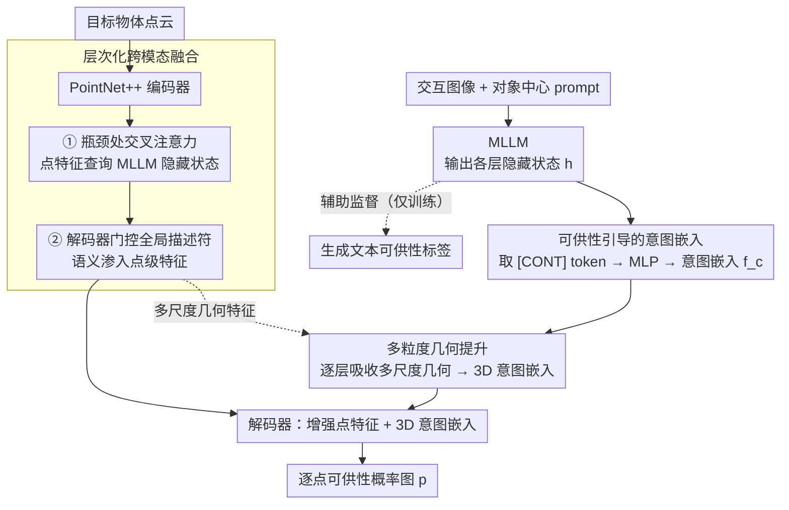

# HAMMER: Harnessing MLLM via Cross-Modal Integration for Intention-Driven 3D Affordance Grounding

**会议**: CVPR 2026  
**arXiv**: [2603.02329](https://arxiv.org/abs/2603.02329)  
**代码**: [https://rayyoh.github.io/Hammer/](https://rayyoh.github.io/Hammer/)  
**领域**: 多模态VLM  
**关键词**: 3D可供性, MLLM, 跨模态融合, 点云, 意图理解

## 一句话总结
提出 HAMMER 框架，通过从 MLLM 中提取接触感知的意图嵌入、层次化跨模态融合增强点云特征、以及多粒度几何提升模块为意图嵌入注入3D空间信息，实现基于交互图像的3D可供性定位，在 PIAD 基准上全面超越现有方法。

## 研究背景与动机
**领域现状**：意图驱动的3D可供性定位（通过交互图像预测点云上的可操作区域）是连接视觉理解和物理交互的重要任务，应用于机器人操作、模仿学习等。

**现有痛点**：GREAT 需要手工模板和两阶段训练，依赖 MLLM 生成文本描述作为中间表示；InteractVLM 将点云渲染为多视角图像后用2D分割器预测接触图再反投射到3D，存在几何不一致和细节丢失。

**核心矛盾**：现有方法要么未充分利用 MLLM 强大的理解能力（只用来生成文本），要么引入了不可避免的中间表示损失。

**本文目标**：如何完整利用 MLLM 的多模态理解能力进行3D可供性定位，避免中间文本或2D掩码的损失。

**切入角度**：直接从 MLLM 的隐藏层提取包含交互意图的嵌入，并通过跨模态注意力将 MLLM 的知识注入点云特征。

**核心idea**：用 [CONT] 特殊 token 聚合MLLM的交互意图，通过层次化跨模态融合和多粒度几何提升实现3D可供性定位。

## 方法详解

### 整体框架
HAMMER 要解决的是：给一张人和物体交互的图像，在目标物体的点云上标出可被这样操作的区域（可供性图）。它的核心想法是把 MLLM 当成「意图理解器」而非「文本生成器」——不让 MLLM 吐出一段文字再去解析，而是直接从它的隐藏层把交互意图抠出来，注入点云分支。

整条流水线是这样转的：交互图像 $\mathbf{I}$ 送进 MLLM，一方面用一个特殊 token 聚合出紧凑的意图嵌入 $\bm{f}_c$，另一方面保留各层的隐藏状态 $\bm{h}$；点云分支用 PointNet++ 编码物体几何，在编码器瓶颈处和解码阶段两次把 MLLM 的隐藏状态融进点云特征；与此同时，意图嵌入 $\bm{f}_c$ 借助点云分支逐层的几何特征被「提升」成带 3D 感知的 $\bm{f}_c^{3D}$；最后解码器把增强后的点云特征和 3D 意图嵌入结合，输出每个点的可供性概率图 $\bm{p}$。

### 关键设计

**1. 可供性引导的意图嵌入：用一个特殊 token 把 MLLM 的交互意图抠出来**

以往工作（如 GREAT）让 MLLM 生成一段文本可供性描述，再当中间表示喂给下游——文本是有损瓶颈，细粒度的空间意图在「图像→文字」这一步就丢了。HAMMER 绕开文本：在 MLLM 词表里新增一个 `[CONT]` 特殊 token，配合对象中心化的 prompt 引导模型聚焦到「这个物体被怎么交互」的语义上，然后直接取 `[CONT]` 最后一层的隐藏状态、过一个 MLP 投影成意图嵌入 $\bm{f}_c = \psi_c(\bm{h}_{[\text{CONT}]})$。这一步思路和 LISA 用 `[SEG]` token 聚合分割意图同源，区别是这里聚合的是 3D 可供性意图。为了让 `[CONT]` 真正学到交互语义，训练时还挂一个辅助任务让模型同时生成文本可供性标签——文本只在训练时当监督信号，推理时不再需要，因此没有中间表示损失。

**2. 层次化跨模态融合：把 MLLM 的世界知识两次灌进点云特征**

纯 3D backbone 只看几何、缺语义，分不清「杯子的把手适合抓」这类需要常识的判断。HAMMER 让 MLLM 的隐藏状态 $\bm{f}_h$（携带丰富视觉理解和世界知识）在点云解码路径上分两个阶段注入。第一阶段在编码器瓶颈处，用交叉注意力让点云特征去查询 MLLM 隐藏状态：

$$\tilde{\bm{f}}_p^{enc} = \text{CrossAttn}(\bm{f}_p^{enc}, \bm{f}_h, \bm{f}_h)$$

这一步在最压缩的语义层面把 MLLM 知识对齐到点云的全局表示上。第二阶段在解码器，用一个门控机制自适应地给各个 MLLM token 加权，聚成一个全局描述符，再和恢复到全分辨率的点云特征拼接，让语义信息渗透到细粒度的点级特征里。两次融合一粗一细，互补地补齐了点云分支缺的语义。

**3. 多粒度几何提升：给二维来的意图嵌入补上 3D 空间感**

意图嵌入 $\bm{f}_c$ 来自图像和文本，本身没有任何 3D 空间信息，直接拿去匹配点云会「悬空」。一个直觉做法是像 InteractVLM 那样把 2D 预测反投射回 3D，但反投射依赖相机参数、还会引入几何不一致。HAMMER 改成直接给嵌入本身注入几何：取点云解码器各层的多尺度特征 $\{\bm{f}_p^{(i)}\}$（从粗结构到精细表面），让意图嵌入逐层用注意力去吸收对应粒度的几何：

$$\bm{f}_c^{(i)} = \bm{f}_c^{(i-1)} + \text{Softmax}\!\left(\frac{\bm{q}^{(i)}(\bm{k}^{(i)})^T}{\sqrt{d}}\right) \bm{v}^{(i)}$$

其中 $\bm{q}$ 来自上一层的意图嵌入、$\bm{k}/\bm{v}$ 来自第 $i$ 层点云特征。从粗到细走完所有层后，嵌入就携带了完整的 3D 结构和表面感知，得到 $\bm{f}_c^{3D}$。相比反投射，这条路不需要相机参数、也不受 2D-3D 投影误差影响，更通用。

### 一个完整示例：一张「拿水杯」的交互图怎么走到可供性图

假设输入是一张人正握住马克杯把手的图，目标物体点云是这只马克杯。

1. **MLLM 抠意图**：图像 + 对象中心 prompt（「这个 mug 正被如何交互」）进 MLLM，`[CONT]` token 聚合出意图嵌入 $\bm{f}_c$——它编码的是「grasp / 握住把手」这层语义；辅助任务此时输出文本标签「grasp」作训练监督。
2. **点云编码**：PointNet++ 把马克杯点云编码到瓶颈，此处第一次交叉注意力把 MLLM 隐藏状态融进来，全局特征开始「知道」这是个可被握的容器。
3. **几何提升**：意图嵌入 $\bm{f}_c$ 沿解码器各层逐级吸收几何——先吸收粗结构（杯身是圆柱、旁边凸出一块是把手），再吸收精细表面（把手的弯曲弧面），变成带 3D 感知的 $\bm{f}_c^{3D}$。
4. **解码出图**：解码阶段门控加权的全局描述符 + 全分辨率点云特征结合 $\bm{f}_c^{3D}$，给每个点打可供性分数——把手区域得高分、杯口和杯底得低分，最终高亮出把手作为「可握」区域。

### 损失函数
$\mathcal{L} = \lambda_{txt}\mathcal{L}_{txt} + \lambda_{aff}\mathcal{L}_{aff}$：$\mathcal{L}_{txt}$ 是辅助文本标签的生成损失，$\mathcal{L}_{aff} = \mathcal{L}_{focal} + \mathcal{L}_{dice}$ 监督点级可供性图（focal 处理正负点严重不均，dice 优化区域重叠）。

## 实验关键数据

### 主实验（PIAD 基准）

| 方法 | 会议 | Seen aIOU↑ | Seen AUC↑ | Unseen aIOU↑ | Unseen AUC↑ |
|------|------|-----------|----------|-------------|------------|
| IAGNet | ICCV'23 | 20.51 | 84.85 | 7.95 | 71.84 |
| GREAT | CVPR'25 | 19.61 | 85.22 | 8.32 | 67.46 |
| **HAMMER** | - | **22.20** | **88.43** | **13.71** | **80.92** |

### 消融实验

| 配置 | Seen aIOU | Unseen aIOU | 说明 |
|------|----------|------------|------|
| Full HAMMER | 22.20 | 13.71 | 完整模型 |
| w/o 层次化融合 | ↓ | ↓ | 缺少MLLM知识注入 |
| w/o 几何提升 | ↓ | ↓ | 意图嵌入缺少3D信息 |
| w/o 文本辅助 | ↓ | ↓ | 模型对任务的理解变弱 |

### 关键发现
- 在 Unseen 设置上提升最为显著（aIOU: 8.32→13.71, AUC: 67.46→80.92），显示出强泛化能力
- 层次化融合和几何提升两个模块贡献互补：前者提升语义理解，后者提升空间定位
- 在噪声注入点云的鲁棒性测试中也表现优异

## 亮点与洞察
- **完整利用 MLLM 的多层信息**：不仅用最终输出，还用中间隐藏状态来增强点云特征，这比只用 MLLM 生成文本要充分得多
- **[CONT] token 聚合意图**的设计简洁有效，类似于 LISA 的 [SEG] token，但用于3D可供性
- 多粒度几何提升模块避免了2D到3D反投射的几何不一致问题

## 局限与展望
- 依赖预训练 MLLM（需要 LoRA 微调），计算开销较大
- 点云编码器使用较简单的 PointNet++，更强的3D backbone 可能进一步提升
- 仅在桌面操作物体上验证，场景级可供性理解未涉及
- 对象类别标签作为先验输入，在完全开放场景下获取这一先验有挑战

## 相关工作与启发
- **vs GREAT**: GREAT 用 MLLM 生成文本描述再融合，HAMMER 直接利用 MLLM 的隐藏状态，避免信息在文本转换中的损失
- **vs InteractVLM**: InteractVLM 通过2D掩码反投射到3D，HAMMER 通过多粒度几何提升直接增强意图嵌入的3D感知，无需相机参数
- 跨模态融合MLLM隐藏状态增强3D表示的思路可以扩展到其他3D理解任务

## 评分
- 新颖性: ⭐⭐⭐⭐ MLLM隐藏状态+点云的融合路径有新意
- 实验充分度: ⭐⭐⭐⭐ 多基准+消融+鲁棒性测试
- 写作质量: ⭐⭐⭐⭐ 与已有方法的架构对比图直观有效
- 价值: ⭐⭐⭐⭐ 为MLLM在3D理解任务中的应用提供了有价值的设计范式

<!-- RELATED:START -->

## 相关论文

- [\[CVPR 2026\] EG-3DVG: Expression and Geometry Aware Grounding Decoder for 3D Visual Grounding](eg-3dvg_expression_and_geometry_aware_grounding_decoder_for_3d_visual_grounding.md)
- [\[CVPR 2026\] Decoupled and Reusable Adaptation for Efficient Cross-Modal Transfer](decoupled_and_reusable_adaptation_for_efficient_cross-modal_transfer.md)
- [\[NeurIPS 2025\] Guiding Cross-Modal Representations with MLLM Priors via Preference Alignment](../../NeurIPS2025/multimodal_vlm/guiding_cross-modal_representations_with_mllm_priors_via_preference_alignment.md)
- [\[ICCV 2025\] Visual Intention Grounding for Egocentric Assistants](../../ICCV2025/multimodal_vlm/visual_intention_grounding_for_egocentric_assistants.md)
- [\[CVPR 2026\] Rethinking Cross-Modal Anchor Alignment for Mitigating Error Accumulation](rethinking_cross-modal_anchor_alignment_for_mitigating_error_accumulation.md)

<!-- RELATED:END -->
