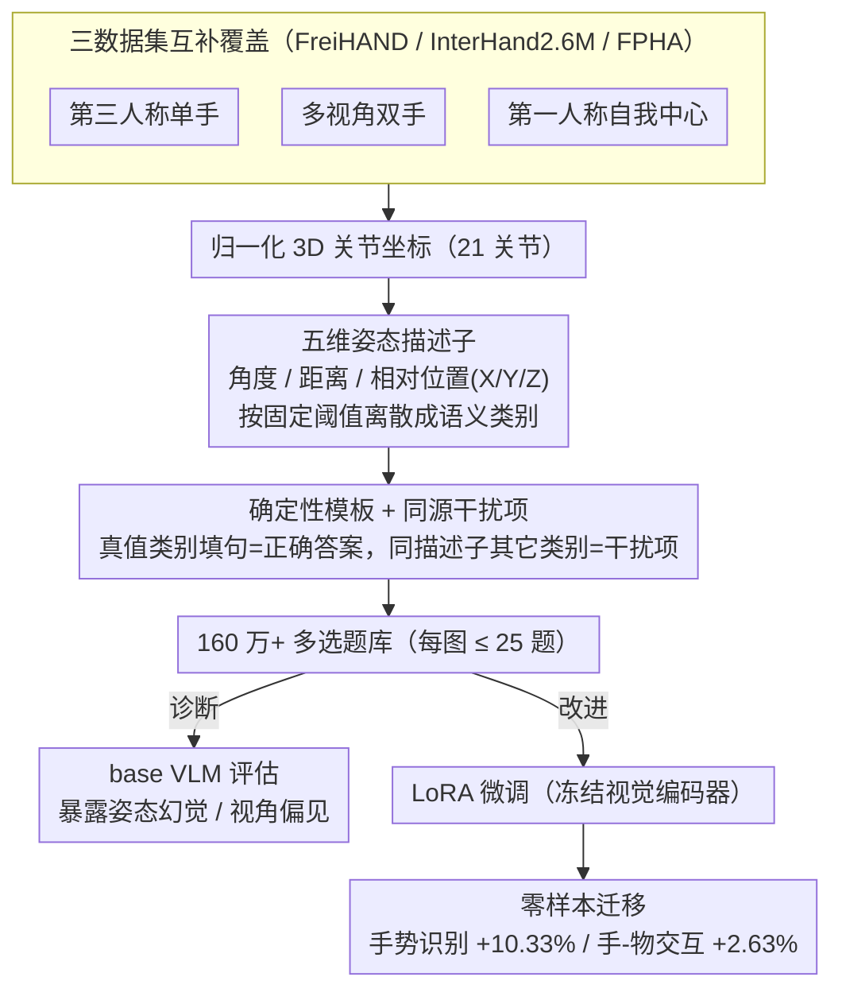

# HandVQA: Diagnosing and Improving Fine-Grained Spatial Reasoning about Hands in Vision-Language Models

**会议**: CVPR 2026  
**arXiv**: [2603.26362](https://arxiv.org/abs/2603.26362)  
**代码**: [https://kcsayem.github.io/handvqa/](https://kcsayem.github.io/handvqa/)  
**领域**: 多模态VLM  
**关键词**: 手部空间推理, VQA基准, 视觉语言模型, 细粒度理解, 零样本迁移

## 一句话总结
构建了 HandVQA——一个包含 160 万+选择题的大规模诊断性基准，基于 3D 手部关节标注自动生成关于关节角度、距离和相对位置的 VQA 问题，系统暴露了当前 VLM 在细粒度手部空间推理上的严重缺陷，并证明在 HandVQA 上微调后的模型可零样本迁移到手势识别（+10.33%）和手-物交互识别（+2.63%）等下游任务。

## 研究背景与动机

**领域现状**：视觉语言模型（VLM）在通用 VQA 任务上已接近人类水平（如 VQAv2），但在细粒度空间推理上表现不佳。已有研究表明 VLM 在简单的左/右区分上仅达到约 56% 准确率（人类 99%），反映的是表面相关性而非真正的几何理解。

**现有痛点**：手部是人类传达动作、意图和控制的主要媒介，精确理解手部姿态在机器人手术、芯片制造、AR/VR 交互等高风险场景中至关重要。然而现有 VLM 对手部关节级别的空间关系（21 个关节的复杂空间配置）缺乏理解，经常产生"姿态幻觉"——误判关节弯曲状态或错误估计手指间距离。

**核心矛盾**：通用 VQA 基准无法诊断 VLM 在细粒度空间推理上的具体弱点。现有空间推理基准（如 CLEVR、SPHERE）关注物体间关系，没有针对单一物体内部的部件级空间结构（如手部关节的运动学和几何关系）进行评估。

**本文目标** 1) 如何系统评估 VLM 对手部关节级空间关系的理解能力？2) VLM 的具体失败模式是什么？3) 通过手部空间推理训练获得的能力能否迁移到其他任务？

**切入角度**：利用现有高质量 3D 手部数据集（FreiHAND、InterHand2.6M、FPHA）的精确 3D 关节标注，自动生成诊断性 VQA 问题，将手部姿态估计分解为五个可独立评估的子任务。

**核心 idea**：将手部 3D 关节坐标系统转换为结构化自然语言选择题，实现对 VLM 手部空间推理能力的精确诊断和有效改进。

## 方法详解

### 整体框架
HandVQA 要解决的核心问题是：怎样不靠人工标注、又无歧义地考出一个 VLM 到底懂不懂手部关节级的空间关系。它的思路是把现成 3D 手部数据集里精确的 21 关节坐标当作"标准答案的源头"，让一条全自动、全确定性的管线把这些坐标翻译成选择题。管线分三步走：先从归一化的 3D 关节坐标算出连续几何量（关节夹角、关节间距离、沿坐标轴的相对位置），再按固定阈值把这些连续量离散成有限几个语义类别；然后用确定性模板把类别填进自然语言句子，真值类别对应的句子当正确答案、其余类别对应的句子当干扰项；最后把图像和这组选项配成标准多选题。每张图最多出 25 道题（5 种描述子 × 每种采样 5 个实例），全库累计超过 160 万道。整条链路没有任何随机性或人工判断，因此基准本身可复现、可审计。生成的题库一边用来诊断现成 VLM 的缺陷，一边用来 LoRA 微调以验证这种空间推理能力可否迁移到下游任务。

### 关键设计

**1. 三数据集互补覆盖：把视角与单/双手的偏见也考进来**

只在一种拍摄设定下评估，会让结论被数据分布带偏。HandVQA 同时用三个互补数据集：FreiHAND 是第三人称单手，InterHand2.6M 是多视角双手，FPHA 是第一人称自我中心视角。三者各自独立训练、独立评估，于是基准不仅考"会不会读手"，还顺带暴露了模型对采集条件的脆弱性——base 模型在 FPHA 的自我中心视角上性能明显塌陷，说明 VLM 对视角存在系统性偏见；InterHand2.6M 的双手场景则因为关节数翻倍、左右手交叠，把空间推理的难度又抬高了一档。

**2. 五维姿态描述子：把连续几何量切成无歧义的语义类别**

诊断要可信，首先得让每道题的"标准答案"唯一确定，不能出现连续值评估里"到底算弯还是算直"的模糊地带。HandVQA 为此定义了三种几何度量并各自离散化：角度 $\theta_j$ 是同一根手指上相邻三关节的夹角，切成 4 类（完全弯曲 / 弯曲 / 轻微弯曲 / 伸直）；距离 $d_{(i,k)}$ 是两关节的欧氏距离，切成 3 类（靠近 / 分开 / 大幅分开）；相对位置 $\Delta_a(i,k)$ 是沿 X/Y/Z 三轴的有符号偏移，每轴分成左右 / 上下 / 前后。每类的阈值都是写死的（如 $\theta_j<105°$ 判完全弯曲、$\theta_j\geq 170°$ 判伸直），落在边界"对齐"区间的样本直接排除，避免把临界 case 当考点。这套五维分解的好处不只是消歧——它让评估能按维度拆开，看清一个模型到底是栽在角度、距离还是相对位置上，而不是只给一个笼统的总分。

**3. 确定性模板与同源干扰项：让选择题客观且有区分度**

有了类别标签，下一步是把它变成读得通、又骗不过去的题目。HandVQA 给每种描述子配一套固定句法模板，例如距离题的模板是 "The {joint A} joint of the {finger A} is {category} the {joint B} joint of the {finger B}."，把真值类别填进 {category} 就是正确答案。关键在于干扰项的来源：它不是随便编的，而是同一个关节对在该描述子下的其它类别（比如真值是 "spread"，干扰项就是 "close" 和 "far apart"）。这样干扰项天然合理、和正确答案处在同一语义轴上，模型不能靠排除离谱选项蒙对，必须真的判断几何关系；模板化也保证了不同模型、不同数据集之间的评估口径完全一致。

### 损失函数 / 训练策略
改进侧用 LoRA 对 VLM 做参数高效微调，并冻结视觉编码器，只在 HandVQA 训练集上训练；评估时角度 / 距离任务同时报准确率和 MAE。值得注意的是冻结视觉编码器既是省算力的选择，也成了后面角度任务始终难以做高的一个可能瓶颈（见实验分析）。

## 实验关键数据

### 主实验

| 模型 | 微调 | Angle Acc↑ | Angle MAE↓ | Distance Acc↑ | Distance MAE↓ |
|------|------|-----------|-----------|--------------|--------------|
| DeepSeek 7B (Base) | ✗ | 34.10 | 0.883 | 45.55 | 0.657 |
| LLaVA 7B (Base) | ✗ | 40.08 | 0.739 | 16.20 | 1.293 |
| Qwen 7B (Base) | ✗ | 37.92 | 0.779 | 19.58 | 1.247 |
| LLaVA 7B (Finetuned) | InterHand | **74.35** | **0.263** | **90.79** | **0.094** |
| DeepSeek 7B (Finetuned) | InterHand | 68.00 | 0.334 | 88.02 | 0.122 |

### 零样本迁移实验

| 模型 | 手势识别↑ | 手-物交互↑ |
|------|----------|-----------|
| LLaVA 7B (Base) | 57.42% | - |
| LLaVA 7B (Finetuned) | **69.58%** (+12.16) | - |
| Qwen 7B (Base) | 71.86% | 80.26% |
| Qwen 7B (Finetuned) | **82.19%** (+10.33) | **82.89%** (+2.63) |

### 关键发现
- Base VLM 在距离判断上严重失败：LLaVA 和 Qwen 的准确率低于随机猜测（33.3%），Qwen 在"spread"选项上 93% 的时间错误回答"close"
- 角度任务即使微调后仍然困难：最高仅 74.35%（vs 距离 90.79%），冻结视觉编码器可能是瓶颈
- 自我中心视角（FPHA）对 base 模型特别困难，表明 VLM 存在视角偏见
- 单个任务的优势不能泛化到其他任务：没有一个 base 模型在所有空间维度上都领先

## 亮点与洞察
- 将 3D 关节坐标转化为 VQA 选择题的管线设计非常巧妙——完全自动化、确定性、无歧义，可以低成本生成海量诊断数据。这个思路可以迁移到身体姿态、物体 6DoF 位姿等领域
- 零样本迁移实验证明"3D 空间推理是可迁移的技能"——在 HandVQA 上学到的关节级空间推理能力可以直接提升手势识别和视频交互识别，不需要任务特定训练
- 发现 VLM 的"姿态幻觉"现象：模型倾向于用简化答案（总是回答"close"或"slightly bent"）来应对空间推理问题，这与物体级幻觉不同

## 局限与展望
- 仅评估 7B 模型，更大模型可能表现不同
- 使用 LoRA 微调冻结了视觉编码器，可能限制了角度等精细特征的学习
- 离散化阈值固定，可能不完全符合人类感知的连续性
- 仅覆盖静态图像，未扩展到视频中的动态手部推理
- 模板化语言限制了问题多样性，未来可引入更自然的表述

## 相关工作与启发
- **vs SPHERE**: SPHERE 评估物体间空间关系，HandVQA 聚焦单物体内部件级结构，更精细也更具挑战性
- **vs SpatialVLM**: SpatialVLM 通过深度图注入空间信息，HOandVQA 通过 VQA 训练让模型自主学习空间推理能力
- HandVQA 的自动生成管线可以启发其他领域的诊断性 benchmark 构建

## 评分
- 新颖性: ⭐⭐⭐⭐ 首个系统性评估 VLM 手部空间推理的大规模基准
- 实验充分度: ⭐⭐⭐⭐⭐ 三个数据集、三个模型、五个子任务、零样本迁移，非常全面
- 写作质量: ⭐⭐⭐⭐ 结构清晰，分析深入
- 价值: ⭐⭐⭐⭐ 对理解和改进 VLM 空间推理有重要参考价值

<!-- RELATED:START -->

## 相关论文

- [\[CVPR 2026\] CropVLM: Learning to Zoom for Fine-Grained Vision-Language Perception](cropvlm_learning_to_zoom_for_fine_grained_vision_language_perception.md)
- [\[CVPR 2026\] It's Time to Get It Right: Improving Analog Clock Reading and Clock-Hand Spatial Reasoning in Vision-Language Models](its_time_to_get_it_right_improving_analog_clock_reading_and_clock-hand_spatial_r.md)
- [\[CVPR 2026\] Concept-wise Attention for Fine-grained Concept Bottleneck Models](coat_cbm_concept_wise_attention.md)
- [\[CVPR 2026\] Fine-Grained Post-Training Quantization for Large Vision Language Models with Quantization-Aware Integrated Gradients](fine-grained_post-training_quantization_for_large_vision_language_models_with_qu.md)
- [\[CVPR 2026\] ReasonMap: Towards Fine-Grained Visual Reasoning from Transit Maps](reasonmap_towards_fine-grained_visual_reasoning_from_transit_maps.md)

<!-- RELATED:END -->
