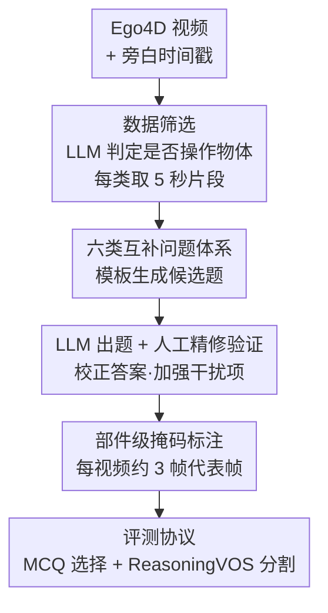

# HanDyVQA: A Video QA Benchmark for Fine-Grained Hand-Object Interaction Dynamics

**会议**: CVPR 2026  
**论文**: [CVF Open Access](https://openaccess.thecvf.com/content/CVPR2026/html/Tateno_HanDyVQA_A_Video_QA_Benchmark_for_Fine-Grained_Hand-Object_Interaction_Dynamics_CVPR_2026_paper.html)  
**代码**: [项目主页](https://masatate.github.io/HanDyVQA-project-page/)  
**领域**: 多模态VLM / 视频理解  
**关键词**: 视频问答、手物交互、细粒度时空动态、Reasoning VOS、视频基础模型评测

## 一句话总结
HanDyVQA 是一个面向"手-物交互（HOI）动态过程"的细粒度视频问答 benchmark，用 6 类问题（动作/过程/物体/位置/状态变化/部件）覆盖"操作→效果"全链路，含 1.11 万道五选一选择题和 1.03 万帧分割掩码，实测最强模型 Gemini-2.5-Pro 也只有 73% 准确率，远低于人类的 97%。

## 研究背景与动机
**领域现状**：手-物交互理解是 egocentric 视频研究的核心方向，近年涌现大量 benchmark，主要分两支——要么做底层定位（检测手/物、估计 3D 姿态、物体追踪），要么做高层语义（动作识别、长程动作、流程步骤、物体状态变化）。

**现有痛点**：这些 benchmark 几乎都只盯住 HOI 的"单一侧面"——要么只看人怎么"操作"（manipulation），要么只看物体最终"变成什么状态"（effect），而且粒度很粗。比如只问"这个人在做什么动作"，却不问"他从哪个方向锤、锤到了物体哪个部位、那个部位发生了什么形变"。

**核心矛盾**：HOI 本质是一个**动态过程**——人的手部动作在时空上连续地作用于物体，逐步产生效果。现有评测把这个连续过程拆成孤立的快照来考，自然就漏掉了"操作风格、手/物运动轨迹、部件级状态变化"这些只有看完整段视频才能回答的细节。

**本文目标**：造一个能系统评测"模型是否真懂 HOI 时空动态"的 benchmark，既覆盖操作侧也覆盖效果侧，既能问语义也能问像素级 grounding。

**切入角度**：作者观察到，"操作"和"效果"其实是同一交互过程的两端，应该用一套互补的问题类型把它们串起来；同时，物体/部件这类问题天然适合用分割掩码来验证模型是否"指对了地方"，于是引入 Reasoning VOS 任务。

**核心 idea**：在 Ego4D 真实视频上，用"LLM 出草稿 + 人工精修验证"的流水线，构造 6 类互补的细粒度 HOI 问题，并配套部件级的推理分割任务，专门暴露当代视频大模型在时空动态上的短板。

## 方法详解
本文是 benchmark 论文，核心不在"提出新模型"，而在"如何系统地造出一个能考倒现有模型的数据集 + 评测协议"。整体可拆成：定义任务与问题体系 → 半自动 QA 构造流水线 → 掩码标注 → 评测协议与划分。

### 整体框架
HanDyVQA 包含两个任务：**多选题（MCQ）** 与 **推理视频物体分割（ReasoningVOS）**。给定一段视频和一个问题，MCQ 要求从若干选项里选出正确答案（可能多选），ReasoningVOS 则要求输出与正确答案对应的分割掩码。问题被组织成 6 个类别，前三类考"操作侧"、后三类考"效果侧"：

- **Action（动作）**：人用手在做什么？
- **Process（过程）**：人是"怎么"完成这个动作的（方向、手法）？
- **Objects（物体）**：手用到了哪些物体？（常多答案）
- **Location（位置）**：人把物体放/移到了哪里？
- **State Change（状态变化）**：物体状态如何改变？
- **Object Parts（部件）**：物体的哪个部位发生了变化？

其中 Objects 和 Object Parts 两类额外提供 ReasoningVOS 样本（共 1.03 万帧掩码），要求模型不靠显式文本指代、而靠对问题的隐式推理去分割目标。整条数据生产线如下：

### 关键设计

**1. 六类互补的问题体系：把"操作→效果"全链路拆成可考的维度**

针对"现有 benchmark 只考单一侧面"这个痛点，作者把 HOI 动态显式拆成两组、共 6 类问题：操作侧（Action / Process / Objects）回答"人怎么动手、用了什么"，效果侧（Location / State Change / Object Parts）回答"物体被移到哪、状态怎么变、哪个部件变了"。每类用固定模板从旁白里抽 `[verb]` 和 `[object]` 填空生成，例如 Process 是"How does the person [verb] [object]?"。这套设计的关键在于它逼模型回答**只看完整时序才答得出**的问题——比如 Process 要分辨"从上往下直锤"还是"从侧面锤"，Object Parts 要定位"圆柱顶部的白色塑料件被锤进去了"，这些都不是单帧、也不是粗粒度标签能覆盖的。Action/Process 的选项描述明显更长（平均 18.1/20.3 词），因为要写清手的左右、涉及物体和细粒度手部运动。

**2. LLM 出草稿 + 人工精修验证的两阶段构造：在规模和质量间取得真实保证**

纯人工标注 1.1 万道带强干扰项的题成本极高，纯 LLM 生成又难保正确性与难度。作者用协作式流水线：先让 LLM 从旁白生成候选问题和答案，再让 LLM 生成干扰项；然后标注员介入——核验问题是否符合视频实际内容、修正或拒绝不合适的题、为 Objects 这类多答案问题列全所有合理物体，并**主动删除重叠选项、提升干扰项迷惑性、在必要时补更难的干扰项**。最终所有 QA 都经人工验证"准确、足够迷惑、人能答对"。这一步是 benchmark 可信度的命门：正是它保证了人类基线能达到 95%+（说明题有解），而模型却普遍答不好（说明题真难）。⚠️ 选 MCQ 而非开放式问答，是为了减少评测歧义、并通过设计强干扰项来探测细粒度理解，而不是图省事。

**3. 部件级 Reasoning VOS：用像素掩码验证"指对地方"，而非只验证"说对词"**

文本选择题可能被表层语义线索蒙对，作者于是为 Objects/Object Parts 配套分割任务：标注员从每段视频均匀采约 3 个目标清晰可见的代表帧，标出对应区域，共得 1.03 万帧掩码。与传统 Referring VOS（给显式文本指代去分割）不同，这里是 Reasoning VOS——模型要根据问题做隐式推理才知道该分割谁。由于 egocentric 视频里物体和相机都在动，掩码在相邻帧间漂移剧烈（Objects 相邻帧质心平均位移 93.7px、相邻帧 IoU 仅 0.17；Parts 更碎，IoU 仅 0.08），预测难度天然很高。部件级分割（如"圆柱被锤的那一小块"）比物体级更难，专门考模型的 component-level grounding。

**4. 真实多域数据 + 重测评轻训练的划分：保证多样性与评测严肃性**

benchmark 建在 Ego4D 之上，因为它包含真实、未脚本化的多场景 HOI（烹饪、园艺、修车、木工等），覆盖 112 个视频域、Top30 动词分布广。每段取旁白时间戳前后各 2.5 秒、共 5 秒的片段。划分上作者刻意用 **train:val:test = 10:5:85** 的比例（约 1.1K / 0.5K / 9.4K 题），只留极小一部分做 instruction tuning 让模型学会输出格式，把绝大多数样本留给评测——强调"这是评测集而非训练集"。

### 损失函数 / 训练策略
本文不训练新模型，主体是 zero-shot 评测；唯一涉及训练的是 4.3 节的"hand/object-aware"基线研究——把现成的 HelpingHands、EgoHOD 等带手/物 bbox 辅助监督的模型拿来对比，验证显式建模手/物信息能否提升表现（结论是各组件能减少不同类型错误，但作用有限）。

## 实验关键数据

### 主实验：MCQ zero-shot 排行
评测 8 个模型（6 开源 + 2 闭源），双编码器模型用视频-选项文本余弦相似度选答，LLM 集成模型直接读帧+选项提示。除 Objects 用 AP（多答案）外均用 top-1 准确率；Avg 排除 Objects（指标不同）。

| 模型 | 类型 | Action | Process | Location | State | Parts | Avg |
|------|------|--------|---------|----------|-------|-------|-----|
| Random | – | 19.3 | 18.9 | 20.4 | 19.8 | 19.4 | 19.5 |
| GPT-4o (text only) | 纯文本 | 36.6 | 50.9 | 34.1 | 39.5 | 45.5 | 41.3 |
| LaViLa (TSF-L) | 双编码器 | 61.6 | 40.1 | 36.9 | 38.9 | 35.6 | 42.6 |
| LLaVa-Video-7B | LLM集成 | 56.9 | 53.7 | 50.5 | 58.5 | 54.6 | 54.8 |
| Qwen2.5-VL-7B | LLM集成 | 60.8 | 54.9 | 47.9 | 56.7 | 48.6 | 53.8 |
| Qwen2.5-VL-72B | LLM集成 | 78.0 | 73.4 | 63.2 | 72.2 | 62.5 | 69.9 |
| GPT-4o (vision) | 闭源 | 61.3 | 64.4 | 51.5 | 59.0 | 58.5 | 58.9 |
| **Gemini-2.5-Pro** | 闭源 | 79.1 | 73.3 | 67.6 | 73.9 | 69.3 | **72.6** |
| **Human** | – | 98.6 | 95.9 | 96.6 | 95.3 | 96.9 | **96.6** |

最强的 Gemini-2.5-Pro 仅 72.6%，与人类 96.6% 存在约 24 个点的巨大鸿沟；纯文本 GPT-4o 仅略高于随机（说明选项无法靠文本偏置蒙对，benchmark 真要看视频）。Location 和 Parts 是所有模型的重灾区。

### 帧数/分辨率消融 + 错误类型分析
作者把错误归成 4 类，并扫描输入帧数（1→64 帧）和分辨率的影响：

| 配置变化 | 关键发现 |
|---------|---------|
| 增大帧数 + 分辨率 | 整体提升，Gemini-2.5-Pro 在 32 帧时各类错误最低、增益最一致 |
| mPLUG-Owl3 超过 8 帧 | 性能饱和（因其训练时用 8 帧片段） |
| Motion 类错误 | 增帧/增分辨率几乎无改善，是最顽固的短板，解释了 Process/Location 提升有限 |
| Interaction/空间关系错误 | 各模型错误率最高，对应 Location/Parts 低分 |

### Hand/Object-aware 模型对比（Tab.4）
| 模型 | 关键特性 | Objects(AP) | 备注 |
|------|---------|------------|------|
| LaViLa-L (16帧) | 基线 | 68.5 | – |
| HelpingHands-L | 手/物 bbox 推断 | 69.2 (+0.7) | Objects 涨但其他类全面引入更多错误 |
| EgoHOD-L | 富文本 + 运动适配器 | 75.3 (+6.8) | Objects/Location/State 改善，但 Motion Adapter 没能解决运动类错误 |

### ReasoningVOS（Tab.5）
所有模型分数远低于以往 ReasoningVOS benchmark（VideoLISA 在旧任务有 40+ 的 J，这里只有个位数）。最好的 Sa2VA-8B 在 Objects 上 J 约 32、Parts 仅约 11——**部件级分割是全新难点**。大模型整体更好（说明推理能力重要）；视频输入对大掩码更有利，逐帧处理有时反而在小掩码上更好。

### 关键发现
- **模型靠表层线索蒙混**：定性分析显示失败集中在 4 类——混淆相邻物体/手的左右、抓不住手物/物物空间关系、漏掉运动、看不出结构/状态变化。说明现有模型缺乏对局部交互与时序动态的细粒度建模。
- **运动理解是最硬的骨头**：增加时序信息（帧数）几乎无法降低 Motion 错误，暴露当前 frame-based 架构对时序动态利用不足。
- **显式手/物建模有用但不够**：bbox/文本辅助监督能在部分类别提升，但代价是别处引入新错误，无法系统解决左右手区分、运动理解。
- **部件级 grounding 是新挑战**：Object Parts 的 VOS 分数显著低于以往，模型常漏检多个被操作物体或把部件过度分割。

## 亮点与洞察
- **"操作↔效果"双侧 + 6 类问题的设计很系统**：它不是堆问题，而是用一套互补维度把 HOI 的连续动态拆成可量化的考点，让 benchmark 既有覆盖面又能定位模型具体短板（哪类问题/哪类错误）。
- **MCQ + ReasoningVOS 双任务相互印证**：选择题验证"能不能说对"，分割验证"能不能指对地方"，两者结合大幅压缩了"靠语言先验蒙对"的空间——这是个可迁移到其他细粒度评测的思路。
- **难度由人类基线背书**：人类 95%+ 而最强模型仅 73%，且纯文本基线接近随机，说明题目难度真实来自视觉时空理解而非歧义或文本泄漏，这种"双向校验"让 benchmark 的结论更可信。
- **错误类型化分析提供改进方向**：把 24 个点的差距拆成"空间关系/运动/结构变化"等具体瓶颈，等于给后续做 HOI-aware 视频编码器画了路线图。

## 局限与展望
- 作者承认当前 hand/object-aware 建模对运动、左右手区分等问题作用有限，暗示需要专门建模局部手-物信息及其时空动态的视频编码器。
- benchmark 仅建在 Ego4D（egocentric）上，结论是否迁移到第三人称视频未验证；5 秒短片段也限制了对长程操作流程的考察。⚠️ 训练集只占 10%，主要用于格式对齐而非充分微调，因此本文未给出"在该数据上充分训练后能到多高"的上界参考。
- ReasoningVOS 每视频仅约 3 帧代表帧标注，掩码时序密度较低，对连续追踪类评测的支撑有限。
- 改进思路：设计显式融合手姿态、物体追踪、物体特征的视频编码器；针对 Motion 错误引入更强的运动/光流建模；扩展到多视角或更长时序。

## 相关工作与启发
- **vs 高层 HOI benchmark（EgoTaskQA / EgoHOIBench / OSCAR 等）**：它们只考操作或效果之一、粒度粗；HanDyVQA 同时覆盖操作与效果、且做到部件级细粒度，所有 QA 经人工验证。
- **vs HD-EPIC**：HD-EPIC 虽做细粒度但效果侧只含 Location 类、不含 State Change/Object Parts；HanDyVQA 把效果侧补全到部件级。
- **vs Referring VOS（EgoMask / HOI-QA）**：它们靠显式文本指代做物体级分割；HanDyVQA 引入隐式推理的 Reasoning VOS 并下沉到部件级，要求对动态手-物关系和结构变化做推理。

## 评分
- 新颖性: ⭐⭐⭐⭐ 首个同时覆盖操作与效果、且带部件级 Reasoning VOS 的细粒度 HOI 动态 benchmark
- 实验充分度: ⭐⭐⭐⭐⭐ 8 个 MCQ 模型 + 多个 VOS 模型 + 帧数/分辨率消融 + 错误类型化分析 + hand/object-aware 对比，非常完整
- 写作质量: ⭐⭐⭐⭐ 任务定义与构造流水线清晰，错误分析有洞见
- 价值: ⭐⭐⭐⭐ 暴露当代视频大模型在 HOI 时空动态上的硬短板，为 HOI-aware 编码器提供明确路线图

<!-- RELATED:START -->

## 相关论文

- [\[CVPR 2026\] See What I Mean: Aligning Vision and Language Representations for Video Fine-grained Object Understanding](see_what_i_mean_aligning_vision_and_language_representations_for_video_fine-grai.md)
- [\[CVPR 2026\] MA-Bench: Towards Fine-grained Micro-Action Understanding](ma-bench_towards_fine-grained_micro-action_understanding.md)
- [\[NeurIPS 2025\] OpenHOI: Open-World Hand-Object Interaction Synthesis with Multimodal Large Language Models](../../NeurIPS2025/multimodal_vlm/openhoi_open-world_hand-object_interaction_synthesis_with_multimodal_large_langu.md)
- [\[CVPR 2026\] BOP-Ask: Object-Interaction Reasoning for Vision-Language Models](bop-ask_object-interaction_reasoning_for_vision-language_models.md)
- [\[CVPR 2026\] EagleNet: Energy-Aware Fine-Grained Relationship Learning Network for Text-Video Retrieval](eaglenet_energy-aware_fine-grained_relationship_learning_network_for_text-video_.md)

<!-- RELATED:END -->
