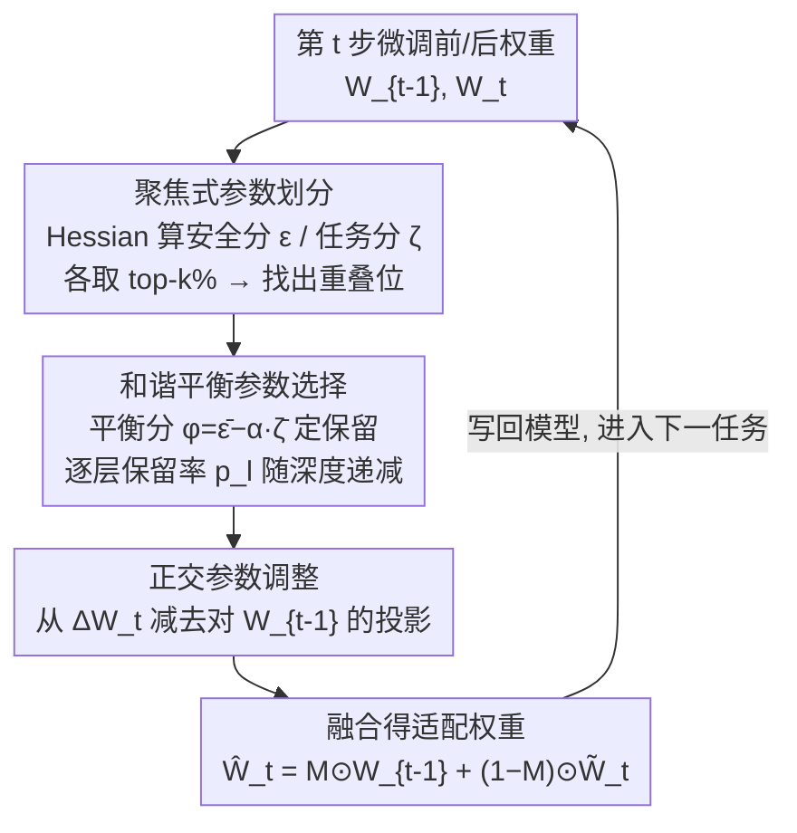

# Harmonious Parameter Adaptation in Continual Visual Instruction Tuning for Safety-Aligned MLLMs

**会议**: CVPR 2026  
**论文**: [CVF Open Access](https://openaccess.thecvf.com/content/CVPR2026/html/Wang_Harmonious_Parameter_Adaptation_in_Continual_Visual_Instruction_Tuning_for_Safety-Aligned_CVPR_2026_paper.html)  
**代码**: https://github.com/Minato-Zackie/HPA  
**领域**: 多模态VLM  
**关键词**: 持续视觉指令微调、安全对齐、灾难性遗忘、参数级后训练、安全-能力权衡

## 一句话总结
针对"已做过安全对齐的多模态大模型在持续指令微调（CVIT）中既遗忘旧任务、又掉安全"的双重问题，本文提出 HPA：在每步微调**结束后**对权重做一次免训练的参数级编辑——先按 Hessian 重要性把参数分成"安全聚焦/任务聚焦"两类，再用一个可自适应的平衡分数挑选要保留的安全参数，最后对任务参数更新做正交投影来抗遗忘，从而在不动原训练流程的前提下同时守住安全和能力。

## 研究背景与动机
**领域现状**：持续视觉指令微调（CVIT）让 MLLM 顺着一串视觉指令数据集逐个微调，不断适应新任务。主流做法（MoeLoRA、SMoLoRA、BranchLoRA、SEFE 等）大多靠**加参数模块、改训练流程**来缓解灾难性遗忘。

**现有痛点**：这些方法有两个隐患。一是几乎全都默认模型是"安全对齐之前"的（pre-SA CVIT），只盯着任务遗忘，完全没考虑安全；二是它们要么增加参数冗余和训练开销，要么改动原始训练管线。但真实部署里，模型是**先做完安全对齐再上线、再持续更新**（post-SA CVIT）的。

**核心矛盾**：作者观察到一个被忽略的现象——对一个已安全对齐的 MLLM 做 CVIT，模型不仅照常遗忘旧任务，**已经建立好的安全性也会随着微调步数持续退化**（图 1：攻击成功率一路升高）。而重新拿原始安全数据集再对齐一次，又被隐私限制和算力成本卡死。于是问题变成：在**不能重新对齐**的约束下，如何在持续微调中同时守住安全、当前任务、旧任务三者。

**本文目标**：在 post-SA CVIT 设定下，设计一个既能抗遗忘、又能保安全、还不打扰原训练流程的方案。

**切入角度**：深度网络是过参数化的，不是所有权重都同等重要——有些权重主要"管安全"，有些主要"管任务"。如果能在每步微调后**精确识别**这两类权重，就能有选择地把"管安全"的旧权重保留下来、把"管任务"的新权重留下，从参数层面去调和这个权衡。

**核心 idea**：把安全-能力的平衡问题转化为一个**参数选择 + 正交更新**的免训练后处理：用 $\hat{W}^l_t = F(W^l_{t-1}, W^l_t)$ 把上一步权重和当前步权重融合成新权重，融合规则就是"按安全/任务聚焦分类 → 平衡挑选 → 正交去干扰"。

## 方法详解

### 整体框架
HPA 是一个**后训练（post-training）参数适配框架**：它不碰原本的 LoRA 微调流程，而是在每个任务 $\tau_t$ 训练完之后，拿到"微调前权重 $W^l_{t-1}$"和"微调后权重 $W^l_t$"，对每一层 $l$ 做一次参数级编辑，产出最终权重 $\hat{W}^l_t$ 再写回模型。整条流水线由三块串行组成：**先分类、再挑选、最后正交修正**。

形式上目标是学一个融合函数 $\hat{W}^l_t = F(W^l_{t-1}, W^l_t)$，其中 $W^l_{t-1}, W^l_t \in \mathbb{R}^{r\times c}$ 分别是第 $l$ 层在微调前后的权重。post-SA CVIT 的总目标在普通 CVIT 的任务损失 $\sum_i \mathcal{L}_{C_i}$ 之外，额外多了一项安全损失 $\mathcal{L}_S$：

$$\min_{\{\theta_t\}} \sum_{t=1}^{n}\Big(\mathcal{L}_S\big(f(x;\theta_t)\big) + \sum_{i=1}^{t}\mathcal{L}_{C_i}\big(f(x;\theta_t)\big)\Big)$$

### 关键设计

**1. 聚焦式参数划分：用 Hessian 敏感度把权重分成"管安全"和"管任务"两类**

这一步要解决的是"凭什么判断哪些权重在保安全、哪些在学任务"。以往按权重幅值或梯度变化估计重要性太粗，抓不住这种"聚焦"行为。HPA 借鉴 Hessian 剪枝的思路：一个权重 $w_{i,j}$ 的重要性用"删掉它带来的损失增量" $(w_{i,j})^2 / [H^{-1}]_{jj}$ 衡量，$H$ 是损失对参数的 Hessian。把这个思路迁移到微调前后，对第 $l$ 层每个位置 $(i,j)$ 定义两个分数——安全聚焦分 $\varepsilon$ 和任务聚焦分 $\zeta$：

$$\varepsilon^l_{i,j} = \frac{\big(W^l_{t-1}(i,j)-W^l_t(i,j)\big)^2}{[H^{-1}_{s,l}]_{ii}}, \quad \zeta^l_{i,j} = \frac{\big(W^l_t(i,j)-W^l_{t-1}(i,j)\big)^2}{[H^{-1}_{t,l}]_{ii}}$$

其中 $H = 2X^\top X$，$X$ 是用**安全校准集** $D^*_s$ 或**任务校准集** $D^*_t$ 算出的激活矩阵——也就是说，分子是同一个权重改动量，分母换成不同数据集下的 Hessian 敏感度，于是同一处改动在"安全视角"和"任务视角"下被赋予不同重要性。再按列对 $r$ 行取均值得到列级聚焦强度 $\bar{\varepsilon}^l, \bar{\zeta}^l \in \mathbb{R}^c$，各取 top-$k$% 列，就得到安全聚焦参数（来自旧权重 $W^l_{t-1}$）和任务聚焦参数（来自新权重 $W^l_t$）。关键的麻烦点是**重叠**：某一列在旧权重里属于安全聚焦、在新权重同位置又属于任务聚焦，这类"共享聚焦位置"同时影响安全和任务，必须专门决定保留谁——这正是下一个设计要处理的。⚠️ 公式细节以原文为准。

**2. 和谐平衡参数选择：用可自适应的平衡分数 + 逐层保留率，避免一边倒**

光保留安全参数会伤当前任务，光留任务参数又掉安全，这个设计就是在**层内**和**层间**两个维度做平衡。先定义二值掩码 $M^l \in \mathbb{R}^{r\times c}$，融合写成 $\hat{W}^l_t = M^l \odot W^l_{t-1} + (1-M^l)\odot W^l_t$，掩码为 1 的列保留旧权重（保安全），为 0 的列用新权重（学任务），保留比例 $p$ 通常设得比聚焦比例 $k$ 小，让保留集是聚焦集的更紧子集。

层内策略是：先把**不在重叠位置**的安全聚焦参数全部保留（占比 $p_s$%），这些不会伤任务；剩下的名额到重叠位置里挑——对重叠位置定义平衡分数

$$\phi^l = \bar{\varepsilon}^l - \alpha \cdot \bar{\zeta}^l$$

$\phi$ 越大说明这列越偏安全，按 $\phi$ 取 top-$(p-p_s)$% 补足保留名额。其中 $\alpha$ 不是常数，而是按每层安全/任务信号的相对强弱**自适应**调节（用 $\log(\bar{\varepsilon}^l/\bar{\zeta}^l)$ 的期望过 $\tanh$ 后在上下界 $\alpha_0,\alpha_1$ 间插值），从而每层都能自己拿捏偏安全还是偏任务。层间策略是：靠近输出的高层编码更多任务特定知识，所以保留率随层深**线性递减**：

$$p_l = p_{\max} - \frac{l}{L}\cdot(p_{\max}-p_{\min})$$

浅层多留旧权重保安全，深层少留以让位给当前任务学习。这种"层内挑重叠位 + 层间动态保留率"的双重平衡，是 HPA 不让安全或任务任何一方崩掉的核心。

**3. 正交参数调整：把任务更新里"和旧知识同向"的分量投影掉，抗遗忘**

前两步在第 $t$ 步把安全和当前任务平衡好了，但对那些保留下来的**新权重**（来自 $W^l_t$），它们的更新仍可能干扰之前任务学到的表示。这个设计让新更新方向尽量与旧参数张成的子空间正交。记本步更新 $\Delta W^l_t = W^l_t - W^l_{t-1}$，先算它在旧权重 $W^l_{t-1}$ 上的投影（用 Frobenius 内积）：

$$\text{Proj}_{W^l_{t-1}}(\Delta W^l_t) = \frac{\langle \Delta W^l_t, W^l_{t-1}\rangle}{\|W^l_{t-1}\|_F^2} W^l_{t-1}$$

这一项量化了"新更新里与旧知识同向、容易覆盖旧表示"的成分；把它减掉，得到正交化后的更新 $\tilde{W}^l_t = W^l_{t-1} + \Delta W^l_t - \text{Proj}_{W^l_{t-1}}(\Delta W^l_t)$。最终融合用正交后的任务权重代替原始 $W^l_t$：

$$\hat{W}^l_t = M^l \odot W^l_{t-1} + (1-M^l)\odot \tilde{W}^l_t$$

直觉上，保留旧安全参数管"不掉安全"，正交更新管"不覆盖旧任务"，两者分工互补——消融里这一项主要把 BWT（抗遗忘指标）从 -7.00 拉回 -3.88。

### 损失函数 / 训练策略
HPA 本身**不引入额外训练损失**，它是在标准 LoRA 微调（LoRA 训完合并回基座）之后做的一次性参数编辑，整套流程按 Algorithm 1 逐任务、逐层执行：训练 → 抽前后权重 → 算 $\bar\varepsilon,\bar\zeta$ → 推出 $\phi,p_l$ → 形成掩码 $M$ → 正交更新 → 融合写回。校准集很小：安全校准集 $D^*_s$ 仅 8 条（用"有害图文 + 对齐模型自己产出的安全回复"凑成，绕开拿不到原始安全数据的限制），任务校准集 $D^*_t$ 128 条。基座为 LLaVA-v1.5-7B，超参 $\alpha_0=0.4,\alpha_1=0.8,p_{\min}=5,p_{\max}=15$，$k=2p_l$，作用于所有线性层。

## 实验关键数据

### 主实验
基座 LLaVA-v1.5-7B，按 AD→ImageNet→Flickr30k→Fin→ScienceQA→TextVQA 顺序持续微调，最终任务后评测。CVIT 看 AP（平均性能）/BWT（抗遗忘，越大越好）；安全看 MASR/DASR（攻击成功率及其相对初始模型的增量，越低越安全）。下表对比最强基线 Safe Delta：

| 数据条件 | 方法 | AP ↑ | BWT ↑ | MASR ↓ | DASR ↓ |
|----------|------|------|-------|--------|--------|
| Original | SeqFT | 65.68 | -25.62 | 42.56 | 39.70 |
| Original | Model Tailor | 68.79 | -10.29 | 28.29 | 25.43 |
| Original | Safe Delta | 73.32 | -6.91 | 5.02 | 2.15 |
| Original | **HPA (Ours)** | **75.73** | **-4.87** | **4.75** | **1.89** |
| 注入 0.1% 有害数据 | SeqFT | 66.69 | -24.29 | 58.22 | 55.36 |
| 注入 0.1% 有害数据 | Safe Delta | 73.20 | -6.82 | 24.26 | 21.40 |
| 注入 0.1% 有害数据 | **HPA (Ours)** | **76.62** | **-3.88** | **7.22** | **4.36** |

干净数据下 HPA 比 Safe Delta 在 AP/BWT 各 +2.41/+2.04，MASR/DASR 还各降 0.27/0.26——能力和安全同时更好。更说明问题的是**注入 0.1% 有害数据**的攻击场景：Safe Delta 安全直接崩到 MASR 24.26%，HPA 仍守在 7.22%（DASR 4.36%），同时 AP/BWT 反超 +3.42/+2.94，体现出对污染数据的鲁棒。

### 消融实验
三个组件（安全分 $\bar\varepsilon$ 保留、重叠位 $\phi$ 选择、正交更新 $\tilde W$）逐步叠加（注入 0.1% 有害数据条件）：

| Exp | $\bar\varepsilon$ | $\phi$ | $\tilde W$ | AP ↑ | BWT ↑ | MASR ↓ | DASR ↓ |
|-----|:---:|:---:|:---:|------|-------|--------|--------|
| 1 | ✗ | ✗ | ✗ | 66.69 | -24.29 | 58.22 | 55.36 |
| 2 | ✓ | ✗ | ✗ | 73.49 | -5.81 | 6.02 | 3.16 |
| 3 | ✗ | ✓ | ✗ | 74.16 | -5.21 | 11.51 | 8.64 |
| 4 | ✓ | ✓ | ✗ | 74.82 | -7.00 | 9.67 | 6.81 |
| 5 | ✓ | ✓ | ✓ | 76.62 | -3.88 | 7.22 | 4.36 |

### 关键发现
- **保安全主要靠 $\bar\varepsilon$**：Exp.1→2 仅加"保留安全聚焦参数"，MASR 就从 58.22 暴降到 6.02、BWT 从 -24.29 升到 -5.81，说明安全退化的根源确实是安全相关参数被微调覆盖。
- **$\phi$ 偏任务、$\tilde W$ 抗遗忘，分工清晰**：Exp.3 只保重叠位参数，任务更好（AP 74.16）但安全回落（MASR 11.51）；Exp.5 在 Exp.4 上加正交更新，把 BWT 从 -7.00 拉到 -3.88，验证正交项专治灾难性遗忘。
- **保留率 $p$ 的权衡**：$p$ 越大越安全、任务越掉；从安全角度至少需要 ~10% 安全聚焦参数才稳，而逐层动态 $p_l$ 比固定值取得更好折中。
- **任务顺序鲁棒**：在 Order1/Order2 两种打乱序列上，HPA 的 MASR 都在 5–8% 区间（SeqFT 高达 60+%），BWT 也优于 SeqFT 和 Model Tailor。

## 亮点与洞察
- **把"安全退化"作为一等公民提出来**：以往 CVIT 几乎只谈任务遗忘，本文指出 post-SA CVIT 下安全会随微调持续滑坡，这个问题设定本身就有价值。
- **同一改动、双视角打分**：$\varepsilon$ 和 $\zeta$ 分子相同、只换 Hessian 分母（安全数据 vs 任务数据），用同一套敏感度框架优雅地区分"管安全/管任务"，思路可复用到任何"双目标参数取舍"场景。
- **8 条样本的安全校准集**：利用"已对齐模型自己会拒答"来合成安全回复，绕开拿不到原始对齐数据的现实约束，几乎零成本。
- **纯后处理、不改训练管线**：HPA 是训练后的一次权重编辑，可即插即用挂在任何 LoRA-CVIT 流程后面，工程友好。

## 局限与展望
- 方法重度依赖 Hessian 逆对角项估计重要性，大模型上这部分计算/近似的精度和开销原文交代有限，⚠️ 实际可扩展性需进一步验证。
- 安全校准集只有 8 条、且覆盖四类风险，安全评测也只用 VLGuard/Ch3EF，安全的"代表性"和泛化到更多攻击类型的能力未充分检验。
- 多个超参（$k, p_{\min}, p_{\max}, \alpha_0, \alpha_1$）需手工设定，跨基座/跨任务序列的稳定性只在 7B + 两种顺序上验证。
- 只在 LLaVA-v1.5-7B 单一基座上做，更大模型或不同对齐方式（DPO/偏好优化）下是否同样有效未知。

## 相关工作与启发
- **vs Safe Delta / SPPFT（LLM 安全保护后训练）**：它们也想在微调后守安全，但 HPA 多了"安全/任务双视角 Hessian 分类 + 重叠位平衡选择 + 逐层动态保留率"，在有害数据注入的强攻击下安全优势悬殊（7.22% vs 24.26% MASR）。
- **vs SEFE / Model Tailor（CVIT 抗遗忘）**：这类方法聚焦任务遗忘、且常要加模块或改训练；HPA 不动管线、且把安全一并纳入，BWT 与安全指标双优。
- **vs 经典正交持续学习（如梯度/参数正交）**：HPA 把正交投影只用在"保留下来的任务权重"这一子集上，与参数选择掩码协同，而非全量正交，更精细。
- **可迁移启发**："同一改动量、换不同校准数据的 Hessian 做分母"这一打分范式，可用于任意需要在两个目标间分配参数的持续学习/多目标微调问题。

## 评分
- 新颖性: ⭐⭐⭐⭐⭐ 首次提出 post-SA CVIT 设定并给出参数级解法，问题与方法都新。
- 实验充分度: ⭐⭐⭐⭐ 主实验/消融/保留率/系数/任务顺序齐全，但只在单一 7B 基座验证。
- 写作质量: ⭐⭐⭐⭐ 三组件逻辑清晰、公式完整，部分 Hessian 近似细节略简。
- 价值: ⭐⭐⭐⭐⭐ 直击真实部署中"持续更新掉安全"的痛点，即插即用、工程价值高。

<!-- RELATED:START -->

## 相关论文

- [\[CVPR 2026\] Multimodal Continual Instruction Tuning with Dynamic Gradient Guidance](multimodal_continual_instruction_tuning_with_dynamic_gradient_guidance.md)
- [\[CVPR 2026\] Parameter-Efficient Adaptation for MLLMs via Implicit Modality Decomposition](parameter-efficient_adaptation_for_mllms_via_implicit_modality_decomposition.md)
- [\[CVPR 2026\] LLaDA-V: Large Language Diffusion Models with Visual Instruction Tuning](llada-v_large_language_diffusion_models_with_visual_instruction_tuning.md)
- [\[CVPR 2026\] Test-Time Distillation for Continual Model Adaptation](test-time_distillation_for_continual_model_adaptation.md)
- [\[ACL 2025\] Enhancing Multimodal Continual Instruction Tuning with BranchLoRA](../../ACL2025/multimodal_vlm/branchlora_continual_instruction.md)

<!-- RELATED:END -->
