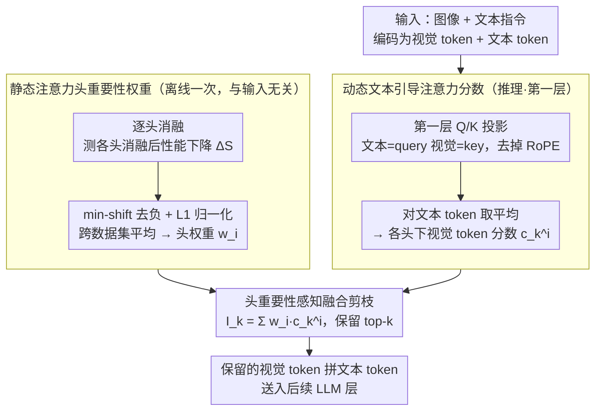

# HAWK: Head Importance-Aware Visual Token Pruning in Multimodal Models

**会议**: CVPR 2026  
**arXiv**: [2604.07812](https://arxiv.org/abs/2604.07812)  
**代码**: [https://github.com/peppery77/HAWK.git](https://github.com/peppery77/HAWK.git)  
**领域**: 多模态VLM / LLM效率  
**关键词**: 视觉token剪枝, 注意力头重要性, 多模态推理加速, 训练无关, 文本引导注意力

## 一句话总结
提出 HAWK，一种基于注意力头重要性感知的视觉 token 剪枝方法，通过离线计算各注意力头对视觉理解的贡献权重，并结合文本引导的注意力分数动态评估每个视觉 token 的重要性，在 Qwen2.5-VL 上剪枝 80.2% 视觉 token 后仍保留 96.0% 原始性能，同时减少 26% 推理延迟。

## 研究背景与动机

**领域现状**：多模态大语言模型（MLLM）将视觉输入编码为大量视觉 token（通常数百甚至上千个），与文本 token 一起输入 LLM 进行处理。由于注意力机制的计算复杂度随 token 数量二次增长，大量视觉 token 导致推理速度慢、内存消耗大。现有的视觉 token 剪枝方法主要分为三类：基于相似度的（DivPrune）、基于微调的（DART）和基于注意力的（FastV）。

**现有痛点**：1) 基于相似度的方法与上下文无关，无法根据用户指令自适应调整，可能丢弃与当前任务相关的 token；2) 基于微调的方法需要端到端训练，计算开销大且泛化性差；3) 基于注意力的方法假设所有注意力头对视觉理解贡献相等，简单地对所有头的注意力分数取平均来估计 token 重要性。

**核心矛盾**：不同注意力头实际上捕获了不同的视觉语义，对视觉理解的贡献差异很大。实验显示，禁用不同的注意力头会导致模型性能出现显著不同的变化，且这种变化趋势在多个数据集上一致。将所有头等同对待会导致保留冗余 token 而错误剪除有价值的 token。

**本文目标** 如何在视觉 token 剪枝中考虑不同注意力头的差异化贡献，最大程度保留关键 token？

**切入角度**：通过系统性地消融每个注意力头并测量对视觉任务的影响，发现头重要性的一致模式，据此设计权重感知的剪枝策略。

**核心 idea**：用离线计算的注意力头重要性权重对文本引导的视觉注意力分数进行加权，实现更精准的视觉 token 重要性估计和剪枝。

## 方法详解

### 整体框架
HAWK 想解决的事很具体：现有基于注意力的剪枝（如 FastV）把所有注意力头一视同仁地平均，但不同头其实各管一摊视觉语义，简单平均会让重要头的判断被噪声头稀释。HAWK 的做法是把"哪些头重要"和"当前指令下哪些视觉 token 重要"两件事拆开算再合起来。整条链路分三段走：先在离线阶段对每个注意力头做消融，量出它对视觉理解的固有贡献，得到一组只需算一次的静态头权重；推理时进到第一层注意力层，用 Q/K 投影算出文本 token 对每个视觉 token 的相关性分数（刻意去掉位置编码）；最后用头权重对这些分数加权求和，按总分保留 top-k 视觉 token，再和文本 token 拼起来送进后续 LLM 层。全程零训练，能直接挂到不同 MLLM 架构上。

### 关键设计

**1. 静态注意力头重要性权重：先量出每个头到底有多重要**

基于注意力的剪枝方法默认所有头等权，但 HAWK 的消融实验显示，禁用不同的头会让模型性能出现显著不同的跌幅，而且这种趋势在多个数据集上高度一致——这说明头的重要性是可以离线测准的。具体做法是对每个头 $i$、在每个基准数据集 $j$ 上测量消融该头后的性能下降 $\Delta S_{i,j} = S_{base,j} - S_{i,j}$。由于个别头被消融后性能反而略升会带来负值，先做一次 min-shift 把所有下降值平移到非负区间 $S'_{i,j} = \Delta S_{i,j} - \min_i(\Delta S_{i,j})$，再在每个数据集内做 L1 归一化、跨数据集取平均，得到最终头权重

$$w_i = \frac{1}{N_d}\sum_j \frac{S'_{i,j}}{\sum_i S'_{i,j}}.$$

关键在于这组权重只需算一次就能反复复用，把"哪些头懂视觉"这件事固化成了一张离线查找表，不给在线推理添任何负担。

**2. 动态文本引导注意力分数：根据当前指令判断哪些视觉 token 有用**

头权重是跟任务无关的固有属性，但"这张图里哪些区域和用户问题相关"必须随指令而变，所以还需要一个动态信号。HAWK 借用 LLM 第一层注意力层现成的 Q/K 投影矩阵，把文本 embedding 投成 query、视觉 embedding 投成 key，算出注意力矩阵 $A^i = Q^i \cdot (K^i)^T / \sqrt{d_k}$，再对所有文本 token 取平均，得到每个视觉 token $k$ 在头 $i$ 下的相关性分数 $c^i_k = \frac{1}{N}\sum_j A^i_{j,k}$。这里有意去掉 RoPE 位置编码，是因为带位置编码时位置靠近文本的视觉 token 会无端获得更高注意力，污染语义对应关系；去掉之后分数只反映文本和视觉之间的语义匹配。选第一层则是出于工程约束——剪枝要在模型前端做掉才能省下后续所有层的计算，而第一层已经携带了足够的语义信息。

**3. 头重要性感知融合剪枝：把静态头权重和动态分数合成一个总分**

前两步分别给出了"头有多重要"和"token 在每个头下有多相关"，最后一步把它们融合成单个可排序的重要性分数。每个视觉 token $k$ 的最终得分是用头权重对各头的注意力分数做加权求和

$$I_k = \sum_{i=1}^{N_h} w_i \cdot c^i_k,$$

然后按 $I_k$ 排序、保留 top $\tilde{M} = \lfloor M \cdot r \rfloor$ 个 token（$M$ 为原始视觉 token 数，$r$ 为保留率），其余丢弃，留下的子集和文本 token 拼接进入后续层。和 FastV 那种对所有头取平均的写法相比，这里的加权让真正懂关键视觉语义的头在打分中说话更响，不会被一堆贡献小的头平均掉，从而更准地保住有价值的 token、剪掉冗余的。

### 损失函数 / 训练策略
HAWK 完全无需训练。头重要性权重的离线计算使用 HallBench、MME、TextVQA、ChartQA、AI2D、RealWorldQA 六个数据集。推理时仅需一次矩阵运算计算注意力分数和加权剪枝。

## 实验关键数据

### 主实验 (Qwen2.5-VL-7B, Native Resolution)

| 方法 | 剪枝率 | HallBench | MME | TextVQA | ChartQA | Rel.% |
|------|--------|-----------|-----|---------|---------|-------|
| 原始模型 | 0% | 46.5 | 2315 | 85.2 | 86.2 | 100% |
| DivPrune | 60% | 45.8 | 2274 | 82.7 | 80.6 | 96.9% |
| FastV | 60% | 42.5 | 2283 | 84.1 | 82.5 | 96.1% |
| **HAWK** | **60%** | **46.5** | **2313** | **85.0** | **83.6** | **99.6%** |
| DivPrune | 80% | 39.0 | 2196 | 76.8 | 69.0 | 91.6% |
| FastV | 80% | 38.2 | 2236 | 81.9 | 72.3 | 92.3% |
| **HAWK** | **80%** | **42.8** | **2311** | **83.0** | **76.8** | **96.2%** |

### 效率分析 (MME, Qwen2.5-VL-7B)

| 配置 | Score | E2E延迟 | KV Cache | GPU内存 |
|------|-------|---------|----------|---------|
| 原始模型 | 2315 | 20m15s | 668MB | 16.9GB |
| HAWK (60%) | 2313 | 16m10s (x1.25) | 276MB | 16.1GB |
| HAWK (80%) | 2311 | 15m04s (x1.34) | 148MB | 15.7GB |

### 关键发现
- 在 60% 剪枝率下 HAWK 保留 99.6% 原始性能，远超第二名 DivPrune 的 96.9%（高出 2.7pp）
- 在 80% 剪枝率下仍保留 96.2%，比第二名高 3.9pp
- 迁移到 InternVL3-8B 后优势更大：80% 剪枝下 94.1% vs DivPrune 87.1%（高 7.0pp）
- 视频理解任务上同样有效：60% 剪枝保留 98.8% 性能
- 端到端延迟减少 25-34%，KV Cache 减少 59-78%，GPU 内存减少 0.8-1.2GB

## 亮点与洞察
- 核心发现非常有洞察力——注意力头对视觉理解的贡献高度不均且跨数据集一致。这个发现不仅对剪枝有用，也揭示了 MLLM 内部的视觉处理分工机制
- 去除 RoPE 的设计看似小细节但很关键——位置编码会导致位置靠近文本 token 的视觉 token 获得更高注意力，与实际语义重要性无关
- 方法极其简洁且实用：一次离线计算 + 推理时一次矩阵运算，零额外训练，可直接插入任何 MLLM，工程落地门槛极低
- 在极端剪枝率 90% 下仍保留约 90% 性能，说明 MLLM 中视觉 token 确实存在大量冗余

## 局限与展望
- 头重要性权重是跨数据集平均的静态值，可能不是每个具体任务的最优
- 仅使用第一层注意力来估计重要性，可能无法捕获更深层的语义依赖
- 与 CDPruner 相比，HAWK 在某些单项指标上并非总是最优，但综合性能最好
- 视频理解上 90% 剪枝率时不同方法差距缩小，高剪枝率下的区分度有限
- 未考虑动态剪枝率——不同图像/查询可能需要不同的保留比例

## 相关工作与启发
- **vs FastV**: FastV 基于早期层注意力分数简单排序剪枝，假设所有头等权。HAWK 通过头重要性加权显著提升了重要 token 的识别准确度
- **vs CDPruner**: CDPruner 用 DPP 建模条件多样性，计算开销更大。HAWK 更轻量且性能更优
- **vs DivPrune**: DivPrune 最大化特征多样性，与任务指令无关。HAWK 的文本引导机制使其能适应不同查询
- 头重要性分析的思路可迁移到 LLM 推理中的 KV Cache 压缩

## 评分
- 新颖性: ⭐⭐⭐⭐ 注意力头重要性差异的发现有价值，加权剪枝设计自然
- 实验充分度: ⭐⭐⭐⭐⭐ 覆盖两种模型架构、图像+视频、4种剪枝率、效率分析、消融实验
- 写作质量: ⭐⭐⭐⭐⭐ 结构清晰、动机明确、实验组织有条理
- 价值: ⭐⭐⭐⭐⭐ 方法简洁高效、效果显著、工程落地性极强

<!-- RELATED:START -->

## 相关论文

- [\[CVPR 2026\] When Token Pruning is Worse than Random: Understanding Visual Token Information in VLLMs](when_token_pruning_is_worse_than_random_understanding_visual_token_information_i.md)
- [\[CVPR 2026\] VLM-Pruner: Buffering for Spatial Sparsity in an Efficient VLM Centrifugal Token Pruning Paradigm](vlm-pruner_buffering_for_spatial_sparsity_in_an_efficient_vlm_centrifugal_token_.md)
- [\[NeurIPS 2025\] SCOPE: Saliency-Coverage Oriented Token Pruning for Efficient Multimodal LLMs](../../NeurIPS2025/multimodal_vlm/scope_saliency-coverage_oriented_token_pruning_for_efficient_multimodel_llms.md)
- [\[ICLR 2026\] IVC-Prune: Revealing the Implicit Visual Coordinates in LVLMs for Vision Token Pruning](../../ICLR2026/multimodal_vlm/ivc-prune_revealing_the_implicit_visual_coordinates_in_lvlms_for_vision_token_pr.md)
- [\[CVPR 2026\] On Token's Dilemma: Dynamic MoE with Drift-Aware Token Assignment for Continual Learning of Large Vision Language Models](on_tokens_dilemma_dynamic_moe_with_drift-aware_token_assignment_for_continual_le.md)

<!-- RELATED:END -->
