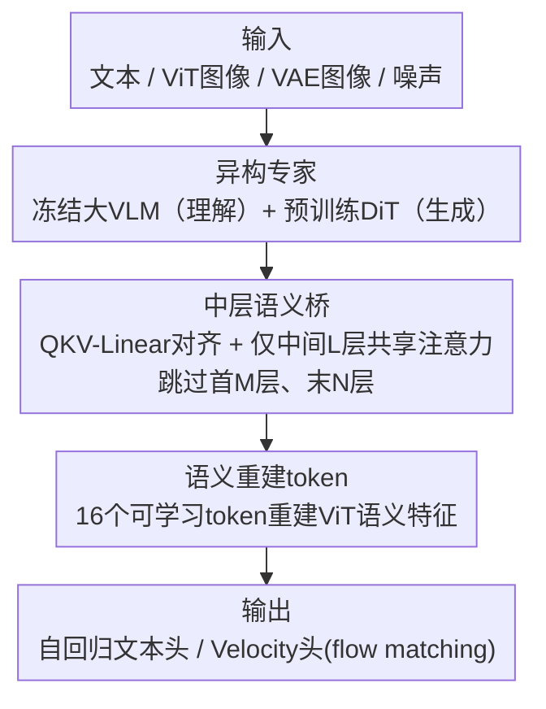

# HBridge: H-Shape Bridging of Heterogeneous Experts for Unified Multimodal Understanding and Generation

**会议**: CVPR 2026  
**论文**: [CVF Open Access](https://openaccess.thecvf.com/content/CVPR2026/html/Wang_HBridge_H-Shape_Bridging_of_Heterogeneous_Experts_for_Unified_Multimodal_Understanding_CVPR_2026_paper.html)  
**代码**: 待确认  
**领域**: 多模态VLM / 统一理解与生成  
**关键词**: 统一多模态, MoT, 异构专家, 中层桥接, 扩散先验

## 一句话总结
HBridge 把"统一理解+生成"模型里两个对称、逐层共享注意力的 MoT 专家，换成一对**异构专家**（冻结大 VLM + 预训练扩散 DiT），只在**中间若干层**桥接注意力、并加一组**语义重建 token**，用 BAGEL 约 1/12 的 T2I 训练 token 就在 DPG-Bench / GenEval / ImgEdit 上反超 BAGEL。

## 研究背景与动机
**领域现状**：统一多模态理解与生成的主流是 Mixture-of-Transformers（MoT）范式，代表是 BAGEL、LMFusion、Mogao。它们部署两个**完全相同**的 Transformer 专家（都从同一个预训练 LLM/VLM 初始化），一个管理解、一个管生成，并通过**逐层共享自注意力**让两个分支在每一层都交换信息。

**现有痛点**：这种对称、密集连接的设计有两个结构性问题。其一，生成分支被迫从自回归 LLM 初始化（因为没有现成的、架构与 LLM 兼容的大规模预训练扩散骨干），拿不到扩散模型的强生成先验，收敛慢、训练成本高，甚至和随机初始化差不多——论文 Fig. 2(a) 显示对称 7B+7B 模型收敛明显慢于异构 7B+4B。其二，理解任务靠高层语义推理、生成任务靠低层细粒度结构，二者天然不对称；在**最浅的输入层和最深的输出层**也强行共享注意力，会干扰各分支学习自己任务特有的表征。作者实测发现：跳掉 BAGEL 浅层和深层的跨专家连接几乎不掉点、甚至涨点（Fig. 2(b–c)），而且密集连接还会让生成专家**过拟合理解专家的浅层词法/实体特征**，绕过高层推理。

**核心矛盾**：对称 + 密集是为了"初始化方便、融合简单"，但它和"两个模态本就异构、两类任务本就不对称"这个事实直接冲突——便利性换来的是先验浪费和浅层过拟合。

**本文目标**：(1) 让生成分支能复用预训练扩散先验；(2) 只在真正有用的层做跨模态融合，避免浅/深层干扰与浅层过拟合；(3) 给生成显式注入高层语义。

**切入角度**：既然中间层连接主导性能、浅深层贡献甚微（Fig. 2 的特征漂移与性能退化分析），那就**只保留中层桥**，让架构形成一个"H"形拓扑——两根竖（各自独立的浅/深层）+ 一根横（中层桥）。

**核心 idea**：用一对**异构专家**（大 VLM + 扩散 DiT）替代对称双胞胎，用**中层语义桥**替代全层共享，再用**语义重建 token**补上高层语义对齐。

## 方法详解

### 整体框架
HBridge 是一个混合**非对称 MoT** 架构：左边是理解专家（一个冻结的预训练 VLM，如 Qwen2.5-VL-7B），右边是生成专家（一个从 OmniGen2 初始化的 4B 扩散 DiT）。输入的文本、ViT 图像特征、VAE 图像特征、噪声分别经各自 projector 进入对应专家；两个专家**只在中间一段层**通过多模态自注意力交换信息，浅层和深层各自独立。生成专家最终经 Velocity Head 用 flow matching 去噪出图，理解专家保留自回归文本头。因为两个专家的 embedding 维度、归一化、注意力头数都不同，桥接处要靠一组 **QKV-Linear** 把生成端的 Q/K/V 投影到理解端的统一语义空间再做交叉注意力，算完再投影回扩散专家原空间。

### 关键设计

**1. 异构专家：让理解和生成各用最适合自己模态的预训练骨干**

对称 MoT 的根本浪费是：生成分支从 LLM 初始化，白白丢掉扩散模型的生成先验。HBridge 直接拆成两个异构专家——理解专家是冻结的大 VLM（Qwen2.5-VL-7B 或 0.5B），完整保留原生的视觉-语言推理能力、且训练时不更新；生成专家是从 OmniGen2 取来的 4B 全注意力 DiT，天生带强图像合成先验。问题是两者内部配置（维度 $d_u \ne d_g$、归一化、头数）对不上，无法直接共享注意力。作者引入 **QKV-Linear 对齐模块**：给定生成专家第 $l$ 层的 $G_l^q, G_l^k, G_l^v$，用可学习矩阵投到理解空间 $Q_l = W_l^q G_l^q,\ K_l = W_l^k G_l^k,\ V_l = W_l^v G_l^v$，在统一潜空间里做跨模态注意力后再线性投影回扩散端。由于 DiT 有 32 层、比 Qwen2.5-VL-7B 的 28 层多，多出来的冗余层被挪进 Noise Projector，保证桥接层一一对齐。这样生成专家既复用扩散先验，又能和理解专家通信，是 HBridge 用 ~200B T2I token 就反超 BAGEL ~2.5T token 的根本原因。

**2. 中层语义桥：只在中间层桥接，砍掉 40%+ 注意力连接还涨质量**

全层共享会让浅层输入和深层输出也被迫融合，干扰各分支学任务特有表征，还诱导生成专家走捷径——很多生成任务只要从冻结理解专家抓浅层词法/实体特征就能出物体，于是模型懒得提取高层推理语义。作者的特征分析（Fig. 2b–c）显示中层连接主导性能、浅深层可有可无。HBridge 据此**只连接中间 $L$ 层、跳过最前 $M$ 层和最后 $N$ 层**的跨专家注意力，形成 H 形拓扑：两侧竖线是各自独立的浅/深层，中间横线是共享的语义桥。实现里取 $M=N=6$（跳首尾各 6 层）。这一刀砍掉超过 40% 的注意力共享，既提了效率，又因为避开浅层过拟合而**提升**了生成质量；消融显示 $M=N=10$ 时桥太窄、部分物体语义（如"蘑菇""向日葵"）会丢失。

**3. 语义重建 token：给生成端显式补一份高层语义监督**

生成常需要显式语义理解——物体关系、布局、组合推理。光靠中层桥的隐式对齐还不够，作者在生成专家输入侧追加一小撮**可学习 Semantic Reconstruction Tokens（SRT，实验用 16 个）**，训练时让它们去**重建目标图像的 ViT 级语义特征**，用余弦距离监督：$L_{\text{SRT}} = \text{Distance}_{\cos}(\text{Proj}(\text{Token}^{out}_{SRT}), F_{ViT})$，其中 $F_{ViT}$ 是冻结 Qwen2.5-VL-7B ViT 自适应池化后的特征。总损失 $L = L_{\text{Flowmatching}} + L_{\text{SRT}}$。这个辅助目标把语义监督直接灌进生成过程，逼模型内化关系语义，而不是只靠浅层实体特征蒙混过关。

### 损失函数 / 训练策略
生成主目标是 flow matching 去噪损失，叠加 SRT 的余弦重建损失 $L = L_{\text{Flowmatching}} + L_{\text{SRT}}$。理解专家全程冻结，只训练生成专家与桥接的线性层。优化器 AdamW，学习率 1e-4，约 200k 步；在 64 张 H100/A100/A800 上混合精度训练（部分实验用 16 卡 + 梯度累积逼近 64 卡），训练数据约 4 亿张图。

## 实验关键数据

### 主实验
默认配置 7B+4B（理解 Qwen2.5-VL-7B + 生成 4B DiT）。理解专家冻结，故 MMBench 83.5 / MMMU 58.6 / MM-Vet 67.1 直接继承原 VLM 能力。文生图主结果如下：

| 基准 | 指标 | HBridge (7B+4B) | BAGEL (7B+7B) | OmniGen2 (3B+4B) | UniWorld-V1 (7B+12B) |
|------|------|-----------------|---------------|------------------|----------------------|
| DPG-Bench | Overall ↑ | **85.23** | 85.07 | 83.57 | 81.38 |
| GenEval（无 rewriter） | Overall ↑ | **0.83** | 0.80* | 0.80 | 0.80 |
| GenEval（带 LLM rewriter） | Overall ↑ | **0.87** | 0.86* | 0.86 | 0.84 |

亮点：HBridge 用约 200B T2I token，对比 BAGEL 约 2.5T token（约 1/12），仍在 DPG-Bench、GenEval 上反超参数更大的 BAGEL（7B+7B）与 UniWorld-V1（7B+12B）。图像编辑 ImgEdit-Bench 上 HBridge 的 Overall 也优于 BAGEL、OmniGen2、Step1X-Edit 等竞品（在 Add/Position/Color-attri 等子项领先）。

### 消融实验
| 配置 | 结果 | 说明 |
|------|------|------|
| 异构专家（扩散初始化） | 40k 步即出高保真图 | 完整设计 |
| 换 VLM 初始化 DiT | 更多步仍质量骤降 | 丢掉扩散先验，验证异构专家价值 |
| 理解专家 7B vs 0.5B | 7B 视觉质量更好 | 更强理解专家提升生成 |
| 中层桥 $M=N=6$ | DPG/GenEval 最佳 | 跳首尾各 6 层为最优桥宽 |
| 中层桥 $M=N=10$ | 部分物体语义丢失 | 桥太窄，语义通道不足 |

### 关键发现
- **扩散先验是最大功臣**：把生成专家从扩散初始化换成 VLM 初始化的 DiT，即便训练更久也质量骤降——这是异构设计相对对称 MoT 最核心的收益。
- **桥宽有甜点**：$M=N=6$（保留中段、跳首尾各 6 层）最优；桥太窄（$M=N=10$）会丢物体语义，太宽则退回密集共享的浅层过拟合。
- **效率惊人**：训练 token 仅 BAGEL 的 ~8%，性能反超，说明对称密集 MoT 把大量算力浪费在了无用的浅/深层连接和缺先验的生成分支上。

## 亮点与洞察
- **"对称是为了方便、不是为了最优"这个反思很到位**：作者用 BAGEL 自身的"跳层不掉点"分析（Fig. 2）直接证伪了全层共享的必要性，再顺势推出 H 形拓扑，论证链条扎实。
- **QKV-Linear 是让异构专家能共享注意力的关键工程点**：它把"两个内部配置完全不同的预训练大模型拼在一起"这件看似不可能的事变可行，且只需训练轻量线性层，可迁移到任意 VLM+DiT 组合。
- **SRT 用"重建 ViT 语义特征"做辅助损失**，本质是把"生成时也要懂语义"这个要求显式化，思路可迁移到其他生成模型对抗浅层捷径。
- **资源效率是最有说服力的卖点**：~200B vs ~2.5T token 反超，说明架构改进比堆数据更划算。

## 局限与展望
- 理解专家全程冻结，统一模型的"理解"能力上限被原 VLM 锁死，无法通过生成任务反哺理解。
- 桥宽 $M=N$ 当成固定超参手调（取 6），未自适应；不同骨干/任务的最优桥宽可能不同，缺自动选择机制。
- 主要在文生图、图像编辑基准上验证；更复杂的交错图文、长上下文多模态推理生成未充分展开。
- "为何中层连接主导"只给了经验性的特征漂移/性能分析，缺更深的理论解释。

## 相关工作与启发
- **vs BAGEL / Mogao / LMFusion（对称密集 MoT）**：它们用两个相同专家逐层全共享、都从 LLM 初始化；HBridge 改成异构专家 + 中层桥，能用预训练扩散先验、砍 40%+ 连接，用 ~1/12 训练 token 反超——核心区别是"非对称 + 稀疏桥接"。
- **vs MetaQuery / Metamorph（连接器式混合）**：它们在 LLM 输入/输出侧接 learnable query 或预测连续视觉 token 喂扩散器，是松耦合；HBridge 在中间层做注意力级深度融合，交互更充分。
- **vs 纯自回归统一模型（Chameleon / UniToken）**：后者把图像离散化进统一 token 序列，受统一 tokenizer 和自回归累积误差限制、难出照片级图；HBridge 走 AR+扩散混合，保留扩散的高保真生成。

## 评分
- 新颖性: ⭐⭐⭐⭐⭐ "对称→异构 + 全层→中层桥"是对统一 MoT 范式的结构性重构，且有扎实的跳层分析支撑。
- 实验充分度: ⭐⭐⭐⭐ DPG/GenEval/ImgEdit 三基准 + 多项消融较全，但理解能力因冻结未深入评测。
- 写作质量: ⭐⭐⭐⭐ 动机—分析—设计链条清晰，H 形比喻直观。
- 价值: ⭐⭐⭐⭐⭐ 用 ~1/12 训练 token 反超 SOTA，为资源高效的统一多模态提供了新范式。

<!-- RELATED:START -->

## 相关论文

- [\[CVPR 2026\] OneCAT: Decoder-Only Auto-Regressive Model for Unified Understanding and Generation](onecat_decoder-only_auto-regressive_model_for_unified_understanding_and_generati.md)
- [\[CVPR 2026\] Rosetta Stone for Unified MLLMs: A Unified Tokenizer to Decipher Understanding and Generation](rosetta_stone_for_unified_mllms_a_unified_tokenizer_to_decipher_understanding_an.md)
- [\[CVPR 2026\] UniCompress: Token Compression for Unified Vision-Language Understanding and Generation](unicompress_token_compression_for_unified_vision-language_understanding_and_gene.md)
- [\[CVPR 2026\] CodeMMR: Bridging Natural Language, Code, and Image for Unified Retrieval](codemmr_bridging_natural_language_code_and_image_for_unified_retrieval.md)
- [\[CVPR 2026\] DuetSVG: Unified Multimodal SVG Generation with Internal Visual Guidance](duetsvg_unified_multimodal_svg_generation_with_internal_visual_guidance.md)

<!-- RELATED:END -->
