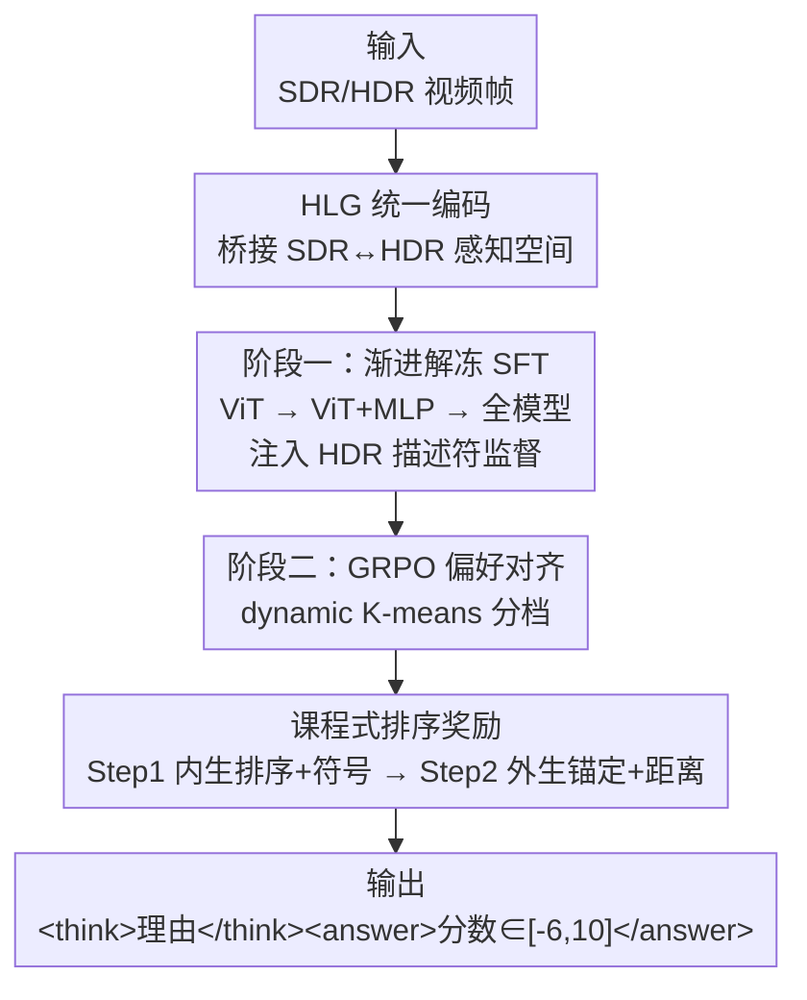

# HDR-VLM: HDR-Domain Adaptation of VLMs and Preference-Aligned Quality Assessment for HDR Video Color Grading

**会议**: CVPR 2026  
**论文**: [CVF Open Access](https://openaccess.thecvf.com/content/CVPR2026/html/Yuan_HDR-VLM_HDR-Domain_Adaptation_of_VLMs_and_Preference-Aligned_Quality_Assessment_for_CVPR_2026_paper.html)  
**代码**: 待确认（论文称录用后随数据集/脚本一并开源）  
**领域**: 多模态VLM / HDR视频质量评估  
**关键词**: HDR调色, 视频质量评估, VLM领域适配, HLG编码, GRPO课程奖励

## 一句话总结
HDR-VLM 是首个把只见过 SDR 的预训练 VLM 适配到 HDR 域、用于评估 HDR 视频调色质量的方法：第一阶段用 **HLG 统一编码 + 渐进解冻**补上 HDR 感知，第二阶段用**带课程式奖励的 GRPO** 把模型打分对齐到含噪的人类主观偏好，在真实产线 HDR 数据集上 PLCC 0.9033 / SROCC 0.8667，且能给出可解释的扣分理由。

## 研究背景与动机
**领域现状**：HDR（高动态范围）视频生产里，调色（color grading）决定了画面的色调、对比度、亮度观感。但评估"调色质量"很难——它是语义、内容相关的高层审美问题，而且几乎没有大规模标注数据。

**现有痛点**：现有 HDR 视频质量评估（VQA）方法大多是全参考、信号级的（PSNR/SSIM、HDR-VDP-3、ColorVideoVDP、LGFM），擅长测压缩/噪声/结构失真，却**抓不住调色的风格意图和语义连贯性**——比如高光是否被裁切、肤色/天空是否自然、整体氛围是否贴合内容情绪。另一边，预训练 VLM 有强语义先验、能生成可读理由，看似天选，但它们**只在 SDR 数据上训练过**，没见过 HDR 光度学：HDR 用 PQ 传递函数编码绝对亮度（最高 10000 nit），SDR（Rec.709 + Gamma 2.4）只编码约 100 nit 的相对亮度，VLM 会直接误判 HDR 的亮度和色彩（Fig. 1c）。

**核心矛盾**：有两道坎叠在一起。其一是**域差**——SDR 训练的 VLM 不懂 HDR 绝对亮度与光度统计，先前用 PU-21 编码硬迁移 SDR IQA 模型泛化很差。其二是**对齐难**——主观标注天生含噪，且监督是**多尺度**的：粗粒度的"档位间偏好"较可靠，细粒度的"同档内具体分值"很噪、且内容相关；普通监督微调（SFT）会收敛到一个平均尺度、泛化差，而现有 RL 类 IQA 方法（Q-Insight、VisualQuality-R1、VQAThinker）对噪声样本敏感、训练易不稳甚至退化。

**本文目标**：(1) 把 VLM 适配到 HDR 域而不破坏其语义先验；(2) 在含噪、多尺度的主观数据上稳定对齐人类偏好。

**切入角度**：作者发现一个被忽视的性质——VLM 对 **HLG（Hybrid Log-Gamma）编码**有天然适应性。HLG 低亮度段用类 SDR 的 Gamma 曲线、高亮度段转对数曲线，既能在 SDR 屏可看、又能渲染完整 HDR 细节，相当于从"VLM 熟悉的 SDR 类感知空间"平滑过渡到 HDR 域的**天然课程**。

**核心 idea**：用 HLG 把所有格式统一编码当域适配桥梁（解决域差）+ 用 coarse-to-fine 的内生排序奖励 GRPO（解决含噪对齐）。

## 方法详解

### 整体框架
HDR-VLM 以一个通用 VLM（Qwen2.5-VL 7B：ViT 视觉编码器 + MLP 投影 + LLM）为骨干，分两阶段训练。**阶段一（HDR 域适配）**：先把 SDR/HDR 输入统一编码成 HLG，再用一份 4 万对"双参考 HDR 帧 + 结构化 HDR 描述符"的语料做**渐进解冻 SFT**，让模型学会感知 HDR 亮度/色彩线索。**阶段二（主观偏好对齐）**：用 GRPO 强化学习，对同一 SRC 组内的多个版本采样多个候选打分，用 **dynamic K-means** 把相对分聚成 $M$ 个档位，再用一套 **coarse-to-fine 的课程式排序奖励**先稳住档位间排序、再校准具体分值。推理时模型输出 `<think>理由</think><answer>分数</answer>`，分数落在 $[-6, 10]$。

### 关键设计

**1. HLG 统一编码：用一个 VLM 本就半熟悉的域当 SDR→HDR 的过渡桥**

PQ 编码绝对亮度、和 SDR 屏不兼容、依赖 metadata 做色调映射，直接喂给 SDR 训练的 VLM 会被严重误判；而把 HDR 先 tone-map 回 SDR 又会压缩动态范围、丢掉 HDR 特有的伪影线索。作者的关键洞察是 **HLG** 的混合曲线：低亮段类 Gamma（VLM 熟悉）、高亮段转对数（覆盖 HDR），且 metadata-free。于是把 HDR10、HDR Vivid、Dolby Vision 等多格式统一编码进 HLG 域，让 VLM 从熟悉的 SDR 类感知空间出发、逐步暴露到更高亮度，形成天然课程。这一步是整个方法成立的前提——消融里 RL-only（不做 HDR 域适配）始终追不上完整管线，证明"先建 HDR 感知、再对齐偏好"缺一不可。

**2. 渐进解冻 SFT + 结构化 HDR 描述符：注入 HDR 感知又不破坏语义先验**

直接全模型一把微调会触发捷径学习——语言骨干会过拟合训练模式、产生虚假跨模态对齐，反而学不到 HDR 感知特征。作者用**三段式渐进解冻**：先只调 ViT（学 HDR 敏感的低层线索，LLM 与投影 MLP 冻结，稳住语义空间）→ 再放开投影 MLP（把 HDR 特征映进 LLM embedding 空间）→ 最后全解冻端到端指令微调。监督语料是 4 万对**双参考样本**：每对取同一 SRC、沿某个调色维度有差异的两帧，配上用内部工具算的帧级 HDR 描述符（峰值/平均亮度、高光区占比、阴影方差、平均色度饱和度、中间调对比度）拼成的结构化对比文本。这种因子化监督强化了模型对这些具体维度的敏感度。消融（Fig. 4）显示渐进解冻准确率 0.90，而 one-shot 全模型微调只有 0.85。

**3. GRPO + 课程式内生排序奖励：在含噪、多尺度主观数据上稳定对齐**

主观分含噪、且"档位间排序可靠 / 同档内分值噪"，直接回归分值会被噪声带偏。作者把对齐拆成 coarse-to-fine 两步课程，套在 GRPO 上（每样本采 $K$ 个候选分、标准化成优势 $a_k(v_i)=\frac{r_k(v_i)-\mu(r(v_i))}{\sigma(r(v_i))}$）。核心是用 **Spearman 排序相关（SROCC）**当奖励，因为它对单调变换不变、有界于 $[-1,1]$、稳定。先用 dynamic K-means（按类内方差与复杂度自适应选档数 $M$）把相对分分档。**Step 1（学排序）**：构造内生列表 $P_{L1}$——把当前预测插到它所属档位的槽里、其余槽填各档预测均值（留一法），奖励 $R_{L1}=\rho_s([M, M{-}1, \dots, 1], P_{L1})$ 衡量这个序列和"高到低档序"的吻合度；再叠一个**符号一致奖励** $R_{\text{sign}}$（预测与真值相对 SDR 同号给 0.5）。Step 1 奖励 $r^{(1)}=R_{L1}+R_{\text{sign}}$，目的是在噪声下先学稳健的档位间排序、抑制 SDR 锚点附近的噪声梯度。**Step 2（校准尺度）**：把内生均值换成真值均值得到外生列表 $P_{L2}$，奖励 $R_{L2}=\rho_s([1, 2, \dots, M], P_{L2})$ 把排序锚到真实尺度；再加**截断距离奖励** $R_{\text{dist}}=\max\{0, 1-\frac{|\hat s_{i,k}-\Delta J_i|}{\Delta_{\max}}\}$ 精修残差。Step 2 奖励 $r^{(2)}=R_{L2}+R_{\text{dist}}$，在不打乱已学排序的前提下对齐数值。这样"先排序后校尺度"的设计正是稳定性与泛化的来源。

### 损失函数 / 训练策略
阶段一 SFT 用标准下一 token 似然 $L_{\text{SFT}}=-\mathbb{E}_{(x,m,y)}\big[\sum_t \log \pi_\theta(y_t\mid x, m, y_{<t})\big]$。阶段二 GRPO 目标含 ratio clip 与 KL 正则：$\mathcal{J}(\theta)=\mathbb{E}[\min(\rho_k a_k, \bar\rho_k a_k)-\beta\, D_{KL}(\pi_\theta\|\pi_{\text{ref}})]$，$\bar\rho_k=\text{clip}(\rho_k, 1-\epsilon, 1+\epsilon)$。超参：$K=5$、温度 0.6、最大生成 800 token、$\epsilon=0.2$、$\beta$ 从 0.02 线性 warmup 后余弦衰减；Step 1 跑 1500 步、Step 2 跑 500 步；AdamW lr $1\times10^{-5}$；4×H20，全局 batch 260（$4\times5\times13$，13 对应每 SRC 组可靠版本数）。

## 实验关键数据

### 主实验
真实产线 HDR 数据集（50 个 4K SRC，每组 1 个 SDR + 13 个 HDR 版本，共 700 视频 87,080 帧；9,750 对比较转 JOD 分，参考 SDR 记 0，范围 $[-6, 10]$）；按 SRC 7/1/2 划分。报告 PLCC、SROCC（越高越好）。

| 类别 | 方法 | PLCC ↑ | SROCC ↑ |
|------|------|--------|---------|
| 传统 FR-HDR | ColorVideoVDP | 0.4275 | 0.5747 |
| 深度 VQA | FuPiC（本数据集训练） | 0.8621 | 0.8287 |
| 预训练 VLM | Qwen2.5-VL 7B | 0.7828 | 0.7439 |
| 预训练 VLM | GPT-4o | 0.7889 | 0.7856 |
| 预训练 VLM | Gemini 2.5 Pro | 0.8194 | 0.8296 |
| RL 方法 | VisualQuality-R1 | 0.8418 | 0.8212 |
| RL 方法 | VQAThinker | 0.8745 | 0.8386 |
| 本文 | **HDR-VLM** | **0.9033** | **0.8667** |

传统信号级 FR-SDR/FR-HDR 方法基本失效（不少甚至负相关），ColorVideoVDP 已是传统里最好但仅 PLCC 0.4275；HDR-VLM 是**唯一 PLCC 突破 0.9** 的方法，且 SROCC 最高。注意：所有 RL 对比方法都先用了本文的阶段一 HDR 域适配后再接各自奖励，仍不及完整方法。

### 消融实验
两阶段策略消融：

| 配置 | 策略 | PLCC | SROCC |
|------|------|------|-------|
| (A) | 仅 SFT | 0.8024 | 0.7955 |
| (B) | 仅 RL | 0.8140 | 0.8055 |
| (C) | 完整（SFT+RL） | **0.9033** | **0.8667** |

奖励组件消融：

| 配置 | 奖励 | PLCC | SROCC |
|------|------|------|-------|
| (A) | 仅 $R_{L2}+R_{\text{dist}}$（Step 2） | 0.8323 | 0.7703 |
| (B) | 仅 $R_{L1}+R_{\text{sign}}$（Step 1） | 0.8860 | 0.8659 |
| (C) | 完整两步课程 | **0.9033** | **0.8667** |

### 关键发现
- **域适配是主驱动**：仅 SFT（0.8024）或仅 RL（0.8140）都明显落后完整管线（0.9033），说明"先建 HDR 感知再校偏好"的顺序不可省。
- **排序奖励比尺度奖励更关键**：只用 Step 1（内生排序+符号，0.8860/0.8659）远胜只用 Step 2（外生+距离，0.8323/0.7703），证明在含噪数据上"先学可靠的档位间排序"是稳健学习信号的核心。
- **渐进解冻必要**：三段式解冻准确率 0.90，one-shot 全微调仅 0.85——一把全调会让语言骨干走捷径、学不到 HDR 感知。

## 亮点与洞察
- **"VLM 对 HLG 有隐藏适应性"是全文最巧的支点**：它把"SDR 模型迁 HDR"这个域差问题，转化成一个 VLM 本就半熟悉的过渡域，用编码选择而非堆数据来跨域，思路可迁移到其他"目标域与预训练域有部分重叠"的适配场景。
- **课程式奖励对"标注含噪"的处理很务实**：承认细粒度分值不可靠、只把可靠的档位排序当强信号先学，再小心校尺度，是在脏数据上做 RLHF 式对齐的可复用范式。
- **dynamic K-means 自适应分档**：让档数随分布离散度变化，避免人工定死档位，是把"多尺度监督"落地的关键工程点。
- **产出可解释理由**：模型会指出"B 的高光过曝、云细节全丢"这类具体扣分依据，对内容创作者有实际指导价值，比纯打分的黑盒 VQA 更可用。

## 局限与展望
- 数据集规模偏小（50 SRC / 700 视频），且来自单一流媒体平台的产线内容，跨平台/跨题材泛化未充分验证。
- 评估锚定 1000-nit 消费级显示与 HLG，对更高峰值（如 4000-nit 母版）或纯 PQ 工作流的迁移性未深入。
- 方法依赖一份内部 HDR 描述符工具算结构化文本，复现门槛与描述符质量对结果的影响未量化。
- 仍是相对 SDR 参考打分（双参考/相对尺度），对无参考的单条 HDR 绝对质量评估未覆盖。

## 相关工作与启发
- **vs 传统 HDR VQA（HDR-VDP-3 / ColorVideoVDP / LGFM）**：它们做信号级失真度量，抓不住调色的风格意图与语义；HDR-VLM 借 VLM 语义先验做内容感知评估，并能出可读理由——这正是传统方法 PLCC 普遍 <0.6 的差距来源。
- **vs RL 类 VLM-IQA（Q-Insight / VisualQuality-R1 / VQAThinker）**：它们也用 GRPO 把 IQA 重构成"推理+打分"，但奖励设计对噪声样本敏感、训练易不稳；HDR-VLM 的 coarse-to-fine 内生排序课程专为含噪主观数据设计，先学可靠排序再校尺度，更稳更泛化。
- **vs PU/PU-21 硬迁移 SDR IQA**：那类方法把 HDR 压回 SDR 类空间再套 SDR 模型，受数据规模与表征限制泛化差；HDR-VLM 直接在 HLG 域适配、不做 tone-map，保留 HDR 特有线索。

## 评分
- 新颖性: ⭐⭐⭐⭐⭐ 首个把 VLM 适配到 HDR 域做调色质量评估，HLG 桥 + 课程式排序奖励两点都新。
- 实验充分度: ⭐⭐⭐⭐ 对比覆盖传统/深度/VLM/RL 四类且消融到位，但数据集规模与来源单一。
- 写作质量: ⭐⭐⭐⭐ 两道坎—两阶段的对应关系讲得清楚，奖励公式完整。
- 价值: ⭐⭐⭐⭐ 解决了 HDR 调色这一真实产线痛点，可解释输出有落地意义；泛化范围待扩。

<!-- RELATED:START -->

## 相关论文

- [\[CVPR 2026\] Probabilistic Prompt Adaptation for Unified Image Aesthetics and Quality Assessment](probabilistic_prompt_adaptation_for_unified_image_aesthetics_and_quality_assessm.md)
- [\[CVPR 2026\] BriMA: Bridged Modality Adaptation for Multi-Modal Continual Action Quality Assessment](brima_bridged_modality_adaptation_for_multi-modal_continual_action_quality_asses.md)
- [\[CVPR 2026\] FluoCLIP: Stain-Aware Focus Quality Assessment in Fluorescence Microscopy](fluoclip_stain-aware_focus_quality_assessment_in_fluorescence_microscopy.md)
- [\[CVPR 2026\] VITAL: Vision-Encoder-centered Pre-training for LMMs in Visual Quality Assessment](vital_vision-encoder-centered_pre-training_for_lmms_in_visual_quality_assessment.md)
- [\[CVPR 2026\] UARE: A Unified Vision-Language Model for Image Quality Assessment, Restoration, and Enhancement](uare_a_unified_vision-language_model_for_image_quality_assessment_restoration_an.md)

<!-- RELATED:END -->
