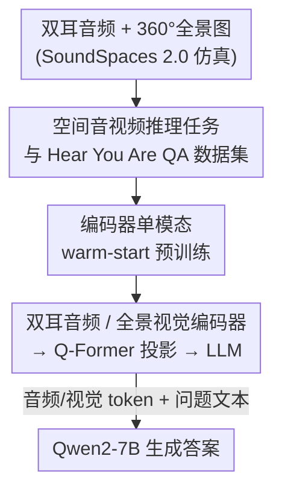

# Hear you are: Teaching LLMs Spatial Reasoning with Vision and Spatial Sound

**会议**: CVPR 2026  
**论文**: [CVF Open Access](https://openaccess.thecvf.com/content/CVPR2026/html/Ryu_Hear_you_are_Teaching_LLMs_Spatial_Reasoning_with_Vision_and_CVPR_2026_paper.html)  
**代码**: 无（作者称将开源数据集与训练代码）  
**领域**: 多模态VLM  
**关键词**: 空间推理、双耳空间音频、音视频问答、多模态LLM、声源定位  

## 一句话总结
论文提出"音视频空间推理"任务，用 SoundSpaces 2.0 仿真合成了含双耳音频 + 360° 全景图的百万级问答数据集 Hear You Are QA，并训练一个把双耳空间音频编码器、全景视觉编码器接到 Qwen2-7B 上的多模态大模型 Hear You Are LLM；在"声音与视觉物体语义不匹配""多个同类物体需靠方位区分"等只能靠空间线索解决的场景上，显著超过只用单声道音频的基线。

## 研究背景与动机
**领域现状**：主流音视频学习（声源定位、声源分离、音视频同步）几乎都用**单声道（monaural）音频**，靠的是"声音语义"和"物体外观"之间的语义对齐，或事件与声音之间的时间对齐。

**现有痛点**：单声道音频不含**方位信息**，于是有两类场景这些方法天然做不了：① 发声物体与声音语义**不匹配**——手机在背包里响，"铃声"和"背包"没有语义对应，只能靠"声音从哪个方向来"推断手机在背包内；② 多个**同类**视觉物体共享同一语义线索——教室里好几个学生都可能"说话"，必须靠空间音频锁定到底是哪个学生在提问。

**核心矛盾**：人靠**双耳听觉（binaural hearing）**天然感知声源方位，把空间声音和视觉结合就能做高层推理；而机器一旦丢掉双耳的方位线索，碰到"语义模糊或具有误导性"的场景就只能靠语义先验瞎猜。已有的空间音频推理工作（BAT 等）又**只用音频不用视觉**，缺了视觉本身携带的空间上下文。

**本文目标**：定义并解决"音视频空间推理"——不止于感知和定位声源，而是要对空间线索做推理，推断声音与视觉物体之间的关系；为此既要造数据集，也要造能同时吃双耳音频和全景视觉的模型。

**核心 idea**：把**双耳空间音频编码器 + 全景视觉编码器**通过投影层接到一个大语言模型上，让 LLM 在统一 token 空间里联合做语义对齐与空间推理；并用仿真器批量合成带 ground-truth 方位的音视频问答数据来训练它。

## 方法详解

### 整体框架
方法分两条线：**造数据**和**造模型**。数据侧用 SoundSpaces 2.0 声学仿真器，在 Matterport3D 的真实扫描房间里，给定声源位置、单声道源音、接收者位姿，通过房间冲激响应卷积渲染出**双耳音频**，并把 Stable Diffusion 3 + InstantMesh 生成的 3D 物体摆进场景拼成 360° 全景图，按 9 类问题模板自动填空生成约 **100 万条问答对**。模型侧 Hear You Are LLM 接收一张 224×812 的全景图和一段 10 秒双耳波形：视觉编码器和音频编码器各自抽特征 → 各接一个 Q-Former 投影层映射到 LLM 隐空间 → 投影后的视觉/音频 token 和问题文本 token 一起喂给 Qwen2-7B，用标准语言建模交叉熵优化生成答案。为保证两个编码器各自先学到有效表征，先做一轮**单模态 warm-start 预训练**，再端到端联合微调。

### 关键设计

**1. 空间音视频推理任务与 Hear You Are QA 数据集：让"只靠空间才能答"的场景可训练可评测**

针对痛点①②，作者先把任务定义清楚，再用仿真把它变成可监督的数据。用 SoundSpaces 2.0 在 Matterport3D 的 90 栋扫描建筑（72/9/9 划分训练/验证/测试）里渲染**几何声学**：观测信号 = 单声道源音与房间冲激响应（room impulse response）的卷积，接收端用 SoundSpaces 默认的头相关传输函数（HRTF）录成**双耳信号**，从而保留方位线索且保有精确的 ground-truth（每个声源的 3D 位置和朝向）。声源取自 VGGSound（人工剔掉"飞机飞过""人群行进"这类室外/视觉模糊类别），视觉物体则用 Stable Diffusion 3 生成 2D 图再用 InstantMesh 升成 3D，注入场景作为发声物或干扰物；每个场景一个声源，按问题场景被指派为"语义匹配的物体""不同类别的随机物体"或"随机空位"，并额外塞最多 3 个随机干扰物以增加视觉复杂度、避免拼接缝隙成为捷径。

数据集的关键在 **9 类 base 问题**（Table 1）覆盖四大类：空间对应（Q1，含"钢琴位置放狗叫声"这类**反事实**样本，逼模型学真正的空间对应而非语义先验）、相对位置（Q2/Q3/Q4，问左右前后、上下、角度、距离）、空间-语义联合对应（Q5–Q8，按是否有多个同类物体分难度）、语义共现（Q9，问声源在画面里是否可见）。模板字段由场景构造参数按手工规则自动填充，再用 ChatGPT-4o 改写成多样化自然问法。

**2. 双耳空间音频 + 全景视觉接入 LLM 的多模态架构：把方位线索和外观线索统一进 token 空间**

针对"既要语义又要空间"的需求，模型保留两路编码器并各配投影层。视觉用 **SigLIP2（NaFLEX 设置，支持灵活分辨率/长宽比）**处理全景图，输出 patch token 序列 $v\in\mathbb{R}^{N_v\times C_v}$，且**不做池化、保留完整空间布局**（方位信息就藏在 patch 的空间排列里）；训练时对 patch embedding 和注意力层用 LoRA 微调。音频用 BAT 的 **Spatial-AST 双耳编码器**，吃双耳频谱图、输出保留空间声学线索的 token 序列 $a\in\mathbb{R}^{N_a\times C_a}$，且**全程冻结**。两路各接一个 **Q-Former 投影层**（音频侧用 BAT 权重、视觉侧用 BLIP-2 前两层注意力权重），分别产出 $N_1=64$ 个音频 query token 和 $N_2=128$ 个视觉 query token，投影参数全可训。这些 token 与问题文本 embedding 拼接后送入 **Qwen2-7B-Instruct**，按位置交叉熵最大化目标答案似然。和最接近的对照 VideoLLaMA2 相比，架构同构、LLM 同款，唯一关键差别就是这里喂的是**双耳**而非单声道音频——这正是空间推理能力的来源。

**3. 编码器的单模态 warm-start 预训练：先各自学会"认物体 + 报方位"再联合**

直接端到端训练，两个编码器容易学不出干净的模态表征。作者为每个模态先在单模态 + LLM 设置下做两类辅助任务：**分类**（视觉问"({方位角}, {仰角}), {距离} 米处检测到什么物体"，音频问"检测到什么声音"）和**定位**（问指定物体类别/声源的方位角、仰角、距离）。视觉编码器采用**渐进式**训练——先只做分类学语义表征，再加入分类+定位的联合任务引入空间 grounding；音频编码器则从一开始就同时训两个任务。Warm-start 后两个编码器单模态指标已相当扎实（Table 3：视觉检测准确率 0.633、平均角误差 26.89°；音频 0.575、38.01°），为后续多模态联合训练提供了好起点。

### 损失函数 / 训练策略
端到端阶段用标准语言建模交叉熵（逐 token 最大化答案似然）。全模型在 8 张 A5000 上训 3 个 epoch，有效 batch size 128，图像编码器和 LLM 用 LoRA rank 16，训练约 3 天。输入为单张 224×812 全景图 + 10 秒 32 kHz 双耳波形。

## 实验关键数据

### 主实验（vs 基线，Table 2）
基线都只用**单声道**音频：ISSL / ACL-SSL 是声源定位方法（不做语言理解，只在不需要语言的任务上评），VideoLLaMA2 则是把视觉/音频编码器换成与本文相同、再在本数据集上微调的 MLLM（架构与本文同构，只差双耳）。指标为分类准确率与到达方向（DoA）准确率。

| 任务 | 含义 | VideoLLaMA2 (R+M+Q) | 本文 (R+B+Q) |
|------|------|------|------|
| Q1 (aligned) | 声源与视觉语义匹配的定位 | 77.44 | **77.61** |
| Q1 (non-matching) | 声源处物体与声音**不匹配** | 50.75 | **61.67** |
| Q7 (DoA) | 单个同类物体，估方位 | 68.57 | **73.21** |
| Q8 (DoA) | **多个同类物体**，估方位 | 46.37 | **64.27** |

可见语义足够的场景（Q1 aligned、Q7）两者接近——单声道+视觉就够定位；但一旦语义模糊（Q1 non-matching 需靠方位关联、Q8 多个同类物体），缺双耳的 VideoLLaMA2 在 Q8 只有约 50% 近似随机，本文凭双耳线索拉开十几个百分点。

### 消融实验（模态设置，Table 4，节选）
对比 R+B+Q（图+双耳+问题）/ R+M+Q（单声道）/ B+Q / M+Q / R+Q，并给 Random/Oracle 参考。

| 任务·指标 | R+B+Q | R+M+Q | B+Q | 说明 |
|------|------|------|------|------|
| Q1 coming-from acc ↑ | **69.64** | 64.10 | 26.40 | 语义相近时双耳的方位优势 |
| Q4-invisible DoA acc ↑ | **41.18** | 16.71 | 11.18 | 声源不可见时双耳几乎是唯一线索 |
| Q4-invisible DoA err ↓ | **39.81°** | 69.25° | 80.51° | 同上，误差大幅下降 |
| Q6 sounding acc ↑ | **72.33** | 52.33 | 59.33 | 两个同类物体，R+M+Q 退化到随机猜 |
| Q8 DoA err ↓ | **23.78°** | 50.80° | 32.32° | 多同类物体时双耳消歧 |

### 关键发现
- **双耳音频在"语义模糊/不可见"场景才是决定性的**：声源可见且唯一时（Q5、Q7），R+M+Q 靠视觉空间线索就能定位，双耳优势不明显；但声源不可见（Q4-invisible）或多个同类物体（Q6、Q8）时，单声道直接退化到接近随机，双耳保持稳定——这条贯穿全部消融的规律正是论文要证明的核心。
- **视觉与双耳互补、各管一摊**：B+Q 只关注方向、不受物体级歧义影响，在多同类物体时 DoA 误差比 R+M+Q 低；而单物体时 R+M+Q 反超 B+Q（视觉空间信息无语义混淆时更准）。R+B+Q 在 Q8 取得最低误差 23.78°，说明两路结合最稳。
- **视觉有助于学空间音频**：在 R+B+Q 上训练、换到 B+Q 测试时 Q5/Q6 掉点明显，作者推测训练时的视觉信号给了隐式空间线索、帮助对齐音频方位与视觉场景，即视觉对"学好空间音频"本身也有益。

## 亮点与洞察
- **用反事实样本逼出真正的空间对应**：在同一位置摆"钢琴 + 狗叫声"这种语义不匹配对，直接掐断模型靠语义先验偷懒的路，是个简单但很对症的数据设计，可迁移到任何想测"模型是否真在用空间/几何而非外观先验"的任务。
- **"保留 patch 空间布局 + 双耳编码器"把方位信息原封不动喂给 LLM**：视觉不池化、音频用 Spatial-AST，方位线索从两路都进到 token 空间，让 LLM 自己做跨模态空间推理，而不是人工设计定位头。
- **仿真换标注**：双耳真实数据需要 ambisonic/假人头麦克风、极难规模化；用 SoundSpaces 2.0 + 生成式 3D 物体合成百万级带精确 ground-truth 的数据，是把"空间音视频"这类难标注任务做大的可复用范式。

## 局限与展望
- **全仿真域**：场景、双耳音频、3D 物体都是合成的，HRTF 用默认头模型，真实双耳录音的个体差异、复杂混响、真实图像质感都未覆盖，sim-to-real 差距存疑 ⚠️。
- **音频编码器全程冻结**：Spatial-AST 直接沿用 BAT 预训练权重不动，空间音频表征的上限被它锁死，未探索联合微调音频编码器是否还能再涨。
- **静态单声源单帧**：每个场景只有一个声源、输入是单张全景图 + 10 秒音频，没有多声源混叠、运动声源、时序动态等更接近真实的设定。
- 论文给的多是分任务准确率/角度/距离误差，缺乏对 LLM 生成答案在自由问法下的鲁棒性、幻觉率的系统评测。

## 相关工作与启发
- **vs BAT [56]（纯空间音频推理）**：BAT 同样用 SoundSpaces 2.0 合成空间音频问答并接 LLM，但**只用音频不用视觉**，做声事件检测/方位距离估计/"狗叫声左边的声音是什么"这类问题。本文复用其 Spatial-AST 编码器和音频投影，但加入全景视觉，把任务推进到"发声物与周边可见/不可见视觉物体之间的空间关系推理"，能处理 BAT 做不了的语义不匹配与多同类物体消歧。
- **vs VideoLLaMA2 [10]（音视频 MLLM）**：作为最接近的对照，本文把它的编码器/LLM 都换成与自己相同后微调，唯一差别是它用单声道音频。结果在需要空间消歧的 Q1(non-matching)、Q8(DoA) 上明显落后，直接证明"差距来自双耳音频而非架构"。
- **vs 传统声源定位（ISSL/ACL-SSL）**：它们做的是"基于音频 query 的物体检测/分割"，靠语义对齐，缺语言理解也缺空间推理，在反事实和多同类物体场景下大幅落后。

## 评分
- 新颖性: ⭐⭐⭐⭐ 首次把双耳空间音频 + 视觉 + LLM 拼起来定义"音视频空间推理"任务，并配套百万级数据集，切入点扎实。
- 实验充分度: ⭐⭐⭐⭐ 9 类问题 × 多模态设置的交叉消融很系统，Oracle/Random 参考完整；但全在仿真域、缺真实数据验证。
- 写作质量: ⭐⭐⭐⭐ 任务动机（手机在背包里响）讲得直观，消融分析逐题解释为什么双耳必要。
- 价值: ⭐⭐⭐⭐ 任务定义 + 数据集 + 基线齐全，为音视频空间推理立了可复现的 benchmark，作者承诺开源。

<!-- RELATED:START -->

## 相关论文

- [\[CVPR 2026\] Geometrically-Constrained Agent for Spatial Reasoning](geometrically-constrained_agent_for_spatial_reasoning.md)
- [\[ICCV 2025\] MM-Spatial: Exploring 3D Spatial Understanding in Multimodal LLMs](../../ICCV2025/multimodal_vlm/mm-spatial_exploring_3d_spatial_understanding_in_multimodal_llms.md)
- [\[CVPR 2026\] STAR-R1: Multi-View Spatial TrAnsformation Reasoning by Reinforcing Multimodal LLMs](star-r1_multi-view_spatial_transformation_reasoning_by_reinforcing_multimodal_ll.md)
- [\[CVPR 2026\] EgoMind: Activating Spatial Cognition through Linguistic Reasoning in MLLMs](egomind_activating_spatial_cognition_through_linguistic_reasoning_in_mllms.md)
- [\[CVPR 2026\] SpaceTools: Tool-Augmented Spatial Reasoning via Double Interactive RL](spacetools_tool-augmented_spatial_reasoning_via_double_interactive_rl.md)

<!-- RELATED:END -->
