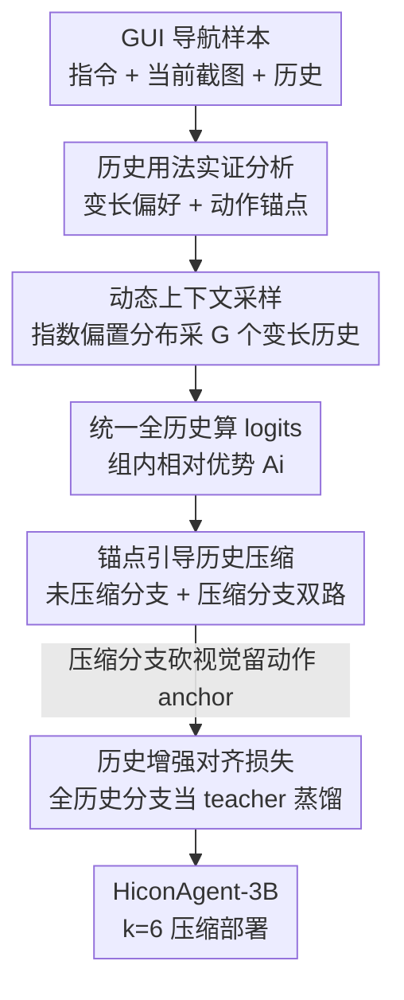

# HiconAgent: History Context-aware Policy Optimization for GUI Agents

**会议**: CVPR 2026  
**论文**: [CVF Open Access](https://openaccess.thecvf.com/content/CVPR2026/html/Zhou_HiconAgent_History_Context-aware_Policy_Optimization_for_GUI_Agents_CVPR_2026_paper.html)  
**代码**: https://github.com/JiuTian-VL/HiconAgent  
**领域**: 多模态VLM / GUI Agent / 强化学习  
**关键词**: GUI 智能体, 历史上下文, 强化微调, GRPO, 视觉历史压缩

## 一句话总结
HiconAgent 用一套 History Context-aware Policy Optimization（HCPO）的强化微调框架训练 GUI 导航智能体：采样阶段动态变化历史长度让模型学会"按需用历史"，更新阶段把历史截图扔掉、只留历史动作 token 当锚点并用全历史分支对齐蒸馏；3B 模型在 GUI-Odyssey 上反超 GUI-R1-7B 步成功率 +11.32%，同时 FLOPs 降 60%、推理快 2.47×。

## 研究背景与动机

**领域现状**：基于多模态大模型（MLLM）的 GUI 智能体要完成"订机票""买鞋"这类多步导航任务，输入是任务指令 $I$、当前截图 $s_t$ 和历史上下文 $H_t=\{(s_{t-\tau},a_{t-\tau}),\dots,(s_{t-1},a_{t-1})\}$，逐步生成并执行动作。近期主流训练范式从监督微调转向规则奖励的强化学习（尤其是 GRPO），直接优化 grounding 准确率和步成功率（SR）。

**现有痛点**：但"历史到底怎么用"几乎没人认真研究。大多数 RL 方法（GUI-R1 等）为了省显存，干脆把历史截图全砍掉、只喂历史动作文本——这丢掉了消歧、区分视觉相似元素、保持时序一致所需的视觉线索；反过来，如果老老实实把完整历史（截图+动作）都塞进去，高分辨率截图带来海量视觉 token，叠加注意力的二次复杂度，计算开销爆炸。

**核心矛盾**：决策质量和计算效率之间存在 trade-off——历史信息越全决策越准但越慢，砍得越狠越快但越容易判断失误。而且作者通过实证发现一个更细的问题：**不同决策步对历史长度的偏好天差地别**，固定窗口长度 $\tau$ 根本兼顾不了；同时**历史动作 token 才是视觉信息真正的"流通枢纽"**，历史截图的价值并不来自后层直接去看它，而是在中间层把信息"灌"进动作锚点里。

**本文目标**：在不牺牲（甚至提升）决策质量的前提下，让 GUI 智能体既"用对"历史（按步选合适长度）又"用省"历史（压掉冗余视觉），并把这两件事直接做进 RL 的采样和更新两个阶段。

**核心 idea**：采样阶段用动态变长历史教模型自适应选上下文（Dynamic Context Sampling）；更新阶段砍掉历史视觉、保留动作锚点，再用一个全历史分支当老师做对齐蒸馏（Anchor-guided History Compression）。两者合成 HCPO。

## 方法详解

### 整体框架

HCPO 把标准 GUI RL 流程的**采样**和**更新**两个阶段都改造了一遍，对应两个核心组件 DCS 与 AHC。整条管线是：给定一条导航样本 $(I, H_t, s_t)$，先用 **Dynamic Context Sampling** 按一个随训练步演化的指数偏置分布，为同一条样本采出 $G$ 个不同历史长度 $\tau_i\le\tau$ 的输入变体，各自 rollout 出回复，再统一在全历史上下文下算 logits、得到组内相对优势 $A_i$；随后进入 **Anchor-guided History Compression** 的双分支更新——未压缩分支吃完整历史走标准 GRPO，压缩分支在早期融合层之后把历史截图全 prune 掉、只留历史动作 token 当锚点也走一遍 GRPO，两分支共享同一批回复和优势，并通过一个 history-enhanced 对齐 KL 损失，把未压缩分支当 teacher 来约束压缩分支。最终用压缩分支（k=6 配置）部署，省 60% FLOPs。

### 关键设计

**1. 历史用法实证分析：先搞清"历史该怎么用"再设计方法**

作者没有上来就堆模块，而是先用两组探针实验回答两个问题，方法的每个设计都从这里长出来。第一组分析**历史长度的影响**：用固定权重的基模型在训练集上对每条样本在 $\tau\in\{0,1,2\}$ 下各 rollout 8 次、记录平均奖励，取奖励最高的 $\tau$ 当该样本的"最优历史长度"（奖励差 <0.05 的样本丢弃）。结果是不同样本、不同动作类型的最优 $\tau$ 各不相同，有些步要长历史、有些步短历史反而奖励更高（$\text{Improvement}=\text{mean\_reward}(\tau_{short})-\text{mean\_reward}(\tau_{long})>0$ 的分布非平凡），说明长历史可能引入无关信息反害决策——**固定窗口必然次优**。第二组做**层级 token-drop 探针**：在 Qwen2.5-VL-3B（36 层）的第 $k$ 层之后分别丢掉历史动作 $A_{his}$、历史图像 $V_{his}$ 或两者，观察 SR 下降。关键发现是浅层（$k<12$）丢 $A_{his}$ 掉点远大于丢 $V_{his}$——即便保留了丰富视觉，后层也无法不经动作锚点直接从 $V_{his}$ 提取有效线索；历史视觉的增益主要发生在中间层、由动作 token 聚合后传递给后续 token。结论落到一条压缩准则：**在早期融合深度 $k$ 之后，prune 掉 $V_{his}$、保留 $A_{his}$**，这直接定义了下面 AHC 的做法。

**2. Dynamic Context Sampling：用变长历史采样教模型按步自适应选上下文**

针对"固定 $\tau$ 次优"，DCS 在训练时不再总喂定长历史，而是为每条样本采 $G$ 个截断历史变体 $\{H_t^1,\dots,H_t^G\}$，每个 $H_t^i$ 用一个采样得到的长度 $\tau_i\le\tau$。难点在采样分布：直接用均匀分布 $U(0,2)$ 会触发**退化现象**——因为为保证训练/推理一致，最终只用 $\tau=2$ 的上下文算梯度更新，短历史（$\tau=0,1$）的回复质量会随训练越来越差（消融图 6 的短/长历史奖励比一路下滑）。作者改用一个随训练步 $u$ 演化的**指数偏置分布**：

$$P(\tau_i\mid u)=\frac{\exp(\lambda(u)\,\tau_i)}{\sum_{j=0}^{N}\exp(\lambda(u)\,j)}$$

其中 $\lambda(u)$ 是随 $u$ 线性增长的函数。训练早期 $\lambda(u)\approx 0$，分布近似均匀、鼓励随机探索各种历史长度；随训练推进 $\lambda(u)$ 增大，分布逐渐偏向更大的 $\tau_i$，平滑地从"随机选"过渡到"全历史"。每个变体组成输入 $q_i=(I,H_t^i,s_t)$ 产出回复 $o_i$，$G$ 个回复作为一组算优势——优势高的回复获得更强梯度更新，于是策略自适应地学到"哪种历史长度带来更好行为"。关键 trick：为保持训练-推理一致，每个采样回复 $o_i$ 都**配上完整历史输入 $(I,H_t,s_t)$ 来算优化用的 logits**，即"在变长条件下探索、在统一长度下评估"。

**3. Anchor-guided History Compression：砍视觉留动作锚点 + 全历史分支对齐蒸馏**

承接设计 1 的结论（动作锚点保留了后层真正用到的历史线索），AHC 在更新阶段做双分支优化。设输入 $q=\{I,H_t,s_t\}$，重要性采样比 $\rho_i=\frac{\pi_\theta(o_i\mid q)}{\pi_{\theta_{old}}(o_i\mid q)}$，**未压缩分支**走标准 GRPO 目标 $\mathcal{L}_{w/o\,comp}$（带 clip 和对参考策略的 KL）。**压缩分支**则把所有历史视觉 token $V_{his}$ 全部移除、只保留历史动作 token $A_{his}$ 组成压缩历史 $H_t^c$，在 $q^c=\{I,H_t^c,s_t\}$ 上用同一批回复和优势走 GRPO 式目标 $\mathcal{L}_{w/\,comp}$（重要性比 $\rho_i^c=\frac{\pi_\theta(o_i\mid q^c)}{\pi_{\theta_{old}}(o_i\mid q^c)}$），借未压缩分支生成的高质量回复来带动压缩分支。为了让压缩分支别丢掉原模型的核心决策能力，引入 **history-enhanced 对齐损失**：对同一批回复在两个分支做并行前向，最小化二者输出分布的 KL，用未压缩分支当 teacher 指导压缩分支：

$$\mathcal{L}_{KL}=\sum_{i=1}^{G}\mathrm{KL}\left[\pi_\theta(o_i\mid q^c)\,\Vert\,\pi_\theta(o_i\mid q)\right]$$

注意 teacher（未压缩分支）输出做了 detach、不回传梯度，只当指导信号。最终 HCPO 损失把三项加起来：

$$\mathcal{L}_{HCPO}=\mathcal{L}_{w/o\,comp}+\mathcal{L}_{w\,comp}+\lambda\,\mathcal{L}_{KL}$$

$\lambda$ 控制对齐强度。这样压缩分支在大幅缩短序列、降 FLOPs 的同时，靠对齐保住了时序一致性和决策质量。压缩位置 $k$（早期融合深度）是效率-效果的关键旋钮：$k$ 越小砍得越早 FLOPs 降越多但掉点越大，默认取 $k=6$ 做平衡。

### 损失函数 / 训练策略

训练数据来自开源 AMEX 数据集，仅用 **3K 未过滤样本**，沿用 GUI-R1 的训练设置。奖励设计针对 GUI 动作"类型 + 取值"的结构，引入三类规则奖励（类型匹配、坐标距离、文本匹配，细节在附录）。总损失即上面的 $\mathcal{L}_{HCPO}$。默认部署用压缩分支 $k=6$ 配置。

## 实验关键数据

### 主实验

三个 GUI 导航基准：AndroidControl-High（AC-High）、AITW、GUI-Odyssey。Table 1 在相同数据规模与训练设置下对比（绿色表示相对 GUI-R1-7B 退化，红色表示提升）：

| 设置 | 模型 | AC-High Grounding | AC-High SR | Odyssey Grounding | Odyssey SR |
|------|------|------|------|------|------|
| SFT | GUI-R1-7B | 58.69 | 48.11 | 38.65 | 34.44 |
| RFT | GUI-R1-3B | 56.24 | 46.55 | 41.52 | 41.33 |
| RFT | GUI-R1-7B | 65.56 | 51.67 | 43.64 | 38.79 |
| RFT | **HiconAgent-3B** | 65.51 (−0.05) | **52.40 (+0.73)** | **52.10 (+8.46)** | **50.11 (+11.32)** |

3B 模型在 AC-High 上与 7B 基本持平，但在长程的 GUI-Odyssey 上以不到一半参数量大幅反超 GUI-R1-7B：grounding +8.46%、SR +11.32%，印证显式利用历史上下文对长程序列推理的价值。

OOD 泛化（Table 2，平均 SR）：

| 模型 | 训练数据 | AC-High | AITW | Odyssey | Avg SR |
|------|------|------|------|------|------|
| OS-Atlas-7B | 13M (过滤) | 29.83 | 41.38 | 26.96 | 32.72 |
| GUI-R1-7B | 3K (过滤) | 51.67 | 55.31 | 38.79 | 48.59 |
| infiGUI-3B | 32K (过滤) | 71.10 | 46.51 | 33.15 | 50.25 |
| **HiconAgent-3B** | 3K (未过滤) | 52.40 | 51.91 | 50.11 | **51.47** |

HiconAgent 仅用 3K 未过滤样本就拿到最高平均 SR（51.47%），超过用更大规模过滤数据训练的对手；infiGUI-3B 虽在 AC-High 飙到 71.1% 但在 AITW/Odyssey 大跌，说明其 OOD 泛化弱——HCPO 既有效又数据高效。

### 消融实验

采样分布 $p(\tau)$ 消融（Table 3，AC-High SR）：

| 配置 | 更新 τ | 采样 p(τ) | AC-High SR | 训练时长 |
|------|------|------|------|------|
| HCPO (w/o DCS) | 2 | – | 51.03 | 17h |
| HCPO (Uniform) | 2 | U(0,2) | 50.53 | 17h |
| HCPO (Uniform) | {0,1,2} | U(0,2) | 51.62 | 30h |
| **HCPO (ExpBias)** | 2 | ExpBias(u) | **52.40** | 17h |

朴素均匀采样反而掉到 50.53（退化现象）；强制把全部 $\tau\in\{0,1,2\}$ 都纳入更新虽能部分补回（51.62）但训练时长翻到 30h；指数偏置分布以同样 17h 拿到最佳 52.40，取得性能-开销最优平衡。

双分支 / 对齐 / DCS 逐组件消融（Table 4，SR，压缩开启）：

| 配置 | 双分支 | KL | DCS | AC-High | AITW | Odyssey |
|------|------|------|------|------|------|------|
| GRPO（仅压缩分支） | – | – | – | 44.89 | 45.62 | 43.21 |
| HCPO (w/o KL, DCS) | ✓ | – | – | 48.70 (+3.81) | 49.23 (+3.61) | 47.09 (+3.88) |
| HCPO (w/o DCS) | ✓ | ✓ | – | 51.03 (+6.14) | 50.78 (+5.16) | 48.68 (+5.47) |
| **HCPO** | ✓ | ✓ | ✓ | **52.40 (+7.51)** | **51.91 (+6.29)** | **50.11 (+6.90)** |

只训压缩分支最差；加未压缩分支（无 KL）就涨，加 KL 对齐再涨，最后开 DCS 达到最佳——三个组件层层叠加都有正贡献。

压缩位置 $k$ 的效率-性能权衡（Table 5）：

| Drop k | FLOPs | ∆ vs 3B | Tokens | SR |
|------|------|------|------|------|
| k=1 | 23.66 | −33.81% | 674 | 46.11 |
| k=6 | 25.21 | −29.47% | 674 | 47.34 |
| k=12 | 27.07 | −24.28% | 674 | 47.89 |
| w/o drop | 35.75 | – | 1664 | 49.29 |

$k$ 越小砍越早 FLOPs 降越多但掉点越大；默认 $k=6$ 在 59.54% FLOPs 削减（相对 7B）和 2.47× 加速下保住竞争力，token 数从 1664 降到 674。

### 关键发现
- **DCS 的采样分布是成败关键**：均匀采样会让短历史回复质量随训练退化（因为只用 $\tau=2$ 算梯度），指数偏置分布"早探索、晚收敛到全历史"的调度同时解决了退化和训练开销，比硬塞 all-τ 更新省一半时间还更准。
- **动作锚点假设被层级 drop 实验坐实**：浅层丢历史动作掉点远大于丢历史图像，这是 AHC"砍视觉留动作"的直接依据，也解释了为什么单砍视觉而不蒸馏对齐会掉点。
- **长程任务收益最大**：在 GUI-Odyssey 上 3B 反超 7B 高达 +11.32% SR，说明显式历史建模在长 horizon 下价值被放大，而短程的 AC-High 上提升有限。⚠️ Table 1 与 Table 5 的 AC-High SR 数值口径略有差异（52.40 vs 47.34），疑为评测子集/设置不同，以原文为准。

## 亮点与洞察
- **"先做实证再设计"的范式很扎实**：两组探针实验（变长偏好 + 层级 token-drop）不是事后解释，而是直接定义了 DCS 的"变长采样"和 AHC 的"砍视觉留动作"，方法的每个组件都有据可循，避免了拍脑袋堆模块。
- **把历史利用拆进 RL 的采样和更新两个阶段**是个干净的切入点——采样阶段管"用多少历史"，更新阶段管"怎么省着用历史"，两件事正交且各有专门组件。
- **双分支对齐蒸馏的 self-distillation 思路可迁移**：用同一模型的"全信息分支"当 teacher、detach 梯度去带"压缩信息分支"，这种在同一次前向里做自蒸馏来换效率的技巧，可推广到任何"想压缩输入但怕掉点"的多模态场景（如长视频、多图推理）。
- **指数偏置课程式采样**：用随训练步演化的 $\lambda(u)$ 把采样分布从均匀平滑推向偏置，本质是一种 curriculum，缓解了"只用长上下文算梯度导致短上下文退化"这一隐蔽的训练不稳定。

## 局限与展望
- 历史长度探针只在 $\tau\in\{0,1,2\}$ 这个很小的窗口里做，更长 horizon（$\tau$ 更大）下变长偏好和指数偏置调度是否还成立、$\lambda(u)$ 的线性调度是否最优，论文未充分探讨。
- ⚠️ 奖励设计、训练超参、$\lambda$ 取值、$\lambda(u)$ 的具体形式都放在附录，正文给的机制公式清楚但复现细节依赖附录，以原文/代码为准。
- AHC 一刀切地砍掉**所有**历史视觉、只留动作锚点，依赖"前 $k$ 层已把视觉信息充分灌进动作 token"这一前提；当某些步的关键视觉线索并不绑定在历史动作位置上时（如纯浏览、无动作的观察步），这种压缩可能丢信息，论文未给这类失败案例的定量分析。
- 评测集中在移动端 GUI 导航（Android/AITW/Odyssey），桌面端、网页端等更复杂、截图分辨率更高的场景下的效率-效果权衡有待验证。

## 相关工作与启发
- **vs GUI-R1**：GUI-R1 用 GRPO 做规则奖励 RL，但只喂历史动作文本、不显式建模历史视觉。HiconAgent 复用 GUI-R1 的训练设置和奖励框架，但在采样和更新两阶段都加了历史感知组件，于是 3B 反超其 7B 版本，核心差异是"是否系统性利用并压缩历史"。
- **vs 直接用完整历史的方法**：朴素塞完整历史（截图+动作）决策更准但计算爆炸（视觉 token 多 + 注意力二次复杂度）。HiconAgent 通过 AHC 砍视觉留动作锚点，把这条 trade-off 曲线整体往"又快又准"推，达到 60% FLOPs 削减下仍保持竞争力。
- **vs 沿用单图 VQA 信息流结论的压缩方法**：以往工作直接套用单图 VQA 场景的信息流研究来选保留哪些 token，HiconAgent 则在 GUI 导航 + RL 框架下重新做信息流分析，发现 GUI 场景里"历史动作才是视觉信息流锚点"这一更贴合任务的规律，压缩准则因此更对路。

## 评分
- 新颖性: ⭐⭐⭐⭐ 把历史利用拆进 RL 采样/更新两阶段、用层级 token-drop 实证支撑"动作锚点"压缩，切入角度新且有据。
- 实验充分度: ⭐⭐⭐⭐ 三基准 + OOD + 四组消融（采样分布/组件/压缩位置）较全，但部分细节和奖励设计压在附录，正文数值口径有小差异。
- 写作质量: ⭐⭐⭐⭐ "先实证再设计"的叙事清晰，机制公式给得完整，图表充分。
- 价值: ⭐⭐⭐⭐ 3B 反超 7B 且省 60% FLOPs、3K 未过滤数据即强泛化，对资源受限的 GUI 智能体落地有直接参考价值。

<!-- RELATED:START -->

## 相关论文

- [\[CVPR 2026\] CodeV: Code with Images for Faithful Visual Reasoning via Tool-Aware Policy Optimization](codev_code_with_images_for_faithful_visual_reasoning_via_tool-aware_policy_optim.md)
- [\[NeurIPS 2025\] GUI-Rise: Structured Reasoning and History Summarization for GUI Navigation](../../NeurIPS2025/multimodal_vlm/gui-rise_structured_reasoning_and_history_summarization_for_gui_navigation.md)
- [\[CVPR 2026\] SketchVL: Policy Optimization via Fine-Grained Credit Assignment for Chart Understanding and More](sketchvl_policy_optimization_via_fine-grained_credit_assignment_for_chart_unders.md)
- [\[CVPR 2026\] See, Think, Act: Teaching Multimodal Agents to Effectively Interact with GUI by Identifying Toggles](see_think_act_teaching_multimodal_agents_to_effectively_interact_with_gui_by_ide.md)
- [\[CVPR 2026\] Dynamics-Aware Preference Optimization for Vision-Language Models](dynamics-aware_preference_optimization_for_vision-language_models.md)

<!-- RELATED:END -->
