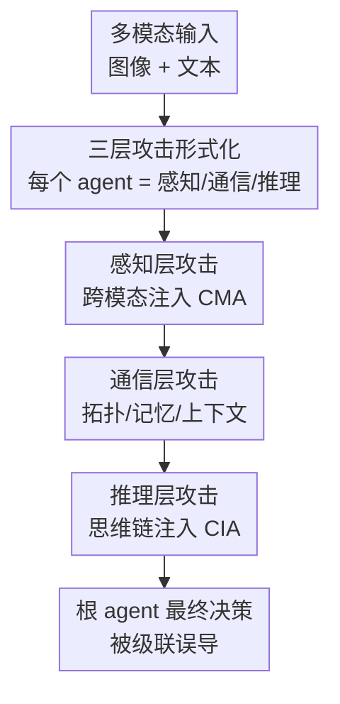

# Hierarchical Attacks for Multi-Modal Multi-Agent Reasoning

**会议**: CVPR 2026  
**arXiv**: [2605.13213](https://arxiv.org/abs/2605.13213)  
**代码**: 论文称将公开 benchmark（系统基于开源框架 OxyGent），暂无确认仓库  
**领域**: 多模态VLM / Agent / AI 安全 / 对抗攻击  
**关键词**: 多模态多智能体, 对抗攻击, 分层攻击, 推理链注入, 通信拓扑

## 一句话总结
本文提出 HAM³，把对「多模态多智能体系统（MM-MAS）」的对抗攻击拆成感知层、通信层、推理层三个相互衔接的层次，系统性地刻画扰动如何从单点输入级联到集体决策，在 GQA 上对 ReAct/Plan-and-Solve/Reflexion 三种范式做实验，最高攻击成功率（ASR）达 78.3%，并发现推理层攻击最强、最隐蔽、最难纠正。

## 研究背景与动机
**领域现状**：多模态多智能体系统（MM-MAS）正快速铺开——一个主控 agent 协调多个专精子 agent（图像理解、目标检测、分割、写代码等），通过辩论、投票、角色分工等结构化通信协议协作完成复杂跨模态推理，已被用到社交交互、具身控制、自动驾驶等场景。系统越大、互联越密，安全性就越关键。

**现有痛点**：已有对抗攻击研究几乎都停留在「单 agent」或「单模态」：要么操纵单个 agent 的观测/提示/记忆来误导它的推理，要么只是把单 agent 的攻击原理简单平移到多 agent——往往只是篡改某个 agent 的消息内容或污染共享工具，其它 agent 在固定通信结构下被动传播错误。这类做法只触及「内容级」操纵。另一条线的多模态对抗攻击则瞄准模型层的感知（排版型、组合型、逻辑型视觉提示去 jailbreak VLM），却没攻击 agent 的决策流水线。

**核心矛盾**：MM-MAS 的脆弱性恰恰来自单 agent 设定里不存在的两类结构性维度——**通信拓扑**（谁连谁、消息怎么路由、共享记忆/上下文怎么被共用）和**集体推理动态**（多个 agent 的推理链如何相互引用、汇总、放大）。只盯内容级扰动，就看不到这些跨层、跨结构的漏洞。

**本文目标**：建一个统一框架，刻画扰动如何在感知 → 通信 → 推理三层之间传播，并量化哪一层最脆弱、不同推理范式的鲁棒性差异。

**切入角度**：把每个 agent 形式化为「感知—通信—推理」三层映射的复合，于是整个系统的攻击面天然分成三层；在每层注入针对性扰动，就能观察局部扰动如何级联到根 agent 的最终决策。

**核心 idea**：用一个分层（hierarchical）攻击模型 HAM³，把「攻击 MM-MAS」分解为感知层、通信层、推理层三类可独立实例化、又相互衔接的攻击，统一比较它们的传播性与破坏力。

## 方法详解

### 整体框架
HAM³ 把 MM-MAS 形式化为一组 agent $S=\{A_1,\dots,A_N\}$，每个 agent 由系统提示、工具集、记忆模块和通信接口构成。给定多模态输入 $x=(x_{\text{image}}, x_{\text{text}})$，系统映射 $F$ 产出 $y=F(x;\Theta)$，最终输出由根 agent 给出 $F(x)=o_{A_{\text{root}}}$。关键在于：每个 agent 被拆成三层映射的复合——感知 $f^{(1)}$、通信 $f^{(2)}$、推理 $f^{(3)}$。叶子 agent 输出 $o_A=f_A^{(3)}(f_A^{(2)}(f_A^{(1)}(x_A)))$；内部 agent 先用聚合算子 $\Phi_A$ 汇总所有子 agent 的输出再走通信、推理两层。于是攻击者可以对任意 agent $A$、任意层 $l\in\{1,2,3\}$ 注入扰动 $\delta_A^{(l)}$，HAM³ 就是把这三层的攻击逐一实例化，并观察扰动沿协作流水线级联到根 agent 的过程。

### 关键设计

**1. 三层攻击形式化：把每个 agent 拆成感知-通信-推理映射，让攻击面结构化**

痛点是：以往攻击只把多 agent 系统当成「一堆会传话的 agent」，无法描述扰动具体在哪个环节注入、又如何沿协作结构扩散。HAM³ 的做法是把每个 agent 显式建模为三层映射的复合 $o_A=f^{(3)}(f^{(2)}(f^{(1)}(\cdot)))$，并区分叶子 agent 直接吃输入、内部 agent 先用聚合算子 $\Phi_A(\{o_C\mid C\in\text{Children}(A)\})$ 汇总孩子输出。这样一来，任意层都可挂一个扰动 $\delta_A^{(l)}$，攻击不再是「改某条消息」的零散操作，而是有明确层次坐标的系统性扰动。它有效，是因为这套形式化把「单点扰动 → 集体决策」的级联路径显式写出来，使得跨层、跨结构的漏洞第一次能被统一定义和比较

**2. 感知层攻击：跨模态联合扰动，打 agent 入口处的视觉-语言对齐**

感知层攻击在任何 agent 间协作之前就动手，扰动多模态输入。核心是跨模态注入攻击（Cross-Modal Injection Attack, CMA）：$x'=(G_{\text{image}}(x_{\text{image}}), G_{\text{text}}(x_{\text{text}}))$，其中 $G_{\text{text}}$ 根据 query 和视觉内容生成误导文本，$G_{\text{image}}$ 做语义图像编辑或在图上叠加文字。相比只改图（VIA）或只改文（TIA），同时扰动两个模态能更有效地骗过 agent 的视觉-语言对齐——因为系统往往靠图文一致性自检，单模态的错误常被下游推理或 agent 间通信纠回来，而联合扰动让图文「一起撒谎」，自检失效。实验里 CMA 在 87% 的任务上取得感知层最高 ASR，且本文用 Cross-Modal Consistency（CLIP 空间图文余弦相似度）说明扰动后图文语义仍对齐、攻击更隐蔽

**3. 通信层攻击：动消息内容更动通信拓扑，攻击集体结构而非单点**

这一层针对多 agent 独有的结构性依赖，含四种攻击：Agent Spoofing（ASA，伪造/替换通信图中的 agent，$\Gamma'=G_{\text{topo}}(\Gamma,\delta_{\text{topo}})$，劫持路由）、Structural Blocking（SBA，注入阻塞指令构造 $A_i\to A_j\to A_k\to A_i$ 这样的循环等待，制造死锁/无限循环）、Shared Memory Pollution（SMPA，往目标 agent 集合 $\Omega$ 的短期记忆注入伪造历史片段 $D_{\text{adv}}$）、Shared Context Injection（SCIA，往一组 agent 的系统提示插入同一条对抗先验 $p_{\text{adv}}$，让它们的偏置对齐、互相强化）。关键洞察是：消息级攻击（SMPA/SCIA）只造成 agent 回复不一致，常能靠交叉验证或消息重路由纠正；而**结构级攻击（SBA）直接改网络拓扑**，强行切断关键 agent 间的连接、断掉对正确专长的访问，难以恢复——所以 SBA 的 ASR 显著高于消息级攻击（ReAct+Qwen-7B 下 65.0%，Plan-and-Solve 下达 71.8%）

**4. 推理层攻击：注入思维链中间步骤，错误被多 agent 放大且最难纠正**

推理层攻击干扰每个 agent 的内部推理链。核心是思维链注入攻击（Chain-of-Thought Injection Attack, CIA）：给定推理序列 $\text{CoT}=[r_1,\dots,r_T]$，攻击者按位置 $\tau$ 插入或替换中间状态 $r^*$，得到 $\text{CoT}'=G_{\text{CIA}}(\text{CoT}, r^*, \tau)$。它最强是因为：扰动早期/枢纽步骤引入的细微逻辑错误会沿推理链被放大，而当 CoT 在 agent 间被共享或摘要（ReAct/Plan-and-Solve/Reflexion 都会这么传），一段被污染的推理就能误导整个子团队；且它直接改中间推理步骤，不像污染记忆或工具那样是间接干扰，一旦推理轨迹被改，输出就不可靠且极难纠回。这使 CIA 拿到全实验最高 ASR 78.3%（ReAct+Qwen-7B），比最强通信攻击 SBA 高约 13 个点、比最强感知攻击 CMA 高约 17 个点

### 一个例子：CIA 为何比内容级攻击更致命
取 ReAct + Qwen-7B：感知层 CMA 把图文一起改，ASR 60.8%——但部分错误被后续 agent 协作纠回；通信层 SBA 切断关键 agent 连接，ASR 65.0%——结构破坏更难恢复；推理层 CIA 只在某个 agent 的 CoT 里塞一句误导推理，ASR 直冲 78.3%，且这条被污染的 CoT 在 agent 间被引用/摘要后，超过一半的成功攻击会让多个 agent 产生「一致的错误」，集体性地走偏。三层对照清晰说明：越靠近内部推理、越靠近被共享的中间状态，攻击越持久、越隐蔽、越系统性。

## 实验关键数据

### 主实验
评测在 GQA 上采样 5,984 个图文对（覆盖 10 个语义类别），MM-MAS 基于 OxyGent 搭建：1 个主控 agent + 6 个专精子 agent + 13 个工具，跑 ReAct / Plan-and-Solve / Reflexion 三种范式。文本攻击用 GPT-4o 生成、视觉攻击用 Nano Banana 生成。下表为 ReAct 范式下各层代表性攻击的 ASR（%），加粗为各层最强：

| 范式/模型 | 感知 CMA | 通信 SBA | 推理 CIA | 全场最高 |
|--------|------|------|------|------|
| ReAct / Qwen-7B | 60.8 | 65.0 | **78.3** | CIA 78.3 |
| ReAct / Qwen-32B | 55.7 | 59.8 | **73.2** | CIA 73.2 |
| ReAct / GLM-4V+ | 53.7 | 62.2 | 71.3 | TSA 72.0 |
| ReAct / O1-Mini | 44.0 | 51.3 | **71.5** | CIA 71.5 |
| ReAct / GPT-4o | 43.2 | 49.0 | **65.0** | CIA 65.0 |

跨范式看：Reflexion 最鲁棒（同样 CIA+Qwen-7B 下 ASR 降到 61.7%，比 ReAct 低约 16 点），Plan-and-Solve 居中（69.2%），ReAct 最脆弱（推理与行动交替却无显式校验，早期扰动易被放大）。模型越大越抗打：CIA 在 ReAct 下从 Qwen-7B 的 78.3% 降到 GPT-4o 的 65.0%。

### 消融/分析实验
任务成功率（TSR，%）在各层攻击下的下降（N.A. 为无攻击基线）：

| 范式 | 感知 | 通信 | 推理 | 无攻击 N.A. |
|------|------|------|------|------|
| ReAct | 29.45 | 27.58 | **23.55** | 58.99 |
| Plan-and-Solve | 34.59 | 31.99 | 27.58 | 60.88 |
| Reflexion | 33.18 | 31.43 | 30.64 | 61.35 |

三范式无攻击基线都约 60%；攻击后 TSR 大幅下降，ReAct 在推理层降幅最大（最高掉约 35 个点），感知/通信层降幅中等（约 25–30 点），再次印证推理层最脆弱。

### 关键发现
- **推理层最脆弱**：CIA 在所有设置下都拿最高 ASR，因为它直接改中间推理步骤、错误沿链放大，且 CoT 跨 agent 共享时单段污染就能误导整个子团队；超过一半的成功攻击导致多个 agent 产生「一致错误」。
- **结构攻击 > 内容攻击**：通信层里 SBA（破坏拓扑、制造死锁）远强于 SMPA/SCIA（消息级），后者常被交叉验证/重路由纠回；ASA（伪造 agent）不稳定，因为假 agent 的噪声输出会被忽略。
- **外部鲁棒 vs 内部稳定的 trade-off**：幻觉错误率（HER）从 Qwen-7B 约 8% 降到 GPT-4o 约 4%，大模型内部更稳；Reflexion 外部错误少但幻觉相关错误多，ReAct 反之——两者共同决定系统可靠性。

## 亮点与洞察
- **把攻击面「分层坐标化」**：用 $f^{(1)}/f^{(2)}/f^{(3)}$ 三层映射给每个 agent 建模，使得「扰动注在哪一层、怎么级联」第一次能被统一定义和横向比较——这套形式化本身比任何单个攻击更有迁移价值。
- **「越内部越致命」的清晰结论**：感知 → 通信 → 推理，攻击破坏力单调上升，且推理层攻击隐蔽（CoT 看起来仍连贯）、持久（错误难纠）、系统性（沿共享 CoT 扩散到子团队），给鲁棒 MM-MAS 设计指了明确防御重点。
- **用 CMC 量化「隐蔽性」**：借 CLIP 图文余弦相似度衡量扰动后是否仍保持跨模态语义对齐，高 CMC + 高 ASR 才算「既能骗又不易察觉」，把「攻击隐蔽性」做成可测指标，思路可迁移到其它多模态攻击评估。

## 局限与展望
- 评测主要在 GQA（外加补充材料的 EvoChart-QA），任务集中在视觉问答类多步推理，是否推广到具身控制、自动驾驶等真实 MM-MAS 场景未充分验证。
- 系统配置绑定在 OxyGent 框架的「1 主控 + 6 子 agent + 13 工具」这一特定拓扑上，攻击效力对 agent 数量、拓扑形态、协议（辩论/投票）的敏感性未系统扫描。
- 文章是「攻击侧」工作，提出了大量攻击但几乎没给对应防御/检测方案；作者把「设计更鲁棒系统」留作 future work，实际可防御性仍是开放问题。
- ⚠️ ASA「伪造 agent 输出噪声被忽略所以不稳定」这一解释偏定性，缺少对拓扑攻击在不同图结构下稳定性的定量分析。

## 相关工作与启发
- **vs 单 agent 攻击（InjecAgent / ASB）**：它们在单 agent 上做 prompt 注入、工具调用污染、环境扰动；本文把视角抬到多 agent，强调通信拓扑和集体推理动态这类单 agent 不存在的结构性漏洞，攻击不再是改一条消息而是有层次坐标的级联。
- **vs 多 agent 通信攻击（communication manipulation / poisoned shared tools）**：以往多 agent 攻击仍是「内容级」——改某 agent 消息或污染共享工具，其余 agent 被动传播；本文额外引入拓扑级（SBA/ASA）和推理链级（CIA）攻击，并实测结构/推理攻击远强于内容级。
- **vs 多模态对抗攻击（typographic / 逻辑视觉提示越狱 VLM）**：它们打的是模型层感知、目标是 jailbreak 单个 VLM；本文打的是 agent 决策流水线，CMA 只是入口扰动，重点在扰动如何沿协作链传播到集体决策。

## 评分
- 新颖性: ⭐⭐⭐⭐⭐ 首个系统性研究 MM-MAS 对抗鲁棒性，分层形式化把感知/通信/推理三层攻击统一起来，视角清晰且原创。
- 实验充分度: ⭐⭐⭐⭐ 覆盖 3 范式 × 5 模型 × 10 种攻击，主表+TSR/HER/CMC 多维分析扎实；但只在 GQA 类任务、单一拓扑上评测，泛化性验证略薄。
- 写作质量: ⭐⭐⭐⭐ 三层结构叙事清楚，形式化与实验呼应；个别攻击的有效性解释偏定性。
- 价值: ⭐⭐⭐⭐⭐ 给出「推理层最脆弱、结构攻击 > 内容攻击」的明确结论与可测隐蔽性指标，对构建鲁棒多智能体系统有直接指导意义。

<!-- RELATED:START -->

## 相关论文

- [\[CVPR 2026\] Socratic-Geo: Synthetic Data Generation and Cross-Modal Geometric Reasoning via Multi-Agent Interaction](socratic-geo_synthetic_data_generation_and_cross-modal_geometric_reasoning_via_m.md)
- [\[CVPR 2026\] ProSoftArena: Benchmarking Hierarchical Capabilities of Multi-modal Agents in Professional Software Environments](prosoftarena_benchmarking_hierarchical_capabilities_of_multi-modal_agents_in_pro.md)
- [\[ICLR 2026\] Multi-modal Data Spectrum: Multi-modal Datasets are Multi-dimensional](../../ICLR2026/multimodal_vlm/multi-modal_data_spectrum_multi-modal_datasets_are_multi-dimensional.md)
- [\[CVPR 2026\] CogniVerse: Revolutionizing Multi-Modal Retrieval-Augmented Generation with Cognitive Reflection and Geometric Reasoning](cogniverse_revolutionizing_multi-modal_retrieval-augmented_generation_with_cogni.md)
- [\[CVPR 2026\] CRIT: Graph-Based Automatic Data Synthesis to Enhance Cross-Modal Multi-Hop Reasoning](crit_graph-based_automatic_data_synthesis_to_enhance_cross-modal_multi-hop_reaso.md)

<!-- RELATED:END -->
