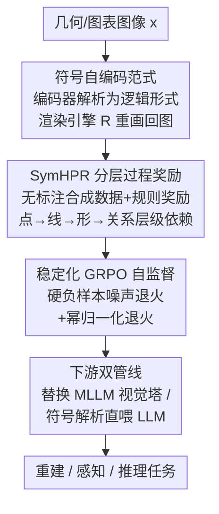

# Hierarchical Process Reward Models are Symbolic Vision Learners

**会议**: CVPR 2026  
**论文**: [CVF Open Access](https://openaccess.thecvf.com/content/CVPR2026/html/Zhang_Hierarchical_Process_Reward_Models_are_Symbolic_Vision_Learners_CVPR_2026_paper.html)  
**代码**: 项目页 https://vi-ocean.github.io/projects/SymVAE  
**领域**: 多模态VLM  
**关键词**: 符号视觉、过程奖励模型、几何图解析、自监督自编码器、GRPO

## 一句话总结
把"几何图理解"重新定义为一个**符号自编码**问题——编码器把图解析成点/线/形/关系的逻辑形式（latent 不再是像素向量而是符号图），可执行渲染引擎再把逻辑形式重画回原图，并用一套**分层过程奖励（SymHPR）+ 稳定化 GRPO** 来监督这条非可微管线，使 7B 模型在几何图重建上 MSE 降 98.2%、感知/推理 benchmark 上分别 +13% / +3%。

## 研究背景与动机
**领域现状**：图表、几何图这类 diagram 是科学与教育里"用图说理"的通用媒介，但它和自然图像在本质上不同——自然图靠纹理/颜色/场景传递语义，diagram 则是"语义稀疏、结构稠密"的蓝图，意义全在点线面之间的拓扑与逻辑关系里。

**现有痛点**：主流视觉编码器（CLIP 系、Qwen2.5-VL 的视觉塔）把 diagram 当普通自然图处理，编码成连续高维向量；VAE / MAE 这类自编码器再从连续特征里重建，得到的 latent 捕捉的是**像素级语义而非符号结构**。后果是：解析一条线或一段弧时，像素值本身不携带符号含义，模型只能从弱监督里"近似"出符号理解，重建出来的几何图结构粗糙、关系错乱。

**核心矛盾**：diagram 的正确理解需要**层级依赖**——线必须建立在正确识别的点之上，形依赖线，关系依赖形；一旦线解析错了，后续基于它的形状分析就毫无意义。而连续 latent + 像素重建的范式根本没有显式建模这种"低层对高层的支撑"。

**本文目标**：(1) 让 latent space 本身就是符号表示而非连续向量；(2) 给多步解析提供细粒度、可验证、无需人工标注的过程监督；(3) 在重建监督极稀疏的情况下还能稳定训练。

**切入角度**：作者把过程奖励模型（PRM，本来用于语言推理的逐步监督）搬到视觉里，但加上 diagram 独有的**层级几何依赖**——这是文本 PRM 完全没有的结构先验。

**核心 idea**：用"符号自编码器 + 分层过程奖励"代替"像素自编码器 + 整体重建损失"，让编码器学会输出可执行、可验证、组合式的几何逻辑形式。

## 方法详解

### 整体框架
方法围绕一条三阶段训练管线展开：先冷启动 SFT 让基座 VLM 会输出结构化逻辑形式（SymParser），再用分层过程奖励 RL 强化它对几何层级依赖的把握（SymHPR），最后接上一个确定性渲染引擎当解码器、用稳定化 GRPO 做**自监督**重建训练（SymVAE）。训练好的符号编码器再以两条下游管线服务于 MLLM 的感知与推理。输入是一张几何/图表图像 $x$，输出是结构化逻辑形式 $s$（点→线→形→形属性→几何关系），渲染引擎能把 $\hat{s}$ 重画成 $\hat{x}=R(\hat{s})$。

### 关键设计

**1. 符号自编码范式：把 latent 从像素向量换成可执行逻辑图**

针对"像素 latent 抓不住 diagram 结构"这个根本痛点，作者把自编码器的瓶颈从连续向量换成**符号逻辑形式**。编码器 $f_\theta: X \to S$ 把图解析成组合式几何原语——点用顶点字母标记并带归一化坐标 $(x,y)\in[0,1]^2$，线由顶点对定义（如 $ab$），形由线/圆构成（如 `RightTriangle` 显式指明哪两条线垂直），关系描述原语间交互（`IntersectAt`、`Incircle`、`Tangent`、`AngleBisector`）。解码器不是神经网络而是一个**确定性渲染引擎** $R:S\to X$（基于 matplotlib 等图形库），把逻辑形式重画成图像。这样 latent 天然编码了"点定义线、线组成形、原语共同构成关系"的依赖结构，重建走的是"视觉-逻辑规则"而非像素回归。渲染引擎本身不可微，但通过 RL 把视觉奖励 $r_\text{vis}(x, R(\hat{s}))$ 当标量监督回传，从而在**无标注图像**上做自监督训练。

**2. SymHPR 分层过程奖励：用层级依赖防止"表面匹配"的奖励黑客**

文本 PRM 要么靠人工标注（贵且不可扩展）、要么靠 LLM-as-judge（易幻觉）；而且它们都只在文本上逐步打分，没有几何层级约束。SymHPR 给出三个针对性创新：① **零成本训练数据**——一个合成逻辑形式引擎自动构造解析路径（POINT⇒LINE⇒SHAPE⇒SHAPE PROPERTIES⇒GEOMETRIC RELATIONS）配上渲染图，免人工标注；② **规则化可验证奖励**——六个维度各自用 F1 或 L2 这类可验证指标算分（点用 F1，线用考虑顺序无关 $ab\equiv ba$ 的 F1，形需同时匹配类型与顶点，形属性奖励 $r_\text{indicator}=r_\text{shape}\times F1(\cdot)$ 仅在形正确时才给分，关系只比对关系类型词，点位置用 $r_\text{position}=\exp(-d_\text{avg}/\tau)$、$\tau=0.05$），杜绝幻觉监督；③ **层级依赖建模**——核心是把"子组件奖励"按对父组件的依赖加权融合：

$$r'_c = r_c \cdot \big[(1-\alpha_{c\to p}) + \alpha_{c\to p}\cdot r'_p\big],\quad \alpha=0.9$$

即线/形/关系的奖励要乘上其父级（点/线/形）的调整后奖励，等价于 $r'_c = r_c\cdot[0.1+0.9\,r'_p]$。这样"线没解析对，建立其上的形就拿不到高分"，从机制上堵死了"低层全错、高层靠蒙凑表面匹配"的 reward hacking。作者实测：若用扁平平均 $r_\text{flat}=\frac{1}{6}\sum r_c$，策略几乎退化回冷启动水平（探索能力受限），层级版才真正学到结构。

**3. 稳定化 GRPO：让稀疏视觉重建奖励不至于训练坍塌**

直接用视觉重建奖励跑标准 GRPO 会坍塌：diagram 大片是均匀背景、前景只是细线细弧，重建奖励几乎区分不出好坏，导致组内 advantage 趋零、reward 早早 plateau、KL 散度近 0（策略停止探索）。作者给两味解药：① **硬负样本对比 + 噪声退火**——每组 8 个 rollout 里给 4 个的重建图注入高斯噪声 $\hat{x}_\text{noisy}=\text{clip}(\hat{x}+\mathcal{N}(0,\sigma^2 I),0,255)$ 当硬负样本，拉大奖励方差；并让 $\sigma$ 随训练指数退火 $\sigma_t=\sigma^{(0)}_\text{min}+(\sigma^{(0)}_\text{max}-\sigma^{(0)}_\text{min})e^{-t/T}$（$\sigma_\text{max}=1.0\to\sigma_\text{min}=0$），实现"先激进探索后稳定利用"的课程。② **幂归一化退火**——对组内归一化奖励做幂变换 $\tilde{r}_i=\big(\frac{r_i-r^\text{group}_\text{min}}{r^\text{group}_\text{max}-r^\text{group}_\text{min}+\epsilon}\big)^{\alpha_t}$，其中 $\alpha_t$ 从 3.0 退火到 1.0；因为 $\alpha\ge1$ 时 $r_i^\alpha/r_j^\alpha > r_i/r_j$，会放大好坏 rollout 的相对差距、保留排序但锐化分布，从而给策略梯度更强的信号。作者默认采用幂归一化（最终性能与稳定性更优）。

**4. 两条下游管线：从"换视觉塔"到"神经-符号直连"**

符号编码器训练好后有两种用法：一是**替换式**——把 Qwen2.5-VL-7B 的视觉编码器整个换成符号编码器，视觉 token 仍喂给 MLLM 推理器（沿用换编码器的惯例）；二是**神经-符号直连**——把可解释的符号解析结果**直接以文本逻辑形式喂给 LLM** 引导推理，此时视觉奖励能自适应地补充文本答案奖励（最终答案 + 格式）。后者更激进地把"视觉感知"翻译成 LLM 原生能读的符号语言，作者借此论证符号逻辑形式与语言推理空间天然兼容，甚至无需显式视觉-语言对齐投影。

### 损失函数 / 训练策略
三阶段：① 冷启动用标准 next-token 预测 $L_\text{SFT}(\theta)=-\mathbb{E}_{(x,s)\sim D}[\log p_\theta(s\mid x)]$ 在 100K 合成图-逻辑形式对上学符号语言（得 SymParser）；② SymHPR 在 9K 对上用层级过程奖励 RL（$K=8$ rollouts、$\beta=0.03$ KL）；③ SymVAE 在 16K 纯图像（7K 合成 + 5K Geo170K + 4K PGDP）上用视觉奖励 $r_\text{vis}=\sum_k \frac{w_k}{\sum_j w_j}r_k$（MSE/SSIM/DINO 权重 0.6/0.3/0.1）做稳定化 GRPO 自监督。下游用 LoRA（rank=64）微调。

## 实验关键数据

### 主实验

几何图重建（MSE ×10⁻³↓，越低越好）：

| 测试集 | 指标 | 本文 SymVAE-7B | VAE | GPT-4o |
|--------|------|----------------|-----|--------|
| 合成 diagram | MSE↓ | **6.01** | 12.9 | 34.3 |
| 合成 diagram | SSIM↑ | **0.94** | 0.62 | 0.82 |
| Geo170K | MSE↓ | **16.8** | 37.9 | 39.9 |
| Geo170K | SSIM↑ | **0.83** | 0.64 | 0.76 |

相对像素自编码器 VAE，合成集 MSE 从 12.9 → 6.01，对应论文所述"几何图重建 MSE 降低约 98.2%"（相对最弱基线/统计口径，⚠️ 以原文为准）。图表重建（ChartMimic Direct Mimic）上 SymVAE+chart-7B 低层得分 96.3，比 GPT-4o（89.8）高 +0.6%~+6.5%（布局），且仅用 1/5 图表样本就超过专用解析器 VisCodex-8B（74.8）。

下游感知/推理：

| 任务/benchmark | 指标 | 本文 | Qwen2.5-VL-7B | 提升 |
|----------------|------|------|----------------|------|
| MathGlance 感知（Avg.） | top-1 acc | 72.6 | 59.2 | +13.4 |
| 关系识别（rlat） | acc | 100.0 | 52.0 | +48 |
| MathVerse 推理 | acc | 51.8 | 49.2 | +2.6 |
| GeoQA 推理 | acc | 79.4 | 76.4 | +3.0 |

值得注意：GeoQA 上**不用投影器对齐**的版本（79.4）与带投影器变体（79.2）持平，佐证符号逻辑形式天然兼容语言推理空间。

### 消融实验

| 配置 | 现象/关键指标 | 说明 |
|------|--------------|------|
| 扁平奖励 $r_\text{flat}$ | 接近冷启动水平 | 简单平均六奖励，策略探索受限、学不到层级结构 |
| 层级奖励 SymHPR | 显著优于 flat | 显式建模点→线→形→关系依赖（默认 $\alpha=0.9$）|
| SymVAE-3B⊖（vanilla GRPO） | MSE 6.99 / SSIM 0.81 | 不加稳定化，奖励早 plateau、KL 近 0 |
| SymVAE-3B⊕（噪声退火） | MSE 6.20 / SSIM 0.87 | 硬负样本噪声退火拉大方差 |
| SymVAE-3B（幂归一化，默认） | MSE 6.13 / SSIM 0.89 | 锐化奖励分布，最终最稳 |

### 关键发现
- **层级依赖是 SymHPR 的灵魂**：去掉层级、退回扁平平均后策略几乎不进步，说明"低层正确才给高层奖励"的级联约束才是防止 reward hacking 的关键。
- **稳定化策略缺一不可**：vanilla GRPO 在稀疏视觉奖励下直接坍塌；噪声退火与幂归一化都能救，幂归一化最终性能与稳定性更优、被设为默认。
- **跨域泛化**：从平面几何迁移到立体几何属性归因、并能扩展到电路图/化学结构图重建，说明符号原语具备组合泛化性。

## 亮点与洞察
- **把"理解图"重新框成"符号自编码 + 可执行解码"**：解码器不是神经网络而是确定性渲染引擎，重建保真度天然逼模型把逻辑形式解析对，这是非常优雅的自监督信号来源。
- **层级过程奖励是文本 PRM 在视觉上的真正升级**：不是简单把 PRM 搬过来，而是把 diagram 独有的"点→线→形→关系"依赖编进奖励的乘法级联里，机制上堵死 reward hacking。
- **稀疏奖励下的 RL 稳定化套路可迁移**：硬负样本噪声退火 + 幂归一化退火这套"人为拉大组内方差再退火"的思路，对任何"奖励区分度低导致 advantage 趋零"的 GRPO 场景都有借鉴价值。
- **神经-符号直连**：把符号解析当文本喂 LLM、无需对齐投影也能打平，提示"可解释中间表示 + 语言推理"可能比"连续视觉 token + 投影对齐"更省事。

## 局限与展望
- 渲染引擎是手写的确定性管线（matplotlib 级），对超出预设原语集（曲线、自由形状、复杂样式）的图可能力不从心，扩展性受工程约束。
- 大量依赖**合成逻辑形式数据**冷启动，真实世界 diagram 的风格/噪声分布与合成集的 gap 可能限制泛化（论文已用 Geo170K/PGDP 缓解但仍有限）。
- 自监督只覆盖能被渲染引擎重画的图类；对无法逻辑形式化的视觉内容（自然图像）这套范式不适用。
- $\alpha=0.9$、噪声/幂退火的超参较多，跨数据集稳健性需更多验证。

## 相关工作与启发
- **vs 像素自编码器（VAE / MAE / VQ-GAN）**：它们 latent 是连续向量、抓像素语义；本文 latent 是符号逻辑图，重建走"视觉-逻辑规则"，对 diagram 这种结构稠密图天然更对路。
- **vs 文本 PRM（Let's Verify / GroundedPRM / VisualPRM）**：它们逐步监督但只在文本上、无几何层级约束；本文是首个面向符号视觉的分层过程奖励模型（HPRM），把层级依赖编进奖励。
- **vs 代码化图表解析（ChartMimic / VisCodex / Plot2Code）**：代码表示擅长统计图表的数值映射，但 matplotlib 只支持低层原语、缺显式形状与层级关系；本文逻辑形式显式编码原语实体与形级信息及其层级。
- **vs 逻辑解析（PGDP / AlphaGeometry）**：PGDP 谓词缺形属性指示、关系有限；AlphaGeometry 面向符号定理证明、不能解析或重建视觉图；本文产出的视觉逻辑形式可解释、可组合、可验证，是首个自监督符号视觉编码器。

## 评分
- 新颖性: ⭐⭐⭐⭐⭐ 把符号自编码 + 分层过程奖励引入视觉，范式层面的创新
- 实验充分度: ⭐⭐⭐⭐ 覆盖重建/感知/推理三类任务且有层级与稳定化双消融，但部分提升幅度依赖统计口径
- 写作质量: ⭐⭐⭐⭐ 动机层层递进、机制讲得清楚，公式略密
- 价值: ⭐⭐⭐⭐ 对可解释视觉推理与稀疏奖励 RL 稳定化都有方法论启发

<!-- RELATED:START -->

## 相关论文

- [\[CVPR 2026\] Do Vision Language Models Need to Process Image Tokens?](do_vision_language_models_need_to_process_image_tokens.md)
- [\[CVPR 2026\] Keep it SymPL: Symbolic Projective Layout for Allocentric Spatial Reasoning in Vision-Language Models](keep_it_sympl_symbolic_projective_layout_for_allocentric_spatial_reasoning_in_vi.md)
- [\[CVPR 2026\] HiSpatial: Taming Hierarchical 3D Spatial Understanding in Vision-Language Models](hispatial_taming_hierarchical_3d_spatial_understanding_in_vision-language_models.md)
- [\[CVPR 2026\] ARM-Thinker: Reinforcing Multimodal Generative Reward Models with Agentic Tool Use and Visual Reasoning](arm-thinker_reinforcing_multimodal_generative_reward_models_with_agentic_tool_us.md)
- [\[CVPR 2026\] TreeTeaming: Autonomous Red-Teaming of Vision-Language Models via Hierarchical Strategy Exploration](treeteaming_autonomous_red-teaming_of_vision-language_models_via_hierarchical_s.md)

<!-- RELATED:END -->
