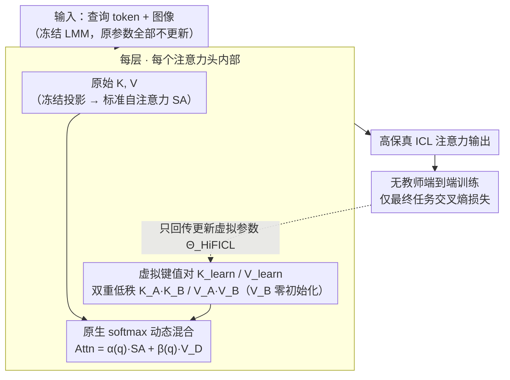

# HiFICL: High-Fidelity In-Context Learning for Multimodal Tasks

**会议**: CVPR 2026  
**arXiv**: [2603.12760](https://arxiv.org/abs/2603.12760)  
**代码**: [https://github.com/bbbandari/HiFICL](https://github.com/bbbandari/HiFICL)  
**领域**: 多模态VLM  
**关键词**: 上下文学习, 参数高效微调, 大型多模态模型, 虚拟键值对, 低秩分解

## 一句话总结

HiFICL 通过严格的注意力公式推导，将 ICL 近似问题从"拟合 shift vector"重构为"直接参数化 ICL 的源头"——在注意力头中注入可学习的低秩虚拟键值对，以端到端训练实现一种动态的、上下文感知的参数高效微调方法，在多个多模态基准上以极少参数超越现有 ICL 近似方法和 LoRA。

## 研究背景与动机

1. **领域现状**：上下文学习（ICL）是大型多模态模型（LMM）的关键能力，通过少量示例即可适配新任务，无需参数更新。但在多模态场景下，视觉输入的高 token 成本导致计算开销大，且 ICL 性能对示例选择和排序高度敏感。

2. **现有痛点**：为解决这些问题，主流方向是"ICL 近似"——学习一个"shift vector"来蒸馏 ICL 效果。代表方法如 Task Vector、LIVE、MimIC 都将 ICL 效果建模为对隐藏状态表示的线性平移。但这些方法基于一个理论不精确的假设：它们近似的是 ICL 的间接结果，而非其根本机制。

3. **核心矛盾**：机制可解释性研究已证明 ICL 不是简单的全局平移，而是由专门的电路（如 Induction Heads）执行的复杂模式匹配和检索过程，涉及高度非线性的表示空间变换。线性 shift 假设与 ICL 的非线性本质之间存在根本矛盾。

4. **本文目标** (a) 如何忠实地建模 ICL 的真实机制而非近似其间接效果？(b) 如何设计一种兼具动态性和参数效率的微调方法？

5. **切入角度**：作者回到注意力公式本身，推导出 ICL 效果的精确数学分解——它不是一个外部加上去的向量，而是标准自注意力输出与上下文值矩阵的动态加权混合。因此，ICL 近似的正确目标应该是直接参数化其"源头"(K_D, V_D)，而非近似其"效果"。

6. **核心 idea**：放弃间接拟合 shift vector，直接在注意力模块中注入可学习的低秩虚拟键值对来模拟 ICL 示例，忠实地保留注意力机制的非线性动态。

## 方法详解

### 整体框架

HiFICL 冻结 LMM 的所有参数，在每一层的每个注意力头中注入一组可学习的虚拟键值对 $(K_{\text{learn}}, V_{\text{learn}})$。在注意力头内部，这组虚拟对与该头原有的（冻结的）键值一起经原生 softmax 计算，使输出呈现「标准自注意力 + 上下文值注入」的动态混合——这正是理论分解出的 $\alpha(q)\cdot\text{SA} + \beta(q)\cdot V_D$ 形式。训练时丢掉教师，仅用最终任务的交叉熵损失端到端优化，且梯度只回传到这些虚拟参数。

### 关键设计

**1. 注意力公式的精确分解：先想清楚 ICL 到底在注意力里干了什么**

之前所有 ICL 近似方法都默认"ICL 效果 = 给隐藏状态加一个 shift vector"，但这只是一个未经推导的工程假设。HiFICL 回到注意力公式本身，把"前缀里塞了 ICL 示例"这件事展开成精确的解析式：含示例的注意力输出可以拆成

$$\text{Attn}_{\text{out}} = \alpha(q) \cdot \text{SA}(q,K,V) + \beta(q) \cdot V_D$$

其中 $\text{SA}(q,K,V)$ 是不带示例的标准自注意力，$V_D$ 是 ICL 示例的值矩阵。两个权重都依赖当前查询 $q$：标量权重 $\alpha(q) = Z_2/(Z_1+Z_2)$ 控制原始自注意力被缩放多少，向量权重 $\beta(q) = \exp(qK_D^{\top}/\sqrt{d_k})/(Z_1+Z_2)$ 控制示例值被注入多少，$Z_1, Z_2$ 分别是示例键和查询键的注意力分数之和。这条式子的意义在于：ICL 不是"在输出上加一个固定向量"，而是"对自注意力做随查询变化的动态缩放，再叠加随查询变化的上下文值"——一个完整的非线性动态系统。换句话说，前人苦苦拟合的那个 shift effect，本身就是这条公式里 $\beta(q)\cdot V_D$ 项的副产物。既然如此，忠实建模 ICL 的正确目标就不该是去近似它的"结果" shift，而应该直接参数化它的"源头" $(K_D, V_D)$。

**2. 双重低秩虚拟键值对：用极少参数把那个源头学出来**

顺着上面的结论，HiFICL 不再外挂任何 shift 向量，而是在每个注意力头 $h$ 里塞入 $n$ 个可学习的虚拟键值对 $(K_{\text{learn}}^{(h)}, V_{\text{learn}}^{(h)})$，让它们冒充真实 ICL 示例的 $(K_D, V_D)$，通过原生 softmax 与查询动态交互。直接学全秩矩阵参数太多、极易过拟合，所以每一对都做低秩分解：

$$K_{\text{learn}}^{(h)} = K_A^{(h)} K_B^{(h)}, \qquad V_{\text{learn}}^{(h)} = V_A^{(h)} V_B^{(h)}$$

其中 $K_A, V_A \in \mathbb{R}^{n \times r}$，$K_B, V_B \in \mathbb{R}^{r \times d_h}$，秩 $r \ll d_h$。这个分解一箭双雕：键侧的低秩约束本身就是结构化正则，逼模型把示例压成少数几个紧凑的"原型键"，形成信息瓶颈防过拟合；值侧则把 $V_B$ 零初始化，使训练初期上下文偏移恰好为零，模型从"等价于原始 LMM"的状态出发平滑地学习，避免随机初始化带来的梯度爆炸。消融里 $V$ 的低秩分解贡献最大（去掉后掉 2.77%），正是因为这个零初始化撑起了训练稳定性。

**3. 无教师端到端训练：把对齐损失整套丢掉**

MimIC 这类方法要走教师-学生范式：先用带真实示例的模型做一遍教师前向，再让学生逐层对齐教师的隐藏状态。HiFICL 把这套全部丢掉，只用最终任务的交叉熵损失端到端优化全部虚拟参数：

$$\mathcal{L} = -\sum_t \log P(A_t \mid Q, A_{<t}; \Theta_{\text{base}}, \Theta_{\text{HiFICL}})$$

冻结的 $\Theta_{\text{base}}$ 是 LMM 原参数，只有 $\Theta_{\text{HiFICL}}$（那些低秩虚拟对）参与更新。丢掉教师不只是图省事——消融显示加回教师反而把 VQAv2 从 72.08% 拉低到 70.09%，说明逐层对齐其实是在给学生设性能天花板，强迫它模仿教师的中间表示限制了它自由探索更优解。同时省掉教师前向带来巨大的效率红利：训练时间只有 MimIC 的 1/7.5，FLOPs 只有 1/14.3。

### 损失函数 / 训练策略

采用 AdamW 优化器，学习率 5e-3，cosine 退火 + 10% warmup，虚拟提示数 $n=8$，秩 $r$ 为任务相关超参数（VQAv2 的最优秩为 8，更复杂的 OK-VQA 最优秩为 16）。所有实验使用 1000 个训练样本。

## 实验关键数据

### 主实验

在 LLaVA-Interleave-7b 上的性能对比：

| 方法 | 参数量 (M) | VQAv2 | OK-VQA | COCO CIDEr |
|------|----------|-------|--------|------------|
| 8-shot ICL | - | 68.19 | 43.84 | 1.2085 |
| LoRA | 19.7 | 70.12 | 48.19 | 1.0665 |
| MimIC | 17.0 | 74.40 | 52.29 | 1.3169 |
| **HiFICL** | **2.2** | **74.66** | **54.19** | **1.3315** |

在 Idefics2-8b-base 上的性能对比：

| 方法 | 参数量 (M) | VQAv2 | OK-VQA | COCO CIDEr |
|------|----------|-------|--------|------------|
| MimIC | 0.26 | 69.29 | 58.74 | 1.2827 |
| **HiFICL** | **2.2** | **72.08** | **59.56** | **1.2951** |

HiFICL 在 Idefics2 上 VQAv2 超越 MimIC 达 2.79%，同时参数量仅为 LoRA 的 1/8。

### 消融实验

在 Idefics2 上的组件消融：

| 配置 | VQAv2 | OK-VQA | COCO |
|------|-------|--------|------|
| HiFICL (完整) | **72.08** | **59.56** | **1.2951** |
| + Teacher（加教师） | 70.09 (-1.99) | 59.13 | 1.2844 |
| - LoRA on K（去 K 低秩） | 70.58 (-1.50) | 55.72 | 1.2652 |
| - LoRA on V（去 V 低秩） | 69.31 (-2.77) | 56.86 | 1.2618 |
| w/o SA scaling ($\alpha=1$) | 70.14 (-1.94) | 58.51 | 1.2808 |

### 关键发现

- **教师范式是性能天花板**：加入教师后 VQAv2 降了 1.99%，同时训练成本增加 7.5 倍。这验证了教师对齐会限制模型潜力
- **V 的低秩分解贡献最大**：去除后 VQAv2 降了 2.77%，因为 $V_B$ 零初始化是训练稳定性的关键保障
- **非线性缩放因子 $\alpha$ 至关重要**：设 $\alpha=1$ 等价于退化为线性 shift 近似，性能从 72.08% 降到 70.14%，实证验证了保留注意力机制非线性的必要性
- **最优秩随任务复杂度变化**：VQAv2 最优 $r=8$，更复杂的 OK-VQA 最优 $r=16$，说明低秩分解不只是压缩手段，更是任务自适应的正则化器
- **幻觉分析**：HiFICL 的 CHAIRi 最低（2.2），比 8-shot ICL（3.9）显著降低，同时 Recall 最高（45.7），说明高保真近似减少了不基于视觉输入的内容生成
- **数据效率极高**：仅 300 个样本即超过 8-shot ICL 基线

## 亮点与洞察

- **从理论推导出发重构问题**：不是在"如何更好地近似 shift vector"上做文章，而是证明 shift vector 本身就是注意力公式的解析结果，从而将问题转化为"直接参数化 $(K_D, V_D)$"。这种问题重构的思路可迁移到其他试图近似某个效果的研究方向
- **ICL 作为 inference-time finetuning 的具体实例化**：理论研究认为 ICL 实质是一种推理时的动态优化，HiFICL 是第一个将这一假说转化为训练时 PEFT 方法的工作。相比 LoRA 的静态、输入无关适应，HiFICL 的动态、上下文感知适应更符合 ICL 的本质
- **极致的参数效率**：仅 2.2M 参数即超越需要 17-19.7M 参数的 LoRA/MimIC，且推理速度与 zero-shot 近乎相同

## 局限与展望

- 仅在 7B/8B 规模模型上验证，更大规模模型上的效果未测试
- 虚拟提示数 $n=8$ 和秩 $r$ 需要在不同任务上调优
- 理论推导基于统一自注意力架构，不适用于早期跨注意力设计（如 Flamingo）
- 仅评估了 VQA 和 captioning 任务，更复杂的多模态推理任务（如 visual grounding、视频理解）未测试

## 相关工作与启发

- **vs MimIC**: MimIC 将 ICL 效果简化为单方向线性 shift，用教师-学生范式训练。HiFICL 实现完整的多方向非线性动态混合，端到端训练更高效（FLOPs 仅 1/14.3），性能全面超越
- **vs LoRA**: LoRA 在权重空间做静态、输入无关的修改；HiFICL 在激活空间做动态、上下文感知的适应，更接近 ICL 的本质机制，且参数量仅为 LoRA 的 1/8
- **vs LIVE**: LIVE 在 FFN 层后插入可学习向量，是一种简单的线性近似；HiFICL 在注意力模块内部操作，能捕获非线性动态

## 评分

- 新颖性: ⭐⭐⭐⭐⭐ 从理论推导出发重构问题的思路非常优雅，将 ICL 近似与 PEFT 统一的视角新颖
- 实验充分度: ⭐⭐⭐⭐ 消融和分析详尽，但仅在 2 个模型 3 个任务上测试，覆盖面可再扩大
- 写作质量: ⭐⭐⭐⭐⭐ 理论推导严谨流畅，从问题重构到方法设计逻辑链清晰
- 价值: ⭐⭐⭐⭐ 提供了 ICL 近似的新理论视角和实用方法，参数效率极高

<!-- RELATED:START -->

## 相关论文

- [\[CVPR 2026\] Parallel In-context Learning for Large Vision Language Models](parallel_in-context_learning_for_large_vision_language_models.md)
- [\[CVPR 2026\] SEATrack: Simple, Efficient, and Adaptive Multimodal Tracker](seatrack_multimodal_tracker.md)
- [\[CVPR 2026\] MASQuant: Modality-Aware Smoothing Quantization for Multimodal Large Language Models](masquant_modality-aware_smoothing_quantization_for_multimodal_large_language_mod.md)
- [\[CVPR 2026\] CoVR-R: Reason-Aware Composed Video Retrieval](covr-rreason-aware_composed_video_retrieval.md)
- [\[CVPR 2026\] EvoPrompt: Evolving Prompt Adaptation for Vision-Language Models](evolving_prompt_adaptation_for_vision-language_models.md)

<!-- RELATED:END -->
