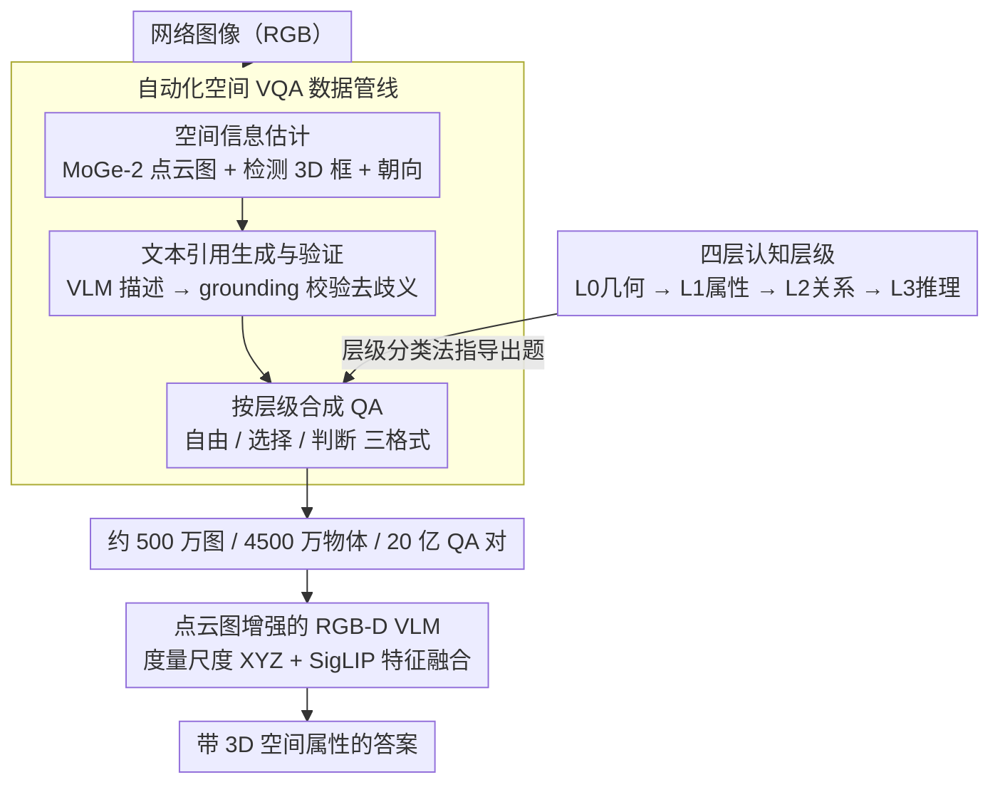

# HiSpatial: Taming Hierarchical 3D Spatial Understanding in Vision-Language Models

**会议**: CVPR 2026  
**arXiv**: [2603.25411](https://arxiv.org/abs/2603.25411)  
**代码**: 无  
**领域**: 多模态VLM  
**关键词**: 3D空间理解, 视觉语言模型, 层级任务设计, 点云地图, 空间推理

## 一句话总结

HiSpatial 提出将 3D 空间智能分解为四层认知层级（几何感知 → 物体属性 → 物体关系 → 抽象推理），构建了处理约 500 万张图像、4500 万个物体、20 亿 QA 对的自动化数据管线，并设计了以度量尺度点云图为辅助输入的 RGB-D VLM，以仅 3B 参数在多个空间推理基准上超越 GPT-5 和 Gemini-2.5-Pro。

## 研究背景与动机

1. **领域现状**：VLM 在 VQA、图像描述等 2D 任务上表现出色，但从 2D 扩展到 3D 空间理解非常困难。近期工作通过引入空间导向的 VQA 任务进行 SFT 或 RFT，但面临两个主要挑战。

2. **现有痛点**：(a) 缺乏统一的、系统性的任务层级设计——现有任务覆盖不全面，不清楚不同层级的空间推理技能之间的依赖关系；(b) 大规模、多样化、有 3D 标注的数据难以获取——现有 3D 标注数据集局限于室内场景，大规模网络数据缺乏 3D 监督。

3. **核心矛盾**：之前的工作各自关注空间理解的某些方面（定性关系比较、定量距离预测等），但没有人系统地研究这些任务之间的层级依赖：低层级任务的训练是否有助于高层级能力的涌现？

4. **本文目标** (a) 定义一个覆盖全面、有层级依赖关系的 3D 空间理解任务体系；(b) 构建大规模空间 VQA 数据集；(c) 验证层级间的依赖关系并提供训练策略指导。

5. **切入角度**：将 3D 空间智能类比为人类认知的四层进阶：先感知深度和几何 → 理解物体本身的 3D 属性 → 理解物体间的空间关系 → 进行抽象空间推理（换视角、空间计数、空间问题求解）。

6. **核心 idea**：四层认知层级 + 大规模自动数据管线 + 度量尺度点云辅助的 RGB-D VLM，系统地构建和验证 VLM 的 3D 空间智能。

## 方法详解

### 整体框架

HiSpatial 要解决的是 VLM 从 2D 走向 3D 空间理解时「任务不成体系、3D 数据难获取」两个卡点，整套方法围绕一条主线展开：先把空间智能拆成由低到高的四层认知层级，再用一条自动化管线把海量普通图像批量转成各层级的空间 VQA 对，最后训一个能直接读 3D 点云图的 RGB-D VLM。输入是一张 RGB 图（推理时配上估计出来的点云图），中间经过点云特征与视觉特征的融合，输出是带 3D 空间属性的答案。三块是递进关系——层级体系决定数据该长什么样，管线把数据造出来，模型把数据吃进去并验证层级之间的依赖确实成立。

### 关键设计

**1. 四层认知层级：把空间智能拆成可逐级训练的能力阶梯**

针对「任务覆盖不全、不知道技能之间谁依赖谁」的痛点，这篇论文把 3D 空间理解类比人类认知，分成从感知到推理的四层。Level 0 是不带语义的基础几何感知，只做像素级 3D 点查询（给定 2D 位置输出 3D 坐标）和成对深度排序；Level 1 上升到物体级，要把几何和语义锚定起来，做物体定位、朝向估计（用语言描述 yaw）、尺寸估计；Level 2 处理物体之间的关系，包括相对方向（定性的左右前后或精确 3D 方向向量）、相对距离（欧氏距离及各分量）、多物体的关系比较与排序；Level 3 是抽象推理，涵盖视角变换（站在某个物体的视角推断别的物体在哪）、满足空间约束的物体计数、以及把高层目标拆成多步空间推理的空间问题求解。

这套分层不只是分类好看，它的价值在于揭示并量化了层级之间的依赖。消融里把 L0+L1 的训练数据抽掉，L2 平均掉了 25%（EmbSpatial 从 80.71% 直接跌到 37.53%），L3 也掉了 14.51%——哪怕 L2 自己的数据量远多于底层任务，缺了底层几何感知，高层推理就没了隐式的空间知识基础。这条结论直接给出了训练策略：先打牢低层级，再叠高层级。

**2. 自动化空间 VQA 数据管线：从普通图像端到端造出带 3D 标注的题目**

大规模 3D 标注数据稀缺，现有 3D 数据集又困在室内场景，所以这篇论文没有去标数据，而是搭了一条三阶段管线把网络图像自动转成空间 QA。第一阶段做空间信息估计：MoGe-2 出像素级 3D 点云图，RAM→GroundingDINO→SAM 串起来检测物体并结合点云算出 3D 边界框和尺寸，OrientAnythingv2 估朝向，Perspective Fields 建一个重力对齐的世界坐标系。第二阶段生成文本引用：用 Describe Anything / Qwen2.5-VL / Qwen3-VL 给每个物体写描述，再反过来用 VLM grounding 验证一遍，IoU 低于阈值的描述直接丢掉——这一步是为了堵住「一句描述对应多个物体」的歧义，保证后面 QA 指代得准。第三阶段按层级分类法合成 QA，生成自由问答、选择题、判断题三种格式提供互补的学习信号，其中 L3 的空间问题求解交给 GPT 生成需要多步推理的题目。

举个具体的转换：一张室内照片进来，MoGe-2 先把每个像素抬到 3D 坐标，检测器圈出「沙发」「茶几」「台灯」，结合点云算出各自的 3D 框和尺寸，OrientAnythingv2 标出沙发朝向；接着给每个物体配上经过 grounding 验证的文本引用；最后按层级出题——L1 问「台灯有多高」，L2 问「茶几在沙发的哪个方向」，L3 问「从坐在沙发的人的视角看，台灯在左边还是右边」。这条管线最终滚出了约 500 万张图像、4500 万个物体、20 亿 QA 对的数据规模。

**3. 点云图增强的 RGB-D VLM：把度量尺度的 3D 几何直接喂进模型**

光有 RGB 难以做精确的距离和尺寸判断，所以模型在 PaliGemma2-3B 上加了一路点云输入。点云图记作 $\mathbf{X} \in \mathbb{R}^{H \times W \times 4}$，前三通道是 3D 坐标、第四通道是有效性掩码，经过正弦位置编码和一个可学习的 patchify 卷积层变成特征图，再沿特征维度和 SigLIP 的视觉特征拼接，过一个线性投影器融合后送进语言模型；训练时冻结视觉编码器，只联合微调 patchify 层、融合投影器和 LLM。

关键区别在于这里用的是**度量尺度**点云，而不是以往工作常用的相对深度图。相对深度只能告诉你谁前谁后，度量点云直接给出真实的米制坐标，距离和尺寸这类定量问题才有据可依——消融里度量点云比相对深度在定量任务上高出 6.76%（75.26% → 82.02%）。更进一步，如果换成 GT 点云还能再涨，说明在有深度传感器的具身 AI 场景里，这套设计的上限会更高。

### 损失函数 / 训练策略

标准的 VLM SFT 交叉熵损失。AdamW 优化器，学习率 $2 \times 10^{-5}$，batch size 256，训练 70K 步。空间 VQA 数据与 LLaVA-Next 通用 VQA 数据按 1:7 采样混合训练，以保持通用能力。

## 实验关键数据

### 主实验

定量空间 VQA 基准（L1-L2 任务）：

| 模型 | 输入 | SpatialRGPT Avg | QSpatial Avg |
|------|------|----------------|-------------|
| GPT-5 | RGB | 40.47 | 68.45 |
| Gemini-2.5-Pro | RGB | 26.57 | 49.92 |
| MM-Spatial-3B | RGB-D | 68.70 | - |
| **HiSpatial-3B** | **RGB-XYZ** | **79.28** | **85.16** |

定性空间 VQA 基准（L1-L3 任务）：

| 模型 | EmbSpatial | RoboSpatial | CV-Bench-3D | 3DSRBench |
|------|-----------|------------|-------------|-----------|
| GPT-4o | 63.38 | 77.20 | 84.90 | 44.20 |
| Gemini-2.5-Pro | 76.67 | 77.24 | 90.80 | 48.47 |
| Qwen-3-VL-8B | 78.50 | 82.11 | 90.66 | 52.80 |
| **HiSpatial-3B** | **80.71** | **86.18** | **97.58** | **63.81** |

自建基准（L1-L3）：

| 模型 | 物体距离 (L1) | 物体方向 (L2) | 空间问题求解 (L3) |
|------|-------------|-------------|-----------------|
| GPT-5 | 47.19% | 59.27% | 33.33% |
| **HiSpatial-3B** | **92.18%** | **67.21%** | **47.44%** |

### 消融实验

层级间依赖分析：

| L0 | L1 | L2 | L3 | L2任务Avg | L3任务Avg | 说明 |
|----|----|----|----|-----------|-----------|----|
| ✓ | ✓ | ✓ | ✓ | **81.21** | **56.29** | 完整模型 |
| ✓ | ✓ | | ✓ | 79.69 (-1.52) | 48.15 (-8.14) | 去掉L0+L1，L3降8% |
| ✓ | | ✓ | | 56.21 (-25.00) | 41.78 (-14.51) | 去掉L1+L2，L2降25% |

辅助 3D 输入的影响：

| 输入 | 定性 | 定量 |
|------|------|------|
| RGB only | 83.70 | 74.16 |
| RGB + 相对深度 | 84.29 (+0.59) | 75.26 (+0.90) |
| RGB + XYZ 点云 | **84.79** | **82.02 (+6.76)** |
| RGB + GT XYZ | - | 82.79 (+0.77) |

### 关键发现

- **层级依赖非常强烈**：即使 L2 任务的训练数据远多于 L0+L1，去掉后者仍导致 L2 性能大幅下降（EmbSpatial 从 80.71% 跌至 37.53%），说明底层几何感知为高层推理提供了不可替代的隐式知识
- **对 L3 的影响呈层级梯度**：去掉 L1+L2 比去掉 L0+L1 对 L3 的伤害更大（-14.51% vs -8.14%），因为 L3 直接依赖 L1/L2 技能
- **度量尺度点云远优于相对深度**：在定量任务上差距达 6.76%，因为度量信息直接支持精确的距离/尺寸估计
- **空间 SFT 不损害通用能力**：在 88% 空间 + 12% 通用数据上训练后，MMBench 从 49.86% 提升至 69.67%，说明空间理解和通用 VQA 能力可以互相促进

## 亮点与洞察

- **四层认知层级的系统性设计**是这篇论文的核心贡献——不只是提出一组任务，而是揭示了任务间的层级依赖关系，为未来的训练策略提供了清晰指导（先训低层级再训高层级更有效）
- **大规模自动化数据管线**具有很强的复用价值——从 MoGe-2 点云估计到多模型物体检测、文本引用生成和验证、多格式 QA 合成，整个流程可以直接应用于新的图像数据集
- **3B 模型超越 GPT-5 和 Gemini-2.5-Pro**：证明了空间理解能力可以通过高质量的领域数据和合理的架构设计在小模型上实现，不需要巨大的模型规模
- 度量尺度点云图比相对深度更有效的发现，为具身 AI 等有深度传感器的下游任务指明了方向

## 局限与展望

- 依赖 MoGe-2 估计点云图质量，在纹理稀疏或遮挡严重的场景可能不准确
- 数据管线中的文本引用验证仍有通过率有限的问题（验证失败时回退到类别标签+边界框）
- L3 的空间问题求解由 GPT 生成，可能存在偏差和多样性不足
- 仅在 PaliGemma2-3B 上验证，更大规模模型的效果和层级依赖是否一致尚不清楚
- 评估为静态单图场景，视频/多视角中的 3D 空间理解未涉及

## 相关工作与启发

- **vs SpatialRGPT**: SpatialRGPT 仅关注 L1-L2 层级的定量任务且使用相对深度。HiSpatial 覆盖全部四个层级并使用度量尺度点云，定量任务准确率从 56.22% 提升至 79.28%
- **vs MM-Spatial**: 同样使用 RGB-D 输入和 3B 模型，但 HiSpatial 的层级化数据更全面（2B QA 对），定量平均从 68.70% 提升至 79.28%
- **vs RoboRefer**: 侧重具身场景中的空间引用，缺乏系统的层级设计。HiSpatial 在 RoboSpatial 上也取得了更好性能（86.18% vs 84.55%）

## 评分

- 新颖性: ⭐⭐⭐⭐ 四层层级设计虽然概念上直观但执行严谨，层级依赖分析是真正的新贡献
- 实验充分度: ⭐⭐⭐⭐⭐ 7 个外部基准 + 自建基准 + 详细消融 + 通用能力评估，非常全面
- 写作质量: ⭐⭐⭐⭐ 结构清晰，图表信息丰富，数据管线描述详细
- 价值: ⭐⭐⭐⭐⭐ 数据管线和层级框架对社区有很高的参考价值，3B 模型超越 GPT-5 的结果有示范效应

<!-- RELATED:START -->

## 相关论文

- [\[CVPR 2026\] Abstract 3D Perception for Spatial Intelligence in Vision-Language Models](abstract_3d_perception_for_spatial_intelligence_in_vision-language_models.md)
- [\[CVPR 2026\] HOG-Layout: Hierarchical 3D Scene Generation, Optimization and Editing via Vision-Language Models](hog_layout_hierarchical_3d_scene_generation_optimization_and_editing.md)
- [\[CVPR 2026\] Beyond 3D VQAs: Injecting 3D Spatial Priors into Vision-Language Models for Enhanced Geometric Reasoning](beyond_3d_vqas_injecting_3d_spatial_priors_into_vision-language_models_for_enhan.md)
- [\[CVPR 2025\] RoboSpatial: Teaching Spatial Understanding to 2D and 3D Vision-Language Models for Robotics](../../CVPR2025/multimodal_vlm/robospatial_teaching_spatial_understanding_to_2d_and_3d_vision-language_models_f.md)
- [\[CVPR 2026\] G$^2$VLM: Geometry Grounded Vision Language Model with Unified 3D Reconstruction and Spatial Reasoning](g2vlm_geometry_grounded_vision_language_model_with_unified_3d_reconstruction_and.md)

<!-- RELATED:END -->
