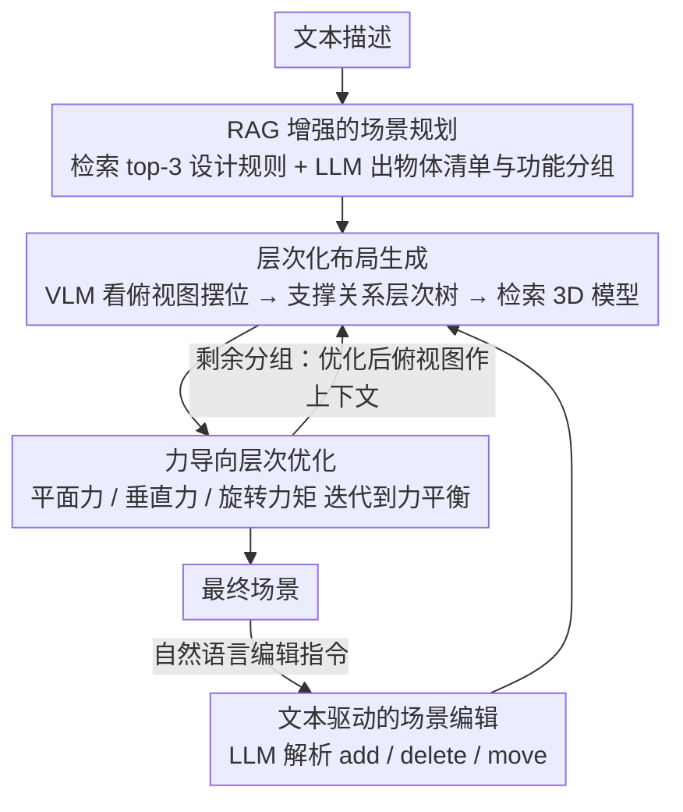

# HOG-Layout: Hierarchical 3D Scene Generation, Optimization and Editing via Vision-Language Models

**会议**: CVPR 2026  
**arXiv**: [2604.10772](https://arxiv.org/abs/2604.10772)  
**代码**: 无  
**领域**: 多模态VLM  
**关键词**: 3D场景生成, 场景编辑, 视觉语言模型, 层次化优化, RAG

## 一句话总结
本文提出 HOG-Layout，一个基于 VLM 和 LLM 的层次化 3D 室内场景生成、优化和编辑框架，通过 RAG 增强语义一致性、力导向层次优化确保物理合理性，在 SceneEval 上以 4.5 倍更快的速度超越 LayoutVLM。

## 研究背景与动机

1. **领域现状**：3D 室内场景生成服务于内装设计、VR 和具身 AI。传统方法从数据学习布局（图网络、Transformer、扩散模型），或直接生成外观（NeRF、Gaussian Splatting），但受限于多样性或缺乏交互性。LLM/VLM 的出现使开放词汇的场景生成成为可能。
2. **现有痛点**：LLM 直接生成布局（如 LayoutGPT）可能产生碰撞和不合理放置；加入空间关系约束（如 Holodeck）改善合理性但牺牲多样性；VLM 方法（如 LayoutVLM）改善了语义一致性但需要预定义物体集且基于梯度的优化非常耗时（~321s/场景）。所有方法主要关注从零生成，忽略了实际中更重要的场景编辑需求。
3. **核心矛盾**：生成语义一致且物理合理的场景需要同时满足软约束（语义关系）和硬约束（无碰撞、在边界内），现有方法难以兼顾两者且计算效率低。
4. **本文目标**：构建一个同时支持场景生成和编辑的层次化框架，在保证语义一致性和物理合理性的同时实现低延迟。
5. **切入角度**：将物体按支撑关系组织为层次结构（地板→桌子→桌上物品），在每一层和父子层级间分别优化，将复杂的 3D 约束分解为平面力、垂直力和旋转力矩。
6. **核心 idea**：RAG 增强场景规划 + VLM 生成初始布局 + 力导向层次优化 + LLM 解析编辑指令，四个模块协同实现高效场景生成和编辑。

## 方法详解

### 整体框架
HOG-Layout 要解决的是：从一句文本描述出发，生成一个既语义合理（沙发对着电视、床头柜挨着床）又物理合理（不穿模、不出界、桌上物品稳稳落在桌面）的 3D 室内场景，并且支持事后用自然语言编辑。整条管线按"先规划、再布局、后优化、可编辑"四步走：先让 LLM 配上检索来的设计规则把文本拆成结构化的物体清单和分组计划；再让 VLM 看着俯视图把物体摆成一个按支撑关系组织的层次布局，并从素材库检索出具体 3D 模型；接着把这个粗布局丢进力导向优化器迭代到稳定；用户若不满意，LLM 把编辑指令解析成 add/delete/move 三类操作，改完再走一遍优化。贯穿全程的关键抽象是把物体按"谁支撑谁"组织成一棵层次树（地板→桌子→桌上的杯子），约束因此被拆解成同层之间和父子层级之间两类，分别求解。布局生成与优化按功能分组逐组进行，每组优化好的俯视图再作为下一组的上下文，形成一个分组生成的回环。

### 关键设计

**1. RAG 增强的场景规划：给 LLM 补上它缺的室内设计常识**

直接让 LLM 从文本生成布局，最大的问题是它没有领域知识——不知道"电视和沙发要留多少距离""餐桌椅怎么环绕"这类设计经验。本文先把这些布局约束写成规则模板，用 Qwen3-Embedding-4B 把每条规则编码成 1024 维向量存进 FAISS。用户输入一段描述时，按余弦相似度检索出最相关的 3 条规则，连同原始描述一起喂给 LLM，让它输出结构化的场景计划：每个物体的 ID、名称、尺寸，以及功能分组。分组是这一步的点睛之处——比如一个"卧室兼客厅"会被拆成用餐组和观影组，后续布局就按组逐个生成，每组的俯视图作为下一组的上下文，从而保证整体空间一致。

**2. 层次化布局生成：让 VLM 看着俯视图把物体摆成一棵支撑关系树**

规划只给出物体清单，真正决定每个物体放在哪、朝向哪、谁支撑谁的是这一步。本文把当前场景渲染成带网格线和坐标的俯视图，连同场景计划一起喂给 VLM，让它输出每个物体的 XY 平面坐标和绕 Z 轴的朝向——Z 坐标不让 VLM 猜，而是根据父物体和自身尺寸自动算出（落在父物体顶面，或挂在天花板/墙上的悬挂高度）。这里的核心抽象是支撑关系层次树：每个物体的"父"就是支撑它的平面（地板、墙、天花板，或另一个物体的 ID），共用同一支撑面的物体属于同一层级。这棵树既约束了 VLM 的摆放逻辑，也为下一步把约束拆成"同层 / 父子"两类提供了结构基础。摆好位置后还要把抽象物体换成真实 3D 模型：先用 SBERT 按文本描述从素材库召回 top-60 候选，再用 OpenCLIP 算图文相似度、叠加尺寸匹配度，按加权分数 $Score_{Final}=w_1 S_{sbert}+w_2 S_{clip}+w_3 S_{size}$ 选出最贴合的一个，并用它的真实尺寸替换预测尺寸，得到初始场景。

**3. 力导向层次优化：把布局优化当成一个物理力平衡问题来解**

VLM 给出的初始布局往往有碰撞、出界、悬空，需要优化到稳定。本文不走 LayoutVLM 那条耗时的梯度优化路线，而是把所有约束统一抽象成"力"，让物体像受力的刚体一样被推到合理位置。借助层次树，约束被拆成三个方向分别处理：平面力 $F_{i,\text{plane}} \in \mathbb{R}^2$ 管同层内的碰撞、边界、邻近和靠墙；垂直力 $F_{i,\text{vert}} \in \mathbb{R}$ 管跨层级的碰撞和上下边界；旋转力矩 $\tau_i$ 管朝向和对齐。每一步把三类力累加，用显式欧拉积分更新物体的位置与旋转，直到残余力小于阈值 $\epsilon_{\text{conv}}$ 收敛。

$$F_{i,\text{plane}} = \sum (\text{碰撞} + \text{边界} + \text{邻近} + \text{靠墙}), \quad F_{i,\text{vert}}, \quad \tau_i$$

光靠力推容易卡死，所以本文加了死锁检测与规避：两个物体在水平面互相顶住推不开时（水平死锁），就施加一个垂直力把其中一个"抬出来"再放下；物体在垂直方向放不下时（垂直死锁），直接缩放它的 Z 轴让它塞得进去。这套设计的好处是绕开了混合整数规划那种组合爆炸的开销，而层次化分解又让同层约束和父子约束可以并行求解，这正是它比梯度优化快 4.5 倍的根源。

**4. 文本驱动的场景编辑：让场景生成从"一次性出图"变成可迭代设计**

现有工作几乎都只管从零生成，但实际用起来，用户更常做的是"把那把椅子挪过去""再加个台灯"这类局部修改。本文让 LLM 把一句编辑指令映射成四类基本操作：plan / add / delete / move。add 把新物体送回布局生成模块按层次摆好；move 由 VLM 输出待移动物体的 ID 和新位置；delete 由 VLM 输出待删除的 ID。任何一种改动完成后，都重新跑一遍力导向优化，保证编辑后的场景依然无碰撞、物理合理。正是这个闭环让 HOG-Layout 从一个生成器变成了一个交互式设计工具。

### 一个完整示例：从"现代卧室"到挪走床头柜

输入"一个带阅读角的现代卧室"。**规划阶段**，FAISS 检索出 3 条相关规则（如"床头柜对称放在床两侧""阅读椅靠窗"），LLM 据此输出物体清单——床、两个床头柜、书架、阅读椅、落地灯——并分成睡眠组和阅读组。**布局阶段**，VLM 先摆睡眠组：床贴墙居中，两个床头柜分列两侧；这组的俯视图再作为上下文摆阅读组，把椅子和灯放到剩余的窗边空间。**优化阶段**，初始布局里床头柜和床有轻微穿模、落地灯半个底座出界——平面力把床头柜往外推到贴边、把灯拉回边界内，垂直力确保台灯稳落地面，几十步迭代后残余力低于 $\epsilon_{\text{conv}}$ 收敛。**编辑阶段**，用户说"删掉左边的床头柜"，LLM 解析成 delete，VLM 定位到该物体 ID 删除，再跑一遍优化让剩余物体自然回填空隙，得到最终场景。

### 损失函数 / 训练策略
无训练。统一使用 GPT-4o 作为 LLM/VLM 骨干，全部能力来自提示工程与检索（物体检索的打分见关键设计 2）。

## 实验关键数据

### 主实验

| 方法 | COL_ob↓ | COL_sc↓ | SUP↑ | OAR↑ | SP↑ | Time↓ |
|------|---------|---------|------|------|-----|-------|
| LayoutGPT | 35.67% | 49% | 34.39% | 11.48% | 35.14 | **37s** |
| Holodeck | 12.24% | 63% | 34.72% | 38.27% | 55.45 | 272s |
| LayoutVLM | 29.44% | 55% | 77.54% | 61.99% | 65.54 | 322s |
| **HOG-Layout** | **5.28%** | **16%** | **81.17%** | **75.74%** | **69.69** | **70s** |

**人类评估（7 分制）**：

| 方法 | 合理性 | 语义对齐 |
|------|--------|---------|
| LayoutGPT | 2.43 | 2.58 |
| Holodeck | 3.97 | 3.66 |
| LayoutVLM | 3.69 | 4.61 |
| **HOG-Layout** | **5.33** | **5.75** |

### 消融实验

| 配置 | COL_ob↓ | SP↑ | 说明 |
|------|---------|-----|------|
| HOG-Layout 完整 | 5.28% | 69.69 | 全部模块 |
| 无 RAG | 更高 | ~65 | 语义约束减弱 |
| 无层次优化 | ~20% | ~60 | 碰撞显著增加 |
| 无力分解 | ~15% | ~64 | 垂直约束处理不当 |

### 关键发现
- **碰撞率降低 6 倍**：HOG-Layout 的物体碰撞率仅 5.28%（LayoutVLM 29.44%），场景碰撞率 16%（LayoutVLM 55%）
- **生成速度提升 4.5 倍**：70s vs LayoutVLM 的 322s，因为力导向优化远快于梯度优化
- **人类评估一致性**：GPT-5 评分与人类评分趋势一致，HOG-Layout 在两项均显著领先

## 亮点与洞察
- **力导向层次优化**是核心创新：将场景布局优化类比为物理力平衡问题，既直观又高效。死锁检测和规避机制进一步增强了鲁棒性
- **编辑支持**是走向实用的关键一步：大多数场景生成工作只关注从零生成，HOG-Layout 的 add/delete/move 编辑能力使其更接近实际使用场景
- **分组生成策略**值得借鉴：按功能区域分组逐步生成，每组的俯视图作为下一组的上下文，保证了空间一致性

## 局限与展望
- 物体检索依赖现有 3D 资源库（3D-FUTURE、Objaverse），无法生成不存在的物体
- 力导向优化可能陷入局部最优，死锁规避策略是启发式的
- 仅支持室内场景，未验证室外或大规模场景
- 编辑操作较为基础（add/delete/move），未支持更复杂的语义编辑（如"让房间更温馨"）

## 相关工作与启发
- **vs LayoutVLM**: LayoutVLM 使用梯度优化，计算开销大（322s）且需预定义物体集。HOG-Layout 的力导向优化快 4.5 倍且支持开放词汇
- **vs Holodeck**: Holodeck 用 DFS/MILP 满足硬约束但忽略软语义约束。HOG-Layout 同时处理物理和语义约束

## 评分
- 新颖性: ⭐⭐⭐⭐ 层次化力导向优化和 RAG 增强规划的组合新颖且有效
- 实验充分度: ⭐⭐⭐⭐ SceneEval 100 场景 + 人类评估 + 编辑实验
- 写作质量: ⭐⭐⭐ 模块多但描述清晰，部分细节需参考补充材料
- 价值: ⭐⭐⭐⭐ 生成+编辑的统一框架有实用价值，速度优势明显

<!-- RELATED:START -->

## 相关论文

- [\[CVPR 2026\] HiSpatial: Taming Hierarchical 3D Spatial Understanding in Vision-Language Models](hispatial_taming_hierarchical_3d_spatial_understanding_in_vision-language_models.md)
- [\[CVPR 2025\] LayoutVLM: Differentiable Optimization of 3D Layout via Vision-Language Models](../../CVPR2025/multimodal_vlm/layoutvlm_differentiable_optimization_of_3d_layout_via_vision-language_models.md)
- [\[CVPR 2026\] Scene-VLM: Multimodal Video Scene Segmentation via Vision-Language Models](scene-vlm_multimodal_video_scene_segmentation_via_vision-language_models.md)
- [\[CVPR 2026\] PointAlign: Feature-Level Alignment Regularization for 3D Vision-Language Models](pointalign_feature-level_alignment_regularization_for_3d_vision-language_models.md)
- [\[CVPR 2026\] RE-VLM: Event-Augmented Vision-Language Model for Scene Understanding](re-vlm_event-augmented_vision-language_model_for_scene_understanding.md)

<!-- RELATED:END -->
