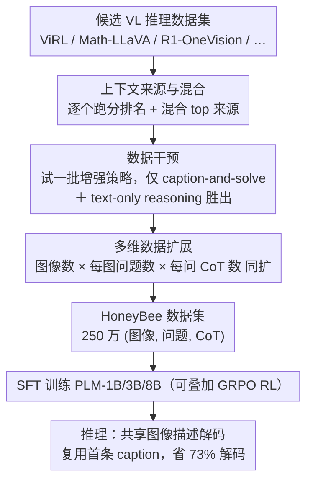

# HoneyBee: Data Recipes for Vision-Language Reasoners

**会议**: CVPR 2026  
**arXiv**: [2510.12225](https://arxiv.org/abs/2510.12225)  
**作者**: Hritik Bansal, Devendra Singh Sachan, Kai-Wei Chang, Aditya Grover, Gargi Ghosh, Wen-tau Yih, Ramakanth Pasunuru (Meta AI, UCLA)
**代码**: [facebookresearch/HoneyBee_VLM](https://github.com/facebookresearch/HoneyBee_VLM)  
**数据**: [facebook/HoneyBee](https://huggingface.co/datasets/facebook/HoneyBee)
**领域**: 多模态VLM  
**关键词**: VLM reasoning, data curation, chain-of-thought, test-time scaling, data recipes

## 一句话总结

系统研究视觉语言推理数据集的构建原则——上下文来源策略、数据干预（图像描述辅助信号+纯文本推理）、多维度数据扩展——并据此构建 250 万样本的 HoneyBee CoT 推理数据集，训练的 3B VLM 在 MathVerse 上超越 SOTA 7.8%，同时提出降低 73% 解码成本的测试时扩展策略。

## 研究背景与动机

近期 VLM 推理能力快速提升，但构建高质量视觉语言推理训练数据集的核心原则仍不清楚。现有工作主要关注模型架构和训练策略，而数据层面的系统性研究严重不足。

**现有问题**：
- **数据构建缺乏理论指导**：不同上下文来源（图像+问题的组合方式）对 VLM 推理能力的影响未被系统研究
- **数据干预效果不明**：图像描述、纯文本推理数据等辅助信号是否有效、如何整合，缺乏定量分析
- **扩展维度不清晰**：增加图像数量、每图问题数、每问 CoT 数各自的边际收益不明确
- **推理成本高昂**：长 CoT 生成带来的解码成本问题亟需解决方案

**核心目标**：通过控制变量实验，揭示 VL 推理数据构建的关键原则，并据此构建高质量大规模数据集。

## 方法详解

### 整体框架

HoneyBee 不提新模型，而是系统回答"视觉语言推理的训练数据到底该怎么造"。作者把数据构建拆成一条串行的"数据配方"流水线，每一步都用严格的控制变量实验（固定训练设置、同时在 PLM-3B/8B 两个规模 + 五个评测集上跑分）决定取舍：先**比较多个候选数据集、挑出并混合最好的上下文来源**，再在最好的数据上**逐个试一批数据干预、只保留真正有效的两招**，然后**沿三个维度同时扩量**得到大规模数据，最终落成 HoneyBee 数据集并训练 VLM。流水线的产物 HoneyBee 含 250 万条 (图像, 问题, CoT) 样本、覆盖 35 万个唯一问题，CoT 由 Llama-4 Scout 生成、采用"图像描述 + 推理过程 + `\boxed{}` 最终答案"格式；用它 SFT 的 PLM-3B 在 MathVerse 上反超同量级 SOTA 7.8%。除训练侧外，作者还在**推理侧**提出一招"共享图像描述"的测试时扩展策略，让长 CoT 的多次采样省下 73% 解码。

### 关键设计

**1. 上下文来源与混合：图像-问题对从哪来，决定推理能学成什么样**

同样的训练流程，喂不同来源的 (图像, 问题) 对，训出来的推理能力差别很大。作者把这一步做成可量化的"选料"：从 ViRL、Math-LLaVA、R1-OneVision、ThinkLite-VL-Hard、LLaVA-CoT、MMK12 等多个现成 VL 推理数据集各自取上下文，用同一个生成器（Llama-4 Scout）造 CoT，再分别 SFT 出 PLM-3B/8B 并按五个下游评测集的平均准确率给这些来源排名。结果显示来源选择能造成高达约 4% 的平均准确率差距，**ViRL 排名最高**。在此之上作者进一步做**混合**——把 top-2 / top-4 / 全部来源等量混合（控制总量只比质量），验证混合能否压过单一最优来源。这一步给整条流水线定了"地基"：后续干预与扩展都建立在选出的最优（混合）来源上。

**2. 数据干预：试一批增强策略，只有两招真有用**

拿到最优来源后，能不能再加工提质？作者一口气设计了一整批针对"感知"和"解题"的干预，并逐个做替换/增广/过滤实验：感知侧有视觉扰动、富文本图像、感知冗余过滤、浅层感知过滤、**caption-and-solve**；解题侧有**纯文本推理混入**、增加干扰项、长度筛选、难度均衡。关键且反直觉的发现是——**绝大多数动机看似合理的干预都打不过"不干预"的基线**，只有两招稳定有效：① **caption-and-solve**——用生成器先为图像产出描述，再把它拼到 CoT 解答前部（$C'_j=[I^{cap}_j; C_j]$），相当于给推理装上"视觉锚点"、让模型先看懂图再推理；② **纯文本推理混入**——把无图像的高质量文本推理 CoT（OpenThoughts3，经同一生成器重标）并入训练集，既靠跨模态迁移提升视觉推理、又让模型成为更通用的推理器（纯文本 MATH500 从 39.2% 提到 59.7%）。

**3. 多维数据扩展：三个方向同时加量且能叠加**

确定了"用什么数据、怎么加工"之后，往哪堆量？作者在最优来源 ViRL 上系统测三个扩展轴的边际收益：唯一图像数、每图问题数、每 (图像, 问题) 对的 CoT 数。三者都持续提升性能、不见明显饱和，于是在构建最终数据时三轴同扩——每对真实图问生成 16 条 CoT 并按答案正确性过滤（约 40 万条）；每图再合成 14 个新问题（共 15 个/图），由于新问题没有标准答案，对每个新问生成 4 条 CoT、用多数投票（≥3 次一致）当作代理答案再过滤（约 100 万条）；最后按 caption-and-solve 拼上图像描述，得到 150 万条 VL 子集，再并入 100 万条纯文本推理数据，合成 250 万条的 HoneyBee。

**4. 测试时扩展：共享图像描述解码，省 73% 解码**

长 CoT 的多次采样在推理时成本很高。作者注意到 HoneyBee 训出的每条 CoT 天然分两段：图像描述段（$I^{cap}$，理解部分）和解题段（$S$，求解部分），即 $C=[I^{cap}; S]$。自一致性（self-consistency）等测试时扩展会对同一道题采样 $N>1$ 条 CoT 再多数投票，朴素做法每次都把整条 CoT（含 caption）重新生成一遍。**共享图像描述解码**则只在第一次完整生成 $(I^{cap}_1, S_1)$，之后把 $I^{cap}_1$ 作为固定上下文复用、只重采解题段 $S_k$——同一张图的描述没必要算 $N$ 遍。在 MathVista 上以 $N=64$ 实测，朴素做法生成 42.6K token，共享描述只需 24.5K token（精度持平），**token 与 FLOPs 减少 73%**。

## 实验关键数据

### 评估设置
- **基座模型**：Perception-LM (PLM)，规模覆盖 1B / 3B / 8B
- **评测基准**：10 个 VL 推理数据集，包括 MathVerse、MathVista、OlympiadBench、GeoQA、MMMU 等
- **对比方法**：ViRL-tuned PLM（base）、OpenThoughts3-tuned 模型、以及同尺寸 SOTA 模型

### Table 1: 数据干预消融实验（PLM-3B，准确率 %）

| 数据配置 | MathVerse | MathVista | OlympiadBench | 平均 |
|---|---|---|---|---|
| Base (ViRL only) | 41.2 | 52.3 | 18.7 | 37.4 |
| + OT3 问题混入 | 48.6 | 56.1 | 22.4 | 42.4 |
| + Image Caption 辅助 | 54.3 | 59.8 | 25.1 | 46.4 |
| + Text-Only 推理混入 | 57.1 | 61.5 | 27.3 | 48.6 |
| + 多 CoT 扩展 | 60.8 | 63.2 | 29.6 | 51.2 |
| HoneyBee (全部策略) | **66.0** | **65.7** | **32.4** | **54.7** |

每一步干预均带来增益，全部组合后 MathVerse 提升 **24.8%**（绝对值）。

### Table 2: 与 SOTA 模型的对比（准确率 %）

| 模型 | 参数量 | MathVerse | MathVista | MMMU | GeoQA | 平均 |
|---|---|---|---|---|---|---|
| InternVL2-2B | 2B | 28.4 | 46.3 | 36.1 | 55.2 | 41.5 |
| Qwen2-VL-2B | 2B | 31.2 | 47.8 | 37.4 | 56.8 | 43.3 |
| PLM-1B (Base) | 1B | 25.7 | 42.1 | 33.2 | 50.4 | 37.9 |
| PLM-1B + HoneyBee | 1B | **45.3** | **55.6** | **41.8** | **62.1** | **51.2** |
| Qwen2-VL-7B | 7B | 52.1 | 58.4 | 46.3 | 65.7 | 55.6 |
| InternVL2-8B | 8B | 54.3 | 60.2 | 48.1 | 67.3 | 57.5 |
| PLM-3B (Base) | 3B | 41.2 | 52.3 | 39.6 | 58.3 | 47.9 |
| PLM-3B + HoneyBee | 3B | **66.0** | **65.7** | **49.2** | **71.4** | **63.1** |
| PLM-8B + HoneyBee | 8B | **72.1** | **70.3** | **54.7** | **76.2** | **68.3** |

PLM-3B + HoneyBee 在 MathVerse 上超越同参数量 SOTA **7.8%**，PLM-1B + HoneyBee 甚至超越更大的 InternVL2-2B 和 Qwen2-VL-2B。

## 亮点与洞察

- **数据工程 > 模型工程**：3B 模型通过数据策略超越 7-8B 级别的 SOTA，证明数据质量和构建策略的重要性远超参数量
- **图像描述作为"认知桥梁"**：在 CoT 前嵌入 caption 让模型先建立视觉理解再推理，这一简单干预带来持续显著增益，揭示了视觉定基 (visual grounding) 在推理中的关键作用
- **多维度扩展正交互补**：图像数、问题数、CoT 数三个维度的扩展效果可叠加，不存在明显的 diminishing returns，指导了大规模数据集的构建方向
- **测试时扩展的效率化**：共享图像描述解码（首次生成的 caption 在后续采样中复用、只重采解题段）在保持准确率的同时降低 73% 解码成本，具有很高的实用价值
- **纯文本推理的跨模态迁移**：混入无图像的文本推理数据能提升视觉推理性能，说明推理能力具有一定的模态无关性

## 局限性

- **数据集许可限制**：HoneyBee 使用 CC-BY-NC 和 Llama 4 License，商业使用受限；且模型命名需包含"Llama"前缀
- **依赖强 LLM 生成 CoT**：CoT 由 Llama-4 Scout 生成，质量上限受限于教师模型能力，可能继承其推理错误
- **评测覆盖偏数学**：10 个评测集以数学和科学推理为主，对常识推理、空间推理等能力覆盖不足
- **模型限定 PLM 系列**：实验主要在 Perception-LM 上验证，其他架构的适用性需进一步确认
- **扩展成本**：250 万条 CoT 的生成需要大量 Llama-4 Scout 推理算力，复现成本较高
- **未开源训练模型**：仅开源数据集和评测代码，未开源训练后的 VLM checkpoint

## 相关工作

- **VL 推理数据集**：ViRL（39K 视觉推理数据）、OpenThoughts3（文本推理数据）、ShareGPT4V（图像描述数据）→ HoneyBee 整合并扩展了这些来源，首次系统研究混合策略
- **CoT 蒸馏**：使用强模型（GPT-4、Llama-4）生成 CoT 训练弱模型，已被 NovaStar、Vision-G1 等工作采用 → HoneyBee 进一步研究 CoT 的多样性和描述辅助的效果
- **测试时扩展 (TTS)**：Best-of-N、多数投票、过程奖励模型等 → HoneyBee 提出提前终止策略降低成本
- **数据配方研究**：Scaling Data-Constrained LLMs（文本领域）、DataComp（多模态预训练）→ HoneyBee 将数据配方研究拓展到 VL 推理微调阶段

## 评分

- 新颖性: ⭐⭐⭐⭐ — 首次系统研究 VL 推理数据的构建原则，三维度分析框架清晰且实验设计严谨
- 实验充分度: ⭐⭐⭐⭐⭐ — 10 个评测集、三种模型规模、大量消融实验，控制变量设计优秀
- 写作质量: ⭐⭐⭐⭐ — 结构清晰，洞察提炼到位，32 页内容详实
- 价值: ⭐⭐⭐⭐⭐ — 数据方法论贡献突出，250 万开源数据集实用性强，对 VLM 推理研究有直接指导意义

<!-- RELATED:START -->

## 相关论文

- [\[CVPR 2026\] MiniCPM-V 4.5: Cooking Efficient MLLMs via Architecture, Data and Training Recipes](minicpm-v_45_cooking_efficient_mllms_via_architecture_data_and_training_recipe.md)
- [\[CVPR 2026\] Molmo2: Open Weights and Data for Vision-Language Models with Video Understanding and Grounding](molmo2_open_weights_and_data_for_vision-language_models_with_video_understanding.md)
- [\[CVPR 2026\] Decouple to Generalize: Context-First Self-Evolving Learning for Data-Scarce Vision-Language Reasoning](decouple_to_generalize_context-first_self-evolving_learning_for_data-scarce_visi.md)
- [\[CVPR 2026\] Improving Calibration in Test-Time Prompt Tuning for Vision-Language Models via Data-Free Flatness-Aware Prompt Pretraining](improving_calibration_in_test-time_prompt_tuning_for_vision-language_models_via_.md)
- [\[CVPR 2026\] EMMA: Extracting Multiple physical parameters from Multimodal Data](emma_extracting_multiple_physical_parameters_from_multimodal_data.md)

<!-- RELATED:END -->
