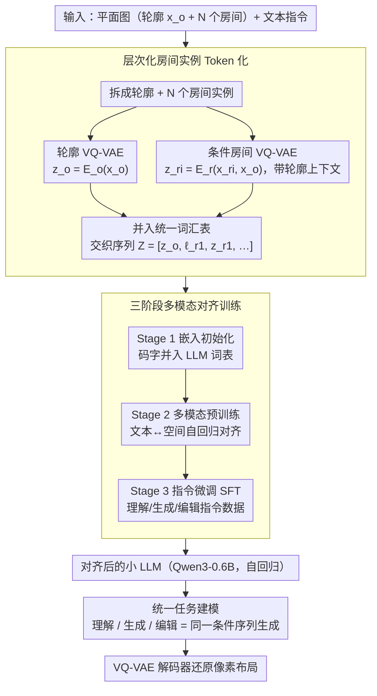

# HouseMind: Tokenization Allows MLLMs to Understand, Generate and Edit Architectural Floor Plans

**会议**: CVPR 2026  
**arXiv**: [2603.11640](https://arxiv.org/abs/2603.11640)  
**代码**: [https://housemind.github.io/](https://housemind.github.io/)  
**领域**: 多模态VLM  
**关键词**: 建筑平面图, VQ-VAE, 多模态LLM, 空间推理, 层次化token

## 一句话总结
提出 HouseMind，通过层次化 VQ-VAE 将建筑平面图的轮廓和房间实例分别离散化为空间 token，与文本 token 统一到同一词汇表中，使小规模 LLM（0.6B）就能在单一自回归框架下实现平面图的理解、生成和编辑三大任务，性能全面超越基于扩散模型和大规模 VLM 的方法。

## 研究背景与动机

**领域现状**：建筑平面图设计需要对几何、语义和空间层次的联合推理，是 AI 设计领域最具认知挑战性的任务之一。现有方法包括 GAN-based（如 HouseGAN）、Graph-based（如 Graph2Plan）和 Diffusion-based（如 ChatHouseDiffusion）等。

**现有痛点**：(1) 多数方法将布局生成视为纯视觉过程，缺乏房间实例级的显式推理，导致局部合理但全局不协调；(2) 大规模 VLM 方法是黑箱生成器，空间可控性差；(3) 现有框架难以在单一架构内统一理解、生成和编辑三项任务；(4) 计算开销大，本地部署困难。

**核心矛盾**：连续的几何布局与 LLM 的离散 token 序列建模之间存在根本性的表征隔阂——如何将空间几何信息有效编码为 LLM 可理解的离散符号？

**本文目标**：构建一个高效、可本地部署的统一多模态模型，在单一框架内实现平面图理解、生成和编辑的联合推理。

**切入角度**：用层次化 VQ-VAE 将几何信息离散化为 token，让 LLM 可以用同一套序列建模机制处理空间和语言信息。

**核心 idea**：通过房间级 token 化桥接连续几何布局与离散语言建模，实现统一的空间推理。

## 方法详解

### 整体框架
平面图的难点在于它本质是连续的几何对象，而 LLM 只会处理离散 token 序列，两者之间隔着一道表征鸿沟。HouseMind 的思路是把这道鸿沟「填平」：先用 VQ-VAE 把平面图拆成轮廓和一个个房间，各自压成离散 token，再把这些空间 token 和文本 token 塞进同一个词汇表，让一个小 LLM 用纯自回归的方式同时处理几何和语言。整条链路最终落成一串交织序列 $Z = [\boldsymbol{z}_o, \ell_{r_1}, \boldsymbol{z}_{r_1}, \ldots, \ell_{r_N}, \boldsymbol{z}_{r_N}]$——开头是轮廓 token，后面每个房间由「语义标签 token $\ell_{r_i}$ + 几何 token $\boldsymbol{z}_{r_i}$」成对排开。一旦平面图变成了这样的序列，理解、生成、编辑就都退化成同一个「读这串 token、写那串 token」的问题。

整条链路分三段：先做层次化 token 化得到统一词汇表与交织序列，再用三阶段对齐训练把空间 token 和文本 token 拉到同一表征空间，最后在这个对齐好的自回归 LLM 上统一地做理解 / 生成 / 编辑。

### 关键设计

**1. 层次化房间实例 Token 化：把整张图拆到房间粒度再离散化**

直接把整张平面图当一张图像编码，是大多数旧方法的做法，但这样 LLM 只能看到笼统的视觉特征，缺乏房间实例级的抓手，容易局部合理、全局错位。HouseMind 改成分层拆解：先把平面图分成轮廓 $x_o$ 和 $N$ 个房间实例 $\{x_{r_i}\}_{i=1}^N$，再用两套 VQ-VAE 分别离散化。轮廓 VQ-VAE 把二值轮廓掩码编码成 $\boldsymbol{z}_o = E_o(x_o)$，房间 VQ-VAE 则是**条件式**的——它编码每个房间时把轮廓一起喂进去，$\boldsymbol{z}_{r_i} = E_r(x_{r_i}, x_o)$，两者都经最近邻量化分别映射到码本 $\mathcal{Z}_o$ 和 $\mathcal{Z}_r$（编码器用 CNN、解码器用转置 CNN）。关键就在这个条件项：房间不是被孤立地编码，而是带着「我在整栋房子里的位置、和谁相邻」的空间上下文被编码，这正是后续保持全局一致性的根基。

**2. 三阶段多模态对齐训练：让空间 token 和语言 token 慢慢说上同一种话**

空间 token 和语言 token 的分布天差地别，硬拉到一起端到端训练，优化会很不稳定。HouseMind 把对齐拆成三步递进。Stage 1 做嵌入初始化，给 VQ-VAE 码本里的每个码字分配一个可训练的 token 嵌入，正式把它们并入 LLM 的词汇表；Stage 2 做多模态预训练，在大规模「文本 + 空间 token」配对数据上跑自回归目标，让模型学会双向的文本—空间对应；Stage 3 才是指令微调（SFT），在理解 / 生成 / 编辑三类指令数据上收尾。这种由浅入深的顺序，本质是先把词表对齐、再建立语义映射、最后才教任务，避免了一上来就让分布迥异的两类 token 互相拉扯。

**3. 统一任务建模：理解、生成、编辑都是同一个条件序列生成**

有了统一的 token 序列，三项任务就不必各训一个模型，而是同一个自回归框架下换不同条件。理解任务给定序列 $Z$ 和文本提示，输出描述、泡泡图或 JSON；生成任务给定轮廓 $\boldsymbol{z}_o$ 和文本 $s$，逐 token 生成整张平面图

$$p(Z \mid \boldsymbol{z}_o, s) = \prod_t p(Z_t \mid Z_{<t}, \boldsymbol{z}_o, s)$$

编辑任务则给定源布局 $Z^{\mathrm{src}}$ 和编辑指令 $s$，生成目标布局 $Z^{\mathrm{tgt}}$。三者共享同一套权重、同一种「读条件、写序列」的机制，省掉了为每个任务单独建模的冗余，也让三类能力在同一个表征空间里互相增益。

### 一个完整示例：从一张轮廓到一张完整平面图
以生成任务为例。输入是一张房屋轮廓掩码 $x_o$ 加一句文本「三室一厅，主卧朝南」。轮廓 VQ-VAE 先把 $x_o$ 压成一小段轮廓 token $\boldsymbol{z}_o$，模型把这段 token 和文本一起读进上下文，然后开始逐 token 往外吐：先吐出第一个房间的语义标签 token（比如「客厅」$\ell_{r_1}$），紧接着自回归地生成这个客厅的几何 token $\boldsymbol{z}_{r_1}$，由于编码时带了轮廓上下文，这些几何 token 落位时天然贴合轮廓边界；接着是「主卧」$\ell_{r_2}$ 及其几何 token，因为前面的客厅已经在序列里、模型能看到它的占位，主卧会避开已占区域并贴着南墙生成……如此一个房间接一个房间地铺，直到序列结束。最后把所有几何 token 喂给对应的 VQ-VAE 解码器还原成像素布局。整个过程没有扩散迭代，约 2 秒就能出一张全局协调的平面图。

### 损失函数 / 训练策略
VQ-VAE 用标准的重构损失 + commitment 损失 + 码本损失训练；LLM 阶段用自回归交叉熵损失。整体基于 Qwen3-0.6B 构建，单卡 RTX 3090 即可推理。

## 实验关键数据

### 主实验（生成任务）

| 方法 | Micro IoU | FID ↓ | Node F1 | Edge Overlap | 时间(s) |
|------|-----------|-------|---------|-------------|---------|
| Tell2Design | 0.390 | 30.5 | 0.808 | 0.197 | ~15 |
| ChatHouseDiffusion | 0.589 | 11.3 | 0.985 | 0.710 | ~30 |
| FloorPlanLLaMA | 0.607 | 49.3 | 0.922 | 0.574 | ~1 |
| **HouseMind-G** | **0.709** | **1.91** | **0.994** | **0.880** | **~2** |

### 消融实验（理解任务）

| 方法 | RMR | LocAcc | AreaDiff↓ | AdjAcc | RelAcc |
|------|-----|--------|-----------|--------|--------|
| LLaVA-v1.6-7B | 0.616 | 0.225 | 3.649 | 0.134 | 0.056 |
| Qwen3-VL-8B | 0.698 | 0.347 | 5.837 | 0.382 | 0.128 |
| InternVL3.5-8B | 0.847 | 0.546 | 12.234 | 0.469 | 0.157 |
| **HouseMind-U** | **0.998** | **0.969** | **0.549** | **0.990** | **0.808** |

### 关键发现
- HouseMind 在所有三个任务上全面超越现有方法，且推理速度极快（2-3秒/样本）
- FID 从竞争方法的 11.3-49.3 降到 1.91，说明生成质量接近真实分布
- 理解任务：AdjAcc 从最好的 0.597 提升到 0.990，面积误差从数平方米降到 0.549 m²
- 消融显示三阶段训练每一步都有贡献，去掉 Stage 1 优化不稳定、去掉 Stage 2 缺乏高层对应

## 亮点与洞察
- 房间级 token 化是核心创新——不是把整张平面图当图像处理，而是分解到实例级，让 LLM 可以进行结构化推理。这一范式可迁移到其他结构化设计任务（电路设计、UI 布局等）
- 0.6B 参数模型超越 7-8B VLM 的事实说明，正确的表征比模型规模更重要
- 编辑任务中 Node F1 达到 0.998，说明模型可以精确修改指定房间而不影响其他区域，实现了真正的局部可控编辑

## 局限与展望
- 编辑能力仅限于简单的房间增删，不支持复杂的拓扑变换
- 未建模门窗家具等细节构件，限制了在精细室内设计中的应用
- 与人类设计偏好和美学约束未对齐，生成结果在功能合理性上可能不满足专业标准
- 仅在 RPLAN 数据集上验证，更多样的建筑风格（如不规则形状、多楼层）有待探索

## 相关工作与启发
- **vs MaskPLAN**: MaskPLAN 也用 VQ-VAE 编码几何属性，但用 masked transformer autoencoding，本文更进一步引入 LLM 做多任务统一推理
- **vs ChatHouseDiffusion**: 扩散模型方法在简单布局上表现好但处理复杂配置时困难；HouseMind 通过离散推理保持全局一致性
- **vs Tell2Design**: Tell2Design 建立了文本-平面图的基准但泛化有限；HouseMind 的 token 化范式更具扩展性

## 评分
- 新颖性: ⭐⭐⭐⭐ 房间级 token 化 + LLM 统一建模的idea很有新意
- 实验充分度: ⭐⭐⭐⭐ 三任务全面评估，对比方法充分
- 写作质量: ⭐⭐⭐⭐ 方法描述清晰，但问题形式化偏重
- 价值: ⭐⭐⭐⭐ 为 AI 辅助建筑设计提供了实用的统一方案

<!-- RELATED:START -->

## 相关论文

- [\[CVPR 2026\] A More Word-like Image Tokenization for MLLMs](a_more_word-like_image_tokenization_for_mllms.md)
- [\[CVPR 2026\] Generate, Analyze, and Refine: Training-Free Sound Source Localization via MLLM Meta-Reasoning](generate_analyze_and_refine_training-free_sound_source_localization_via_mllm_met.md)
- [\[CVPR 2026\] Token Warping Helps MLLMs Look from Nearby Viewpoints](token_warping_helps_mllms_look_from_nearby_viewpoints.md)
- [\[CVPR 2026\] EgoMind: Activating Spatial Cognition through Linguistic Reasoning in MLLMs](egomind_activating_spatial_cognition_through_linguistic_reasoning_in_mllms.md)
- [\[CVPR 2026\] ENC-Bench: A Benchmark for Evaluating MLLMs in Electronic Navigational Chart Understanding](enc-bench_a_benchmark_for_evaluating_multimodal_large_language_models_in_electro.md)

<!-- RELATED:END -->
