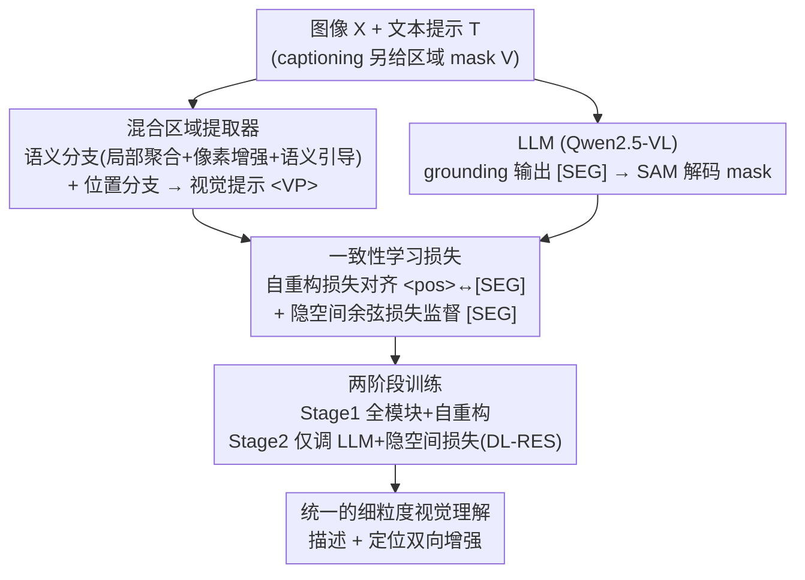

# Hugging Visual Prompt and Segmentation Tokens: Consistency Learning for Fine-Grained Visual Understanding in MLLMs

**会议**: CVPR 2026  
**论文**: [CVF Open Access](https://openaccess.thecvf.com/content/CVPR2026/html/Yang_Hugging_Visual_Prompt_and_Segmentation_Tokens_Consistency_Learning_for_Fine-Grained_CVPR_2026_paper.html)  
**代码**: 待确认  
**领域**: 多模态VLM / 细粒度视觉理解 / 区域级描述 / 像素级 grounding  
**关键词**: MLLM, 一致性学习, 视觉提示嵌入, 分割 token, 区域描述, 指代分割

## 一句话总结
提出 FCLM，发现"区域描述（captioning）里的视觉提示嵌入 `<VP>` 与 grounding 里的分割 token `[SEG]` 其实指向同一区域、只是输入/输出方向相反"，于是用自重构损失 + 隐空间余弦一致性损失把二者对齐，配合一个渐进式混合区域提取器和两阶段训练，让一个 MLLM 在 7 个细粒度视觉任务上同时刷到 SOTA。

## 研究背景与动机

**领域现状**：MLLM（如 Qwen2.5-VL、InternVL）在图像级理解上很强，但细粒度视觉理解主要围绕两个子任务——**captioning**（描述某区域/图像的细节）和 **grounding**（按指代把目标定位/分割出来）。前者代表性做法是用提取器从输入 mask 抽出视觉提示嵌入 `<VP>` 喂给 LLM；后者代表性做法是让 LLM 预测一个分割 token `[SEG]`，再由 SAM 解码成 mask。

**现有痛点**：① 多数方法**任务专用**、各自独立优化；② 少数统一方法虽同时支持两类任务，但只是"堆任务数据 + 拼 pipeline"，**没有挖掘两个任务底层的关联**。此外区域级描述的视觉提示也有缺陷：有的把视觉提示和图像嵌入融合（破坏独立性），有的裁剪局部区域放大细节（丢掉全局上下文）。

**核心矛盾**：captioning 和 grounding 看似相反，其实存在天然对称——captioning 的**输入 mask** 对应 grounding 的**输出分割**，captioning 的**文本输出**对应 grounding 的**指代输入**；而承载区域信息的 `<VP>`（从输入 mask 抽取）和 `[SEG]`（解码成输出 mask）**指向同一区域，只是方向相反**。作者把二者的热力图可视化，发现它们空间-语义分布高度相似——强相关却一直被忽视。

**本文目标**：(i) 显式建模并对齐 `<VP>` 与 `[SEG]`，让 captioning 与 grounding 互相促进；(ii) 造出更高质量、既有像素细节又有全局语义的视觉提示嵌入；(iii) 提出能"从细致描述反过来精确定位"的新任务来检验细粒度理解。

**核心 idea**：与其把两个任务当独立目标，不如把 `<VP>` 当作 `[SEG]` 在隐空间的"伪标签"，用一致性损失把两条相反方向的区域表征"抱"（hug）到一起，实现描述与定位的双向增强。

## 方法详解

### 整体框架
FCLM 建在 Qwen2.5-VL 上，含 LLM 骨干、视觉编码器、混合区域提取器和 mask 解码器。对 captioning：输入图像 + 区域 mask，由混合区域提取器产出视觉提示嵌入 `<VP>`（含语义 mask token `<mask>` 与位置 token `<pos>`）喂给 LLM 生成描述。对 grounding：LLM 输出分割 token `[SEG]`，经 SAM mask 解码器解出 mask。两条任务通过一致性学习损失耦合：先用自重构损失让 `<pos>` 能解码回输入 mask、从而与 `[SEG]` 对齐；再用隐空间余弦一致性损失把 `[SEG]` 直接拉向 `<pos>`。整体两阶段训练，从"建立通用能力"过渡到"细粒度对齐"。

### 关键设计

**1. 混合区域提取器：双分支造出"既细又全"的视觉提示嵌入**

以往视觉提示要么用 CLIP 编码（语义对齐强但分辨率低、小目标弱），要么裁局部放大细节（丢全局上下文）。本设计沿用 Osprey 框架但拆成**语义分支 + 位置分支**。语义分支接 SAM 编码器（大规模预训练、像素级边界精确），并用**三步渐进生成**：① 局部聚合——对裁剪区域 $X_{crop}$ 编码后做前景选择 + mask pooling 得初始 mask token $T_{mask}=\mathrm{MP}(\mathrm{Proj}(\mathrm{Select}(F_{sam}(X_{crop}))))$；② 像素增强——以 $T_{mask}$ 为 query、全图前景像素特征为 key/value 做 cross-attention 精修细节；③ 语义引导——以区域中心点 $P_{center}$ 为参考点从视觉编码器特征里可变形采样全局语义，经 deformable attention + MLP 融入。位置分支则用 MLP 编码 mask 形状与中心坐标 + 宽高，得到位置 token `<pos>`。两者合成 `<VP>`，既保住像素细节又带上全局语义，直接提升区域描述质量（消融见表 6a，三步逐步加都涨点）。

**2. 自重构损失：让视觉提示能"画回"自己的 mask，顺带和 [SEG] 对齐**

要把 `<VP>` 和 `[SEG]` 对齐，先得验证 `<VP>` 真的承载了区域形状信息。作者让 **mask 解码器不仅解 grounding 的 `[SEG]`，也去解 captioning 里的 `<pos>` token**，并对解出的 mask 与输入视觉提示 mask 之间施加分割损失：$L_{self}=L_{seg}(F_{dec}(T_{pos}),\,M)$（式 4）。这样做有三重收益：`<pos>` 被迫精确聚焦目标区域（可视化显示比以往视觉提示定位更准）、训练收敛更快（监督直接来自输入 mask 本身）、并且因为 `<pos>` 和 `[SEG]` 共用同一个解码器去拟合同一区域，二者在隐空间被自然拉近——为下一步把 `<pos>` 当伪标签埋下伏笔。

**3. 隐空间余弦一致性损失：把 [SEG] 直接拉向 <pos> 这个"隐空间伪标签"**

grounding 的核心难点是精确定位，但以往只靠分割损失（作用在解码出的 mask 上），缺乏对"语言-视觉对齐"的显式优化，且 LLM 不参与 mask 生成的细粒度决策、无法真正改进分割。借助设计 2，`<pos>` 已与 `[SEG]` 在隐空间对齐，于是 `<pos>` 可被当作每个区域在**隐空间的伪标签**。作者引入余弦相似度隐空间损失 $L_{latent}=1-\frac{T_{seg}\cdot T_{pos}}{\|T_{seg}\|_2\|T_{pos}\|_2}$（式 5），把同一区域的 `[SEG]` 与 `<pos>` 在隐空间拉到一致。选余弦而非 KL/MSE 是因为 KL/MSE 数值偏大、易使训练不稳，而余弦把相似度约束在 $[0,1]$ 提供更稳的监督（消融表 6c：余弦 67.8/80.3 优于 KL 67.4/79.3、MSE 67.1/77.9）。

### 一个完整示例：DL-RES 任务怎么把两个方向串起来
作者提出新任务 **DL-RES（detailed localized referring expression segmentation）**：给一段**详细的区域描述**，要求模型精确定位并分割对应目标——这正好是 captioning 的逆向。构造方式是把 Describe Anything 数据集里"区域→详细描述"的样本**反转**，把详细描述改写成指代表达，从而为同一区域同时拿到 captioning（`<pos>`）与 grounding（`[SEG]`）的配对 token，再施加隐空间一致性损失。直观上：Stage 1 已让模型会抽 `<VP>`、会解 `[SEG]`；Stage 2 用 DL-RES 把"描述里说的细节"反向逼模型在 grounding 时也精确对上，于是描述越细、定位越准，两个方向互相收紧。

### 损失函数 / 训练策略
端到端总损失 $L_{total}=L_{ce}+L_{seg}+L_{consist}$，其中 $L_{seg}=\lambda_{dice}L_{dice}+\lambda_{bce}L_{bce}$（取 $\lambda_{dice}=1,\lambda_{bce}=2$，沿用 LISA），$L_{consist}$ 含自重构与隐空间损失。两阶段：**Stage 1** 训练全部模块、用自重构损失对齐 `<pos>` 与 `[SEG]`，建立通用 captioning/grounding 能力；**Stage 2** 冻结提取器与解码器、**只微调 LLM**，把自重构损失换成隐空间余弦损失做 DL-RES 训练。消融（表 6d）证实 Stage 2 只调 LLM 最优（67.8/80.3），同时叠加两种损失反而因伪标签不稳而掉点。训练用 8×H20，两阶段学习率 $2\times10^{-5}$ 与 $1\times10^{-5}$。

## 实验关键数据

### 主实验
在 7 个细粒度视觉任务上评测（grounding 类：RES、MUSE 多目标推理分割、DL-RES；captioning 类：ROC 指代对象分类、DLC 详细区域描述；联合：GCG 接地对话生成）。

| 任务 | 指标 | 之前最好 | FCLM-3B | FCLM-7B |
|------|------|---------|---------|---------|
| RES (RefCOCO 系列, gIoU) | gIoU | UniPixel-7B 80.8 | 81.5 | **82.6** |
| DL-RES（本文新任务） | gIoU / cIoU | UniPixel-7B 58.5 / 72.2 | 66.1 / 80.3 | **68.0 / 82.1** |
| ROC (LVIS, SS/sIoU) | SS / sIoU | DAM-3B 89.0 / 77.7 | 89.3 / 78.9 | **90.3 / 80.1** |
| DLC-Bench | Avg | DAM-3B 67.3 | **67.8** | — |
| GCG (Val, CIDEr/mIoU) | C / mIoU | GLaMM-4B 47.2 / 66.3 | **56.2 / 67.6** | — |

亮点是 **3B 的 FCLM 普遍打平甚至超过 7B/13B 的专用模型**：DL-RES 上 3B 版本（66.1/80.3）就大幅超过 UniPixel-7B（58.5/72.2）；GCG 上 3B 版本 CIDEr 56.2 远超 GLaMM-4B 的 47.2，验证了"描述与定位互相增强"确实带来跨任务红利。

### 消融实验

| 配置 | 关键指标 | 说明 |
|------|---------|------|
| 仅视觉编码器特征（baseline） | ROC 87.1/75.7 (LVIS SS/sIoU) | 不用混合提取器三步 |
| + 局部聚合 + 像素增强 | 88.7/77.1 | 渐进加细节 |
| + 局部聚合 + 像素增强 + 语义引导 | **89.3/78.9** | 完整语义分支 |
| 自重构损失：仅 mask token | 87.6/76.9 | — |
| 自重构损失：仅 position token | **89.3/78.9** | `<pos>` 单独最优 |
| 自重构损失：mask+position 都用 | 88.8/78.5 | 反而略降 |
| 隐空间损失：KL / MSE / 余弦 | 67.4 / 67.1 / **67.8** (DLC Avg) | 余弦最稳最好 |

### 关键发现
- **混合区域提取器三步缺一不可**：局部聚合、像素增强、语义引导逐项叠加都在涨点，说明"像素细节 + 全局语义"的融合是高质量视觉提示的关键。
- **位置 token 比语义 mask token 更适合做自重构**：`<pos>` 提供显式空间先验，单独用它做自重构反而比"两个 token 都用"更好——因为它更直接对应几何形状，给 Stage 2 的伪标签更干净。
- **余弦损失因数值范围有界而更稳**：KL/MSE 数值偏大易扰动文本嵌入空间，余弦把约束限制在 $[0,1]$，DL-RES 的 cIoU 80.3 明显高于 MSE 的 77.9。
- **Stage 2 只调 LLM 最优**：Stage 1 已学好表征 token 的抽取/解码，Stage 2 再去动提取器/解码器反而引入不稳定伪标签。

## 亮点与洞察
- **"输入 mask 的提示" 与 "输出 mask 的 [SEG]" 本质同源**——这个观察很漂亮：把两个看似相反的任务通过"同一区域、相反方向"的视角统一起来，并用热力图可视化佐证，是全文最"啊哈"的地方。
- **用一个任务的表征当另一个任务的隐空间伪标签**：`<pos>` 经自重构后天然对齐 `[SEG]`，于是不需要额外标注就能给 grounding 提供隐空间监督，这种"自洽伪标签"思路可迁移到其它"输入/输出对称"的多任务场景。
- **3B 打 7B/13B**：跨任务一致性带来的不是简单多任务并行，而是真正的能力互补，参数效率上的收益对落地很有吸引力。

## 局限与展望
- 方法依赖 SAM 编码器 + mask 解码器这套重型像素管线，整体结构较复杂、组件多，复现与推理成本不低。
- DL-RES 数据由 Describe Anything 的描述"反转"构造，描述质量与反转改写的自然度会影响监督质量，泛化到真实复杂指代仍待验证。
- 当前只覆盖图像域的 mask 表征；作者也承认尚未扩展到视频时序、以及 box/point 等更灵活的空间表征（列为未来工作）。
- 部分超参（如 Stage 2 仅调 LLM 的具体设置、各损失权重）披露有限，⚠️ 细节以原文为准。

## 相关工作与启发
- **vs LISA / GLaMM**：它们用 `[SEG]` + SAM 做推理分割/区域描述，但任务多为单向、缺乏 captioning↔grounding 的显式关联；FCLM 用一致性损失把两个方向"抱"到一起，GCG 上 CIDEr 47.2→56.2。
- **vs Osprey / DAM（区域描述专用）**：FCLM 沿用 Osprey 的提取器思路但加了渐进式三步 + 位置分支，且不止做描述——在 DLC-Bench 上与专用的 DAM 打平（67.8 vs 67.3）的同时还能 grounding。
- **vs UniPixel（统一方法）**：UniPixel 靠扩任务数据与 pipeline 统一两类任务，FCLM 则深入挖掘表征 token 的语义关联，用 3B 反超其 7B，思路上更"对齐驱动"而非"数据驱动"。

## 评分
- 新颖性: ⭐⭐⭐⭐⭐ "视觉提示 ↔ 分割 token 同源"的观察 + 自洽伪标签一致性学习，角度新颖
- 实验充分度: ⭐⭐⭐⭐⭐ 7 任务全面评测 + 细致消融，并提出新任务 DL-RES
- 写作质量: ⭐⭐⭐⭐ 故事线清晰、图示到位，但术语（VP/SEG/pos/mask token）较多需细读
- 价值: ⭐⭐⭐⭐⭐ 3B 打 7B/13B 的参数效率 + 描述定位双向增强，落地价值高

<!-- RELATED:START -->

## 相关论文

- [\[CVPR 2026\] MA-Bench: Towards Fine-grained Micro-Action Understanding](ma-bench_towards_fine-grained_micro-action_understanding.md)
- [\[CVPR 2026\] See What I Mean: Aligning Vision and Language Representations for Video Fine-grained Object Understanding](see_what_i_mean_aligning_vision_and_language_representations_for_video_fine-grai.md)
- [\[CVPR 2026\] Chart-FR1: Visual Focus-Driven Fine-Grained Reasoning on Dense Charts](chart-fr1_visual_focus-driven_fine-grained_reasoning_on_dense_charts.md)
- [\[CVPR 2026\] ReasonMap: Towards Fine-Grained Visual Reasoning from Transit Maps](reasonmap_towards_fine-grained_visual_reasoning_from_transit_maps.md)
- [\[CVPR 2026\] CropVLM: Learning to Zoom for Fine-Grained Vision-Language Perception](cropvlm_learning_to_zoom_for_fine_grained_vision_language_perception.md)

<!-- RELATED:END -->
