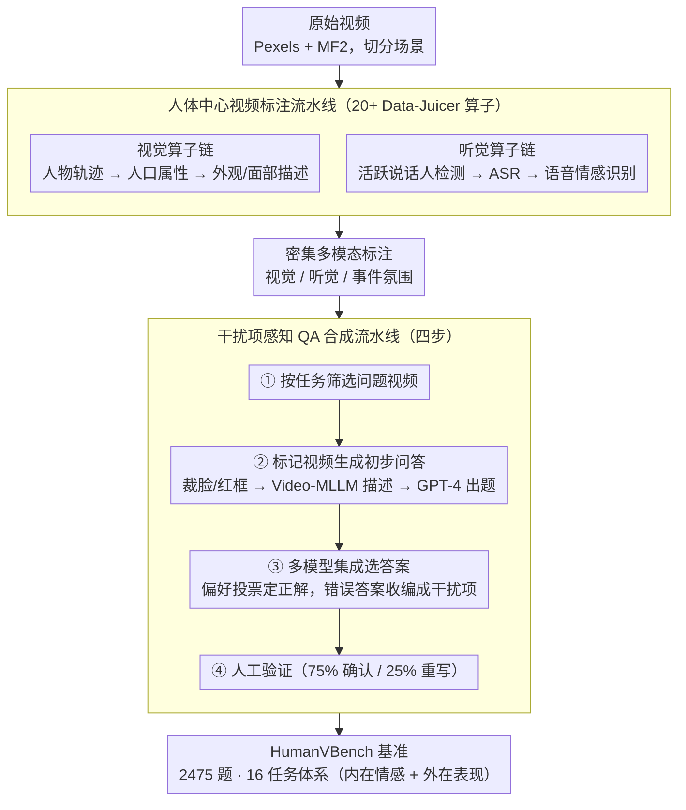

# HumanVBench: Probing Human-Centric Video Understanding in MLLMs with Automatically Synthesized Benchmarks

**会议**: CVPR 2026  
**arXiv**: [2412.17574](https://arxiv.org/abs/2412.17574)  
**代码**: [https://github.com/datajuicer/data-juicer/tree/HumanVBench](https://github.com/datajuicer/data-juicer/tree/HumanVBench)  
**领域**: 多模态VLM / 视频理解  
**关键词**: 视频基准测试, 人体中心视频理解, 多模态大模型, 情感感知, 语音视觉对齐

## 一句话总结

提出 HumanVBench，一个包含 16 个细粒度任务的人体中心视频理解基准，配套两个自动化流水线（视频标注 + 干扰项感知 QA 合成），对 30 个主流视频 MLLM 的评测揭示了当前模型在细微情感感知和语音-视觉对齐方面的关键不足。

## 研究背景与动机

多模态大语言模型（MLLM）已经从处理文本扩展到图像和视频，视频导向的 MLLM 因其模拟人类视觉感知的潜力而受到越来越多关注。然而，这些模型是否真正实现了类人的理解能力——尤其在复杂的人体中心场景中——仍然是开放问题。

现有 MLLM 基准存在三个核心痛点：(1) 主流基准（如 Video-MME）聚焦于通用视频理解，缺乏对人体中心感知能力的结构化、细粒度评估；(2) 情感理解数据集（如 VEATIC）依赖离散情感分类和固定类别，缺少情感动态和跨人物强度比较等多维任务；(3) 语音与视觉线索的同步——人类轻松检测的音视频不匹配——在评估中被频繁忽视。

这些基础感知技能（情感、行为、身份识别、音视对齐）是高级人类相关推理任务（叙事推理、意图推断、社会智能）的前提。但现有基准要么将感知和高阶推理混为一谈，要么依赖大量人工标注，难以扩展。

核心 idea：设计两个自动化流水线——利用 20+ SOTA 数据处理算子生成密集多模态标注的视频标注流水线，以及通过多模型集成和模型常见错误生成语义欺骗性干扰项的 QA 合成流水线——从而以最少人工劳动构建高质量、可扩展的人体中心视频基准。

## 方法详解

### 整体框架

HumanVBench 的构建分三步：(1) 从 Pexels 和 MF2 收集包含人物的视频并切分场景；(2) 通过人体中心视频标注流水线提取视觉、听觉和整体事件氛围的多模态标注；(3) 通过干扰项感知 QA 合成流水线生成多选题，最后进行人工验证和答案泄露后处理。最终产出 2475 个问题实例覆盖 16 个任务。整条链路下，两条流水线各自把"标注"和"出题"自动化，人工只在末端做质量把关；输出的题目按 16 任务体系组织。

### 关键设计

**1. 人体中心视频标注流水线：把人工标注换成 SOTA 模型的算子链**

传统基准要么依赖大量人工标注、无法扩展到野外视频，要么标注粒度粗、抓不到人体中心的细节。这条流水线的做法是把"标注一段人物视频"拆成一串可复用的算子（基于 Data-Juicer 框架），让每个算子各管一类信息，再把结果拼成密集的多模态标注。视觉侧，`video_human_tracks_extraction_mapper` 先靠跨帧重叠阈值把检测到的人脸和身体连成稳定的人物轨迹，解决"同一个人在不同帧要对得上"的问题；`human_demographics_mapper` 从人脸裁剪推断年龄、性别等人口属性；`video_human_description_mapper` 和 `video_facial_description_mapper` 则分别用 MLLM 描述外观/姿态和面部表情变化，关键是先按人物轨迹裁剪再描述，避免背景信息混进来。音频侧串了 `active_speaker_detection_mapper`（融合音视线索定位"此刻谁在说话"）、`asr_mapper`（语音转文字）、`speech_emotion_recognition_mapper`（从语音里读情感）等算子。最终人工只需复核约 25% 的案例，标注成本大幅下降。

**2. 干扰项感知 QA 合成流水线：把模型最爱犯的错变成选项**

多选题好不好用，全看干扰项有没有迷惑性——传统做法按语义相似度随机凑几个选项，模型很容易靠排除法蒙对，区分不出真实能力。本文的核心创新是让干扰项直接来自"模型会犯的错"。流水线分四步：先按任务标准筛视频；再用红框标出目标人物做成"标记视频"喂给 Video-MLLM 生成初步描述，从中抽取任务相关属性并平衡分布；接着做多模型集成答案选择——让 Gemini、VideoLLaMA3、ShareGPT4Video 等多个 MLLM 各自给候选答案，用偏好投票选出正确答案，再把这些模型给出的**错误答案直接收编成干扰项**；最后人工验证，标注员在约 75% 的情况下只需确认现成选项，剩下 25% 才需要重写。这样得到的干扰项天然反映模型的典型错误模式，能逼出模型真正的薄弱环节，而不是给它送分。

**3. 16 个细粒度任务体系：把"人体中心感知"切成可定位的能力维度**

现有基准常把基础感知和高阶推理混在一起评，结果模型分低了也说不清是哪层出了问题。本文只盯基础感知层，按内容的可观察性把它拆成两大类、16 个任务。**内在情感**（4 个，看不见摸不着、要从表情语音推断）：情感识别 ER、情感时序分析 ETA、态度识别 AT、情感强度比较 EIC。**外在表现**再分三个子类——人物识别（文字到人 T2H、人到文字 H2T、人数统计 HC、出现时间检测 ATD）、行为分析（行为时序分析 BTA、行为因果分析 BCA、指定时间动作 AST、特定动作时间 TSA）、语音-视觉对齐（音视说话人匹配 AVSM、活跃说话人检测 ASD、音视对齐检测 AVAD、语音内容匹配 SCM）。这套分类让评测结果能精确落到某一类感知能力上，也为后续叙事推理、意图推断等高阶任务提供了一个干净的能力基线。

### 损失函数 / 训练策略

HumanVBench 是评估基准不涉及模型训练。答案泄露处理：对无视觉输入的模型测试并移除高频正确的 QA（约 6%），确保测试需要视觉信息。标注可靠性：240 个随机抽样问题上两名独立标注员的 Cohen's Kappa 达到 0.8833。

## 实验关键数据

### 主实验

| 模型 | 模态 | 情感感知 | 人物识别 | 行为分析 | 12任务均值 | 语音视觉 | 16任务均值 |
|--------|------|------|----------|------|------|------|------|
| Random Guess | - | 24.4 | 25.2 | 22.9 | 24.2 | 31.2 | 25.9 |
| Qwen-VL3 (7B) | V | 43.2 | 67.6 | 54.3 | 55.0 | 48.3 | 53.4 |
| VideoLLaMA3 (7B) | V | 39.7 | 68.5 | 55.8 | 54.7 | 45.0 | 52.3 |
| Qwen2.5-Omni (7B) | V+A | 35.5 | 44.5 | 38.3 | 39.4 | 54.6 | 43.2 |
| GPT-4o | V | 33.6 | 50.9 | 62.1 | 48.9 | - | - |
| Gemini-2.5-Pro | V+A | 52.9 | 83.5 | 70.7 | 69.0 | 86.5 | **73.4** |
| **Human** | - | **84.6** | **88.5** | **87.0** | **86.7** | **94.4** | **88.6** |

### 消融实验（标注质量）

| 配置 | 比例 | 说明 |
|------|---------|------|
| 标注员确认现有选项 | 75% | 自动生成的选项已足够 |
| 标注员重写正确答案 | 25% | 需要人工修正 |
| Cohen's Kappa (IAA) | 0.8833 | 标注一致性高 |
| 答案泄露移除比例 | ~6% | 无视觉输入也能答对的题 |

### 关键发现

- **情感感知是最大短板**：即使 Gemini-2.5-Pro（最佳模型，52.9%）也远低于人类水平（84.6%），差距超 30 个百分点
- **GPT-4o 意外表现差**：在情感理解和部分人物识别任务上甚至低于多个开源模型，整体 12 任务均分 48.9% 被 Qwen-VL3 的 55.0% 超越
- **语音-视觉对齐是灾难性差距**：几乎所有开源音视频模型在 AVAD 和 SCM 任务上表现接近随机水平，说明当前模型缺乏精确的唇读能力。唯一例外是 Gemini 系列
- **说话人情感识别更难**：说话状态下情感识别准确率普遍比全数据集低 2-4 个百分点，因为说话时面部表情更复杂
- **开源 vs 商用差距正在缩小**：Qwen3-VL 在视觉任务上已接近商业模型水平

## 亮点与洞察

- **模型错误转化为干扰项**是基准构建方法论上的重要创新——传统做法生成随机干扰项，本文利用多模型集成的错误作为干扰项，使基准天然能区分模型的真实能力差异。巧妙之处在于这些干扰项正是模型最容易犯的错误
- **16 任务体系的设计**对视频理解评估有结构性贡献——从内在情感到外在表现、从单模态到跨模态的系统分类，为后续工作提供了清晰的能力图谱
- **标注流水线的算子化设计**可迁移到其他领域的基准构建——将 SOTA 模型作为自动标注器、人工仅做验证的范式大幅降低了基准构建成本

## 局限与展望

- 视频主要来自 Pexels（版权免费），场景多样性可能不如真实社交媒体或监控视频
- 情感标注依赖面部表情和语音，忽略了上下文线索（如事件背景对情感的影响）
- 仅评估了选择题形式，未考虑开放式回答评估（可能更接近实际应用需求）
- 人物轨迹追踪算子在遮挡严重场景中可能失效，影响下游标注质量

## 相关工作与启发

- **vs Video-MME**: Video-MME 是通用视频基准，HumanVBench 专注人体中心维度，两者互补
- **vs Social-IQ**: Social-IQ 混合了基础感知和高阶推理，HumanVBench 专注基础感知层，为高阶评估提供能力基线
- **vs VEATIC**: VEATIC 仅有离散情感分类，HumanVBench 扩展到时序情感分析、强度比较等多维度任务

## 评分

- 新颖性: ⭐⭐⭐⭐ 16 个细粒度人体中心任务体系和模型错误驱动的干扰项生成都是新贡献
- 实验充分度: ⭐⭐⭐⭐⭐ 30 个模型的全面评测，包含开源/商用/视觉/音视频多维度对比，标注质量验证充分
- 写作质量: ⭐⭐⭐⭐ 框架图清晰，任务分类系统，结果分析深入
- 价值: ⭐⭐⭐⭐⭐ 填补了人体中心视频理解评估的空白，揭示了当前模型的关键不足，对社区有重要指导意义

<!-- RELATED:START -->

## 相关论文

- [\[CVPR 2026\] Think360: Evaluating the Width-centric Reasoning Capability of MLLMs Beyond Depth](think_360_evaluating_the_width-centric_reasoning_capability_of_mllms_beyond_dept.md)
- [\[ACL 2025\] Redundancy Principles for MLLMs Benchmarks](../../ACL2025/multimodal_vlm/redundancy_principles_for_mllms_benchmarks.md)
- [\[CVPR 2026\] See, Hear, and Understand: Benchmarking Audiovisual Human Speech Understanding in Multimodal Large Language Models](see_hear_and_understand_benchmarking_audiovisual_human_speech_understanding_in_mul.md)
- [\[CVPR 2026\] MSJoE: Jointly Evolving MLLM and Sampler for Efficient Long-Form Video Understanding](msjoe_jointly_evolving_mllm_and_sampler_for_efficient_long-form_video_understand.md)
- [\[CVPR 2026\] SPARROW: Learning Spatial Precision and Temporal Referential Consistency in Pixel-Grounded Video MLLMs](sparrow_learning_spatial_precision_and_temporal_referential_consistency_in_pixel.md)

<!-- RELATED:END -->
