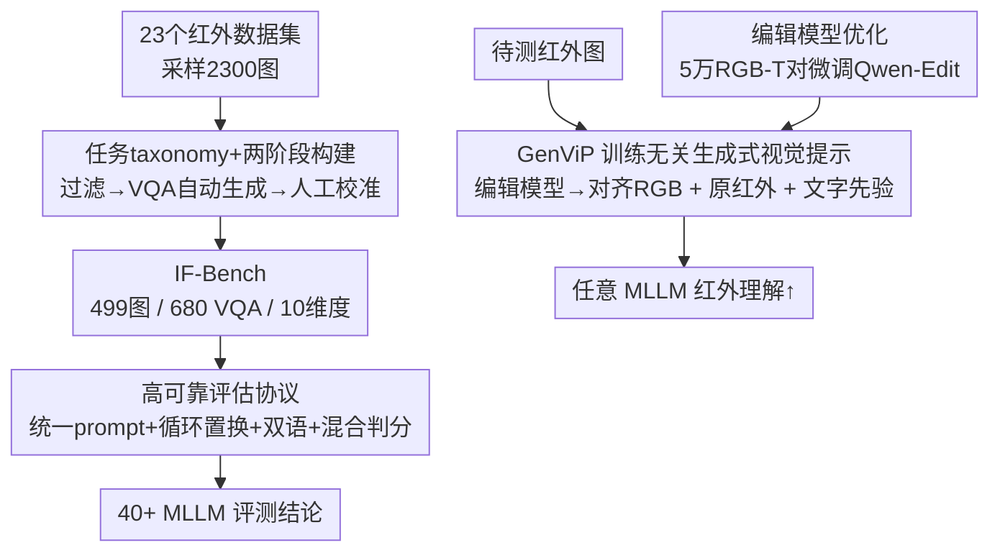

# IF-Bench: Benchmarking and Enhancing MLLMs for Infrared Images with Generative Visual Prompting

**会议**: CVPR 2026  
**论文**: [CVF Open Access](https://openaccess.thecvf.com/content/CVPR2026/html/Zhang_IF-Bench_Benchmarking_and_Enhancing_MLLMs_for_Infrared_Images_with_Generative_CVPR_2026_paper.html)  
**代码**: https://github.com/casiatao/IF-Bench  
**领域**: 多模态VLM  
**关键词**: 红外图像理解, MLLM 评测基准, 生成式视觉提示, 域偏移, 训练无关

## 一句话总结
本文构建了首个系统评测多模态大模型（MLLM）红外图像理解能力的高质量基准 IF-Bench（499 图 / 680 道 VQA / 10 个维度），系统评测 40+ 模型，并提出训练无关的生成式视觉提示 GenViP——用图像编辑模型把红外图翻译成对齐的 RGB 图、与原红外图一起喂给 MLLM 以缓解域偏移，在不微调任何模型的前提下带来最高约 7% 的相对提升。

## 研究背景与动机
**领域现状**：GPT-4o、Gemini-2.5、Qwen3-VL 等 MLLM 在自然图像上不断刷新各类基准，但它们几乎全程在 RGB 自然图上训练，现有评测也集中在自然场景。

**现有痛点**：红外成像在低照度、恶劣天气下具备 RGB 无法替代的可见性，被广泛用于监控与空中侦察，但「MLLM 到底能不能看懂红外图」这个问题几乎没被认真量化过。此前少数尝试（InfraredLLaVA、IRGPT）要么任务覆盖窄、要么缺少人工校准、要么只测了寥寥几个模型，无法反映主流 MLLM 的真实红外理解水平。

**核心矛盾**：红外图与 RGB 图之间存在显著的输入域偏移——MLLM 在 RGB 上训练，喂进红外图时分布失配会直接拖垮理解性能；而靠监督微调来适配又卡在三道坎上：高质量红外图文数据稀缺、逐模型微调成本高、且容易损伤通用能力。

**本文目标**：(1) 造一个覆盖全面、经过人工校准、在大量模型上跑过的红外理解基准；(2) 在不微调任何 MLLM 的前提下提升它们的红外理解能力。

**切入角度**：既然问题根源是「输入分布偏离训练分布」，那就不动模型、只动输入——在推理时把红外图「翻译」回模型熟悉的 RGB 域，同时保留红外特有的热信息。

**核心 idea**：用图像编辑模型把红外图生成语义与空间对齐的 RGB 图，与原红外图组成复合输入喂给任意 MLLM，靠生成式视觉提示而非微调来弥合域偏移。

## 方法详解

### 整体框架
本文有两条主线：左半边是**基准**（怎么把红外理解能力量化出来），右半边是**增强**（怎么在不训练 MLLM 的情况下把这个能力提上去）。基准侧把红外理解拆成三大任务、十个维度，从 23 个红外数据集采图、自动生成 VQA、再经两阶段人工校准得到 499 图 / 680 题；评测侧用统一 prompt + 循环置换 + 中英双语 + 混合判分把每道题跑 8 次以压住随机性。增强侧的 GenViP 在推理时把红外图经编辑模型翻成对齐 RGB，与原红外图＋红外文字先验拼成复合输入喂给 MLLM；为了让开源编辑模型也够用，作者还用 5 万对 RGB-T 图微调 Qwen-Edit 来提升翻译质量。

### 关键设计

**1. 三层任务 taxonomy ＋ 两阶段 VQA 构建：把「红外理解」拆成可量化的题**

此前红外评测的最大问题是任务零散、答案主观。本文先把红外理解显式拆成三大任务——粗粒度感知、细粒度感知、图像推理，再细分成 10 个维度（场景理解、图像主题、拍摄视角、目标定位、空间关系、目标计数、热特征理解、动作识别、热特征推理、常识推理），每个维度都用「单选题＋四选项＋确定答案」的形式以便客观判分。构建走两阶段：先从 InfPre（整合 23 个红外子集）每集采 100 图、过滤掉边长 <200px 的低清图与人工筛掉低质图，得到 1166 张高质量红外图；再对其中 61 张人工标注目标框＋文字描述用于目标定位维度，其余图由 Qwen2.5-VL-72B 每图自动生成至多 4 道题，初始得到 4628 道 VQA。

**2. 由粗到细的人工校准：把自动生成的幻觉题筛干净**

自动生成不可避免会引入逻辑不通、表述歧义、无法从图中作答、答案错配等问题，直接拿来当基准会污染结论。作者用两阶段、由粗到细的人工校准，遵循六条准则：合理性（删病句/矛盾题）、消歧（如明确空间关系题里的观察者视角）、可答性（删无法从图推断的题）、答案核对（改错答）、难度调整（删高度重复或过简题）、数据增强（补高质量题）。细粒度阶段由红外成像领域专家执行、用更严标准。最终落到 499 图 / 680 题，每题提供中英双语，选项顺序随机打乱使正确答案在 A–D 上均匀分布。

**3. 高可靠评估协议：用 8 次评测压住偶然性**

单次跑分对位置偏置和输出格式很敏感，结论不稳。本文叠加四条策略：① 统一 prompt——所有模型同一系统提示、只输出答案字母；② 循环评测——参照 MM-Bench，把四个选项与正确答案循环置换、对所有排列求平均，消除位置偏置；③ 双语评测——同一题中英各跑一遍取平均；②③ 组合后每题被评测 8 次，显著降低随机性。④ 混合判分——先做精确匹配，匹配不上再用 Qwen3-7B 从回复里抽取答案再比对，兼顾准确与效率，避免非标准输出格式拉低评测准确度。

**4. GenViP 训练无关生成式视觉提示 ＋ 复合输入：不动模型只动输入来弥合域偏移**

针对「红外输入偏离 RGB 训练分布」这一根因，GenViP 不微调任何 MLLM，而是在推理时用图像编辑模型把红外图翻译成语义与空间对齐的 RGB 图，使推理时的输入分布逼近训练分布。但纯翻译后的 RGB 图丢掉了热信息，模型答不了热特征类问题，于是作者采用**复合输入策略**：把原红外图与翻译 RGB 图一起喂入 MLLM，既保住热信息又借力模型对 RGB 的强理解；同时在 prompt 里加一段红外图像特性的**文字先验**，进一步提升对热特征的解读。整套方案不需要红外图文配对数据、也不需逐模型微调，可直接套用于任意 MLLM。考虑到开源编辑模型（Qwen-Edit-2509）翻译质量逊于闭源的 Seedream 4.0 / Gemini-2.5-Flash，作者从 37 万+ 候选里经数据源筛查、分辨率过滤、配对质量过滤（亮度＋Canny 边缘 Dice＋Qwen2.5-VL-32B 评估）筛出 5 万对 RGB-T 图，用以微调 Qwen-Edit-2509，使其翻译质量反超上述闭源编辑模型。

### 损失函数 / 训练策略
GenViP 主体训练无关；唯一的训练发生在「编辑模型优化」一步——用 5 万对清洗后的 RGB-T 图微调开源编辑模型 Qwen-Edit-2509，以提升红外→RGB 翻译的对齐质量（具体超参与目标见原文，⚠️ 以原文为准）。

## 实验关键数据

### 主实验
在 IF-Bench 上系统评测 40+ 开源/闭源 MLLM（统一协议、每题 8 次评测）。下表摘取若干代表性模型的平均分（满分 100，越高越好）：

| 模型 | 平均分 Avg | 说明 |
|------|-----------|------|
| InternVL3-1B | 43.0 | 小模型，红外理解明显偏弱 |
| InternVL3.5-1B | 56.6 | 同规模换代提升显著 |
| InternVL3-2B | 65.6 | 规模提升带来稳定增益 |
| Qwen2.5-VL-3B | 66.0 | 细粒度感知（目标定位 TL=76.0）较强 |
| InternVL3.5-4B-Thinking | 71.4 | 思考模式增强推理维度 |
| LLaVA-OneVision-1.5-4B-Instruct | 75.2 | 本组较高水平 |

GenViP 在多种 MLLM 上一致提升红外理解，论文报告在 IF-Bench 上带来最高约 **7% 的相对提升**，并使部分模型超过 Doubao-Seed-Vision-1.6、Gemini-2.5-Pro 等闭源理解模型（各模型逐项增益数值 ⚠️ 以原文为准）。

### 消融 / 分析（四条核心发现）
| 观察维度 | 结论 |
|----------|------|
| 模型规模 | 规模增大持续改善红外理解（如 InternVL3 1B→2B：43.0→65.6） |
| 架构 | MoE 架构在精度与推理效率间取得更好折中 |
| 推理范式（thinking 模式） | 提升热特征理解与推理维度，但**拉低细粒度感知**准确率 |
| 开闭源对比 | 开源模型表现已可与闭源模型相当 |

### 关键发现
- MLLM 普遍仍**难以理解红外图中的精细细节**，根因一半在模型自身表征局限、一半在输入域偏移；GenViP 正是冲着后者去的，且证明「只改输入」就能可观提分。
- 复合输入是关键：纯翻译 RGB 会丢热信息导致热特征题答不上，必须把原红外图一并喂入；文字先验进一步补强热特征解读。
- 编辑模型质量直接决定 GenViP 上限——闭源 Seedream/Gemini 翻译质量更高；经 5 万 RGB-T 对微调后的开源 Qwen-Edit 可反超闭源，兼顾效果与可用性。

## 亮点与洞察
- **「不动模型、只动输入」的训练无关增强**：把适配红外的难题从「微调每个 MLLM」转成「在推理时翻译输入分布」，绕开了红外图文数据稀缺与逐模型微调成本，天然可即插到任意 MLLM——这是最具迁移价值的思路。
- **复合输入保留热信息**：直觉上翻成 RGB 就够了，但作者点破纯翻译会丢掉红外独有的热线索，于是红外＋RGB 双图并喂，是个简单却关键的设计取舍。
- **8 次评测协议**：循环置换×双语把单题评测做成 8 次平均，是把「跑分」做扎实、压住位置偏置与语言偏置的实用范式，可迁移到任何单选题式多模态基准。
- **数据飞轮闭环**：用 5 万 RGB-T 对微调开源编辑模型反超闭源，说明「翻译质量」本身可被针对性优化，把方法从「依赖闭源 API」变成可自托管。

## 局限与展望
- GenViP 的天花板被编辑模型的翻译质量绑定，红外→RGB 翻译若产生语义/空间错位会误导 MLLM；极端热场景或缺乏 RGB 对应物的目标可能翻译失真。
- 复合双图输入会增加视觉 token 与推理开销，论文未充分讨论效率代价（与本会另一些做 token 剪枝的工作正相反方向）。
- 基准规模（499 图 / 680 题）相对自然图基准仍偏小，且全为单选题形式，开放式生成/对话式红外理解未覆盖。
- 改进方向：把翻译质量评估纳入闭环自动迭代、探索更轻量的复合输入（如只在需要 RGB 先验的题上触发翻译）。

## 相关工作与启发
- **vs InfraredLLaVA / IRGPT**：它们靠监督微调做模态适配，受限于红外图文数据稀缺、适配流水线复杂、难跟上 MLLM 快速迭代；本文 GenViP 训练无关、无需图文数据、可直接套任意 MLLM，泛化与便利性更好。
- **vs 通用多模态基准（MM-Bench / MMMU / MVBench / MMSI-Bench）**：这些聚焦自然图的感知/推理/空间能力；IF-Bench 专攻被忽视的红外域，且做了人工校准与 40+ 模型的系统评测，填补了红外理解评测的空白。
- **vs 直接监督微调适配红外**：微调面临数据稀缺、逐模型成本、通用能力退化三重困难；GenViP 把战场从「改模型权重」搬到「改推理输入」，避开了这些坑。

## 评分
- 新颖性: ⭐⭐⭐⭐ 首个系统红外 MLLM 基准＋训练无关生成式视觉提示，思路新但单点技术多为已有组件组合
- 实验充分度: ⭐⭐⭐⭐⭐ 40+ 模型系统评测、四条规律性发现、GenViP 跨模型一致增益、编辑模型优化闭环
- 写作质量: ⭐⭐⭐⭐ 基准与方法两条线清晰，构建与评测协议交代充分
- 价值: ⭐⭐⭐⭐ 填补红外理解评测空白，训练无关增强思路易迁移、实用性强

<!-- RELATED:START -->

## 相关论文

- [\[CVPR 2026\] ViKey: Enhancing Temporal Understanding in Videos via Visual Prompting](vikey_enhancing_temporal_understanding_in_videos_via_visual_prompting.md)
- [\[CVPR 2026\] AV-Reasoner: Improving and Benchmarking Clue-Grounded Audio-Visual Counting for MLLMs](av-reasoner_improving_and_benchmarking_clue-grounded_audio-visual_counting_for_m.md)
- [\[CVPR 2026\] RealBirdID: Benchmarking Bird Species Identification in the Era of MLLMs](realbirdid_benchmarking_bird_species_identification_in_the_era_of_mllms.md)
- [\[CVPR 2026\] ENC-Bench: A Benchmark for Evaluating MLLMs in Electronic Navigational Chart Understanding](enc-bench_a_benchmark_for_evaluating_multimodal_large_language_models_in_electro.md)
- [\[AAAI 2026\] VP-Bench: A Comprehensive Benchmark for Visual Prompting in Multimodal Large Language Models](../../AAAI2026/multimodal_vlm/vp-bench_a_comprehensive_benchmark_for_visual_prompting_in_m.md)

<!-- RELATED:END -->
