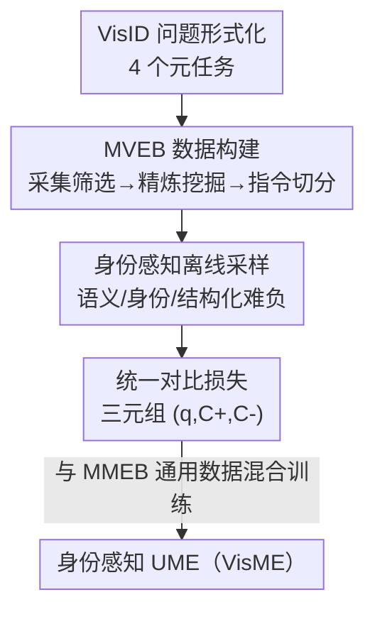

# Illuminating Visual Identity in Universal Multimodal Embeddings

**会议**: CVPR 2026  
**论文**: [CVF Open Access](https://openaccess.thecvf.com/content/CVPR2026/html/Cao_Illuminating_Visual_Identity_in_Universal_Multimodal_Embeddings_CVPR_2026_paper.html)  
**代码**: 论文称将开源 data / models / code（未给出 URL）  
**领域**: 多模态VLM  
**关键词**: 通用多模态嵌入, 视觉身份判别, 对比学习, 身份感知采样, 基准构建

## 一句话总结
针对通用多模态嵌入（UME）一直忽视的"视觉身份判别"能力，本文把它形式化成 4 个元任务、造了一个 522K 样本的 MVEB 基准，再用一套"身份感知采样 + 统一对比损失"的简单框架联合训练，让 7B 模型在身份基准上拿到 78.8 的均分（大幅超越所有现有 UME），同时保持通用检索性能不掉。

## 研究背景与动机
**领域现状**：从 CLIP 的双编码器到近年基于 MLLM 的通用多模态嵌入（UME，如 VLM2Vec、GME、UniME），整个方向都在把图像、文本、视频编码进一个共享空间，靠指令感知的对比微调来支持融合模态检索和复杂指令理解。

**现有痛点**：现有 UME 几乎只关注"语义级对齐"——能判断两张图是不是"同类东西"，却判断不了它们是不是"同一个身份"（visual identity）。比如"找这个人的其他照片""检索同品牌的车"，现有 SOTA 经常区分不出目标身份。根因是这种能力从未被显式纳入训练目标：最常用的 MMEB 基准 36 个子集里只有 1 个 image-to-image 子集（NIGHTS）。

**核心矛盾**：视觉身份判别（VisID）本质是 image-to-image 的细粒度区分（query 和 candidate 都是 `(图, 文)` 对，且都带图），而 UME 训练数据绝大多数是 text↔image 的跨模态语义对齐——训练分布里根本缺少"同身份/不同身份"这种监督信号，模型学不到细粒度身份边界。

**本文目标**：(1) 把 VisID 这个能力定义清楚、可评测；(2) 造出覆盖全谱系的训练+评测数据；(3) 设计一套能塞进现有 UME 流水线、不破坏通用性能的训练方法。

**切入角度**：作者观察到实例检索、行人重识别、人脸识别、ID 保持的 AIGC 这些传统任务其实共享同一种底层能力，于是把它们统一抽象为 VisID，并拆成 4 个元任务来系统建模。

**核心 idea**：用"身份感知的离线采样 + 一个统一对比损失"，把身份判别学习和标准语义对齐学习塞进同一个目标里联合优化，从而给 UME 补上身份判别能力而不牺牲通用检索。

## 方法详解

### 整体框架
整篇方法可以概括为"先定义并造数据、再用一套采样+损失把身份能力学进去"。作者先把 VisID 形式化为：query $q=(i_q, t_q)$（图作身份参照、文指定要找的目标内容），candidate $c=(i_c, t_c)$，并按 query–candidate 关系分成 4 个元任务（身份识别 / 重识别 / 身份接地 / 身份编辑）。然后构建 MVEB 基准（28 子数据集、522K 样本），最后用身份感知采样构造三元组 $(q, C^+, C^-)$ 喂给统一对比损失，与 MMEB 的通用数据混合训练，得到一个既懂语义又懂身份的 UME。

### 关键设计

**1. VisID 形式化与 4 个元任务：把"身份判别"从散落的传统任务统一成一个 UME 能力**

现有工作要么把实例检索、行人重识别、人脸识别当成各自独立的单模态任务，要么（如 IDMR）只覆盖其中一个子任务，缺一个统一形式化。作者在 UME 框架 $f_\theta(x)=y$ 下重新定义 VisID：以图像作身份参照、文本指定检索目标，query 和 candidate 都写成 $(i,t)$ 对，从而天然容纳"带指令的 image-to-image 匹配"。再按 query–candidate 特征拆成 4 个元任务——**身份识别**（判断两图是否同一身份/细粒度类别）、**重识别**（跨观测匹配同一个体）、**身份接地**（用已知身份的参照图作 query 去场景里定位）、**身份编辑**（对源图做文本提示编辑后身份仍保持、其他属性改变）。这个形式化的价值在于：它让"身份能力"第一次有了可统一训练、可统一评测的接口，后面的数据和损失都围绕它展开。

**2. MVEB 数据构建：三步流水线，专治"身份监督信号稀缺 + 长尾 + 难负样本少"**

VisID 学不好的直接原因是数据缺位，作者用三步流水线造了 MVEB（4 元任务、28 子集、20 训 8 测、共 522K 样本）。**Step 1 采集与筛选**：聚合公开数据，做关联性人工核验 + 数据集级质量评估，整集不达标就整集剔除。**Step 2 精炼与挖掘**：对已有身份数据做身份感知重采样压长尾（如 4.1M 的 GLDv2 只取 7.5K 身份、每身份≤4 图，得到约 30K 样本）；对 AIGC 编辑数据（如 GPTImageEdit）难负稀缺的问题，用辅助嵌入模型做去噪 + 难负挖掘——先找"共享同一编辑指令但源身份不同"的候选负对，再选生成图在嵌入空间最接近的对，这些样本"语义上吻合指令、身份上却不一致"，逼模型学更细粒度的表征。**Step 3 指令化与切分**：给每个样本配任务专属自然语言指令，并尽量强制"身份感知切分"——训练里出现过的身份不出现在任何评测集，避免身份泄漏导致虚高。

**3. 身份感知离线采样：堵住"同身份样本被当成负样本"的假负漏洞**

身份数据和普通跨模态数据不同：每个 query $q$ 属于一个身份组 $G^X_q=\{x\in X \mid \text{ID}(x)=\text{ID}(q)\}$。朴素的 in-batch 采样会把同组的其它成员塞进同一 batch，被对比损失当作负样本，形成"假负对"，违背对比学习假设。作者改成**离线采样**：训练前预先生成整个训练计划的所有 mini-batch，保证 (i) 每个身份在任一 batch 里至多出现一次、(ii) 每个身份被采概率正比于它的实例数；训练时顺序读取，对任一锚 $q$ 再从 $G^X_q$ 随机取一个正样本 $c^+$ 构成三元组。同时叠加**结构化难负挖掘**：对带预定义难例关系的子集，采到锚 $q$ 时把它的 $k$ 个指定难负一起拉进同一 batch，逼模型学超出随机采样的细粒度边界。消融显示仅加身份感知采样就让 MVEB 的 IND/OOD 分别涨 11.9 / 12.8 点。

**4. 统一对比损失：一个 loss 同时管语义对齐和身份判别，任务差异只由三元组构造体现**

为了把身份学习无缝塞进现有 UME 流水线，作者只用一个对比损失。相似度定义为带可学习温度 $\tau$ 的缩放余弦 $\text{Sim}(x_i,x_j)=f_\theta(x_i)^\top f_\theta(x_j)/\tau$，单 query 损失为

$$L_i=-\log\frac{e^{\text{Sim}(q_i,c_i^+)}}{e^{\text{Sim}(q_i,c_i^+)}+\sum_{c_j^-\in C_i^-}e^{\text{Sim}(q_i,c_j^-)}},\qquad L=\frac{1}{|B|}\sum_{i\in B}L_i.$$

关键在于这个损失是"任务无关"的：语义任务里 $c^+$ 是与 query 对齐的 caption，身份任务里 $c^+$ 是同实体的另一视角/编辑变体，任务特异性完全来自前面采样构造出的三元组（结构化难负保证细粒度判别、跨源负样本提供广义语义多样性）。这样语义对齐和身份判别就在同一目标下联合优化，不需要为身份能力单设损失或单设训练阶段。

## 实验关键数据

### 主实验
训练语料为 MMEB（20 个 IND 通用子集，662K 对）+ MVEB（20 个 IND 身份子集，439K 对），共 40 数据集 1.1M 对；评测用 Precision@1（P@1）。模型基于 Qwen2-VL / Qwen2.5-VL，用 LoRA(rank=16, alpha=32) + GradCache，8×A800，3000 步，温度初始化 0.02，难负 $k=5$。

| 模型 | MMEB 均分 | MVEB 均分 |
|------|-----------|-----------|
| CLIP (ViT-L/14) | 37.8 | 48.2 |
| SigLIP2 (so400m) | 39.4 | 57.1 |
| GME (Qwen2-VL-7B) | 56.0 | 55.3 |
| LLaVE (LLaVA-OV-7B) | 70.3 | 54.5 |
| B3 (Qwen2-VL-7B) | **72.0** | 52.7 |
| **VisME (Qwen2-VL-7B)** | 72.1 | 74.0 |
| **VisME (Qwen2.5-VL-7B)** | **72.2** | **78.8** |

2B 规模下 VisME 的 MVEB 均分也达到 69.1，已显著超过所有 baseline；7B 把领先扩大到 78.8。关键观察：所有现有 UME（GME-7B 是其中最好的，MVEB 55.3）在身份基准上都明显落后，印证"身份判别是被忽视的关键能力"。有意思的是双编码器 SigLIP2 在身份识别子任务上表现意外地强，说明双编码器架构对 VisID 也有潜力。

### 消融实验
| 配置 | MMEB IND/OOD | MVEB IND/OOD | 说明 |
|------|--------------|--------------|------|
| 无身份感知采样 + 无难负 | 74.2 / 59.4 | 64.3 / 61.2 | 朴素交错采样基线 |
| + 身份感知采样 | 74.2 / 59.8 | 76.2 / 74.0 | MVEB IND/OOD 大涨 11.9 / 12.8 |
| + 难负挖掘（完整） | 75.1 / 60.3 | 77.7 / 74.1 | 两个基准 IND/OOD 进一步同涨 |

| 训练数据 | MMEB IND/OOD | MVEB IND/OOD |
|----------|--------------|--------------|
| 仅 MMEB | 71.4 / 59.0 | 51.7 / 51.2 |
| 仅 MVEB | 41.9 / 43.5 | 72.4 / 64.8 |
| MMEB+MVEB | 72.3 / 59.2 | 76.8 / 72.6 |

### 关键发现
- **身份感知采样是首要贡献来源**：单独加入就让 MVEB 的 IND/OOD 各涨约 12 点，说明"消除假负"比加难负更关键，验证了核心动机。
- **混合训练互补、且更利于 MVEB**：单独训某个基准只提升对应能力、无法迁移；混合训练两边都涨，且 MVEB 的增益超过 MMEB——说明通用语义数据反过来也帮助身份判别。
- **交错 batch size 64 是甜点**：32→64 一致提升，64→128 仅边际改善甚至 MVEB OOD 略降，过大会因 batch 内同质化带来负效应。温度初始化 0.02 最优（与全程固定 0.02 几乎无差）。

## 亮点与洞察
- **"忽视的能力"叙事 + 配套基准**：先点出 UME 普遍缺身份判别，再用一个 522K 的 MVEB 把问题坐实，问题定义和数据贡献相互支撑，比单纯刷点更有说服力。
- **离线预生成 batch 的工程巧思**：用"训练前预排所有 mini-batch、每身份每 batch 至多一次"这种简单办法，从根上消除假负对，避免在线采样里难以控制的身份冲突——这套思路可迁移到任何"同实例多样本"的对比训练（人脸、商品、地标检索）。
- **一个损失统一两类任务**：任务差异全部外移到三元组构造，损失本身保持极简，意味着能直接挂到现有 UME 流水线上而几乎不改训练代码。

## 局限与展望
- 论文主打"simple yet effective"，没有探索更强的损失形式或多阶段课程，身份能力上限可能还没摸到。
- 4 个元任务里"身份编辑"严重依赖 AIGC 编辑数据（如 GPTImageEdit）的质量与去噪挖掘，合成数据的偏差可能影响该子任务的泛化，论文未深入分析。
- 评测主指标只用 P@1，对身份判别这种细粒度任务，召回/排序质量（如 mAP）可能更能反映真实差距——这一点论文未覆盖。
- 双编码器 SigLIP2 在身份识别上意外强，作者只是观察到现象、未深究，留了一个值得追的口子。

## 相关工作与启发
- **vs MMEB / VLM2Vec**：VLM2Vec 建立了系统的 UME 评测，但 36 子集只有 1 个 image-to-image，本质仍是语义对齐；本文显式补上身份判别这一维度，并造了对应基准。
- **vs GME / UNITE / VLM2Vec-v2**：这些工作扩展到文档、视频等更多模态/任务，但仍停留在语义级；本文不扩模态而扩"能力维度"，专攻细粒度身份。
- **vs IDMR**：IDMR 也用 MLLM 做 grounded instance retrieval，但只覆盖单个子任务；本文把身份判别系统化为 4 元任务并统一训练。

## 评分
- 新颖性: ⭐⭐⭐⭐ 把散落的传统任务统一成 VisID 能力并配套基准，问题定义有价值，但训练方法本身（采样+对比损失）较常规。
- 实验充分度: ⭐⭐⭐⭐ 覆盖 2B/7B、多基准、多消融，论证扎实；主指标单一（仅 P@1）略可惜。
- 写作质量: ⭐⭐⭐⭐ 动机—形式化—数据—方法链条清晰，图表充分。
- 价值: ⭐⭐⭐⭐ 基准 + 方法都将开源，对实例检索/ReID/ID-保持 AIGC 的表征学习有直接借鉴意义。

<!-- RELATED:START -->

## 相关论文

- [\[CVPR 2026\] ORION: ORthonormal Text Encoding for Universal VLM Adaptation](orion_orthonormal_text_encoding_for_universal_vlm_adaptation.md)
- [\[ICML 2025\] Universal Retrieval for Multimodal Trajectory Modeling](../../ICML2025/multimodal_vlm/universal_retrieval_for_multimodal_trajectory_modeling.md)
- [\[ICLR 2026\] U-MARVEL: Unveiling Key Factors for Universal Multimodal Retrieval via Embedding Learning](../../ICLR2026/multimodal_vlm/u-marvel_unveiling_key_factors_for_universal_multimodal_retrieval_via_embedding_.md)
- [\[ICCV 2025\] BASIC: Boosting Visual Alignment with Intrinsic Refined Embeddings in Multimodal Large Language Models](../../ICCV2025/multimodal_vlm/basic_boosting_visual_alignment_with_intrinsic_refined_embeddings_in_multimodal_.md)
- [\[ACL 2025\] MegaPairs: Massive Data Synthesis For Universal Multimodal Retrieval](../../ACL2025/multimodal_vlm/megapairs_massive_data_synthesis_for_universal_multimodal_retrieval.md)

<!-- RELATED:END -->
