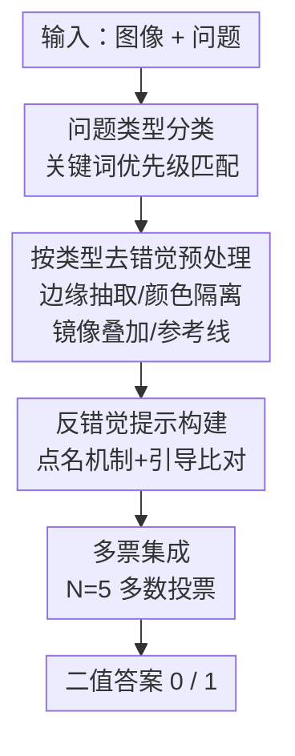

# Illusion-Aware Visual Preprocessing and Anti-Illusion Prompting for Classic Illusion Understanding in Vision-Language Models

**会议**: CVPR 2026 (5th DataCV Challenge Task 1)  
**arXiv**: [2605.08841](https://arxiv.org/abs/2605.08841)  
**代码**: https://github.com/jasminezz/sf-illusion-aware-vlm  
**领域**: 多模态VLM  
**关键词**: 视觉错觉、训练无关、图像预处理、提示工程、多数投票  

## 一句话总结
针对 VLM 面对经典视觉错觉时"凭记忆背答案而非真看图"的毛病，本文提出一套**完全免训练**的流水线——按问题类型对图像做"去错觉"预处理 + 反错觉提示词 + 5 票多数投票，在 DataCV Challenge 630 张官方测试集上拿到 90.48% 准确率（人工核验子集 98.41%），夺得赛道亚军。

## 研究背景与动机
**领域现状**：经典视觉错觉（Müller-Lyer 长度错觉、Ebbinghaus 大小错觉、Café Wall 平行线错觉等）一直是研究人类视知觉的探针。近年发现 VLM 同样会"上当"，但机制和人不一样。

**现有痛点**：Sun 等人的 VI-Probe 框架揭示了一个怪现象——给 VLM 看一张**未经修改**、两个中心圆其实等大的 Ebbinghaus 图，它能答"相等"，但这个"对"不是真的看出来的，而是**认出了这是 Ebbinghaus 错觉、背出了"中心圆其实等大"这条知识**。一旦把图扰动成两圆真的不等大，模型仍然嘴硬答"相等"——记忆压倒了视觉分析。

**核心矛盾**：这就是所谓 "perceive-or-recall（看 vs. 背）困境"：模型在检索记忆关联，而不是真正做视知觉。比赛 Original/Perturbed 两类图各占一半且分开计分，光靠背知识必然在扰动图上翻车。

**本文目标**：在**不微调**的前提下，让 VLM 给出基于真实视觉证据、而非记忆的客观判断。

**切入角度**：与其求模型"看穿"错觉，不如**直接改图**——既然错觉是上下文诱导出来的，那就用针对性变换把诱导上下文物理地削弱/移除，错觉本身不存在了，模型的视觉系统自然就能感知真实几何关系。

**核心 idea**：把"在文本侧劝模型别上当"换成"在图像侧把错觉拆掉"——按七类错觉各设计一套预处理，配上点名错觉机制的反错觉提示，再用多数投票压方差。

## 方法详解

### 整体框架
系统是一条纯推理期、零训练的流水线：输入"图像 + 问题"，先用关键词分类器把问题判成七类经典错觉之一，再路由到**对应类型**的图像预处理器（边缘抽取 / 颜色隔离 / 镜像叠加 / 参考线叠加等）把错觉诱导上下文削弱，接着拼一段**反错觉提示词**把模型注意力从"背知识"引向"比对预处理后引入的视觉特征"，最后对同一张图调用 VLM 多次、取多数票输出二值答案。预处理策略本身不是纯手工拍脑袋设计，而是经过一套"多 VLM 协同 + 人工验证"的半自动流程产出。

### 关键设计

**1. 按类型去错觉的图像预处理：把错觉从图里物理拆掉，而不是劝模型看穿**

这是全文最核心的一招，直击"模型背知识而不看图"的痛点。作者的洞见是：错觉来自上下文诱导，那就改图让诱导上下文失效，七类错觉各配一套专用变换——
- **大小类（Ebbinghaus / Ponzo）**：统一用"镜像叠加"——先把目标隔离出来（橙圆用 RGB 阈值 $R>180,\ G\in[80,200],\ B<80$ 抽取，暗圆用强度 $<100$ 阈值，五边形用连通域分析分离），再把左半镜像后以 $\alpha=0.5$ 与右半混合：若两目标真不等大，叠加处会冒出一圈可见的"边缘环"；等大则叠成干净一片。这把"两个圆谁大"这种被周围参照圆干扰的难判断，变成"有没有边缘环"的易判断。
- **颜色类（Cornsweet / Simultaneous Contrast）**：从图最左右各抽 2% 宽的边缘条，放到中性灰底上并排，再加 $2\times$ 饱和度、$1.5\times$ 对比度增强，把渐变上下文删掉、放大本就细微的色差。
- **直线/对齐/平行类**：用颜色通道把红线隔离出来再叠蓝色虚线参考网格；Poggendorff 对可见红线段做最小二乘拟合、把轨迹**延长线**画过遮挡条让模型比对是否对齐；Café Wall 叠 10 条等距红色竖直参考线检测列边角度偏移。
- **边界类（Kanizsa）**：做 $2\times$ 对比度、$2\times$ 锐化、$1.5\times$ 颜色增强，放大真实边界、让虚幻轮廓保持微弱。

作者强调所有操作都是**定性视觉增强**（增强可见度、加视觉参考线索），阈值化、连通域、最小二乘等计算只用来**渲染标注**，最终二值判断始终由 VLM 给出，以符合比赛"免训练、不许算法直接算答案"的规则。消融显示这套预处理是涨点主力（实验 1→4 把 test_sample 从 77.77% 拉到 87.30%）

**2. 多 VLM 协同的策略发现：让前沿模型当"视觉顾问"自动提候选，人只做精修**

逐类手工设计预处理既慢又依赖个人经验，于是作者搞了个半自动三段式流程。**发散分析**：对每类错觉，把代表图 + 问题喂给 Claude-Opus、Qwen3-VL、Gemini-3.1-Pro 三个前沿模型，用结构化元提示让它们各自"分析错觉机制并提 2–3 个能削弱诱导上下文的图像变换"。**收敛综合**：把三家候选汇总给一个汇总模型（Claude-Opus），让它找跨模型共识、权衡"信息保留 vs. 错觉移除"、给出 top 1–2 策略和具体实现规格——多模型独立收敛的策略更鲁棒，能过滤掉单模型偏好。**人工验证**：在 90 张验证集上实现并评测，逐类看准确率、查失败样本、调参（颜色阈值、增强系数）。最终流水线约 60% 策略直接源自模型提议（如大小比对的镜像叠加就来自 Claude-Opus 的"把两个目标叠起来让大小差自显"建议），40% 是人工精修或组合

**3. 反错觉提示 + 问题转化：点名机制并把难判断改写成模型擅长的简单视觉判断**

光改图不够，还要在提示里把模型注意力从记忆拽回视觉。每类配一段简洁模板，做三件事：**点名错觉机制**激活模型的"警觉"、**指向预处理引入的具体视觉特征**、**约束输出为二值**。关键原则是"问题转化"——不直接问"这两条线一样长吗"（这会触发知识检索），而是改成模型能可靠完成的更简单视觉判断。例如 Müller-Lyer 提示会写"向外的箭头让下面那条线显得更长，忽略箭头只比线段本身，只有差异极其明显才答 NOT EQUAL"；Ebbinghaus 提示让模型"看叠加图有没有边缘环，干净=同大、有环=不同"；Poggendorff 提示让它比"延长虚线"和遮挡条上方黑线是否重合。消融里这一步（叠加多数投票）带来单步最大涨幅（test_sample +11.51pp、test_official +17.38pp），且效果是**乘性的**——提示词单独用只有小涨，但建立在好的视觉变换之上才解锁大幅提升

**4. 多票集成：用多数投票压住 VLM 输出的随机抖动**

VLM 在 $T>0$ 时输出有随机性，单次调用可能恰好抽到错答案。作者对每张图查询 $N$ 次取多数票：

$$\hat{a}=\arg\max_{a\in\{0,1\}}\sum_{k=1}^{N}\mathbf{1}[\hat{a}^{(k)}=a]$$

其中 $\hat{a}^{(k)}$ 是第 $k$ 次 API 调用的预测。$N$ 的选择是精度与成本的权衡：test_sample 上 $N{=}3$ 比单次涨 +2.1pp、$N{=}5$ 涨 +3.4pp，但 $N{=}7$（+3.6pp）、$N{=}9$（+3.7pp）几乎不再涨却要 $1.8\times$ 成本，故最终取 $N=5$

## 实验关键数据

### 主实验
用 Claude (claude-opus-4-6) + 5 票多数投票 + 完整预处理流水线，在两个测试子集上的结果（错觉七类共 630 张，含 Original / Perturbed 两类各计分）：

| 测试集 | Overall ACC | Perturbed ACC | Original ACC |
|--------|-------------|---------------|--------------|
| test_sample（人工核验 63 张） | 98.41% | – | – |
| test_official（官方 630 张） | 90.48% | 82.38% | 98.57% |

官方测试集上 Original 图准确率（98.57%）远高于 Perturbed 图（82.38%）——扰动图本就被设计得更难，要检测出"被故意改过的细微差异"。最终方案夺得赛道**亚军**，仅落后冠军 0.47%。

### 消融实验
五档配置逐步加组件（test_sample / test_official）：

| 配置 | test_sample | test_official | 说明 |
|------|-------------|---------------|------|
| 1 基线（分类+简单预处理+简单提示） | 77.77% | 56.67% | 起点 |
| 2 + 按类型去噪（灰底高亮） | 81.0% | – | +3.23pp |
| 3 + 目标区域高亮 | 84.12% | – | +3.12pp |
| 4 + 参考线 + 区域高亮 | 87.30% | 73.10% | +3.18pp |
| 5 + 反错觉提示 + 模型投票 | 98.41% | 90.48% | 单步最大跳变 |

与基线方法对比（test_sample 63 张人工核验样本，全部用 Claude）：

| 方法 | ACC (%) | Δ |
|------|---------|---|
| Zero-shot VLM | 62.75 | – |
| Few-shot ICL (4-shot) | 66.67 | +3.92 |
| CoT Prompting | 68.63 | +5.88 |
| CoT + Self-Consistency (N=5) | 72.55 | +9.80 |
| VCD (prompt 近似) | 70.59 | +7.84 |
| Generic Visual Enhancement | 74.51 | +11.76 |
| Ours（完整流水线） | 98.41 | +35.66 |

### 关键发现
- **图像预处理是涨点主力**：实验 1→4（纯预处理逐步精修）就把 test_sample 从 77.77% 推到 87.30%，三次精修各贡献约 +3pp。
- **提示 + 投票的效果是乘性而非加性**：实验 4→5 单步在 test_official 涨 +17.38pp，但作者明确指出提示词单独用只有小涨，必须建立在强预处理之上才"解锁"大幅提升。
- **改图比改提示词更有效**：Generic Visual Enhancement（74.51%）压过所有纯文本方法（CoT 自一致仅 72.55%），证明图像级干预强于文本级引导；而本文按类型定制又比通用增强再高 23.9pp，说明"类型专属变换"才是把感知与记忆解耦的关键。
- **Perturbed 更难有内在原因**：检测错觉"存在"靠正向测量，确认"不存在"要证伪；且为原始错觉优化的变换可能**过度矫正**已被扰动的图。

## 亮点与洞察
- **"改输入而非改解码/提示"是很可迁移的范式**：当模型先验知识与视觉证据冲突时，直接在图像表示上动手（物理拆掉诱导上下文）比在文本侧劝说更治本——这条思路可推广到任何"记忆压过证据"的多模态任务。
- **镜像叠加把比大小变成看边缘环**：用 $\alpha=0.5$ 叠加左右目标，把"两圆谁大"这种受参照干扰的判断，转成"有没有出现一圈边缘环"的鲁棒判断，是非常聪明的"问题转化"具象案例。
- **让前沿 VLM 当策略顾问**：用多模型发散提案 + 汇总模型找共识的半自动流程产出预处理策略（60% 直接来自模型建议），是"用 LLM 设计 LLM 解法"的实用工程范式。
- **乘性增益的诚实呈现**：作者没把每个组件的涨幅简单相加邀功，而是点明提示词只有叠在好预处理上才有效，对组件协同关系的刻画很到位。

## 局限与展望
- **泛化受限**：半自动预处理仍含大量逐类手工设计，难扩展到没见过的新错觉类型；作者建议用 meta-learning 或自动变换发现来减少人工。
- **参数对模型敏感**：最优 RGB 阈值、核大小、提示措辞可能随 VLM 架构变化，缺乏模型无关的原则性方案。
- **计算开销**：5 票集成使推理成本 $5\times$，可用基于置信度的自适应投票降本；且方法只针对定义良好的几何错觉，扩展到自然场景级错觉需更灵活的手段。
- （自己看）**强竞赛特化**：分类器是关键词匹配，靠的是比赛标准化问题模板才"完美准确"，换成开放问法（"straight edges"含 "edge" 易误判为边界类）就需要更稳的分类；且整套阈值/参数是在 90 张验证集上人工调出来的，离"通用错觉鲁棒性方法"还有距离。

## 相关工作与启发
- **vs VI-Probe (Sun et al.)**：VI-Probe 是**诊断**工具，用梯度扰动 + Polarity-Flip Consistency / Template Fixation Index 等指标揭示"看 vs. 背"困境；本文是针对这一困境的**解法**，且是免训练的工程方案。
- **vs Visual Contrastive Decoding (VCD)**：VCD 在解码期比对"完整 vs. 损坏视觉输入"的响应分布来下调统计捷径输出；本文走互补路线——不改解码过程，而是在标准推理前**改输入**把错觉上下文物理移除（实验里 VCD 近似只到 70.59%，本文 98.41%）。
- **vs Rostamkhani et al. (Illusory VQA)**：他们已展示简单图像级预处理（如低通滤波）能提升多模态错觉鲁棒性；本文把这一思路推进到**按错觉类型定制**的精细变换，并配反错觉提示与集成，验证了"类型专属 > 通用增强"。
- **vs Few-shot / CoT 提示**：实验证明标准少样本会让 VLM 抓表层模式而非泛化视觉推理原则，CoT 自一致也只到 72.55%，纯文本范式在错觉任务上天花板明显，这正是作者转向图像级干预的动机。

## 评分
- 新颖性: ⭐⭐⭐⭐ "改图拆错觉而非改提示/解码"的视角清晰且有效，多 VLM 协同发现策略也有新意，但整体是竞赛工程组合拳而非全新理论。
- 实验充分度: ⭐⭐⭐⭐ 主结果 + 五档消融 + 六种基线对比齐全，组件归因诚实；但全量测试集受比赛提交次数限制，部分对比只在 63 张子集上做。
- 写作质量: ⭐⭐⭐⭐ 动机与机制讲得透彻，对"乘性增益""Perturbed 更难"等现象的分析到位，可读性好。
- 价值: ⭐⭐⭐⭐ "知识冲突时操作图像表示"的范式有迁移价值，代码开源、方法免训练易复现，对 VLM 错觉鲁棒性研究有实用参考。

<!-- RELATED:START -->

## 相关论文

- [\[CVPR 2026\] Breaking the Illusion: When Positive Meets Negative in Multimodal Decoding](breaking_the_illusion_when_positive_meets_negative_in_multimodal_decoding.md)
- [\[ICLR 2026\] ICYM2I: The Illusion of Multimodal Informativeness under Missingness](../../ICLR2026/multimodal_vlm/icym2i_the_illusion_of_multimodal_informativeness_under_missingness.md)
- [\[ICML 2026\] Are VLMs Seeing or Just Saying? Uncovering the Illusion of Visual Re-examination](../../ICML2026/multimodal_vlm/are_vlms_seeing_or_just_saying_uncovering_the_illusion_of_visual_re-examination.md)
- [\[NeurIPS 2025\] The Illusion of Progress? A Critical Look at Test-Time Adaptation for Vision-Language Models](../../NeurIPS2025/multimodal_vlm/the_illusion_of_progress_a_critical_look_at_testtime_adaptat.md)
- [\[CVPR 2026\] Do VLMs Perceive or Recall? Probing Visual Perception vs. Memory with Classic Visual Illusions](do_vlms_perceive_or_recall_probing_visual_perception_vs_memory_with_classic_visu.md)

<!-- RELATED:END -->
