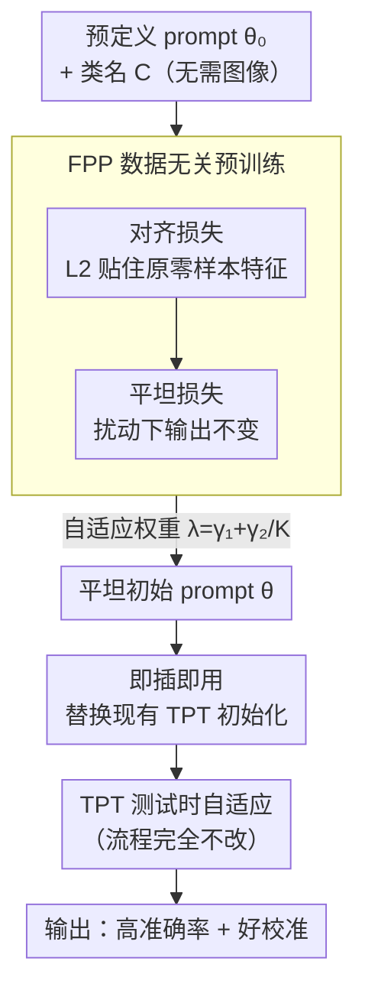

# Improving Calibration in Test-Time Prompt Tuning for Vision-Language Models via Data-Free Flatness-Aware Prompt Pretraining

**会议**: CVPR 2026  
**arXiv**: [2604.27715](https://arxiv.org/abs/2604.27715)  
**代码**: https://github.com/YonseiML/fpp (有)  
**领域**: 多模态VLM / 测试时自适应 / 校准  
**关键词**: CLIP, 测试时 prompt 调优(TPT), 模型校准, 平坦极小值, 数据无关预训练

## 一句话总结
本文发现"给 TPT 加正则项改善校准"的本质是把 prompt 推向损失曲面的平坦极小值，于是提出 FPP——一个数据无关的 prompt 预训练框架，直接把初始 prompt 放进平坦区域，仅替换初始化、不改 TPT 任何流程，就同时刷新了准确率和校准（ECE/SCE）的 SOTA。

## 研究背景与动机

**领域现状**：CLIP 这类视觉语言模型零样本能力强，但对文本模板极其敏感。测试时 prompt 调优（Test-time Prompt Tuning, TPT）用熵最小化（EM loss）在无标注测试样本上逐样本优化 prompt，让模型能应对分布漂移，是当前主流的免标注适配范式。

**现有痛点**：TPT 会把模型校准变差——预测置信度和真实准确率严重脱节（ECE 从 CLIP 的 4.67 飙到 TPT 的 11.67）。在医疗、自动驾驶等需要可靠不确定性的场景里，这种过度自信是致命的。近期的 C-TPT、O-TPT 给 EM loss 额外加一个正则项（鼓励文本特征更分散），校准是改善了，但往往以掉准确率为代价，形成"准确率 vs 校准"的 trade-off；而且这些方法只解释了"加了正则有用"，没说清"为什么有用"。

**核心矛盾**：单步更新的正则化 TPT 既无法充分探索平坦区域（多迭代又会带来额外计算和过度自信风险），又会因几何约束扭曲输出特征而掉点。问题的根源在于：大家是在"预定义 prompt 周围"临时去找平坦极小值，而不是一开始就站在平坦区域。

**本文目标**：（1）解释清楚正则化为何能改校准；（2）找一种既不掉准确率、又不加测试时开销的校准方案。

**切入角度**：作者把正则化 TPT 的单步更新公式展开，发现它等价于"在一个被扰动过的点上算梯度"——这正是 Sharpness-Aware Minimization（SAM）寻找平坦极小值的核心机制。既然平坦极小值才是校准变好的真正原因，那就不必在适配时绕弯子去逼近它。

**核心 idea**：用"数据无关的平坦感知预训练"直接生成一个落在平坦区域的初始 prompt，替换掉现有 TPT 的初始化，其余流程一字不动。

## 方法详解

### 整体框架
FPP（Flatness-aware Prompt Pretraining）解决的是"怎样让 TPT 在适配前就站在平坦极小值里"。它分两步：**先**用一个数据无关的预训练阶段，从预定义 prompt $\theta_0^{\text{zs}}$（如 "a photo of a"）和类名集合 $C$ 出发，联合优化"对齐损失 + 平坦损失"，得到一个新的平坦初始 prompt $\theta$；**再**把这个 $\theta$ 当作初始化塞进任何现成的 TPT/C-TPT/O-TPT/DynaPrompt 管线，测试时自适应过程完全不改。整个预训练只依赖文本侧（prompt + 类名），不碰任何训练/测试图像，且不在测试时增加计算。

### 关键设计

**1. 把"正则化 TPT"重新解读成隐式 SAM：找到校准变好的真正原因**

这是全文的理论地基。所有正则化 TPT 方法每个样本都把 prompt 重置回同一个 $\theta_0^{\text{zs}}$，所以正则项 $L_{\text{reg}}$ 的梯度 $\nabla_\theta L_{\text{reg}}|_{\theta_0^{\text{zs}}}$ 在所有样本上是同一个常量 $\varepsilon_{\text{reg}}$。把单步更新公式 $\theta_1^{\text{reg}}=\theta_0^{\text{zs}}-\nabla_\theta L_{\text{ent}}-\lambda\nabla_\theta L_{\text{reg}}$ 中两个固定项合并，定义新初始点 $\theta_0^{\text{reg}}:=\theta_0^{\text{zs}}-\varepsilon_{\text{reg}}$，更新就变成 $\theta_1^{\text{reg}}=\theta_0^{\text{reg}}-\nabla_\theta L_{\text{ent}}|_{\theta_0^{\text{reg}}+\varepsilon_{\text{reg}}}$——即从 $\theta_0^{\text{reg}}$ 出发、却在被扰动点 $\theta_0^{\text{reg}}+\varepsilon_{\text{reg}}$ 处取 EM 梯度，这与 SAM 在"高损失邻域点"算梯度的式子结构完全一致。作者进一步用 Theorem 1 证明：在单位超球上、特征维度 $D$ 足够大时，期望 EM 损失与正则损失满足 $\mathcal{H}(T)=\alpha L_{\text{reg}}(T)+\beta+O(D^{-3/2})$，所以"增大正则损失"约等于"增大 EM 损失"——$\varepsilon_{\text{reg}}$ 恰好是个让 EM 升高的扰动，于是整个更新就在做 SAM。这把"加正则改校准"从经验技巧升级成"逼近平坦极小值"，也暴露了它的低效：绕着预定义 prompt 临时找平坦，不如一开始就站进去

**2. 平坦损失 $\mathcal{L}_{\text{flat}}$：用扰动不变性把 prompt 直接钉进平坦区域**

既然平坦才是关键，就直接惩罚输出对小扰动的敏感度。平坦损失定义为
$$\mathcal{L}_{\text{flat}}=\operatorname{dist}_{\cos}\big(f_T(C+\varepsilon_1;\,\theta+\varepsilon_2),\;f_T(C;\,\theta)\big),$$
其中 $\varepsilon_1$、$\varepsilon_2$ 是分别加在类名嵌入和 prompt 上的零均值各向同性高斯扰动（方差 0.02 / 0.005），$\operatorname{dist}_{\cos}$ 是余弦距离。直觉上，要求"prompt 和类名都被轻微扰动后，文本特征几乎不变"，等价于压低输出对 $\theta$ 的敏感度，从而对任意可微损失都降低了 sharpness（附录 B 有形式化证明）。和正则化 TPT 不同，它不靠几何约束去强行分散特征，而是直接在预训练阶段把 prompt 优化到平坦区域，因此不会扭曲输出、也就不掉准确率

**3. 对齐损失 $\mathcal{L}_{\text{align}}$：防止只追平坦把零样本能力优化崩**

只优化 $\mathcal{L}_{\text{flat}}$ 会有致命副作用：它会扭曲 $\theta_0^{\text{zs}}$ 的原始文本特征，让学到的 prompt 零样本准确率直接坍塌（消融里掉到 4.65%），而 EM loss 对初始预测概率极其敏感，初始崩了适配也救不回来。对齐损失用 L2 距离把学到的文本特征拉回原始零样本特征附近：
$$\mathcal{L}_{\text{align}}=\operatorname{dist}_{\text{L2}}\big(f_T(C;\,\theta),\;f_T(C;\,\theta_0^{\text{zs}})\big),$$
保住原 prompt 的语义结构。它和平坦损失是一对互补目标：平坦负责"好校准"，对齐负责"别把零样本能力弄丢"，缺一不可

**4. 自适应平坦权重 + 即插即用：让框架真正零成本可落地**

两个损失用 $\mathcal{L}_{\text{FPP}}=\mathcal{L}_{\text{align}}+\lambda\mathcal{L}_{\text{flat}}$ 组合，权重取 $\lambda=\gamma_1+\frac{\gamma_2}{K}$（$\gamma_1=1.0,\gamma_2=0.15$，$K$ 为类别数）。设计动机很具体：类别越多，让大批文本特征同时贴住原特征越难，于是按 $1/K$ 自动调低平坦项权重，给对齐项让路。更关键的是整套损失只依赖 $\theta_0^{\text{zs}}$ 和类名 $C$、不需要任何图像，所以预训练是数据无关的；产出的平坦 prompt 仅替换现有方法的初始化，TPT 适配流程一行不改、测试时零额外开销——这正是它能无缝套到 TPT/CoOp/MaPLe/DynaPrompt 上的原因

### 损失函数 / 训练策略
预训练阶段用 AdamW + cosine 学习率调度，初始学习率 0.01，迭代 1K 步；backbone 为 CLIP-ViT-B/16。测试时自适应严格沿用 TPT/O-TPT 的设置不做改动。校准用 ECE 和 SCE 两个指标评估。

## 实验关键数据

### 主实验

细粒度分类（10 个数据集平均，CLIP-ViT-B/16，硬模板 "a photo of a"，ECE/SCE 越低越好）：

| 方法 | 会议 | Acc.↑ | ECE↓ | SCE↓ |
|------|------|------|------|------|
| CLIP (零样本) | ICML'21 | 63.41 | 4.67 | 1.06 |
| TPT | NeurIPS'22 | 64.62 | 11.67 | 1.15 |
| C-TPT | ICLR'24 | 64.48 | 5.32 | 1.11 |
| O-TPT | CVPR'25 | 64.12 | 4.46 | 1.15 |
| **FPP (本文)** | CVPR'26 | **65.37** | **4.13** | **0.96** |

FPP 是唯一在准确率和校准上**同时**拿到 SOTA 的方法：准确率甚至超过原始 TPT（65.37 vs 64.62），ECE 比 O-TPT 再降一截，SCE 改善尤其明显（0.96，全场最低）。C-TPT/O-TPT 则明显呈现"校准好了、准确率掉了"的 trade-off。

跨框架/跨初始化泛化（ECE 平均）：

| 设置 | 基线 | +FPP |
|------|------|------|
| CoOp 初始 prompt | CoOp+TPT 18.36 | **5.67** |
| MaPLe 初始 prompt | MaPLe+TPT 6.94 | 4.07（Acc 67.01 最高） |
| DynaPrompt 框架 | 13.62 | **4.56** |
| 自然分布漂移(OOD 平均) | TPT 11.99 | **4.63**（Acc 仅降 0.42%） |

在监督训练的 CoOp/MaPLe 初始 prompt 上提升比硬模板更大，说明 FPP 能更好地利用先验知识；OOD 上 O-TPT 掉准确率超 2%，而 FPP 只降 0.42%。

### 消融实验

各组件贡献（细粒度分类，TPT 框架）：

| 配置 | 零样本 Acc | TPT 后 Acc | ECE↓ | SCE↓ |
|------|-----------|-----------|------|------|
| 无预训练（原始 TPT） | 63.41 | 64.62 | 11.67 | 1.15 |
| 仅 $\mathcal{L}_{\text{flat}}$（无对齐） | 崩塌 | 4.65 | 4.16 | — |
| 仅 $\mathcal{L}_{\text{align}}$ | 63.49 | 64.40 | 7.05 | 1.09 |
| 对齐 + 仅 $\varepsilon_1$ | 63.92 | 64.77 | 5.86 | 1.03 |
| 对齐 + $\varepsilon_1$ + $\varepsilon_2$（完整） | 64.35 | 65.37 | 4.13 | 0.96 |

### 关键发现
- **对齐损失是"地基"**：去掉它只留平坦损失，零样本准确率直接坍塌、适配后 Acc 仅 4.65%，印证了 EM loss 对初始预测概率的高度敏感。
- **平坦损失是"校准引擎"**：仅对齐时 ECE 7.05，加上平坦的两个扰动后降到 4.13，两个扰动 $\varepsilon_1$（类名）、$\varepsilon_2$（prompt）各自都有正贡献，协同最佳。
- **几乎不依赖类名监督**：把类名换成 ImageNet 类名或纯高斯噪声做预训练，FPP 仍超过 Table 1 的所有基线（Acc 仅降 0.40/0.09），说明文本语义空间易于采样、随机文本嵌入也能撑起特征结构。

## 亮点与洞察
- **把经验技巧还原成优化几何**：用一行公式合并就证明"正则化 TPT ≈ 隐式 SAM"，再用 Theorem 1 把正则损失和 EM 损失挂钩，这个"重新解读"是全文最漂亮的地方——它不仅解释了已有方法，还顺手指出了它们的低效之处。
- **"换初始化"这个动作本身就是创新**：不改任何适配逻辑、不加测试时开销、不需要标注和图像，仅替换 prompt 初始化就能打穿 trade-off，工程落地成本几乎为零。这种"在前置阶段把问题解决掉"的思路可迁移到其他 TTA 任务（如 BN 适配、特征对齐）。
- **平坦 ↔ 校准的因果证据**：以往工作多在"有正则的监督设置"里讨论平坦与校准，本文展示了即使没有显式正则，平坦极小值本身就带来更好的校准，补上了一块争议地带的实证。

## 局限与展望
- **理论靠近似假设**：Theorem 1 依赖"图像特征在单位超球上均匀分布"和"$D$ 足够大"的渐近条件（$O(D^{-3/2})$ 余项），现实特征分布未必满足，结论是趋势性而非精确等式。
- **扰动方差等超参敏感**：$\varepsilon_1/\varepsilon_2$ 的方差、$\gamma_1/\gamma_2$、1K 预训练迭代等都需调，论文把敏感性分析放在附录；不同数据集是否需要重调 $\lambda$（OOD 里固定为 1.25）值得关注。
- **仅在 CLIP-ViT-B/16 上验证**：未报告更大 backbone 或非 CLIP 架构的结果，跨架构普适性待验。
- **预训练有一次性成本**：虽然测试时零开销，但每个任务/类名集合仍需跑一遍 1K 步预训练，类名变化频繁的场景下这笔成本会累积。

## 相关工作与启发
- **vs C-TPT / O-TPT**：它们在适配时给 EM loss 加几何正则项（特征分散 / 正交），本文证明这等价于隐式 SAM，但因几何约束扭曲特征而掉准确率；FPP 改在适配前用数据无关预训练把 prompt 直接放进平坦区，避免扭曲，从而同时拿下准确率和校准。
- **vs SAM 系列**：SAM 用"扰动点取梯度"的两步优化在训练时找平坦极小值；FPP 不参与适配优化，而是把"平坦"前置成一个 prompt 初始化目标（扰动不变性），单步即可收敛到平坦极小值。
- **vs DiffTPT / Self-TPT 等提准类 TPT**：它们专注准确率、不考虑校准，常导致过度自信；FPP 正交于这些方法，可作为初始化叠加使用。

## 评分
- 新颖性: ⭐⭐⭐⭐⭐ 把正则化 TPT 重解读成隐式 SAM 并据此提出"换初始化"方案，视角新且自洽。
- 实验充分度: ⭐⭐⭐⭐ 覆盖 4 种 TPT 框架 + OOD + 类名无关消融，但仅单一 backbone。
- 写作质量: ⭐⭐⭐⭐⭐ 从观察→理论→方法→验证逻辑链清晰，图 1/2 直观。
- 价值: ⭐⭐⭐⭐⭐ 零成本即插即用、数据无关，对安全攸关部署的校准问题极实用。

<!-- RELATED:START -->

## 相关论文

- [\[CVPR 2026\] SoC: Semantic Orthogonal Calibration for Test-Time Prompt Tuning](soc_semantic_orthogonal_calibration_for_test-time_prompt_tuning.md)
- [\[CVPR 2026\] Towards Calibrating Prompt Tuning of Vision-Language Models](towards_calibrating_prompt_tuning_of_vision-language_models.md)
- [\[CVPR 2026\] STAR: Test-Time Adaptation Can Enhance Universal Prompt Learning for Vision-Language Models](star_test-time_adaptation_can_enhance_universal_prompt_learning_for_vision-langu.md)
- [\[CVPR 2026\] Dual-Modality Anchor-Guided Filtering for Test-time Prompt Tuning](dual-modality_anchor-guided_filtering_for_test-time_prompt_tuning.md)
- [\[CVPR 2026\] Controllable Federated Prompt Learning at Test Time](controllable_federated_prompt_learning_at_test_time.md)

<!-- RELATED:END -->
