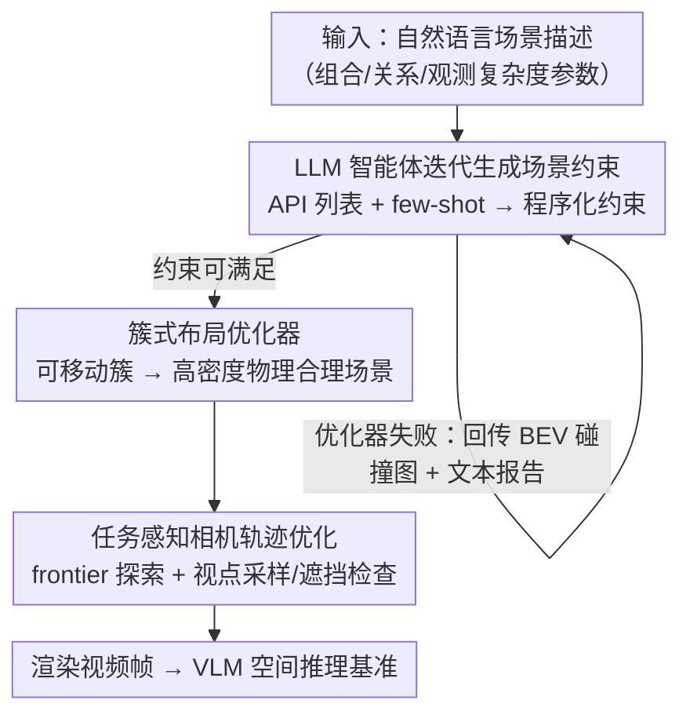

# InfiniBench: Infinite Benchmarking for Visual Spatial Reasoning with Customizable Scene Complexity

**会议**: CVPR 2026  
**论文**: [CVF Open Access](https://openaccess.thecvf.com/content/CVPR2026/html/Wang_InfiniBench_Infinite_Benchmarking_for_Visual_Spatial_Reasoning_with_Customizable_Scene_CVPR_2026_paper.html)  
**代码**: https://github.com/pittisl/infinibench （数据集 https://huggingface.co/datasets/Haoming645/infinibench ）  
**领域**: 多模态VLM / 空间推理评测 / 3D 场景生成  
**关键词**: 空间推理, 可定制基准, 程序化生成, LLM 智能体, 相机轨迹优化

## 一句话总结
InfiniBench 是一个全自动、可参数化定制的 3D 场景基准"生成器"：把自然语言场景描述翻译成物理合理、复杂度可控的逼真视频，从而能针对组合/关系/观测三类复杂度，理论上无限地批量造出 VLM 空间推理评测题，定向暴露模型在不同空间条件下的失败模式。

## 研究背景与动机
**领域现状**：视觉空间推理（理解物体的位置、朝向、相互关系）是 VLM 走向真实世界感知的核心能力，需要在不同复杂度的场景上系统评测。现有评测要么用真实数据集，要么用合成 3D 场景。

**现有痛点**：真实数据集逼真但难以规模化、无法参数化控制；早期渲染引擎（Blender、IsaacSim）程序化生成缺真实感；3D-aware 扩散模型有视觉丰富度但缺语义标注、无法保证物理一致；纯 LLM 直接生成布局，会因 LLM 自身空间逻辑缺陷在物体一多时产出"朝向离谱、出界、互相穿模"的非法布局（论文 Fig.2）；Infinigen / ProcTHOR 这类优化式程序框架又造不出高密度杂乱场景且要专业调参。

**核心矛盾**：现有基准在**可定制性、可扩展性、语义丰富度**三者上无法兼得——尤其无法把"场景复杂度"拆成可独立调节的维度，于是只能给出聚合的平均准确率，**无法隔离并定位 VLM 在某一具体空间条件下到底为什么失败**。

**本文目标**：不再针对每种复杂度单独发布一个基准，而是造一个**生成器**，让用户用自然语言指定复杂度参数，就能产出理论上无限的 3D 场景评测题。复杂度被显式拆为三维：组合复杂度（物体数量与种类）、关系复杂度（空间关系/占用率）、观测复杂度（视角极端程度与遮挡）。

**切入角度**：把"高层规划"与"低层执行"解耦——不让 LLM 直接生成精确布局，而是让它生成高层**约束**，再交给一个专门的优化器去落地成物理合理的 3D 场景，兼得 LLM 的语言表达力和程序化生成的可扩展、可控性。

**核心 idea**：用"LLM 智能体迭代生成场景约束 + 簇式布局优化器 + 任务感知相机轨迹优化"三段流水线，把一句话场景描述变成 VLM 可直接消费的视频基准。

## 方法详解

### 整体框架
InfiniBench 的核心是一条三阶段流水线：输入是一段自然语言场景描述（如"一个 30 m² 的餐厅，含 10 把不同类型的椅子，再加家具使房间占用率达 50%，相机以手持风格运动并尽量覆盖更多物体"），输出是渲染好的视频帧序列（VLM 输入）。第一阶段用 LLM 智能体把描述翻译成机器可读的程序化约束，并通过失败反馈迭代修正；第二阶段用簇式布局优化器把约束落地成物理合理、可高密度的 3D 场景；第三阶段用任务感知的相机轨迹优化，保证所有任务相关物体在视频里都被无遮挡、完整地拍到。

### 关键设计

**1. LLM 智能体迭代生成场景约束：用约束代替直接布局，并用失败反馈闭环纠错**

传统程序化生成要手工脚本化复杂约束，场景一复杂就需要大量专业知识。InfiniBench 让 LLM 智能体把自然语言描述翻译成机器可读约束（如 `set_object_count(monitor, 3)`、`on_top_of(keyboard, desk)`），并为此喂给智能体两类领域知识：完整的程序化 API 语法清单 + few-shot 翻译示例。但单趟生成常常产出逻辑冲突或物理不可能的约束（例如把三个显示器全塞到一张普通尺寸的桌面上）。为此引入**关键反馈回路**：每轮用下游布局优化器尝试把约束落地，若失败则回传一份错误报告——包含展示物体碰撞的鸟瞰图（BEV map）和描述未满足约束的文本摘要——驱动智能体走一遍 CoT 推理：先分析失败原因（如"桌面面积不足，只放下了一个显示器"），再提出解法（增大桌子尺寸），最后改写约束。这把"会不会一次生成对"变成"能不能在几轮内收敛"，实验显示约束通常 5 轮内收敛，且收敛后的约束高度可复用——同一套约束能批量生成大量场景，摊薄了迭代推理的算力成本。

**2. 簇式布局优化：用"可移动簇"替代刚性层级优化，造出此前不可行的高密度场景**

Infinigen / ProcTHOR 用层级优化：先固定大物体（如桌子），再放小物体（如椅子），场景一复杂就会陷入"大物体先占死、小物体没空间"的死局（论文 Fig.6a）。InfiniBench 把布局引擎改成**簇式优化**，核心是"可移动簇"概念：把一组相关物体（如一张桌子和环绕它的椅子）当作单个实体一起优化。流程三步：① 识别簇——解析场景语义图，自动把紧密相关物体聚成簇，每簇含一个"父"大物体和若干"子"小物体；② 扩充动作空间——给优化器加入簇级操作，让整簇一起搬到更好位置而不破坏内部关系；③ 碰撞检测——用每个簇的整体包围盒做碰撞检查。这让优化器能在更大的解空间里整体重定位簇，把以前求不出解的高密度场景变得可行（Fig.6b）。

**3. 任务感知相机轨迹优化：把"前沿探索"重定义到物体簇上，保证任务物体无遮挡全覆盖**

3D 场景生成的输出（Blender 文件或点云）不能被 VLM 直接消费，而糟糕的视点会遮挡关键物体、让空间推理题无法作答（Fig.3）。InfiniBench 的目标是生成**最短**且能清晰、完整、无遮挡地看到每个任务相关物体的相机路径，方法受机器人导航中的 frontier-based exploration 启发，但把"前沿"重定义为"尚未访问的目标物体集合"。流程迭代进行：① 目标选择——从当前相机位置选最近的未访问目标；② 视点采样与选择——在目标周围采样候选视点，按三条标准打分（相机位置是否合法、物体是否完整在视野内、相机与物体之间是否有遮挡），选最高分；③ 路径规划——在 2D 地面平面图上用 Dijkstra 算无碰撞路径连到选定视点；④ 迭代——相机移动、目标标记为已访问，直到所有目标都被访问。最后沿优化轨迹渲染成视频帧。

## 实验关键数据

**自定义指标说明**：
- **Prompt Fidelity（保真度）**：生成场景的物体数量与占用率，相对 prompt 中 GT 值的匹配准确率（↑）。
- **CLIP**：文本 prompt 与生成场景俯视图之间的 CLIP 对齐分（↑）。
- **Realism**：由 GPT-5 评估器打分的布局合理性，含空间一致性与功能合理性（↑）。
- **#OB / #CN**：物理不合理瑕疵数——出界物体数（#OB）与互相碰撞物体对数（#CN），越低越好。

### 主实验
不同物体数量下的场景生成质量对比（取"高物体量"设置，数据来自 Table 1）：

| 方法 | Fidelity↑ | CLIP↑ | Realism↑ | #OB↓ | #CN↓ |
|------|-----------|-------|----------|------|------|
| I-Design | 0.90 | 27.1 | 0.61 | 6.9 | 10.3 |
| Holodeck | 0.88 | 28.8 | 0.71 | 7.7 | 9.4 |
| LayoutGPT | 0.93 | 28.3 | 0.67 | 4.5 | 13.5 |
| Luminous | 0.42 | 26.2 | 0.63 | 0.0 | 0.0 |
| Infinigen | 0.64 | 29.7 | 0.79 | 0.0 | 0.2 |
| **InfiniBench** | **0.98** | **29.9** | **0.81** | 0.1 | **0.0** |

结论：LLM 式方法保真度高但物理合理性差（#OB/#CN 飙升，LayoutGPT 碰撞数高达 13.5）；程序化框架（Luminous/Infinigen）物理合理但复杂度一高保真度崩塌（降到 0.42/0.64）。InfiniBench 同时拿到高保真度与近乎完美的物理合理性，在高复杂度下所有指标领先。

### 消融实验
组件消融（高物体量设置，基线为 Infinigen 原优化器，来自 Table 3）：

| 配置 | Fidelity↑ | CLIP↑ | Realism↑ | 说明 |
|------|-----------|-------|----------|------|
| Base（Infinigen） | 0.64 | 29.7 | 0.79 | 原始层级优化器 |
| 仅约束精修 | 0.71 | 28.9 | 0.79 | 智能体迭代约束，单独用即可显著提升保真度 |
| 仅簇式优化 | 0.68 | 29.9 | 0.81 | 单独用提升较小，但 Realism 略增 |
| **Full InfiniBench** | **0.92** | 29.9 | 0.81 | 两者结合产生协同跃升 |

约束迭代轮数消融（来自 Table 4）：

| 迭代轮数 | Fidelity↑ | 说明 |
|----------|-----------|------|
| 1 | 0.68 | 单趟约束 |
| 2 | 0.72 | — |
| 3 | 0.86 | 明显爬升 |
| 5 | 0.92 | 约 5 轮收敛 |

### 关键发现
- 约束精修与簇式优化**单独用都只是小幅提升**，但合在一起出现"协同跃升"（0.64 → 0.92），说明"先把高层约束精修对、再用簇式优化器落地"是缺一不可的组合拳。
- 约束迭代是有效但有限的过程：3 轮就从 0.68 跳到 0.86，5 轮收敛到 0.92；且收敛后约束可复用来批量造场景，迭代推理成本被摊薄。
- 在低复杂度下各方法差距不大，差距主要在**高复杂度**场景被拉开——这正是现有基准最薄弱、也最值得评测 VLM 的地方。

## 亮点与洞察
- **把"基准"变成"基准生成器"**：与其逐个发布固定基准，不如造一个可参数化的生成器，让评测从"看平均准确率"升级到"隔离单一空间条件、定位具体失败模式"，这是评测范式上的转变。
- **"约束"是 LLM 与程序优化器之间的最佳接口**：让 LLM 出高层约束、优化器做低层落地，既避开了 LLM 直接排布物体的空间逻辑短板，又保留了语言的表达力——这套"规划/执行解耦"思路可迁移到其他需要物理合理性的生成任务。
- **可移动簇**是个朴素但关键的抽象：把"桌子+环绕椅子"当一个整体搬动，直接打破了层级优化的死局，是高密度场景能造出来的根因。
- **把机器人导航的 frontier exploration 借来当相机规划器**，并把"前沿"重定义为未访问目标物体，巧妙地把"覆盖所有任务物体"变成一个可迭代求解的探索问题。

## 局限与展望
- 流水线依赖 Gemini-2.5-Pro 做约束生成、Infinigen 资产库做落地、Blender Cycles 做高保真渲染，整条链路较重，复现成本与生成时延偏高（虽然约束可复用部分缓解）。
- 评测高度依赖资产库的丰富度与真实性，资产库覆盖不到的物体类别/材质难以表达。
- Realism 由 GPT-5 评估器打分、SC/物体计数等也依赖外部大模型，存在评估器自身偏差的风险 ⚠️（以原文为准）。
- 论文主要验证生成质量与少量空间推理任务（测量、视角变换、时空跟踪），尚未大规模系统性地用它去诊断主流 VLM 的失败谱，是后续最有价值的方向。

## 相关工作与启发
- **vs Infinigen / ProcTHOR（程序化优化框架）**：它们靠层级优化、复杂场景易失败且需专业调参；本文用簇式优化 + LLM 智能体包装，既能造高密度场景又无需专业知识，保真度从 0.64 升到 0.92。
- **vs LayoutGPT / Holodeck / I-Design（LLM 直接生成布局）**：它们让 LLM 直出布局，物体一多就出界/穿模（#CN 高达 13.5）；本文让 LLM 只出高层约束、交优化器落地，把物理合理性指标压到近 0。
- **vs 3D-aware 扩散场景生成**：扩散方法视觉丰富但缺语义标注、无法保证物理一致、也难生成 QA 对；本文程序化路线天然带语义元数据，可直接生成空间推理评测题。

## 评分
- 新颖性: ⭐⭐⭐⭐⭐ 把"固定基准"重构成"可参数化复杂度的无限基准生成器"，并用约束解耦 + 簇式优化解决高密度场景这一长期难点。
- 实验充分度: ⭐⭐⭐⭐ 多复杂度维度、多基线、组件与迭代轮数双消融都有；但对主流 VLM 失败模式的系统性诊断展示较少。
- 写作质量: ⭐⭐⭐⭐ 三阶段流水线讲解清晰、图示充分；部分实现细节下放到附录。
- 价值: ⭐⭐⭐⭐⭐ 给 VLM 空间推理研究提供了可控、可扩展、带语义的评测底座，对诊断与改进模型都有长期价值。

<!-- RELATED:START -->

## 相关论文

- [\[ICLR 2026\] Spatial CAPTCHA: Generatively Benchmarking Spatial Reasoning for Human-Machine Differentiation](../../ICLR2026/multimodal_vlm/spatial_captcha_generatively_benchmarking_spatial_reasoning_for_human-machine_di.md)
- [\[ACL 2026\] TableVista: Benchmarking Multimodal Table Reasoning under Visual and Structural Complexity](../../ACL2026/multimodal_vlm/tablevista_benchmarking_multimodal_table_reasoning_under_visual_and_structural_c.md)
- [\[CVPR 2026\] Hear you are: Teaching LLMs Spatial Reasoning with Vision and Spatial Sound](hear_you_are_teaching_llms_spatial_reasoning_with_vision_and_spatial_sound.md)
- [\[CVPR 2026\] Geometrically-Constrained Agent for Spatial Reasoning](geometrically-constrained_agent_for_spatial_reasoning.md)
- [\[CVPR 2026\] SpaceTools: Tool-Augmented Spatial Reasoning via Double Interactive RL](spacetools_tool-augmented_spatial_reasoning_via_double_interactive_rl.md)

<!-- RELATED:END -->
