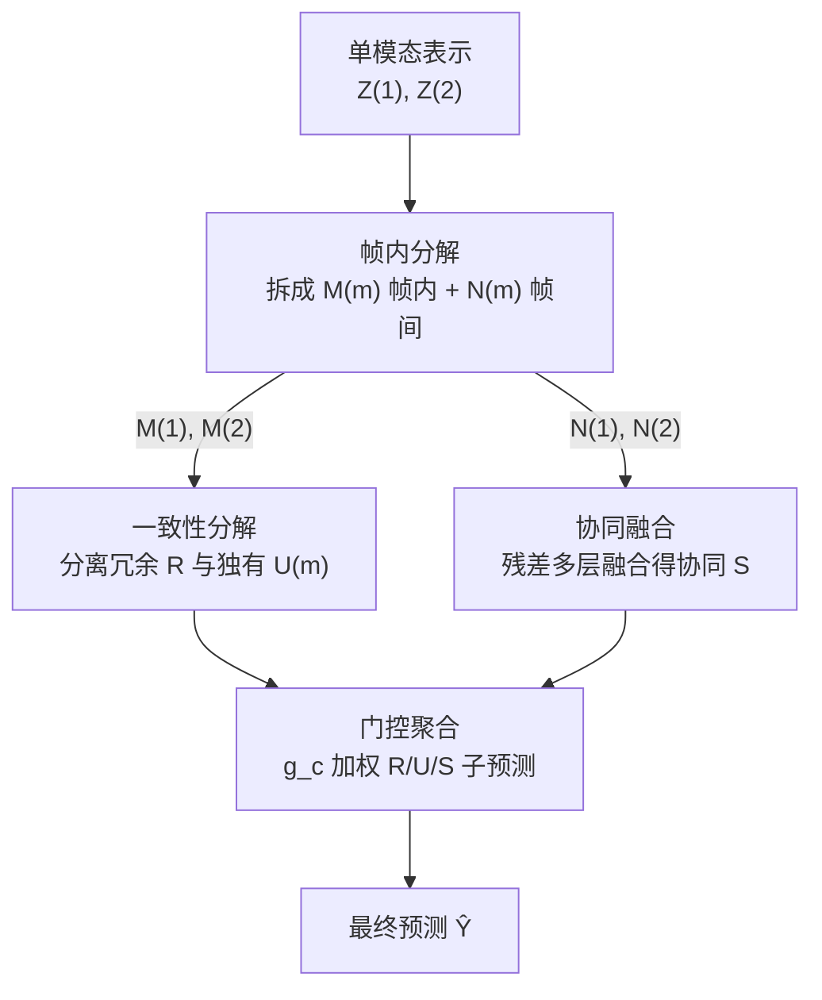

# Information-Theoretic Decomposition for Multimodal Interaction Learning

**会议**: CVPR 2026  
**arXiv**: [2606.11614](https://arxiv.org/abs/2606.11614)  
**代码**: https://github.com/GeWu-Lab/DMIL (有)  
**领域**: 多模态VLM  
**关键词**: 多模态交互, 信息分解, 冗余/独有/协同, 变分推断, 样本级自适应

## 一句话总结
本文从信息论视角指出"多模态交互（冗余 R / 独有 U / 协同 S）是逐样本动态变化的"，证明常规联合学习与模态集成各自只擅长其中一类交互，并提出 DMIL——用变分分解把表示显式拆成 R/U/S 三类成分、再用三阶段微调有针对性地强化它们，从而在不同交互构成的样本上都能拿到最优表现。

## 研究背景与动机

**领域现状**：多模态学习的本质是捕获模态间的三种信息：**冗余（redundant，两个模态都给的重叠信息）**、**独有（unique，某个模态独占的信息）** 和 **协同（synergistic，只有把两个模态联合起来才会涌现的信息）**。Liang 等人（PID 框架）把这三类合称"多模态交互"，并用信息分解方法去量化它们，用于模型选择、训练数据划分等。

**现有痛点**：以往工作几乎都把交互当成**数据集级别的平均量**（一个数据集"平均有多少 R/U/S"），但忽略了一个关键事实——**交互构成是逐样本剧烈变化的**。同一个任务里，有的样本单模态就能答对（U 主导），有的样本必须两模态联合推理才行（S 主导，如 VQA 里"红色物体是否比小物体多"）。把这种样本级异质性抹平成平均量，会掩盖模型真正的短板。

**核心矛盾**：现有范式都在**隐式地**处理交互，受各自归纳偏置限制只偏爱某一类——作者称之为"交互缺陷（interaction deficit）"。具体地：**联合学习**把模态投到共享空间联合预测，会被模态竞争/不平衡支配，在冗余丰富（如 ½U+½R）场景下被最强模态主导、压制其他模态贡献；**模态集成**各自训练单模态再决策层融合，擅长保留单模态信息（冗余）但**结构上无法建模只在联合时涌现的协同**，因此在协同主导场景里性能急剧下降（见图 1）。

**本文目标**：① 从信息论上证明"高质量多模态学习必须覆盖全谱交互"；② 提出一种能**逐样本自适应**地从不同交互类型中学习的范式。

**切入角度**：作者引入随机变量 $C$ 表示"交互构成（interaction composition）"——即某个样本里 R/U/S 的具体组合，并据此推导出学习信息量 $I(Z;Y)$ 的一个下界（Theorem 1）：

$$I(Z; Y) \ge \mathbb{E}_c[I(Z; Y\,|\,c)] - H(C\,|\,Z) + I(Y; C).$$

这个下界揭示两个关键：第一项 $\mathbb{E}_c[I(Z;Y|c)]$ 要求模型在**所有交互构成上平均表现都好**；$H(C|Z)$ 项要求表示 $Z$ 要**显式编码每个样本的交互构成**（由数据处理不等式，$Z$ 必须尽量保留输入里和交互相关的信息）。这就把"显式分解 + 逐样本自适应"从直觉变成了理论必要条件。

**核心 idea**：与其让模型隐式地、偏科地学交互，不如**把多模态表示显式解耦成 R/U/S 三类成分**，再对每类成分做有针对性的强化学习，让模型按每个样本的真实交互构成动态调整信息处理策略。

## 方法详解

### 整体框架
DMIL 要把单模态编码后的表示 $Z=(Z^{(1)},Z^{(2)})$ 显式拆解为冗余 $R$、独有 $U^{(1)}/U^{(2)}$、协同 $S$ 四类成分，再把它们各自投到输出空间、用门控网络按样本动态加权聚合成最终预测。整条管线由**两级分解 + 三阶段训练**串起来（图 3、图 4）：

- **第一级——帧内分解（Intra-modality Decomposition, ID）**：对每个模态，把 $Z^{(m)}$ 拆成"能独立预测目标"的**帧内成分 $M^{(m)}$** 和"自己不足以预测、但能作为跨模态协同基础"的**帧间成分 $N^{(m)}$**。
- **第二级——一致性分解（Consistency Decomposition, CD）**：在两个 $M^{(m)}$ 上进一步分离出**跨模态共享的冗余 $R$** 和**各模态特有的独有 $U^{(m)}$**。
- **协同构造**：把两个帧间残差 $N^{(1)},N^{(2)}$ 通过多层融合机制组合出**协同成分 $S$**。
- **门控聚合**：每个成分 $c\in\{R,U^{(1)},U^{(2)},S\}$ 经线性映射得到子预测 $\hat y_c$，门控网络预测权重 $g_c$，加权求和得最终输出。

判定哪类成分的逻辑可以读成一棵决策树（图 4）：信息能否被单模态获取？→ 不能则归入协同 $S$；能则继续问是否跨模态一致？→ 一致则归入冗余 $R$，否则归入独有 $U$。

### 关键设计

**1. 交互构成理论与下界：把"逐样本自适应"证成必要条件**

针对"以往只看数据集级平均、掩盖样本级异质"的痛点，作者引入交互构成变量 $C$ 描述单个样本里 R/U/S 的具体组合，把宏观分解量（$\tilde R + \tilde U^{(1)} + \tilde U^{(2)} + \tilde S = I(X^{(1)},X^{(2)};Y)$）下放到样本级。在此基础上证明 Theorem 1 的下界 $I(Z;Y)\ge \mathbb{E}_c[I(Z;Y|c)] - H(C|Z) + I(Y;C)$。它的价值不在于"又一个 bound"，而在于把方法论倒推出来：要让学到的多模态信息大，**既要在所有交互类型上都学得好（第一项），又要让表示显式编码出样本的交互构成（$H(C|Z)$ 小）**。这正是后面"显式分解 R/U/S"的理论依据，也解释了为何联合学习/集成会偏科——它们隐式建模，无法同时压低 $H(C|Z)$ 又覆盖全谱。⚠️ 下界的具体推导见原文 Appendix A，以原文为准。

**2. 帧内分解 ID：把"可独立预测"与"只能协同"分离**

针对协同信息无法被单模态线性切出的问题，ID 模块对每个模态把 $Z^{(m)}$ 变分地分解为 $M^{(m)}$（帧内）和 $N^{(m)}$（帧间），优化目标为：

$$\max\; I(Z^{(m)}; M^{(m)}, N^{(m)}) + I(M^{(m)}; Y) - I(Z^{(m)}; M^{(m)}) - I(Z^{(m)}; N^{(m)}),\quad m\in[2].$$

直觉是：$I(M^{(m)};Y)$ 把"对目标直接有用"的信息逼进 $M^{(m)}$；后两项压低 $Z^{(m)}$ 与各成分的互信息以促进**解耦**，让 $N^{(m)}$ 沉淀那些"单独不足以预测、但是跨模态协同基础"的残差信息。$N^{(m)}$ 不被丢弃，而是留到后面专门拼协同 $S$——这正是模态集成做不到的地方（它把单模态隔离，残差里的协同潜力被永久丢失）。

**3. 一致性分解 CD：从可预测信息里再切出冗余与独有**

拿到两个 $M^{(m)}$ 后，CD 在它们之上分离共享与特有：

$$\max\; 2\,I(M^{(1)}; M^{(2)}; R) - I(U^{(1)}; R) - I(U^{(2)}; R).$$

最大化三元互信息项 $I(M^{(1)};M^{(2)};R)$ 让 $R$ 去捕获"两模态一致存在"的共识信息；最小化 $I(U^{(m)};R)$ 把共享与模态特有部分推开，于是 $R$ 建模跨模态共识、$U^{(m)}$ 保留无法被共享成分解释的预测信息。这一步直接对应图 4 决策树里"信息是否跨模态一致"那个分支，把冗余从独有里干净地剥出来。

**4. 协同融合 + 门控聚合 + 三阶段训练：分而治之再端到端微调**

协同成分 $S$ 由两个帧间残差 $N^{(1)},N^{(2)}$ 通过**多层融合**构造；作者还为 $S$ 设计了一种专门的融合范式，把像 XOR 这类复杂协同交互转化成线性可分表示再学（细节见原文 Appendix B）。四类成分各自线性映射出子预测 $\hat y_c$ 后，用门控网络动态预测权重并聚合：

$$\hat Y = \sum_{c\in\{R,U^{(1)},U^{(2)},S\}} g_c\,\hat y_c.$$

门控权重 $g_c$ 是逐样本的，正是"按每个样本真实交互构成自适应"的落地——协同主导样本会给 $S$ 大权重，单模态主导样本会给对应 $U$ 大权重（案例研究里得到验证）。为稳定训练，整体走**三阶段**：Stage 1 训编码器 + ID 模块学 $M,N$；Stage 2 冻结 Stage-1 稳住表示空间，训 CD 模块抽 $R,U$，同时融出 $S$；Stage 3 全参数联合微调，端到端精修同时保住已学到的分解结构。

### 损失函数 / 训练策略
为把上面的互信息目标落成可优化的 loss，定义三种基础损失：**目标损失 $L_t$**（作为 $\max I(\cdot;Y)$ 的代理，施加在 $M^{(m)},R,U^{(m)},S$ 及最终预测 $\hat Y$ 上以保证任务相关性）、**变分损失 $L_{Var}$**（近似最小化各互信息项如 $I(Z^{(m)};N^{(m)})$、$I(U^{(m)};R)$，促进隐因子解耦）、**对齐损失 $L_{Align}$**（施加在 $R$ 上强制跨模态一致）。三阶段目标为：

$$L_1 = \sum_{m\in[2]}\big[L_t(M^{(m)}) + L_{Var}(M^{(m)}, N^{(m)})\big],$$

$$L_2 = \sum_{c\in\{R,U,S\}} L_t(c) + \sum_{m\in[2]} L_{Var}(U^{(m)}, R) + \alpha\,L_{Align}(R),$$

$$L_3 = L_t(\hat Y) + \beta L_1 + \gamma L_2.$$

其中 $\alpha,\beta,\gamma$ 为权重超参。⚠️ 各互信息项的变分上/下界形式与超参取值见原文 Appendix A.3 / B，以原文为准。

## 实验关键数据

### 主实验
5 个真实多模态数据集（CREMA-D 视听情感、Kinetic-Sounds 视听动作、UCF101 RGB+光流、KS-ViT、CMU-MOSEI 视觉+文本情感）上 5 次运行均值，DMIL 在所有数据集、CNN 与 Transformer 两种骨干上都拿到最优（节选自 Table 1，单位 %）：

| 数据集（指标 ACC） | Joint | Ensemble | MLB | MCR | **DMIL** |
|--------|------|------|------|------|------|
| CREMA-D | 72.55 | 74.87 | 75.94 | 76.34 | **77.02** |
| Kinetic-Sounds | 85.07 | 85.86 | 85.52 | 86.41 | **86.72** |
| UCF101 | 79.33 | 83.63 | 83.25 | 82.81 | **85.01** |
| KS (ViT) | 67.81 | 71.80 | 71.22 | 69.51 | **74.20** |
| CMU-MOSEI | 79.42 | 79.18 | 79.56 | 80.77 | **81.12** |

对比组涵盖常规范式（Joint/Ensemble）、正则化方法（OGM/PMR/AGM）、交互建模方法（MMTM/MMIB/QMF/FCL/MLB/MMML/MCR/I2M2）。关键观察：联合 vs 集成谁强**完全取决于数据集和架构**（无普适最优融合），而 DMIL 因为显式解耦后做有针对性融合，跨设置都稳定领先。KS-ViT 上比次优（Ensemble 71.80）高出 **+2.4** ACC，是提升最明显的设置之一。

### 协同验证（合成 + Synergy 指标）
在协同主导的 VQAv2、CLEVR 上用 **Synergy 指标**（多模态答对、但两个单模态都答错的样本比例）量化协同捕获能力：

$$\text{Synergy} = \frac{1}{N}\sum_{i=1}^N \mathbb{I}\big(\hat y_i = y_i \;\wedge\; \hat y_i^{(1)}\neq y_i \;\wedge\; \hat y_i^{(2)}\neq y_i\big).$$

| 方法 | VQAv2 ACC | VQAv2 Syn. | CLEVR ACC | CLEVR Syn. |
|------|------|------|------|------|
| Ensemble | 58.03 | 0.00 | 58.35 | 0.00 |
| Joint | 67.69 | 9.48 | 62.65 | 7.53 |
| **DMIL** | **70.08** | **11.44** | **63.08** | **9.69** |

Ensemble 的 Synergy 恒为 0（结构上学不到协同），印证了动机里的分析；DMIL 的 Synergy 分数最高，说明性能增益确实来自更强的协同捕获能力。

### 消融实验
图 6（CREMA-D / KS 上 ACC，%）：

| 配置 | CREMA-D | KS | 说明 |
|------|------|------|------|
| **DMIL（完整）** | **77.0** | **86.7** | 变分分解 + ID + CD 双模块 |
| DMIL-FC | 74.2 | 85.4 | 变分层换成全连接层 → 验证变分必要性 |
| DMIL-ID | 75.3 | 86.2 | 只保留帧内分解模块 |
| DMIL-CD | 73.7 | 84.5 | 只保留一致性分解模块 |

### 关键发现
- **变分方法是解耦的关键**：DMIL→DMIL-FC 在 CREMA-D 上掉 2.8 个点（77.0→74.2），说明把变分层换成普通全连接后无法有效解耦交互成分。
- **两个分解模块缺一不可**：只留 ID（75.3/86.2）或只留 CD（73.7/84.5）都明显低于完整模型，且 CD 单独使用在 CREMA-D 上是最差变体，验证了"两级分解"设计的必要性。
- **三模态可扩展**：通过引入 DMIL-ID 扩到三模态（MOSEI 视/听/文、UCF101 RGB/光流/帧差），ACC 仍优于 Joint/Ensemble（Table 3，如 UCF101 85.81 vs Ensemble 84.76）。
- **OOD 泛化更强**：把类别切成 ID/OOD 不相交集，仅在 ID 上训练，DMIL 在 OOD 上仍领先（KS OOD 56.04 vs Joint 52.95），显式学交互避免了对训练相关性的过拟合。
- **可解释性**：案例研究里"红物体是否多于小物体"被赋 Synergy=1，而"是否左撇子"主要靠文本先验、被赋大的文本独有权重，门控权重与人对样本交互类型的直觉一致。

## 亮点与洞察
- **把"逐样本自适应"从直觉证成理论必要**：Theorem 1 的下界同时要求"覆盖全谱交互"和"表示显式编码交互构成"，一举为"显式分解 R/U/S + 门控按样本加权"两个设计提供了统一依据，理论与方法咬合得很紧，而不是各写各的。
- **残差不丢、专门拼协同**：ID 模块刻意保留"单模态不可预测"的帧间残差 $N^{(m)}$ 去构造协同 $S$，精准切中模态集成"隔离单模态→永久丢协同"的死穴；这个"把别人当噪声扔掉的东西当宝贝留下"的思路很可迁移。
- **Synergy 指标 = 直接量化协同**："多模态对、两单模态都错"的样本比例，是个干净的协同度量，Ensemble 恒为 0 这条结果几乎是把动机直接做成了实验证据。
- **范式而非模块**：DMIL 不绑定特定骨干（ResNet18、ViT、Transformer 都验证过），是一种可插在不同架构上的"交互中心"训练范式，迁移成本低。

## 局限性 / 可改进方向
- **理论受限于两模态**：R/U/S 的信息论定义在 ≥3 模态时定义高阶互信息本身就是开放难题，三模态实验是靠 DMIL-ID 工程化扩展、并非把理论完整推广（作者承认）。
- **流水线偏重**：两级变分分解 + 三阶段训练 + 多个 loss 权重（$\alpha,\beta,\gamma$），训练复杂度和调参成本明显高于单阶段联合学习，论文未给训练开销/收敛对比。⚠️ 计算成本细节以原文 Appendix 为准。
- **协同融合细节藏在附录**：把 XOR 类协同"转成线性可分表示"的具体融合范式正文只一句带过，复现需依赖附录与代码。
- **未触及大模型场景**：作者把"在 MLLM 里捕获并解释交互机制"列为未来方向，当前实验都在中等规模分类/情感/VQA 任务上，是否在大规模生成式多模态上成立未知。

## 相关工作与启发
- **vs PID 量化框架（Liang et al. [3]）**：他们用信息分解**量化数据集级**的 R/U/S 平均量、做模型选择/数据划分；本文把它**下放到样本级**（交互构成 $C$）并据此**直接构造可学习的分解架构**，从"测量交互"走到"显式学交互"。
- **vs 联合学习（OGM/PMR/AGM 等正则化）**：它们在共享空间里靠正则缓解模态竞争/不平衡，但仍隐式处理交互、在冗余丰富场景被强模态主导；DMIL 显式切出 R/U/S 后分而治之，从根上规避了模态竞争对冗余利用的压制。
- **vs 模态集成 / I2M2**：集成擅长保留单模态信息（冗余）但结构上学不到协同（Synergy 恒 0）；DMIL 通过保留并融合帧间残差把协同显式补回来。
- **vs 交互建模方法（MMIB/FCL/MCR/MLB）**：这些方法各自在某些数据集上强、缺乏普适最优融合；DMIL 用统一的"分解 + 门控自适应"在所有设置上稳定领先，强调的是范式级一致性而非单点最优。

## 评分
- 新颖性: ⭐⭐⭐⭐⭐ 首个从信息论分析"样本级交互动态"并据此设计显式分解范式，理论与方法咬合紧密
- 实验充分度: ⭐⭐⭐⭐⭐ 5 真实数据集 + 合成协同验证 + 消融 + 三模态 + OOD + 案例研究，覆盖面广
- 写作质量: ⭐⭐⭐⭐ 动机—理论—方法逻辑清晰，但协同融合等关键细节压进附录，正文略显含糊
- 价值: ⭐⭐⭐⭐⭐ 提出可插在多种骨干上的"交互中心"训练范式，对多模态融合方向有方法论级启发

<!-- RELATED:START -->

## 相关论文

- [\[AAAI 2026\] Information Theoretic Optimal Surveillance for Epidemic Prevalence in Networks](../../AAAI2026/multimodal_vlm/information_theoretic_optimal_surveillance_for_epidemic_prevalence_in_networks.md)
- [\[CVPR 2026\] Parameter-Efficient Adaptation for MLLMs via Implicit Modality Decomposition](parameter-efficient_adaptation_for_mllms_via_implicit_modality_decomposition.md)
- [\[ICML 2025\] Learning Optimal Multimodal Information Bottleneck Representations](../../ICML2025/multimodal_vlm/learning_optimal_multimodal_information_bottleneck_representations.md)
- [\[CVPR 2026\] BOP-Ask: Object-Interaction Reasoning for Vision-Language Models](bop-ask_object-interaction_reasoning_for_vision-language_models.md)
- [\[CVPR 2026\] SeD-UD: An Influence-Driven and Hierarchically-Decoupled Information Bottleneck for Multimodal Intent Recognition](sed-ud_an_influence-driven_and_hierarchically-decoupled_information_bottleneck_f.md)

<!-- RELATED:END -->
