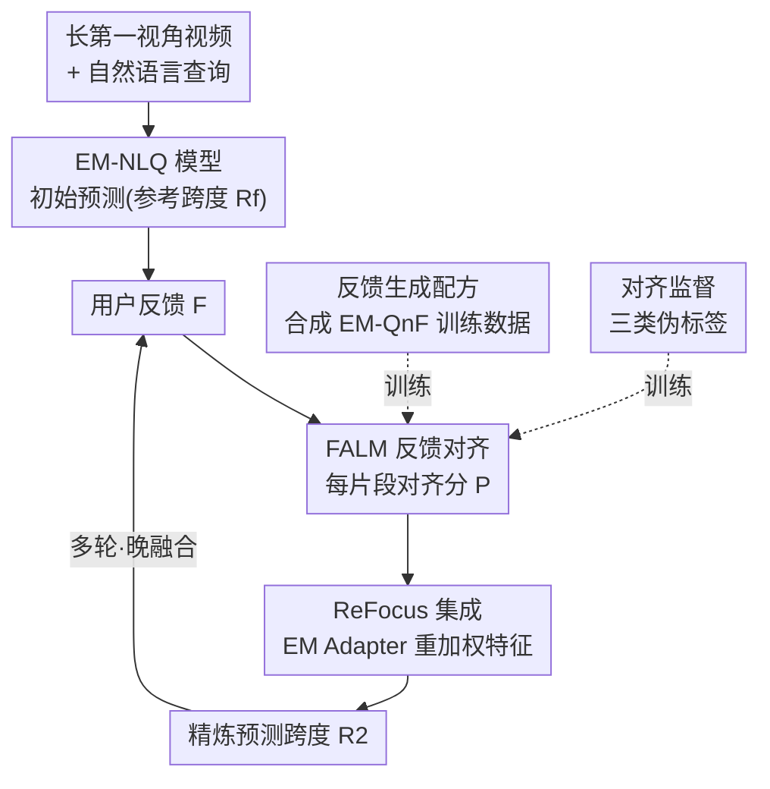

# Interactive Episodic Memory with User Feedback

**会议**: CVPR 2026  
**arXiv**: [2604.24893](https://arxiv.org/abs/2604.24893)  
**代码**: https://nsubedi11.github.io/refocus (项目主页)  
**领域**: 多模态VLM / 第一视角视频 / 情景记忆检索  
**关键词**: 情景记忆, 自然语言查询定位, 用户反馈, 交互式检索, 即插即用模块

## 一句话总结
针对"在长第一视角视频里用自然语言找出回答问题的那一刻"（EM-NLQ）只能一次出结果、无法纠错的问题，本文提出可交互的 EM-QnF 任务、一套无需人工标注的合成反馈数据生成配方，以及即插即用的反馈对齐模块 FALM——它给每个视频片段打"与反馈对齐分"并重加权原模型特征，让现有 EM-NLQ 模型在不引入笨重 LLM 的前提下，根据用户反馈把焦点移到正确片段，三个基准上 R1/R5 最高提升 +4.9/+5.4。

## 研究背景与动机
**领域现状**：情景记忆 + 自然语言查询（EM-NLQ）让人能对着可穿戴相机拍下的超长第一视角视频提问（如"我把杯子放哪了？"），模型需在未裁剪的长视频里定位出回答问题的时间窗 $\mathcal{R}=[t_s,t_e]$。近年工作主要在性能、效率、低数据泛化三个方向打磨。

**现有痛点**：所有现有 EM-NLQ 方法都是**一次性（one-shot）**定位——给一个查询、出一个预测，就结束了。但现实里用户的问题常常**有歧义或信息不全**（"大蓝杯还是白杯？"），模型第一次很可能答错，而用户看到错误结果后本能地会补充或纠正（"不，是这之前，我开始做饭的时候"）。现有模型完全无法利用这种反馈。

**核心矛盾**：大视觉语言模型（LVLM）看似天生适合做交互——它们基于对话、指令跟随、用户对齐训练。但本文实验发现，把 LVLM 微调去做视频理解后，**反而削弱了它响应反馈的能力**（很多指标加反馈后 $\Delta$ 为负），且依赖巨大视觉骨干，又慢又重，做不了端上的快速情景记忆。于是出现两难：擅长定位的任务专家模型不会用反馈，会用语言的 LVLM 又不会精准定位且太重。

**本文目标**：(1) 把 EM-NLQ 扩展成可多轮反馈纠错的新任务；(2) 在没有现成反馈数据集、人工标注又昂贵的情况下造出可训练的数据；(3) 让现有轻量任务专家模型"学会"用反馈，而不堆 LLM。

**切入角度**：用户反馈本质上是在告诉模型"答案该往哪个片段移"——这可以转化为一个**逐片段的对齐打分**问题，再用这个分去重加权原模型的视频特征，从而无侵入地"挪动"原模型的注意力。

**核心 idea**：用一个即插即用的反馈对齐模块（FALM）预测"每个片段与反馈的对齐分"，再用轻量适配器把该分注入任意 EM-NLQ 模型来重加权特征，让模型"重新聚焦（ReFocus）"到符合用户意图的片段。

## 方法详解

### 整体框架
整个系统叫 **ReFocus**，要解决的是"让现成 EM-NLQ 模型听懂用户反馈并改预测"。推理时的流转是：长视频 + 查询先经一个现成 EM-NLQ 模型给出**初始预测**（即"参考跨度" $\mathcal{R}^f$，可能错）；用户针对这个跨度给一句自然语言**反馈** $\mathcal{F}$；FALM 把（视频、查询、参考跨度、反馈）一起读进去，输出每个片段 $C_i$ 的**对齐分** $P_i\in[0,1]$；这些分经轻量 EM Adapter 缩放平移后，去**重加权**原 EM-NLQ 模型的视频特征，使模型焦点移向与反馈一致的片段，产出精炼跨度 $\mathcal{R}_2$；多轮时把每条反馈各自跑一遍再做晚融合。训练侧则靠一套**合成反馈生成配方**把现有 EM-NLQ 数据集转成带反馈的 EM-QnF 数据，并从反馈里抽伪标签来监督 FALM。

### 关键设计

**1. 合成反馈生成配方：不靠人工标注就把 EM-NLQ 数据变成可训练的反馈数据**

痛点很直接——做交互任务得有"针对错误预测的反馈"数据，但让人看完超长第一视角视频再写有意义的反馈极贵，也没有现成数据集。本文用一条四步配方把现有 EM-NLQ 数据集"翻新"成 EM-QnF 数据：(1) **参考跨度采样**：为查询 $\mathcal{Q}$ 造出模拟"错误预测"的 $\mathcal{R}^f$，不只用某个 EM-NLQ 模型的真实失败（会过拟合到特定模型的错法），还额外采两类——与真值视觉相似但答非所问的 $\mathcal{R}^q$-similar 跨度（查询相关）、与真值时序不相交的随机跨度（查询无关），保证错误类型多样；(2) **片段描述**：用预训练 LVLM 给真值跨度 $\mathcal{R}^q$ 和参考跨度 $\mathcal{R}^f$ 各生成与查询无关的视觉描述 $\mathcal{D}_i$（先转文本再让 LLM 推理，省去反复处理长视频的开销）；(3) **解释生成**：为真值跨度生成"为什么它能回答查询"的解释 $E_i$，用来约束反馈不能直接泄露答案；(4) **反馈构造**：把 $\mathcal{D}^q, \mathcal{D}^f, E^q$ 和两跨度的相对时序喂给推理型 LLM，提示它生成包含三类信息任意组合的反馈——关于查询对象的额外区分细节、$\mathcal{R}^q$ 与 $\mathcal{R}^f$ 的对比线索、以及该往参考跨度之前还是之后找的时序指引。

这样造出的反馈风格多样，从"before this"这种模拟没耐心用户的短语，到带多种线索的描述句，平均长度 16 词（标准差 6.8）。关键证据是：用合成反馈训出的模型在推理时能直接吃真人反馈，且合成反馈带来的提升与真人反馈相当——说明配方造出的反馈贴近人类风格

**2. FALM：把"反馈该让答案往哪挪"变成逐片段对齐打分**

现有模型不会用反馈，是因为没有一个机制把"一句自然语言反馈"翻译成"对哪些片段更/更不感兴趣"。FALM（Feedback ALignment Module）即插即用地补上这一环：把视频切成 $m$ 个片段 $\mathcal{V}=\{C_1,\dots,C_m\}$，目标是输出对齐向量 $P\in[0,1]^m$，每个 $P_i$ 表示片段 $C_i$ 与反馈 $\mathcal{F}$ 的对齐程度。架构上，视频用 EgoVideo 的 ViT-1B 编码 $e_v$、查询与反馈用 gte-Qwen2-7B-instruct 编码 $e_q,e_f$；参考跨度则用其起始/结束/均值三个片段嵌入拼成 $e_r=[e_v^s,e_v^e,e_v^\mu]$，让模块在"参考跨度的视觉语境"下理解反馈。随后用一个两层 Transformer 编码器建模 $\{e_q,e_f,e_r\}$ 之间的交互、另一个两层编码器捕捉整段视频上下文 $e_v$，最后过两层带交叉注意力的 Transformer 解码器得到视频-反馈对齐嵌入 $e_a$，由 MLP 头出分。

它有效的关键在于把交互问题降维成一个轻量的打分网络——不引入 LLM、不改原 EM-NLQ 主干，却能显式表达"反馈想要 / 不想要 / 时序方向"对每个片段的影响

**3. 对齐监督：从反馈里抽三类线索，自动造伪标签教 FALM 打分**

FALM 要学打分，但没人逐片段标注"这片段对齐反馈吗"。本文从每条反馈里用 LLM 抽出三类短句线索：**Contains**（正确答案应包含什么）、**Not Contains**（不该出现什么）、**Temporal**（往参考跨度之前还是之后找），再自动转成伪标签。具体地，用 EgoVideo 编码器算 <片段, 线索> 相似度得到 contains 分 $S^c$ 和 not-contains 分 $S^n$，经高斯平滑与 min-max 归一化降噪；把 not-contains 反相 $S^k=1-S^n$（即应避开用户排除的内容）。二值化时，先在真值跨度 $\mathcal{R}^q$ 内算各分数的均值 $S_\mu$ 与标准差 $S_\sigma$，阈值取 $\delta=S_\mu-3S_\sigma$，超阈值记 1 得到 $L^c,L^k$；时序标签 $L^t$ 按抽出的时序线索给参考跨度前/后的片段记 1。最后三类用逻辑与合并 $L=L^c\wedge L^k\wedge L^t$（某条反馈缺哪类线索就只用现有子集）。训练目标是四个 MLP 头分别预测 contains、not-contains、temporal 和总体对齐分，损失为

$$\mathcal{L}=\lambda\mathcal{L}_C(L,P)+\lambda_t\mathcal{L}_C(L^t,P^t)+\lambda_c\mathcal{L}_2(S^c,P^c)+\lambda_n\mathcal{L}_2(S^k,P^k)$$

其中 $\mathcal{L}_C$ 为二元交叉熵、$\mathcal{L}_2$ 为 $\|\cdot\|_2^2$ 回归损失。这套监督让"反馈的语义"被拆解成可学的、片段级的对齐信号，消融显示三类线索各有贡献、其中时序线索最关键

**4. ReFocus 集成与多轮扩展：用一对标量适配器无侵入注入任意 EM-NLQ 模型**

FALM 预训练好后，要插进各种 EM-NLQ 模型而不破坏其原有能力。本文不直接改原模型，而是用对齐分 $P$ 去重加权原模型的视频片段特征——分高的片段被强调、分低的被弱化，从而"挪动"原模型的焦点。为了跨模型无缝适配，引入轻量 **EM Adapter**：用两个可学标量 $\alpha,\beta$ 对 FALM 的分做缩放平移并裁剪 $\hat P=\text{clamp}(\alpha P+\beta,0,1)$，再与 EM-NLQ 模型一起微调；最终模型记作 ReFocus($\mathcal{M}$)。消融表明去掉这个适配器会掉点，说明这层"分数校准"对不同宿主模型的适配很重要。多轮反馈则用一个简单的晚融合扩展：对同一查询的多条独立反馈 $\{\mathcal{F}_1,\dots,\mathcal{F}_n\}$，各自跑一遍 ReFocus，把跨模态编码器的输出特征平均后再送进跨度解码器——这个无需重训的扩展能随反馈轮数稳定涨点

### 一个例子：从答错到答对
用户问"我把什么放进了煎锅？"，GroundNLQ 初次定位到一个错误片段 $\mathcal{R}^f$（参考跨度）。用户给反馈："是这之前，我开始做饭的时候，找的是大蓝容器不是白的。"——这条反馈含对比线索（蓝 vs 白）和时序线索（之前）。FALM 据此给每个片段打分：参考跨度之后、含白容器的片段被压低，参考跨度之前、含蓝容器的片段被抬高，对齐向量 $P$ 经 EM Adapter 校准后重加权 GroundNLQ 的视频特征，模型焦点移到更早的正确时刻，输出 $\mathcal{R}_2$ 命中真值。论文也给出失败例：当"蓝容器在店外、往前找"时，模型虽正确前移注意力，却被货架上一堆蓝色食品容器干扰，没推断出那些货架其实就在同一家店内。

## 实验关键数据

### 主实验
三个第一视角基准（Ego4D-QnF / GoalStep-QnF / HD-EPIC-QnF）上的带反馈定位，指标为 R1/R5 在 tIoU∈{0.3,0.5}。报告格式 $X_{q+f}^{\Delta}$：$X_{q+f}$ 是给查询+反馈后的绝对性能，$\Delta$ 是相对仅查询的增量（正=反馈有用）。

| 方法 | Ego4D R1@.3 | GoalStep R1@.3 | HD-EPIC R5@.3 | 反馈是否有用 |
|------|------|------|------|------|
| TimeChat (ZS, LVLM) | 1.6 ($\Delta$-0.2) | 2.3 ($\Delta$+0.9) | N/A | 多数 $\Delta$ 为负 |
| UniTime (FT, LVLM) | 21.7 ($\Delta$-3.4) | 8.2 ($\Delta$-0.3) | N/A | 微调后仍不会用反馈 |
| OSGNet (任务专家) | 29.6 ($\Delta$+0.4) | 30.2 ($\Delta$+0.6) | 37.7 ($\Delta$-0.1) | $\Delta\le1\%$，基本忽略反馈 |
| **ReFocus(OSGNet)** | **32.5 ($\Delta$+3.3)** | **31.9 ($\Delta$+2.0)** | **38.3 ($\Delta$+1.3)** | 一致涨点 |
| GroundNLQ (任务专家) | 29.6 ($\Delta$+0.6) | 23.3 ($\Delta$+0.2) | 33.8 ($\Delta$+0.9) | 基本忽略反馈 |
| **ReFocus(GroundNLQ)** | **33.1 ($\Delta$+3.3)** | **26.8 ($\Delta$+4.9)** | **39.6 ($\Delta$+5.4)** | 全面最强，最高 +4.9/+5.4 |

核心结论：LVLM 即便微调也学不会用反馈（$\Delta$ 常为负）；任务专家直接在 QnF 数据上训也几乎不动（$\Delta\le1\%$）；唯有 ReFocus 把反馈真正用起来，R1/R5 最高 +4.9/+5.4，且不依赖 LLM、保持原模型效率。

零样本跨数据集（仅在 Ego4D-QnF 训、直接测另两个，Table 2）：ReFocus(GroundNLQ) 在 GoalStep R5@.3 达 45.3 ($\Delta$+5.0)、HD-EPIC R5@.3 达 25.1 ($\Delta$+4.2)，远超竞品的边际提升，说明没过拟合到特定反馈风格。

对比商用 LVLM（Gemini-2.5-Flash，Table 3，在 ReFocus 仅查询会失败的 100 NLQ 子集）：Gemini 即便 R1 强，给反馈+参考跨度也几乎无法改进预测，印证长视频里"用反馈推理"对大模型仍是难点。

### 消融实验
在含全部三类 FALM 标签的 Ego4D-QnF 子集上（Table 4，GroundNLQ 为底）：

| 配置 | R1@.3 | R5@.3 | R1@.5 | 说明 |
|------|------|------|------|------|
| GroundNLQ | 29.56 | 56.42 | 21.63 | 原模型不用反馈 |
| **w. FALM (完整)** | **33.13** | **59.70** | **23.58** | 完整 ReFocus |
| w. FALM$_C$ (仅 contains) | 31.08 | 57.95 | 22.26 | 单一线索 |
| w. FALM$_N$ (仅 not-contains) | 30.89 | 58.03 | 22.38 | 单一线索 |
| w. FALM$_T$ (仅 temporal) | 32.29 | 59.41 | 23.23 | 单一线索中最强 |
| w. FALM w/o Adapter | 32.46 | 58.33 | 23.11 | 去掉 EM Adapter 掉点 |

人工反馈对比（Table 5，Ego4D-QnF 上仅查询会失败的样本，11 名用户共 500 条反馈/271 对）：合成反馈带来 $\Delta$R1@.3=8.6、$\Delta$R5@.3=50.0；真人反馈 $\Delta$R1@.3=5.8、$\Delta$R5@.3=34.4——真人反馈也能稳定提升，但与合成反馈仍有差距，留有改进空间。

### 关键发现
- **三类监督各有贡献、时序线索最关键**：单用 contains/not-contains/temporal 都比基线好，其中 temporal 单独就把 R1@.3 从 29.56 提到 32.29，三者合并才到 33.13——因为不同反馈携带的信息类型不同。
- **EM Adapter 不可省**：去掉那对 $\alpha,\beta$ 标量校准，R1@.3 从 33.13 掉到 32.46，说明跨宿主模型注入对齐分时需要这层缩放平移。
- **多轮反馈零样本涨点**：虽只在单轮训练，多条反馈晚融合后性能随轮数上升，到第 3~4 轮后趋于平台。
- **合成反馈 ≈ 真人反馈**：配方造出的反馈风格贴近人类，模型可直接迁移到真人输入，证明无标注配方的实用性。

## 亮点与洞察
- **把"听懂反馈"降维成"逐片段打分 + 重加权"**：不去碰原模型的定位主干，而是在外面挂一个轻量打分器，用分数去拨动原模型的注意力——这是即插即用、跨模型通用的关键，比起重训或堆 LLM 既省又稳。
- **无标注合成反馈配方很可迁移**：先把视频转文本描述再让 LLM 推理生成反馈，既省算力又能控制反馈"不直接泄题"，且证明合成反馈训出的模型能吃真人反馈——这套"用 LLM 造交互训练数据"的思路可迁到其他需要人类反馈但标注昂贵的定位/检索任务。
- **把反馈拆成 contains/not-contains/temporal 三类伪标签**：用对比和时序两种朴素信号就覆盖了大部分纠错意图，且能用现成编码器算相似度自动造标签，避免人工逐片段标注——这种"语义线索→片段级监督"的拆解很值得借鉴。
- **一个反直觉发现**：擅长对话的 LVLM 反而越微调越不会用反馈（$\Delta$ 转负），提醒"会语言≠会把语言反馈用于精准时序定位"。

## 局限与展望
- **作者承认**：合成反馈与真人反馈仍有绝对提升差距（Table 5），用真人反馈训练或许能补回这部分。
- **多轮建模偏简单**：当前多轮只是把独立反馈晚融合平均，作者自述这只是"强基线"，更精细的多轮交互（轮间依赖、对话状态）留作未来工作；且多轮到第 3~4 轮后就饱和。
- **失败模式**：当反馈涉及需要常识推断的空间关系（"蓝容器在店外不在店内"）时，模型会被视觉相似的干扰物（一堆蓝容器）带偏，说明它主要靠表观相似度对齐、缺乏更强的场景/关系推理。
- **依赖外部大编码器造标签**：伪标签质量受 LVLM/LLM 描述与 EgoVideo 相似度的噪声影响，本文靠高斯平滑 + 3σ 阈值缓解，但标签噪声上限可能限制 FALM 表现。

## 相关工作与启发
- **vs 一次性 EM-NLQ（GroundNLQ / OSGNet / 2D-TAN / VSLNet）**：它们把查询当固定的 one-shot 输入，无法处理歧义或纠错；本文让同一批模型接上 FALM 后可交互精炼，且保持其效率，是"加能力不换骨架"。
- **vs LVLM 时序定位（TimeChat / UniTime / ChatVTG）**：这些靠 LLM 做时间戳对齐，又重又慢，且实验显示微调后反而不会用反馈；ReFocus 不引入 LLM，用轻量打分模块就拿到更好的反馈利用率与效率。
- **vs 其他形式反馈定位（点击/区域/时间戳偏好学习）**：本文用最自然的语言反馈，并把它系统拆成 contains/not-contains/temporal 三类可监督信号，针对第一视角长视频的大搜索空间与模糊查询；同时贡献了无需人工标注、可规模化的反馈生成配方。

## 评分
- 新颖性: ⭐⭐⭐⭐⭐ 首次把交互/反馈引入 EM-NLQ，新任务 + 无标注数据配方 + 即插即用模块成体系。
- 实验充分度: ⭐⭐⭐⭐ 三基准、两类宿主模型、零样本跨集、商用 LVLM 与真人反馈对比都覆盖，唯多轮分析较简略。
- 写作质量: ⭐⭐⭐⭐ 任务定义、配方四步、FALM 监督讲得清楚，图表对照明确。
- 价值: ⭐⭐⭐⭐ 即插即用、不堆 LLM、可吃真人反馈，对端上交互式情景记忆很实用。

<!-- RELATED:START -->

## 相关论文

- [\[CVPR 2026\] IPR-1: Interactive Physical Reasoner](ipr-1_interactive_physical_reasoner.md)
- [\[CVPR 2026\] SpaceTools: Tool-Augmented Spatial Reasoning via Double Interactive RL](spacetools_tool-augmented_spatial_reasoning_via_double_interactive_rl.md)
- [\[CVPR 2026\] WeaveTime: Streaming from Earlier Frames into Emergent Memory in VideoLLMs](weavetime_streaming_from_earlier_frames_into_emergent_memory_in_videollms.md)
- [\[CVPR 2026\] WeaveTime: Stream from Earlier Frames into Emergent Memory in VideoLLMs](weavetime_streaming_video_llm_memory.md)
- [\[ACL 2025\] Sightation Counts: Leveraging Sighted User Feedback in Building a BLV-aligned Dataset of Diagram Descriptions](../../ACL2025/multimodal_vlm/sightation_counts_leveraging_sighted_user_feedback_in_building_a_blv-aligned_dat.md)

<!-- RELATED:END -->
