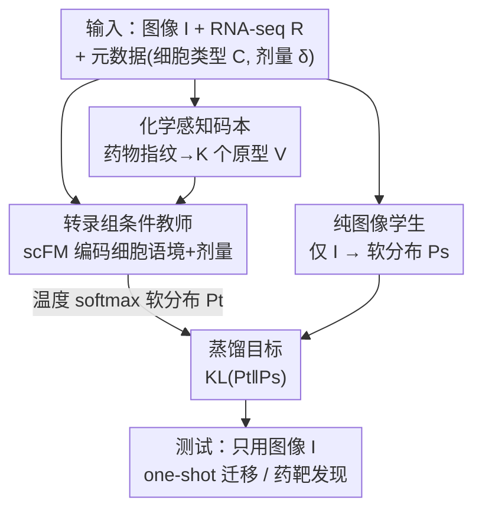

# Intervention-Aware Multiscale Representation Learning from Imaging Phenomics and Perturbation Transcriptomics

**会议**: CVPR 2026  
**arXiv**: [2604.22832](https://arxiv.org/abs/2604.22832)  
**代码**: https://github.com/The-Real-JerryChen/BioMicroscopyProfiler (有)  
**领域**: 多模态VLM / 计算生物学 / 表示学习  
**关键词**: 表型筛选, 知识蒸馏, 扰动转录组, 药物发现, 弱配对数据

## 一句话总结
用配对的扰动转录组（RNA-seq）作为"特权信息"在训练期指导显微图像编码器学习——通过一个"转录组条件教师 → 纯图像学生"的蒸馏框架，把药物作用的机制信号灌进图像表征，使得测试时只用显微图像就能对**未见过的药物/基因扰动**做 one-shot 迁移和药物-靶基因发现，显著优于自监督（MAE/DINO）和对齐（CLIP-style）基线。

## 研究背景与动机
**领域现状**：药物发现里有两种互补的细胞读出（readout）：① 显微成像（如 Cell Painting）便宜、可大规模筛上千种化合物，但只给形态学轮廓；② 扰动转录组（如 LINCS L1000）能测出基因表达变化、揭示药物调控了哪些通路，机制深度足，但贵且通量低。图像模型目前几乎都靠自监督（MAE、DINO）抽形态特征。

**现有痛点**：自监督学到的图像特征"擅长抓形态，却跟生物机制脱节"——它不知道某个表型背后是哪条通路被扰动，因此**迁移到没见过的扰动时就崩**。而现有的图像-多模态方法（把图像跟药物结构或 RNA 对齐到共享嵌入空间）有个更隐蔽的毛病：它们以**药物身份（drug identity）**为监督信号，把"同一化合物在不同剂量/不同细胞类型下"的差异统统塌缩成"二元正配对"，丢掉了泛化最需要的"梯度化响应"信息。

**核心矛盾**：真实配对数据是**弱配对（weakly paired）**的——图像和 RNA-seq 虽是同药同细胞系，但**剂量常常不同**，批次也不同。按身份对齐的方法把剂量、细胞类型不匹配当成"相同正样本"硬配，本质是错的；而且这些方法的目标是学更好的**药物/转录组**表征，图像只是辅助信号，并非要改进的目标模态。

**本文目标**：当只有有限的图像-转录组配对数据时，如何用扰动转录组**指导图像表征**朝"机制理解"靠拢，且测试时不需要 RNA。

**切入角度**：药物扰动遵循一条结构化因果通路——化学结构 $D$ 决定结合哪些靶点（靶点接合态 $Z$），$Z$ 驱动转录组 $R$ 变化、并最终塑造形态 $M$，形态再经显微成像管线观测为图像 $I$；细胞类型 $C$ 作为生物语境调制整条级联。既然 $R$ 携带了 $M$ 看不见的通路级机制，那就该把 $R$ 当**特权信息**在训练期注入。

**核心 idea**：把多模态学习从"按样本身份对齐"重构为"按干预语义（intervention semantics）"——用转录组条件教师产出机制软标签，蒸馏给一个只看图像的学生，并用理论证明这样能**收紧图像预测的风险上界**。

## 方法详解

### 整体框架
框架名为 **TIDE**（Transcriptome-Informed Distillation for image Encoding）。目标是估计 $P(D\,|\,I,C)$——给定细胞图像 $I$ 和细胞类型 $C$，药物（干预）的后验分布。训练时额外有配对转录组 $R$ 可用，测试时只用 $I$（学生甚至不显式吃 $C$，因为细胞类型本就编码在形态里）。整个 pipeline 是"先把药物空间组织成一本按化学相似度排列的码本，再让一个吃齐 图像+RNA+元数据 的教师在码本上产出软分布，最后让一个纯图像学生去逼近这个软分布"。

理论上，命题 3.1 给出一个风险上界：定义只依赖 $(I,C)$ 的预测器的对数损失风险 $\mathcal{L}[q]=\mathbb{E}_{(I,C,D)\sim P}[-\log q(D\,|\,I,C)]$，并让 $S_T(D\,|\,I,C)=\mathbb{E}_{R\,|\,I,C}[T(D\,|\,I,R,C)]$ 是"训练时吃 RNA、测试时对 $R$ 边缘化"的预测器。则

$$\mathcal{L}[S_T]\le H(D\,|\,I,C)+\mathbb{E}_{(I,R,C)}\big[\mathrm{KL}\big(P(D\,|\,I,R,C)\,\|\,T(\cdot\,|\,I,R,C)\big)\big]$$

其中右边第二项就是可直接优化的训练目标。直觉是：在 RNA 条件下，教师能区分"形态相似但通路不同"的药物，把这种机制知识蒸馏进图像学生后，学生学到的是对齐生物机制的表征、而非表面视觉模式。注意 ⚠️ 该界只对**训练分布**成立，并不直接保证对未见药物泛化——作者把"机制特征会迁移到相似机制的新化合物"当作假设，靠实验验证。

### 关键设计

**1. 化学感知码本：把"硬药物身份"换成"按机制可迁移的软原型空间"**

痛点是按药物身份做硬分类无法迁移到训练时没见过的化合物。本文给 $K$ 个训练药物各抽一个分子表征（分子指纹），经一个轻量 MLP 投影到与教师/学生编码器同一嵌入空间、再做 $\ell_2$ 归一化，得到原型矩阵 $V\in\mathbb{R}^{K\times d}$——每行 $\mathbf{v}_k$ 是单位超球面上的一个药物原型，且是**可学习参数**，随反向传播更新。这样模型预测的是"在原型上的软分布"而非硬药物 ID，新化合物可借化学相似度落到邻近原型上完成迁移。更妙的是：初始按化学相似度排布，但训练中原型会**漂移成按机制相似度**聚类——可视化里两个化学结构很远（FCFP 指纹空间分得很开）但同为 ATP 竞争性酪氨酸激酶抑制剂的药物（BMS-536924 与 WH-4-023），在学到的码本空间里被拉得很近

**2. 转录组条件教师：用微调过的单细胞基础模型显式拆开剂量与细胞类型**

痛点是弱配对数据里图像剂量 $\delta_I$ 和 RNA 剂量 $\delta_R$ 常常对不上，按身份硬配会把不同剂量当同一样本。教师 $T_\theta$ 故意**不直接编码药物分子结构**，而是逼自己从观测到的细胞响应（形态+转录组）里推断通路级扰动效应，再靠码本监督把"推断出的机制"链回药物化学——以此避开"教师退化成简单匹配药物 ID"的捷径学习。它用一个在扰动响应预测任务上**微调过的 scFM**（scGPT）：微调时吃基础表达 $R_\text{basal}$、药物表征、剂量 $\delta_r$ 去预测扰动后表达，训练完用其编码器抽两类表征——细胞类型编码 $\mathbf{h}_C$（来自 $R_\text{basal}$，给跨扰动稳定的生物语境）和剂量解耦的转录组编码。教师再编码三路信息：图像+剂量（用 FiLM 式条件机制把 $\delta_I$ 从图像特征里剥出）得 $\mathbf{h}_I$、RNA+剂量 $\delta_R$ 得 $\mathbf{h}_R$、细胞类型 $\mathbf{h}_C$；三者拼接后过投影网络 $f_t$ 融合：$\mathbf{h}_t=f_t([\mathbf{h}_I\|\mathbf{h}_R\|\mathbf{h}_C])$，再对码本算温度缩放 softmax 得软分布

$$P_t=\text{Softmax}\!\left(\frac{V\cdot\mathbf{h}_t}{\tau\cdot|\mathbf{h}_t|_2}\right)\in\mathbb{R}^{K}$$

教师用对真实药物标签的交叉熵 $\mathcal{L}_{teacher}$ 训练。因为 $\delta_I$、$\delta_R$ 在各自模态特征内**分别**编码，教师能对剂量不匹配的弱配对数据"显式推理剂量依赖效应"，产出反映真实剂量语境的软目标，而非二元标签匹配

**3. 纯图像学生 + KL 蒸馏：让部署端只靠形态学就能复现机制软标签**

痛点是部署场景只有显微图像、没有 RNA 也没有显式细胞类型输入。学生复用教师的共享图像编码器，接一个投影头得 $\mathbf{h}_s$，仅从图像产出码本分布 $P_s$（细胞类型信息被认为已隐含在形态特征里，故学生不显式吃 $C$）。蒸馏用 KL 散度让学生分布对齐教师分布：

$$\mathcal{L}_{\text{distill}}=\mathbb{E}_{(I,R,C,\delta)}\big[\mathrm{KL}(P_t\,\|\,P_s)\big]$$

这一步正是命题 3.1 里"对 $R$ 边缘化"的工程落地：教师把通路级机制压进 $P_t$，学生通过逼近 $P_t$ 间接学到"对 $R$ 取期望"的后验 $S_T$。框架对任意自监督方法兼容，对所有图像（配对+未配对）额外施加 $\mathcal{L}_{ssl}$（如 DINO/MAE）以吃满海量无配对成像数据、学通用形态特征

### 损失函数 / 训练策略
总目标把三项加权相加：

$$\mathcal{L}=\mathcal{L}_{\text{distill}}+\alpha\cdot\mathcal{L}_{\text{teacher}}+\beta\cdot\mathcal{L}_{\text{ssl}}$$

即蒸馏 KL + 教师交叉熵 + 自监督。训练 400 epoch，用 k-NN（k=20）在留出验证集（每扰动类 10 张图）上选 checkpoint。Task 1 按**干预**（而非样本）切 train/val/test 以保证真泛化评估；视觉骨干用标准 ViT 与细胞成像专用的 Channel-Agnostic ViT（CA-ViT），按数据规模匹配模型大小（CPG-Pilot/RxRx3 用 ViT-Small，CPG-12 用 ViT-Base）。

## 实验关键数据

数据集为三个 Cell Painting 成像数据集配 L1000 转录组（978 个 landmark 基因），均为弱配对（同药同细胞系但常异剂量）：

| 数据集 | 图像数 | 配对 RNA | 药物数 | 重叠数 | 评测干预数 |
|--------|--------|----------|--------|--------|------------|
| RxRx3 | 61,690 | 3,682 | 1,662 | 235 | 736 |
| CPG-Pilot | 93,696 | 1,883 | 302 | 85 | 260 |
| CPG-12 | 916,721 | 22,066 | 30,340 | 6,989 | 121 |

### 主实验

**Task 1：one-shot 迁移到未见干预**（Top-1/Top-5 准确率 %，50 次平均；CPG-Pilot/RxRx3 测未见基因扰动，CPG-12 测未见化合物）。下表取 ViT 骨干：

| 方法 | RxRx3 Top-1 | RxRx3 Top-5 | CPG-Pilot Top-1 | CPG-Pilot Top-5 | CPG-12 Top-1 | CPG-12 Top-5 |
|------|------|------|------|------|------|------|
| MAE | 1.54 | 6.79 | 2.95 | 12.31 | 4.68 | 11.02 |
| DINO | 4.82 | 14.86 | 11.36 | 30.82 | 36.36 | 60.01 |
| CL(D) | 5.16 | 15.63 | 14.61 | 36.66 | 40.04 | 65.07 |
| CL(R) | 4.93 | 14.27 | 13.97 | 30.64 | 30.57 | 60.89 |
| **TIDE** | **5.62** | **16.86** | **16.01** | **39.12** | **42.09** | **71.07** |

TIDE 全设置最优；CL(D)（对齐药物分子）是次优基线，说明"引入扰动信息"很关键；CL(R)（对齐转录组）因配对 RNA 稀少略输给 CL(D)；SSL 里 DINO 因 local/global crop 增广提供更丰富信号，远超 MAE。

**Task 2：无监督药物-靶基因发现**（无显式监督，100 随机种子平均；RxRx3 报 dose-averaged AP/AUC，CPG-Pilot 报 AP/Hit@5）：

| 方法 | RxRx3 AP | RxRx3 AUC | CPG-Pilot AP | CPG-Pilot Hit@5 |
|------|------|------|------|------|
| MAE | 0.256 | 0.538 | 0.079 | 0.103 |
| DINO | 0.300 | 0.633 | 0.109 | 0.135 |
| CL(D) | 0.252 | 0.537 | 0.099 | 0.127 |
| CL(R) | 0.247 | 0.532 | 0.105 | 0.134 |
| **TIDE** | **0.317** | **0.640** | **0.119** | **0.149** |

该任务本身极难（跨模态扰动配对信号"仅略高于随机"），多数基线几乎只比随机好一点点；TIDE 在这个"基线勉强超随机"的任务上仍显著领先，证明它确实蒸馏到了通路级机制知识。值得注意：与 Task 1 不同，CL(D) 在此任务对 DINO/CL(R) 没有明显优势——因为识别生物靶点需要化学指纹不直接编码的通路级理解。

### 消融实验

**剂量/scFM 微调消融**（CPG-Pilot 按细胞系拆分，ViT；A549 比 U2OS 有更多配对化合物）：

| 任务 | 配置 | U2OS Top-1 | A549 Top-1 | U2OS AP | A549 AP |
|------|------|------|------|------|------|
| DINO 基线 | one-shot / 药靶 | 12.8 | 12.1 | 0.084 | 0.133 |
| TIDE | one-shot / 药靶 | 15.9 | 16.3 | 0.092 | 0.146 |

DINO 下两个细胞系相当（U2OS 甚至略高），但用 TIDE 后**配对数据更多的 A549 涨幅更大**（Top-1 从 12.1→16.3，超过 U2OS 的 12.8→15.9），验证"配对转录组越充足、机制蒸馏越有效"。

### 关键发现
- **scFM 微调是必需的**：把每药配对样本数从 0 扫到 150，微调版 scFM 的 TIDE 随配对样本增加显著涨点；仅用预训练权重的 scFM 几乎不涨（0 配对时 TIDE 退化为 DINO）——说明没有"扰动响应预测"微调，scFM 编码器无法解耦剂量、也编不出细胞类型特异的基础状态。
- **码本学到的是机制而非化学结构**：BMS-536924 与 WH-4-023 在 FCFP 化学指纹 UMAP 里距离很远，但在学到的码本空间里被拉得很近，因为两者同为 ATP 竞争性酪氨酸激酶抑制剂——端到端 + 转录组指导让码本"按药物如何扰动通路"而非"按分子结构"组织药物。
- **CA-ViT 在充分训练下更强**：ViT 与 CA-ViT 在多数方法上相当，但配 TIDE 时 CA-ViT 的通道无关 patch 化设计展现更高表征容量。

## 亮点与洞察
- **"特权信息蒸馏"用得恰到好处**：把贵而稀缺的转录组只放在训练期当老师、测试期边缘化掉，既吃到机制深度又保留图像的可扩展性——这是 Learning Using Privileged Information（LUPI）范式在生物成像上的漂亮落地，理论上还能证明收紧风险上界。
- **以"干预语义"替"样本身份"重构对齐目标**：直指现有对齐方法的死穴（把剂量/细胞类型差异塌缩成二元配对），用因果通路 $D\to Z\to R\to M\to I$ 把问题讲清，动机非常具体。
- **可学习化学码本 + 剂量解耦的组合拳**：码本给"对新化合物的化学相似度迁移"，剂量解耦给"弱配对数据的鲁棒处理"，两者各打一个痛点又互补，思路可迁移到任何"弱配对、需对未见类别泛化"的多模态蒸馏场景（如病理-基因组、遥感-地面标签）。

## 局限与展望
- **理论界只管训练分布**：作者诚实承认命题 3.1 不直接保证对未见药物的泛化，"机制特征会迁移"是假设，靠实验间接支持。
- **静态假设**：框架不显式建模时间动态和多细胞相互作用；批次效应（多板成像、跨实验室 RNA-seq）也未进因果图，仅在附录讨论缓解策略。
- **绝对数值偏低**：药物-靶基因发现任务整体性能仍"modest"（RxRx3 上基线仅略超随机），说明该任务本身信号极弱，TIDE 虽相对领先但离实用还远。
- **依赖配对数据量**：消融显示配对样本太少时收益有限（0 配对即退化为 DINO），对配对极稀缺的新细胞系适用性存疑。
- 改进思路：把批次效应、时间动态纳入因果建模；探索把单细胞（而非 bulk L1000）转录组接进来，进一步提升机制分辨率。

## 相关工作与启发
- **vs 自监督（MAE / DINO）**：它们只从图像学通用形态特征，与生物机制脱节；TIDE 在其上叠加转录组蒸馏，让特征对齐通路级机制，迁移到未见干预时大幅领先（且仍把 SSL 作为 $\mathcal{L}_{ssl}$ 吃满无配对图像）。
- **vs CLIP-style 对齐（CL(D) 对齐药物结构 / CL(R) 对齐 RNA）**：它们以药物身份为监督、把剂量与细胞类型差异塌缩成二元配对，且目标是改进药物/转录组表征（图像只是辅助）；TIDE 反过来以图像为目标模态、以干预语义为监督，显式处理剂量/细胞类型不匹配。
- **vs 反向蒸馏工作（用图像基础模型改进转录组表征，Bendidi et al. 2025）**：方向相反——本文是"用转录组指导图像"，填补了这一被忽视的方向。
- **启发**：当两种模态一贵一便宜、且只有弱配对数据时，"贵模态当训练期教师 + 可学习原型码本组织标签空间 + 显式解耦混淆因素（剂量）"是一套可复用的配方。

## 评分
- 新颖性: ⭐⭐⭐⭐⭐ 把"特权信息蒸馏 + 因果干预语义 + 可学习化学码本"组合用于显微-转录组弱配对学习，方向新且动机扎实。
- 实验充分度: ⭐⭐⭐⭐ 三数据集×两骨干、两任务、剂量/scFM 微调/样本效率消融齐全；但药靶任务绝对值偏低，未与最新生物大模型基线全面对比。
- 写作质量: ⭐⭐⭐⭐ 因果通路与理论界讲得清楚，方法三组件层次分明；个别公式排版（如 $\mathcal{L}_{distill}$ 的 KL 写法）有小笔误。
- 价值: ⭐⭐⭐⭐ 为"只用便宜显微图像做机制级药物发现"提供了一条可证明、可部署的路径，对虚拟细胞/高通量筛选有实际意义。

<!-- RELATED:START -->

## 相关论文

- [\[CVPR 2026\] Multi-Modal Image Fusion via Intervention-Stable Feature Learning](multi-modal_image_fusion_via_intervention-stable_feature_learning.md)
- [\[CVPR 2026\] Taxonomy-Aware Representation Alignment for Hierarchical Visual Recognition with Large Multimodal Models](taxonomy-aware_representation_alignment_for_hierarchical_visual_recognition_with.md)
- [\[CVPR 2026\] MOON2.0: Dynamic Modality-balanced Multimodal Representation Learning for E-commerce Product Understanding](moon20_dynamic_modality-balanced_multimodal_representation_learning_for_e-commer.md)
- [\[CVPR 2026\] Multi-Metric Representation Learning Strategy Based on Clustering for Fine-Grained Multimodal Sentiment Analysis](multi-metric_representation_learning_strategy_based_on_clustering_for_fine-grain.md)
- [\[NeurIPS 2025\] Structure-Aware Fusion with Progressive Injection for Multimodal Molecular Representation Learning](../../NeurIPS2025/multimodal_vlm/structure-aware_fusion_with_progressive_injection_for_multimodal_molecular_repre.md)

<!-- RELATED:END -->
