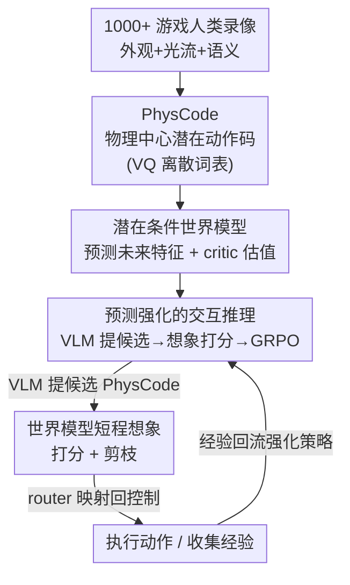

# IPR-1: Interactive Physical Reasoner

**会议**: CVPR 2026  
**arXiv**: [2511.15407](https://arxiv.org/abs/2511.15407)  
**代码**: 项目主页 https://mybearyzhang.github.io/ipr-1 （未见公开代码库）  
**领域**: 多模态VLM / 物理推理 / 世界模型  
**关键词**: 交互式物理推理、世界模型、VLM agent、潜在动作空间、PhysCode

## 一句话总结
IPR 让一个 8B 的 VLM 在 1000+ 款异构游戏里通过"世界模型想象 rollout 打分 → 强化 VLM 策略"的闭环学习物理与因果，并用一套物理中心的潜在动作码 PhysCode 把"语义意图"和"视觉动力学"对齐成预测与推理共享的动作空间，整体竞争力（平均排名）超过 GPT-5。

## 研究背景与动机
**领域现状**：让 agent 在交互环境里学会"物理直觉 + 因果推理"目前有三条主流路线——预训练 VLM/VLA（靠大规模语义先验做开环规划）、世界模型（学潜在动力学、在想象里规划）、以及 RL（直接从像素和奖励里优化策略）。

**现有痛点**：三条路线各有硬伤。VLM/VLA 会推理但缺"前瞻"——它能按指令做语义规划，却预测不出动作在视觉状态空间里的后果，在交互中撞上即将到来的危险（尖刺、移动敌人）也看不见；世界模型会"想象"但常退化成模仿表面视觉相关性、短视地追逐目标，复杂环境里误差累积；RL 样本效率低、依赖稠密且与任务纠缠的奖励，容易过拟合任务捷径而非因果机制，换个游戏界面就崩。

**核心矛盾**：这些方法都倾向于**过拟合表面视觉细节，而非捕捉底层不变的物理/因果机制**。而要在差异巨大的交互环境间稳健迁移，恰恰需要把"核心机制"从"视觉外观"里解耦出来。更麻烦的是动作接口本身：同一个按键（如 UP）在不同游戏里语义完全不同（镜头上抬 vs 角色上移），造成"控制台别名"冲突；纯语言动作又表达不出精细的视觉幅度（跳多高、冲多快）。

**本文目标**：(1) 造一个能暴露"共享物理机制 + 巨大视觉域间隙"的测试床；(2) 设计一种学习范式，让交互经验能稳定累积成物理推理能力，并随经验增长而提升、零样本迁移到没见过的游戏。

**切入角度**：作者主张一种"调配比例"的混合视角——不要全押 RL（探索）、不要全押世界模型（全场景预测）、也不要只靠 VLM（静态先验），而是各取所长：VLM 提供语义因果推理，世界模型提供 rollout 预测，RL 用想象出的奖励来优化决策。关键是把预测目标从**原始像素搬到抽象特征空间**，过滤掉任务无关的感知噪声，逼模型抓"物理的本质"而非"世界的外观"。

**核心 idea**：用世界模型的想象 rollout 去给 VLM 策略打分并强化它，并用一套物理中心的潜在动作码（PhysCode）作为预测与推理共享的动作语言。

## 方法详解

### 整体框架
IPR 把"在交互环境里学物理推理"拆成三阶段串行训练 + 一个推理闭环。先在 1000+ 款游戏的人类录像上学一套离散动作词表 PhysCode（用 VQ 把"外观+光流+语义"压成能跨游戏复用的物理动作码）；再固定这套词表，训一个**特征级**世界模型，让它在 PhysCode 条件下预测未来特征并带一个 critic 估值；最后把 PhysCode token 接进 Qwen3-VL-8B 的词表，让 VLM 直接吐潜在动作，世界模型在想象里 rollout 给候选打分、算 advantage，用 GRPO 强化 VLM 策略。推理时形成"VLM 提候选 → 世界模型短程想象打分剪枝 → router 把选中的 PhysCode 映射回环境控制"的预测在环（prediction-in-the-loop）循环。

### 关键设计

**1. PhysCode：把"动作"从按键/语言改造成物理中心的潜在码**

针对"同键不同义的控制台别名"和"语言说不清精细动力学"这两个痛点，作者不再用按键或自然语言当动作空间，而是学一套基于 VQ 码本 $\mathcal{C}=\{v_k\}_{k=1}^{K}$ 的离散潜在动作。每个码同时由三路线索决定：(i) 域相关的视觉外观（DINOv3 特征 $\phi_{\mathrm{img}}(x_t)$）、(ii) 域无关的运动（光流 $\phi_{\mathrm{flow}}(\mathrm{Flow}(x_t,x_{t+1}))$）、(iii) T5 编码的轻量语义提示 $\phi_{\mathrm{sem}}(y_t)$。训练用标准 VQ-VAE 目标，让解码器从 $(f_t, c_{a_t})$ 重建未来特征 $\hat f_{t+\Delta}$：

$$\mathcal{L}_{\mathrm{LA}}=\big\|\hat f_{t+\Delta}-f_{t+\Delta}\big\|_2^2+\beta\big\|\mathrm{sg}[z_t]-c_{a_t}\big\|_2^2+\gamma\big\|z_t-\mathrm{sg}[c_{a_t}]\big\|_2^2$$

巧妙之处在于"特权信息"的用法：光流只在预训练时可得，作者用 modality dropout + 门控稀疏正则把光流塑造出的物理结构**蒸馏进编码器**，测试时关掉光流门、只靠外观+语义就能取到同样的离散码。这样得到的码在物理相同的环境里聚类、物理不同的环境里分开，天然成为 VLM 推理和世界模型预测共享的动作接口——这也是跨域迁移的结构基础

**2. 潜在条件世界模型 + critic：在抽象特征空间里想象后果并估值**

VLM 缺的是"前瞻"，于是需要一个能预测动作后果的模块。作者固定 PhysCode 词表后训一个**特征级**世界模型 $P_\theta$，输入当前特征 $f_t$ 和动作嵌入 $e_{a_t}$，同时输出未来特征预测和价值估计：$(\hat f_{t+\Delta}, V_\theta(f_t,a_t))=P_\theta(f_t,e_{a_t})$。

为什么预测特征而不是像素？因为特征已经压掉了外观方差和渲染噪声，让动力学在不同游戏间更"可共享"，避免世界模型退化成模仿像素表象。训练分两步：先用特征预测损失 $\mathcal{L}_{\text{pred}}=\|\hat f_{t+\Delta}-f_{t+\Delta}\|_1$ 学动力学，再用 Q-learning 风格目标 $\mathcal{L}_{\text{value}}=\ell_{\text{Q}}(V_\theta(f_t,a_t),y_t)$ 学 critic，其中 $y_t$ 是用 rollout 回报经 TD backup 算出的目标值。这个 critic 估值正是后面给 VLM 候选动作打分的依据

**3. 预测强化的交互推理：用世界模型 rollout 在同一动作空间里强化 VLM**

有了共享动作空间和会估值的世界模型，最后一步把两者闭环起来。作者以 Qwen3-VL-8B 为骨干，扩展它的 tokenizer 加入 PhysCode token，让 VLM 在保留语言能力的同时**直接吐离散潜在动作**。先在 $(f_t, c_t)$ 对上做有监督对齐（感知↔动作）；然后给定上下文和目标 $g$，VLM 采样 $B$ 条候选 PhysCode 序列 $\{\mathbf{a}^{(b)}\}$，世界模型对每条跑短程想象 rollout 给出预测回报，从中算出 advantage $A^{(b)}$，再用 GRPO 更新策略：

$$\mathcal{L}_{\text{GRPO}}=\frac{1}{B}\sum_{b=1}^{B}A^{(b)}\log\pi_\phi(\mathbf{a}^{(b)}\mid f_t,g)-\beta\,\mathrm{KL}(\pi_\phi\|\pi_0)$$

和纯 RL 的区别在于：奖励信号不来自稀疏的环境奖励，而来自世界模型**想象出来的、反映物理可行性的预测回报**，因此不需要稠密奖励就能给长程行为提供梯度。重复交互中，想象与真实执行的轨迹经验不断回流强化 VLM，使它的交互物理推理稳步变强——这正是"经验越多、推理越强"的来源

### 损失函数 / 训练策略
三阶段各有目标：Stage 1 用 VQ-VAE 目标 $\mathcal{L}_{\mathrm{LA}}$（重建 + 码本承诺项）配合光流 dropout 与门控稀疏正则；Stage 2 用 $\mathcal{L}_{\text{pred}}$（特征 L1）+ $\mathcal{L}_{\text{value}}$（Q 学习）；Stage 3 用 GRPO（带 KL 约束到参考策略 $\pi_0$）。骨干为 Qwen3-VL-8B，人类录像以 60 FPS 录制、每款游戏 4 分钟，并做了时间间隔归一化、剔除非交互片段、重平衡长时空闲段等预处理。

## 实验关键数据

评测床为 1000+ 异构游戏（863 款开源复古游戏 via stable-retro + 134 款 HTML/Canvas 轻量游戏 + 3 款商业游戏），按 Maslow 需求层次设计三级指标：**Survival**（生存时长，越长越好）、**Curiosity**（状态空间探索广度，用 CLIP 特征轨迹的多尺度 magnitude 曲线面积 $E=\mathrm{AUC}(M(\tau))$）、**Utility**（目标达成的人类归一化分数 $\mathrm{HNS}=\frac{m-m_{\text{rnd}}}{m_{\text{hum}}-m_{\text{rnd}}}$）。主对比在 200 款游戏、30 个方法上进行。

### 主实验
Table 2 各级别 Mean（随机=0、人类=1 归一化）与整体平均排名（30 方法内，越低越好）关键行：

| 方法 | Survival Mean ↑ | Curiosity Mean ↑ | Utility Mean ↑ | 整体平均排名 ↓ |
|------|------|------|------|------|
| Human | 1.000 | 1.000 | 1.000 | 2.8 |
| Random | 0.000 | 0.000 | 0.000 | 26.9 |
| GPT-5@survival | 0.140 | 0.127 | 0.263 | 13.3 |
| GPT-5@utility | 0.108 | 0.185 | 0.371 | 16.8 |
| Qwen3-VL-8B w/o IPR | 0.105 | 0.325 | 0.176 | 18.2 |
| **Qwen3-VL-8B w/ IPR** | **0.252** | **1.173** | **0.493** | **4.9** |

IPR 整体平均排名 4.9，在 30 个方法里仅次于人类（2.8），把同骨干无 IPR（18.2）和各档位 GPT-5（最好约 13.3）都甩开一大截；Survival 上 IPR 平均排名 2.6、72.0% 的游戏进 Top-3。一句话：**8B 骨干整体竞争力超过 GPT-5**。

### 消融实验
Table 3 在同一 Qwen3-VL-8B 骨干上拆解世界模型预测与 GRPO 的贡献（注：此表为另一套归一化口径，数值与 Table 2 不同尺度，不可直接横比）：

| 配置 | Survival | Curiosity | Utility | 说明 |
|------|---------|---------|---------|------|
| VLM (pretrained) | 0.62 | 2.14 | 0.89 | 纯预训练 VLM |
| VLM + BC | 0.63 | 1.88 | 0.87 | 加行为克隆，反伤探索与效用 |
| VLM + PPO | 1.00 | 1.79 | 1.23 | 生存/效用最高但压制好奇心 |
| VLM + GRPO | 0.95 | 1.78 | 1.22 | 同样牺牲好奇心 |
| VLM + BC + PPO | 0.57 | 1.86 | 0.77 | 三项全降 |
| **IPR** | 0.76 | **2.77** | **1.34** | 好奇心、效用最高，生存仍强 |

### 关键发现
- **预测强化是长程物理推理的关键**：IPR 在 Curiosity（2.77）和 Utility（1.34）上都最高，而纯 RL（PPO/GRPO）虽把 Survival 拉满却压制了 Curiosity，说明 RL 单独用会过拟合短期奖励；世界模型预测带来的"前瞻"才是涨长程推理的核心。
- **低质量 BC 会覆盖有用先验**：加 BC 后 Survival 几乎不动（0.62→0.63）却拖垮好奇心与效用，模仿差演示反而擦掉了 VLM 的先验。
- **PhysCode 验证（Table 1）**：联合训练时按键接口有跨游戏冲突，PhysCode 在物理偏移下退化最小；leave-10-out 零样本迁移上 PhysCode 的像素预测 FID（297.0）显著优于按键（315.0）与语言（320.2），证明它学的是可复用物理机制而非游戏特定绑定。
- **scaling 与零样本迁移**：在 50 款 held-out 游戏上，零样本性能随训练游戏数 $N$ 增加稳步上升（Survival 早期涨最快），印证"交互经验越多、越像人类地迁移物理先验"。

## 亮点与洞察
- **"想象奖励代替环境奖励"很巧**：用世界模型 rollout 出的预测回报当 GRPO 的 advantage，绕开了 RL 对稠密外部奖励的依赖，又给 VLM 注入了它最缺的后果预测能力——这是把三条路线"按比例调配"落到实处的关键接口。
- **光流当特权信息蒸馏**：训练有光流、测试无光流，用 dropout + 门控稀疏把物理结构蒸进编码器，是把"昂贵的物理监督"省到推理期的可复用 trick，可迁移到任何"训练有额外传感、部署无"的具身场景。
- **特征级而非像素级预测**：在抽象表征上预测后果，过滤渲染噪声、让动力学跨域共享，避免世界模型沦为像素模仿器——这个"换预测目标"的思路对跨域世界模型普遍适用。
- **Maslow 三级评测**把"物理直觉→目标推理"拆成可诊断的谱系，直接暴露了"世界模型强探索弱目标、VLM 强目标弱探索"两种失效模式，评测设计本身就很有启发。

## 局限与展望
- 作者承认目前只在游戏上验证，明确计划把该范式扩展到真实交互环境与机器人任务——sim-to-real 的物理一致性是否成立尚待检验。
- 物理分类法较"粗"：作者自陈 coarse physics taxonomy 与 agent 内部抽象并不完全对齐（如 inertia 可能已被 projectile/impulse 覆盖），物理条件迁移的结论有 caveat。
- 两套主表用了不同归一化口径（Table 2 vs Table 3 的 Utility 数值差异大），跨表不可直接比大小；Utility 上 IPR 仍明显低于人类（Table 2 中 0.493 vs 1.000），离"人类水平目标推理"还有距离。
- PhysCode 依赖人类录像构建动作语义词表，纯无人类先验的环境如何冷启动值得探索。

## 相关工作与启发
- **vs 世界模型（DreamerV3 / V-JEPA2 / Genie）**: 它们学潜在动力学在想象里规划，强探索（Curiosity）但弱目标（Utility）、易退化成视觉模仿；IPR 把世界模型降格为"给 VLM 候选打分的前瞻先验"，由 VLM 负责目标驱动推理，从而在三级上都稳。
- **vs VLM/VLA agent（GPT-5 / Qwen3-VL / RT-2 / Gato）**: 它们靠语义先验做开环规划，会推理但预测不出视觉后果；IPR 给 VLM 接上世界模型的后果预测与 PhysCode 动作空间，用 8B 骨干整体竞争力反超 GPT-5。
- **vs RL（PPO / DQN）**: RL 在奖励塑形好时强，但稀疏奖励+部分可观测下不稳、过拟合接口；IPR 用想象奖励替代稀疏外部奖励，把 RL 当"优化器"而非全部。
- **vs 潜在动作空间（VQ-VAE / Genie latent token）**: 已有潜在码常跨域纠缠、缺捕捉共享物理原理的机制；PhysCode 显式融入光流与语义，让码按动力学而非外观聚类，专攻跨游戏复用。

## 评分
- 新颖性: ⭐⭐⭐⭐⭐ "WM rollout 强化 VLM + 物理中心潜在动作码"的混合范式与 G2U 评测都是新的切口
- 实验充分度: ⭐⭐⭐⭐⭐ 1000+ 游戏、30 方法、三级指标 + scaling + 零样本迁移 + 消融，覆盖很全
- 写作质量: ⭐⭐⭐⭐ 逻辑清晰、动机扎实，但两套表口径不同处易让读者误比
- 价值: ⭐⭐⭐⭐⭐ 为"交互式物理推理可随经验持续提升"提供了有说服力的范式与基准

<!-- RELATED:START -->

## 相关论文

- [\[CVPR 2026\] Interactive Episodic Memory with User Feedback](interactive_episodic_memory_with_user_feedback.md)
- [\[CVPR 2026\] PAI-Bench: A Comprehensive Benchmark for Physical AI](pai-bench_a_comprehensive_benchmark_for_physical_ai.md)
- [\[CVPR 2026\] SpaceTools: Tool-Augmented Spatial Reasoning via Double Interactive RL](spacetools_tool-augmented_spatial_reasoning_via_double_interactive_rl.md)
- [\[CVPR 2026\] AV-Reasoner: Improving and Benchmarking Clue-Grounded Audio-Visual Counting for MLLMs](av-reasoner_improving_and_benchmarking_clue-grounded_audio-visual_counting_for_m.md)
- [\[CVPR 2026\] PhyCritic: Multimodal Critic Models for Physical AI](phycritic_multimodal_critic_models_for_physical_ai.md)

<!-- RELATED:END -->
