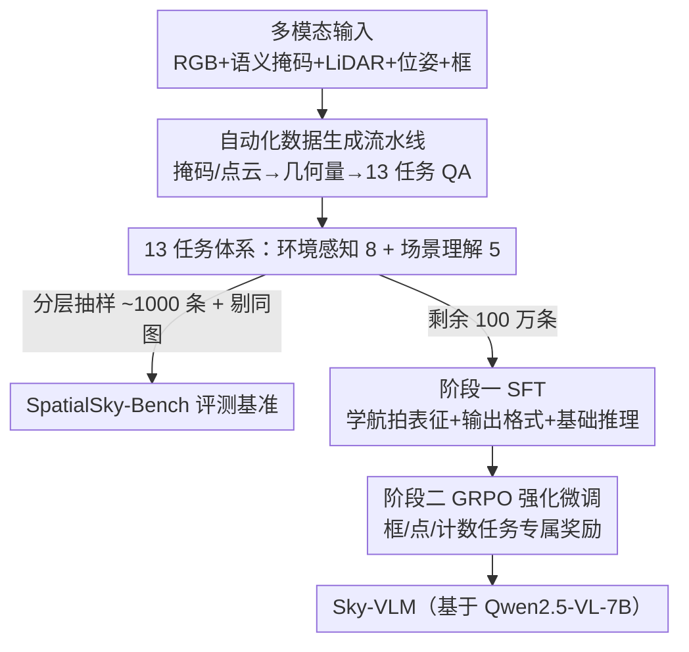

# Is your VLM Sky-Ready? A Comprehensive Spatial Intelligence Benchmark for UAV Navigation

**会议**: CVPR 2026  
**论文**: [CVF Open Access](https://openaccess.thecvf.com/content/CVPR2026/html/Zhang_Is_your_VLM_Sky-Ready_A_Comprehensive_Spatial_Intelligence_Benchmark_for_CVPR_2026_paper.html)  
**代码**: https://github.com/linglingxiansen/SpatialSKy  
**领域**: 多模态VLM  
**关键词**: 无人机导航、空间智能、VLM benchmark、SFT+GRPO、空中视角

## 一句话总结
本文构建了首个面向无人机（UAV）视角的空间智能评测基准 SpatialSky-Bench（2 大类 13 个细粒度任务），配套 100 万样本的自动生成训练集 SpatialSky-Dataset，并用「SFT + GRPO 强化微调」训出专用模型 Sky-VLM，平均分 53.30，比最强基线 GPT-5（23.07）高 139.6%。

## 研究背景与动机
**领域现状**：VLM 凭借强大的视觉感知与推理能力，已被广泛用于无人机的搜救、基础设施巡检、精准农业等导航任务。要支撑实时飞行决策，模型必须具备「空间智能」——理解物体间空间关系、做细粒度场景解析、给出精确的环境感知。

**现有痛点**：现有的 VLM 空间评测基准（VQA、GQA、VSI-Bench、MMSI-Bench、RefSpatial-Bench、RoboSpatial 等）几乎都建立在**地面或第一人称视角**上——室内场景、街景、手持相机照片。无人机的俯视/低空航拍视角带来一组全新挑战：物体尺度变化剧烈、自上而下的遮挡、缺乏深度信息、地面语义复杂，地面视角的基准根本测不出 VLM 在空中的真实能力。

**核心矛盾**：UAV 导航对空间智能的需求极高，但学界既没有「测得准」的空中视角基准，也没有「学得到」空中空间能力的大规模训练数据；现成 VLM 在 UAV 场景普遍缺乏精确的空间感知。

**本文目标**：(1) 造一个系统覆盖 UAV 空间能力的评测基准；(2) 造一个可规模化生成的训练集；(3) 训出一个真正会做 UAV 空间推理的专用 VLM。

**切入角度**：作者发现无人机数据集（UAVScenes）本身带有像素级语义掩码、LiDAR 点云、位姿等多模态标注，这些标注可以**自动**推导出边界框、距离、高度、空间关系等监督信号——于是用一条自动化流水线把原始标注转成海量问答对。

**核心 idea**：用「多模态标注自动生成 QA → SFT 学格式与基础推理 → GRPO 用任务专属奖励精修关键定位任务」三步，把通用 VLM 改造成 UAV 空间专家。

## 方法详解

### 整体框架
全文围绕三个产物展开：评测基准 **SpatialSky-Bench**、训练集 **SpatialSky-Dataset**、专用模型 **Sky-VLM**。流程是：先从带多模态标注的航拍数据自动生成覆盖 13 个任务的问答对（含人工复核），从中分层抽样约 1000 条作为 benchmark（并把同图其余 QA 从训练集剔除以防泄漏）；剩余 100 万条用于训练 Sky-VLM——第一阶段在全量数据上做监督微调（SFT）打基础，第二阶段在 3 万条定位类样本上用 GRPO 强化微调，针对边界框、指点、计数等需要像素级精度的任务设计任务专属奖励。

### 关键设计

**1. SpatialSky-Bench：两大类 13 任务的 UAV 空间能力体系**

针对「现有基准全是地面视角、测不到 UAV 空间能力」的痛点，作者把 UAV 导航所需的空间智能拆成两大类共 13 个细粒度子任务。**环境感知（8 项）**：边界框定位、目标颜色识别、物体间距离估计、UAV 视角高度感知、正向指点（给目标输出坐标）、反向指点（给坐标说出物体）、可行空间检测（找可导航区域）、空间关系理解。**场景理解（5 项）**：单图场景描述、多图时序描述、物体功能推理、不同尺度与遮挡下的物体计数、综合空间线索判断「此处能否降落」的着陆安全分析。每个任务配 task-specific 评测指标——框用 mIoU（IoU≥0.5 判对，公式 $\text{mIoU}=\frac1N\sum_i \frac{|B^i_{pred}\cap B^i_{gt}|}{|B^i_{pred}\cup B^i_{gt}|}$）；指点看预测坐标是否落在真值掩码内；选择题/类别识别用准确率；开放式任务（距离、高度、描述、功能、着陆）用 BLEU 加 GPT-4o 打 1–10 分。这样既能测结构化空间推理，又能测开放语义理解。

**2. 多模态标注驱动的自动化 QA 生成：把几何标注变成可学的语言监督**

构造 100 万样本若靠人工标注完全不现实。作者的关键做法是直接从 UAVScenes 的多模态标注**用几何运算反推答案**：边界框由像素级语义掩码的连通域转成轴对齐框；颜色在 HSV 空间对掩码内像素聚类取主色并映射成「light blue」等描述词；指点/反向指点在掩码内采 5–8 个像素坐标；可行空间取面积 >500 像素的背景连通域采点；空间关系由两物体掩码质心 $c_i,c_j$ 算方向角 $\theta_{ij}=\arctan\frac{\bar y_j-\bar y_i}{\bar x_j-\bar x_i}$ 与距离 $d_{ij}=\lVert c_i-c_j\rVert_2$（$d_{ij}>50$ 像素时归入左/右/上等八类）；距离直接用 LiDAR 点云投影到像面取平均深度 $d_{obj}=\frac1{|P_{obj}|}\sum_{p_k\in P_{obj}} z^{cam}_k$；高度用位姿变换矩阵 $T_{4\times4}$ 把点云转到世界坐标取绝对海拔。每个任务再用 VLM 生成 20+ 种问句模板防止模型靠模式匹配，并经人工专家二次复核。这条流水线让海量、格式多样（开放问答、选择、指点、框）的高质量 QA 得以规模化产出。

**3. SFT + GRPO 两阶段训练：先学会「说对格式」再学会「定得准」**

基于 Qwen2.5-VL-7B，作者用两阶段训练把通用 VLM 调成 UAV 空间专家。**第一阶段 SFT** 在全量 100 万样本上做，让模型学到区别于地面视角的航拍视觉表征、掌握 `<box>`/`<point>`/`<boxed>` 等任务输出格式、具备 13 个任务的基础推理；损失只对答案 token 计梯度：$L_{SFT}=-\frac1{n-k+1}\sum_{i=k}^n \log P(t_i|V,t_1,\dots,t_{i-1};\theta)$，把学习聚焦在「生成答案」而非「理解问题」。**第二阶段 RFT** 用 GRPO 在 3 万条定位类样本上精修，为关键任务设计可直接度量预测-真值偏差的奖励：指点用二值奖励（预测点与最近真值点的 L1 距离 $\le 50$ 给 1，否则 0），选择题用精确匹配奖励，边界框用连续的 IoU 作奖励信号；目标 $L_{GRPO}=-\mathbb{E}_{\pi_\theta}\big[R(y)\log\frac{\pi_\theta(y|x)}{\pi_{ref}(y|x)}\big]+\beta\,\text{KL}(\pi_\theta\Vert\pi_{ref})$，用 KL（$\beta=0.01$）拴住参考模型防跑偏。先 SFT 拿到行为基线、再用 GRPO 在像素级精度任务上拉满，是 Sky-VLM 在框/点/计数上大幅领先的直接原因。

### 损失函数 / 训练策略
SFT 阶段：8×H200，AdamW，学习率 1e-5，每卡 batch 2、梯度累积 2 步，训 1 epoch。RFT 阶段：GRPO，学习率 1e-6、weight decay 0.1，以 SFT 模型为参考策略，KL 系数 $\beta=0.01$，训 1 epoch。

## 实验关键数据

### 主实验
在 SpatialSky-Bench 上对比闭源、开源通用、空间专用三类 VLM（13 任务平均分，部分代表任务）：

| 模型 | 参数 | 框(mIoU) | 颜色 | 着陆 | 平均↑ |
|------|------|----------|------|------|-------|
| GPT-4o | - | 0.24 | 45.00 | 50.70 | 21.27 |
| GPT-5 | - | 1.13 | 47.00 | 50.50 | 23.07 |
| Gemini-2.5-Pro | - | 3.45 | 46.00 | 46.30 | 22.75 |
| Qwen2.5-VL-7B | 7B | 2.38 | 46.00 | 31.32 | 16.93 |
| SpatialVLM（空间专用） | 8B | 0.96 | 21.00 | 25.90 | 19.02 |
| **Sky-VLM（本文）** | 7B | **42.68** | **79.00** | **61.40** | **53.30** |

闭源模型平均分 20.11–23.07、开源 VLM 仅 13.93–18.65，连空间专用模型也迁不到 UAV 视角（SpatialVLM 19.02 / SpaceR 12.61 / VILASR 13.45）。Sky-VLM 平均 53.30，比最强基线 GPT-5 高 **139.6%**；其中框 42.68 mIoU（比 SpaceR 高 473%）、颜色 79.00、着陆 61.40，全任务 SOTA。

### 消融实验

| 配置 | 环境感知↑ | 场景理解↑ | 总平均↑ | 说明 |
|------|-----------|-----------|---------|------|
| Sky-VLM-SFT | 52.53 | 41.52 | 48.29 | 仅 SFT |
| Sky-VLM-RL（Full） | 60.33 | 42.06 | 53.30 | SFT + GRPO |

奖励函数消融（在 GRPO 中逐个去掉奖励项）：去掉**指点奖励**环境感知从 60.33 跌到 53.77（掉幅最大），去掉框奖励、选择奖励总平均分别降到 49.72、50.27。

### 关键发现
- **GRPO 强化微调是定位精度的关键**：仅 SFT 的环境感知 52.53，加 GRPO 升到 60.33（+14.8%），而场景理解（偏开放语义）几乎不变（41.52→42.06），说明 RFT 主要补的是像素级结构化定位能力。
- **指点奖励最重要**：去掉后掉点最多，印证「准确的坐标预测是空间推理的基础」——框/点/计数这类强结构任务最吃奖励信号。
- **现成 VLM 在 UAV 视角集体失灵**：即便是 GPT-5、Gemini-2.5-Pro 也只有 ~23 分，且空间专用模型并不能迁移到空中视角，凸显 UAV 空间智能确实是被忽略的能力缺口。
- 数据规模实验（0K→1M）显示性能随训练数据量增长（Fig. 7）。

## 亮点与洞察
- **「标注即监督」的自动化数据引擎**：把无人机数据集里现成的掩码、LiDAR、位姿用几何运算反推成 13 类任务的答案，绕开了昂贵的人工空间标注，一举生成 100 万样本——这套思路可迁移到任何带多模态几何标注的领域（自动驾驶、机器人）。
- **基准与模型同时交付**：不只提出「现成 VLM 不行」的诊断，还给出 benchmark + dataset + 模型的完整闭环，并严格剔除 benchmark 同图 QA 防数据泄漏，评测可信度高。
- **两阶段分工清晰**：SFT 管「会说对格式与基础推理」，GRPO 管「定位定得准」，且奖励直接用 IoU/L1 距离这类可微度量任务偏差——对需要结构化坐标输出的任务，这种「先模仿后强化」范式很值得借鉴。

## 局限与展望
- 模型基于 Qwen2.5-VL-7B 单一骨干，未验证范式在更大/不同架构 VLM 上的可迁移性。
- 着陆安全等开放式任务依赖 GPT-4o 作自动评判，评分可能带评判模型自身偏差；BLEU 对语义正确性的刻画也有限。
- 训练集由 UAVScenes（22 类、2 万图）派生，场景与类别多样性受源数据集约束；真实复杂气象/光照/动态障碍下的泛化未充分验证。
- 数据由 VLM 自动生成 + 人工抽检，自动生成答案的系统性误差（如颜色聚类、深度投影噪声）可能被模型继承，原文未量化这部分噪声影响（⚠️ 以原文为准）。

## 相关工作与启发
- **vs 地面视角空间基准（VSI-Bench / MMSI-Bench / RefSpatial-Bench / RoboSpatial）**：它们聚焦地面或第一人称视角的空间推理，本文专攻 UAV 俯视视角，直面尺度突变、自上而下遮挡、缺深度等空中特有挑战，填补了该视角的评测空白。
- **vs 空间专用 VLM（SpatialVLM / SpaceR / VILASR）**：这些模型在地面空间任务上表现不错，但本文实验证明它们迁不到 UAV 视角（均 <20 分），说明 UAV 空间智能需要专门的数据与训练，而非简单复用地面空间模型。
- **vs UAV 导航中的 VLM 用法（UAV-VLA / See-Point-Fly / SoraNav / VLM-RRT）**：这些工作把 VLM 当作规划/指点接口直接用，本文则退一步先系统评测并强化 VLM 自身的空间感知，为上层导航决策打地基。

## 评分
- 新颖性: ⭐⭐⭐⭐ 首个 UAV 视角空间智能基准 + 自动化数据引擎，视角切换带来真实新问题，但 SFT+GRPO 训练范式本身较成熟
- 实验充分度: ⭐⭐⭐⭐⭐ 横跨闭源/开源/空间专用三类基线、13 任务全覆盖，含训练阶段、奖励项、数据规模多组消融
- 写作质量: ⭐⭐⭐⭐ 任务体系与数据流水线交代清晰，公式完整；部分指标（着陆 GPT-4o 评分细节）可更透明
- 价值: ⭐⭐⭐⭐⭐ benchmark+dataset+模型完整开源，直接推动 UAV 场景 VLM 研究落地

<!-- RELATED:START -->

## 相关论文

- [\[CVPR 2026\] SpatialScore: Towards Comprehensive Evaluation for Spatial Intelligence](spatialscore_towards_comprehensive_evaluation_for_spatial_intelligence.md)
- [\[CVPR 2026\] Scaling Spatial Intelligence with Multimodal Foundation Models](scaling_spatial_intelligence_with_multimodal_foundation_models.md)
- [\[CVPR 2026\] SpatialTree: How Spatial Intelligence Branches Out in MLLMs](spatialtree_how_spatial_intelligence_branches_out_in_mllms.md)
- [\[CVPR 2026\] Twin-T & TwintVQA: A Reliable Structure-Detail Separating VLM and a Comprehensive Benchmark for Chart and Table Tasks](twin-t_twintvqa_a_reliable_structure-detail_separating_vlm_and_a_comprehensive_b.md)
- [\[CVPR 2026\] PAI-Bench: A Comprehensive Benchmark for Physical AI](pai-bench_a_comprehensive_benchmark_for_physical_ai.md)

<!-- RELATED:END -->
