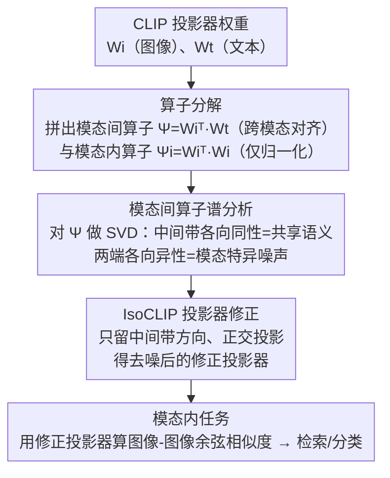

# IsoCLIP: Decomposing CLIP Projectors for Efficient Intra-modal Alignment

**会议**: CVPR 2026  
**arXiv**: [2603.19862](https://arxiv.org/abs/2603.19862)  
**代码**: [https://github.com/simomagi/IsoCLIP](https://github.com/simomagi/IsoCLIP)  
**领域**: 多模态VLM / CLIP 分析  
**关键词**: CLIP, 模态内对齐, 投影头分析, 奇异值分解, 各向同性子空间

## 一句话总结

IsoCLIP 从理论上分析 CLIP 投影头的结构，发现余弦相似度计算中隐含一个模态间算子 $\Psi = W_i^\top W_t$ 负责跨模态对齐，和一个模态内算子 $\Psi_i = W_i^\top W_i$ 仅负责归一化但不促进模态内对齐；通过对 $\Psi$ 的奇异值分解识别出近似各向同性(isotropic)的对齐子空间，去除各向异性方向后无需训练即可显著改善模态内检索和分类性能。

## 研究背景与动机

1. **领域现状**：CLIP 等视觉语言模型主要为跨模态任务（如零样本分类、图文检索）设计，但其图像编码器也被广泛用于模态内任务（如图像-图像检索、图像分类）。
2. **现有痛点**：CLIP 存在模态内错位(intra-modal misalignment)问题——对比训练仅优化跨模态相似度而忽略模态内相似度，导致模态内任务性能次优。现有修复方法如 OTI/OVI 需要昂贵的逐查询优化。
3. **核心矛盾**：CLIP 训练目标仅包含跨模态对齐，模态内对齐完全被忽略。
4. **本文目标**：理解模态内错位的根源并提出高效的无训练修复方案。
5. **切入角度**：从 CLIP 投影头的数学结构入手，分析余弦相似度和对比损失中的算子角色。
6. **核心 idea**：通过 SVD 分解模态间算子，识别两个模态良好对齐的各向同性子空间，去除各向异性方向。

## 方法详解

### 整体框架

这篇论文想搞清楚一件事：为什么 CLIP 的图像编码器拿来做图像-图像检索这类模态内任务时效果总是差一截，又怎么不重新训练就把它补上。IsoCLIP 的整条思路不碰任何特征、不跑任何优化，只在 CLIP 投影头那两个权重矩阵上做文章——把图像投影器 $W_i$ 和文本投影器 $W_t$ 拼成一个模态间算子 $\Psi = W_i^\top W_t$，对它做一次 SVD $\Psi = U\Sigma V^\top$，从奇异值谱里挑出那段"两个模态对得最齐"的中间带，把谱两端那些只服务于单一模态的方向压掉，得到一对修正后的投影器，直接用于模态内任务。所以整个方法从输入到输出就是一条「分析 → 诊断 → 修复」的线性流水线：权重矩阵 → 算子分解 → SVD 谱分析 → 中间带正交投影 → 新权重，没有任何可训练环节。

### 关键设计

**1. 模态间 / 模态内算子分解：从梯度里看出 CLIP 根本没在学模态内对齐**

要解释 CLIP 为什么模态内吃亏，作者没停留在经验观察，而是直接去推对比损失对图像特征的梯度。推导下来梯度自然裂成两块：一块是 $\Psi = W_i^\top W_t$，它把配对的文本特征投回图像空间，正是这一项在拉近图文跨模态相似度；另一块是 $\Psi_i = W_i^\top W_i$，它只作用在图像特征自己身上、约束的是范数。关键就在这里——训练时一张图像只通过 $\Psi$ 和文本发生关系，而图像与图像之间唯一的接触点 $\Psi_i$ 只牵涉它自身，从头到尾没有任何一项在促使两张图像靠近。换句话说 CLIP 的损失里压根不存在模态内对齐的信号，模态内任务次优不是调参没调好，而是目标函数结构上就漏了这块。

**2. 模态间算子的谱分析：奇异值谱两端是模态特异噪声，中间带才是共享语义**

既然 $\Psi$ 是承载跨模态关系的核心，作者就把它拆开看奇异值谱长什么样。结果很整齐：不管是 ViT-B/16 还是 B/32，不管预训练数据是 OpenAI 还是 DataComp，所有 CLIP 模型的谱都呈现同一种形态——谱的两端（最大和最小奇异值对应的方向）高度各向异性，对一个模态的拉伸远强于另一个模态，因而是"模态特异"的；夹在中间的那一带则近似各向同性，两个模态在这些方向上被同等对待、对得最齐。各向异性之所以有害，是因为它会把投影后的特征往单一模态偏好的方向上拽，淹没掉两模态真正共享的语义，模态内相似度自然就被这些方向污染了。

**3. IsoCLIP 投影器修正：留中间带、弃两端，正交投影改写权重**

诊断清楚后修复就很直接：把 $\Psi$ 的奇异值按从大到小排开，只保留中间带 $[k_t,\,r-k_b]$ 那段各向同性方向（$r$ 是 $\Psi$ 的秩，$k_t$、$k_b$ 分别是从顶端、底端掐掉的方向数），丢掉谱两端的模态特异方向。具体做法不是去改奇异值的大小，而是用这段中间带的左/右奇异向量张成子空间 $\mathcal{S}_U$、$\mathcal{S}_V$，构造正交投影算子 $U_{\mathcal{S}_U}U_{\mathcal{S}_U}^\top$、$V_{\mathcal{S}_V}V_{\mathcal{S}_V}^\top$，把原投影器投影上去：$\widehat{W}_i = W_i U_{\mathcal{S}_U}U_{\mathcal{S}_U}^\top$、$\widehat{W}_t = W_t V_{\mathcal{S}_V}V_{\mathcal{S}_V}^\top$。这等价于把 $\Psi$ 两端那些极端方向直接清零、只让两模态共享的语义方向参与投影。修正后的 $\widehat{W}_i$ 把模态内算子 $W_i^\top W_i$ 的谱拉平、把相似度分散到更多方向上，正负样本分得更开、模态内判别性更强。整个操作只读投影器权重、做一次 SVD 再做正交投影，不需要任何训练、优化或回看数据，推理时也不引入额外开销——本质上就是把模态特异的"噪声方向"从投影头里删掉。

### 损失函数 / 训练策略

无需训练。IsoCLIP 是纯后处理方法，只对现有 CLIP 模型的投影器权重做一次 SVD 和谱截断即可。

## 实验关键数据

### 主实验

| 任务/数据集 | 指标 | CLIP 原始 | OTI (优化) | IsoCLIP | 提升 vs CLIP |
|-----------|------|----------|-----------|---------|-------------|
| CIFAR-100 I2I检索 | Recall@1 | 54.2 | 58.7 | 61.3 | +7.1 |
| CUB-200 I2I检索 | Recall@1 | 24.8 | 29.1 | 32.5 | +7.7 |
| STS-B T2T检索 | Spearman | 0.71 | 0.74 | 0.77 | +0.06 |

IsoCLIP 在图像-图像检索和文本-文本检索上均显著优于原始 CLIP，且无需逐查询优化。

### 消融实验

| 配置 | CIFAR-100 R@1 | 延迟 | 说明 |
|------|-------------|------|------|
| CLIP 原始 | 54.2 | 1x | 基线 |
| OTI (100步) | 58.7 | ~50x | 需要逐查询优化 |
| OTI (500步) | 59.3 | ~250x | 更多步略好但极慢 |
| IsoCLIP (中间50%) | 60.1 | 1x | 保留 50% 奇异值 |
| IsoCLIP (中间70%) | 61.3 | 1x | 最优截断比例 |

### 关键发现

- IsoCLIP 无额外延迟即超越需要 100+ 优化步的 OTI，延迟降低约 50 倍
- 各向同性子空间的发现在不同 CLIP 架构(ViT-B/16, B/32)和预训练数据(OpenAI, DataComp)上一致
- 截断比例对性能影响温和，中间 50%-70% 效果稳定
- 在分类任务上（如 few-shot）也有提升，说明改善的模态内相似度有广泛受益

## 亮点与洞察

- **优雅的理论分析**：从 CLIP 对比损失和投影头的数学结构严格推导出模态内错位的根源，不是经验观察而是理论证明
- **模态间算子 $\Psi$ 的发现**：CLIP 的余弦相似度本质上依赖 $W_i^\top W_t$ 这个跨模态映射，这是一个深刻的结构性洞察
- **零额外计算**：仅操作投影器权重矩阵，推理时完全无额外开销

## 局限与展望

- 线性投影器假设限制了分析范围，非线性投影头需要其他方法
- 截断比例是超参数，最优值可能随模型和任务变化
- 只分析了 CLIP 式模型，SigLIP 等其他 VLM 的投影头结构可能不同
- 未来可探索非对称截断策略或自适应确定截断比例

## 相关工作与启发

- **vs OTI/OVI**: OTI 通过优化反转模态解决错位，IsoCLIP 直接修改投影器，更高效
- **vs Modality Gap**: Liang et al. 发现模态间隙但未修复，IsoCLIP 从投影头角度提供了修复方案
- **vs CLIP fine-tuning**: 微调可能损失零样本能力，IsoCLIP 完全不改变模型参数

## 评分

- 新颖性: ⭐⭐⭐⭐⭐ 理论分析深刻，模态间/内算子的分解是原创洞察
- 实验充分度: ⭐⭐⭐⭐ 多模型、多任务验证
- 写作质量: ⭐⭐⭐⭐⭐ 理论推导清晰，实验设计合理
- 价值: ⭐⭐⭐⭐⭐ 零成本提升 CLIP 模态内性能，实用价值极高

<!-- RELATED:START -->

## 相关论文

- [\[CVPR 2026\] Reevaluating the Intra-Modal Misalignment Hypothesis in CLIP](reevaluating_the_intra-modal_misalignment_hypothesis_in_clip.md)
- [\[CVPR 2026\] DeAR: Fine-Grained VLM Adaptation by Decomposing Attention Head Roles](dear_fine-grained_vlm_adaptation_by_decomposing_attention_head_roles.md)
- [\[CVPR 2026\] Boosting Visual Reprogramming for CLIP with Dual Granularity Alignment](boosting_visual_reprogramming_for_clip_with_dual_granularity_alignment.md)
- [\[CVPR 2026\] CoV-Align: Efficient Fine-grained Cross-Modal Alignment with Cohesive Visual Semantics Priority](cov-align_efficient_fine-grained_cross-modal_alignment_with_cohesive_visual_sema.md)
- [\[CVPR 2026\] Reconstructing CLIP for Open-Vocabulary Dense Perception](reconstructing_clip_for_open-vocabulary_dense_perception.md)

<!-- RELATED:END -->
