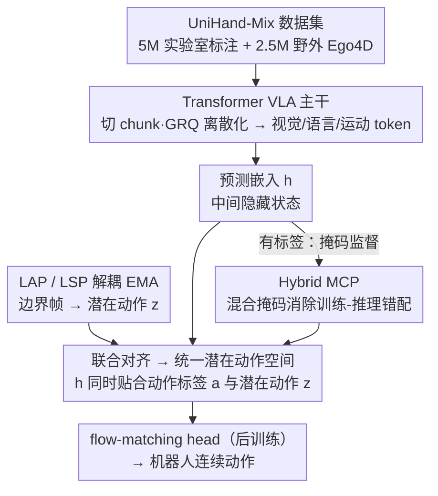

# Joint-Aligned Latent Action: Towards Scalable VLA Pretraining in the Wild

**会议**: CVPR 2026  
**arXiv**: [2602.21736](https://arxiv.org/abs/2602.21736)  
**代码**: [https://research.beingbeyond.com/jala](https://research.beingbeyond.com/jala)  
**领域**: 多模态VLM  
**关键词**: VLA预训练, 潜在动作, 人类视频, 手部运动, 机器人操作

## 一句话总结
提出 JALA 框架，通过联合对齐预测嵌入与逆动力学生成的潜在动作，构建统一的潜在动作空间，使 VLA 能同时从标注数据和未标注的野外人类视频中学习，配合 7.5M 样本的 UniHand-Mix 数据集显著提升机器人操作泛化性。

## 研究背景与动机
**领域现状**：VLA（Vision-Language-Action）模型通过将视觉-语言模型适配到机器人数据来学习操作策略，但机器人数据的规模和多样性远不及视觉/语言领域。

**现有痛点**：利用人类视频数据存在质量-多样性 trade-off——实验室数据有精确手部追踪但场景受限，野外视频有丰富多样性但缺乏动作标注。

**核心矛盾**：先前的潜在动作方法（如 LAPA）依赖逆动力学模型推断潜在动作+前向动力学模型重建未来帧，但精细人手操作的视频重建极其困难，FDM 的质量瓶颈反过来污染了潜在动作的质量。

**本文目标** 如何在不依赖视觉重建的前提下，从标注和未标注的异构人类视频中提取有用的动作信号进行 VLA 预训练。

**切入角度**：人类通过可迁移的动作模式学习操作，而非记忆每个视觉细节。潜在动作应该从上下文可预测且与逆动力学一致，但不需要重建像素。

**核心idea**：用联合对齐（Joint Alignment）替代重建：VLA 的中间隐藏状态（预测嵌入）同时与动作标签和 IDM 推断的潜在动作对齐。

## 方法详解

### 整体框架
JALA 想解决的核心问题是：怎么让一个 VLA 既能吃实验室那种带精确手部标注的视频，又能吃 Ego4D 那种没有任何动作标签的野外视频，而不被 LAPA 式的"重建未来帧"瓶颈拖累。它的思路是把动作信号收敛到 VLA 自己的隐藏状态里，而不是去重建像素。

一段人类视频先被切成若干运动 chunk，Transformer 主干把视觉帧、语言指令、运动 token 一起编码，对运动 chunk 做掩码预测来学习动作模式；与此同时，一个 Latent Action Perceiver（LAP）从每个 chunk 的首尾两帧推断出该段的"潜在动作"，再让 VLA 在那一步的隐藏状态（论文称之为预测嵌入）去对齐这个潜在动作。这样一来，有标签时由动作 token 监督、没标签时由视觉动态监督，两条信号都汇到同一个隐藏状态上。预训练结束后，再接一个 flow-matching head 把预测嵌入翻译成真实机器人动作，完成向操作任务的迁移。

### 关键设计

**1. 联合对齐：用嵌入对齐替代未来帧重建，绕开 FDM 的质量瓶颈**

LAPA 这类方法靠"逆动力学推断潜在动作 + 前向动力学重建未来帧"来约束潜在动作空间，但精细的手部操作视频几乎无法被准确重建，重建器一旦失真就会反过来污染潜在动作。JALA 的做法是直接放弃重建：让 VLA 在第 $i$ 段第 $k$ 步的隐藏状态 $h_{i,k}$ 同时满足两个约束——一是通过掩码预测还原正确的运动 token $a_{i,k}$，二是与 LAP 生成的潜在动作 $z_{i,k}$ 对齐，对齐损失取 L1 距离：

$$\mathcal{L}_{Align} = \sum_{i,k} \|h_{i,k} - z_{i,k}\|_1$$

掩码预测只在有动作标签时才提供监督，而 $z_{i,k}$ 是从任意视频的画面变化里算出来的、不依赖标签，于是两路信号互补，把标注数据和野外视频拉进同一个潜在动作空间，而代价里完全没有"重建像素"这一项。

**2. LAP 与 LSP 的解耦 EMA 更新：让动作锚定和上下文预测各自慢慢收敛**

潜在动作的产生和使用其实是两件事：LAP 看一段运动的边界帧 $(v_t, v_{t+\delta})$，把"这段发生了什么动作"编码成 $z$；LSP 看初始帧，把 VLA 的上下文映射到同一个空间里去预测这个动作。两者共享同一套 Perceiver 架构，但如果直接把不同视觉编码器的特征空间硬连在一起，训练会非常不稳定。JALA 用一组非对称的 EMA 来解耦：backbone 权重从 LSP 慢慢传给 LAP，query 权重则从 LAP 慢慢传给 LSP。这样 backbone 专心负责"读懂上下文"、query 专心负责"锚定动作"，两边各自渐进融合而不互相冲垮。

**3. 混合掩码 chunk 预测（Hybrid MCP）：消除全掩码带来的训练-推理错配**

动作监督是在 chunk 粒度上做掩码预测的。最直白的做法是把目标 chunk 整段掩掉去预测，但这会造成训练和推理时上下文不一致。JALA 改成混合策略：随机挑一个 chunk 作为主预测目标，它之前的 chunk 原样保留作为上下文，目标 chunk 内部按随机比例掩码，它之后的 chunk 只以 5% 的小概率掩码。推理时对同一段多次解码再做 ensemble，进一步稳住输出。这样既保留了足够的上下文对齐，又避免了"训练全掩、推理半掩"的分布偏移。

**4. UniHand-Mix 数据集：把"精确但受限"和"多样但无标"两类视频拼成一个 7.5M 规模的预训练池**

方法能从无标签视频学习，前提是有一批足够大、足够杂的视频。JALA 构建了 UniHand-Mix：5M 以上的实验室标注样本（带精确的 MANO 手部追踪）配上 2.5M 的野外 Ego4D 样本，后者先用手部检测过滤掉看不到手的片段、再用 Gemini 做手部活动校验并生成指令，其中约 10% 进一步用 HaWoR 估计出置信度 ≥0.65 的伪手部姿态作为弱标注。整体覆盖 2000 小时以上视频、共 7.5M 样本，在此前的 UniHand（约 5M 实验室样本）之上补齐了野外多样性，正好对上前面"实验室数据精确但场景窄、野外数据多样但没标注"的矛盾。

### 后训练迁移
预训练得到的预测嵌入并不是机器人能直接执行的动作。后训练阶段在其上接一个 Diffusion Transformer 的 flow-matching head，通过交叉注意力把预训练学到的操作先验融进来，最终把预测嵌入翻译成连续的机器人动作。

## 实验关键数据

### 机器人操作（Libero 基准）

| 方法 | 参数量 | LIBERO-Spatial | LIBERO-Object | LIBERO-Goal | LIBERO-Long | 平均 |
|------|-------|---------------|---------------|-------------|-------------|------|
| OpenVLA | 7B | 84.7 | 88.4 | 79.2 | 53.7 | 76.5 |
| π0 | 3B | 76.9 | 96.0 | 89.4 | 68.2 | 82.6 |
| **JALA** | **~2B** | **优** | **优** | **优** | **优** | **超越同规模** |

### 手部运动生成（实验室 vs 野外）

| 方法 | 实验室 FID↓ | 野外 FID↓ |
|------|-----------|----------|
| Being-H0 (仅实验室) | 较好 | 较差 |
| **JALA** | **保持** | **显著改善** |

### 关键发现
- JALA 在野外场景生成更真实的手部运动，同时保持实验室性能
- 相比仅用实验室数据，混合训练在 Libero 各子任务上一致提升
- 联合对齐比单独使用 MCP 或 LAP 都更好
- 在真实世界机器人任务（尤其是分布外场景）中表现优异

## 亮点与洞察
- **绕过FDM重建**是关键创新：不重建像素而是对齐嵌入，避免了最大的质量瓶颈
- **解耦EMA更新**的设计精巧：让 backbone 负责上下文，query 负责动作锚定，各取所长
- 7.5M 的 UniHand-Mix 是目前最大的人手操作预训练数据集
- 从人类视频到机器人操作的迁移路径（预训练→flow-matching 后训练）简洁高效

## 局限与展望
- 野外视频的 pseudo hand-pose annotation 置信度阈值 0.65 仍可能引入噪声
- MANO 参数表示限制了对非手部操作（如使用工具）的建模
- UniHand-Mix 的视频多为 egocentric 视角，第三人称视角的人类操作视频未纳入
- 真实世界机器人实验的任务种类和规模还有扩展空间

## 相关工作与启发
- **vs LAPA**: LAPA 通过 FDM 重建约束潜在动作空间，JALA 通过联合对齐绕过重建瓶颈
- **vs Being-H0**: Being-H0 仅用实验室标注数据，JALA 通过 LAP 扩展到野外视频
- **vs OpenVLA/RoboVLM**: 这些方法直接在机器人数据上训练，JALA 通过人类视频预训练获得更丰富的操作先验
- 潜在动作对齐的思路可推广到其他需要从异构数据中学习动作的场景

## 评分
- 新颖性: ⭐⭐⭐⭐⭐ 联合对齐范式革新了潜在动作学习方式
- 实验充分度: ⭐⭐⭐⭐ 手部生成+模拟+真实世界多维度验证
- 写作质量: ⭐⭐⭐⭐ 方法动机推导清晰，图示直观
- 价值: ⭐⭐⭐⭐⭐ 为VLA从人类视频的可扩展预训练提供了关键方法论

<!-- RELATED:START -->

## 相关论文

- [\[CVPR 2026\] From Observation to Action: Latent Action-based Primitive Segmentation for VLA Pre-training in Industrial Settings](from_observation_to_action_latent_action-based_primitive_segmentation_for_vla_pr.md)
- [\[CVPR 2026\] SIMPACT: Simulation-Enabled Action Planning using Vision-Language Models](simpact_simulation-enabled_action_planning_using_vision-language_models.md)
- [\[CVPR 2026\] Dictionary-Aligned Concept Control for Safeguarding Multimodal LLMs](dictionary_aligned_concept_control_for_safeguarding_multimodal_llms.md)
- [\[ICML 2026\] Vision-aligned Latent Reasoning for Multi-modal Large Language Model](../../ICML2026/multimodal_vlm/vision-aligned_latent_reasoning_for_multi-modal_large_language_model.md)
- [\[CVPR 2026\] Concept-Aware Batch Sampling Improves Language-Image Pretraining](concept-aware_batch_sampling_improves_language-image_pretraining.md)

<!-- RELATED:END -->
