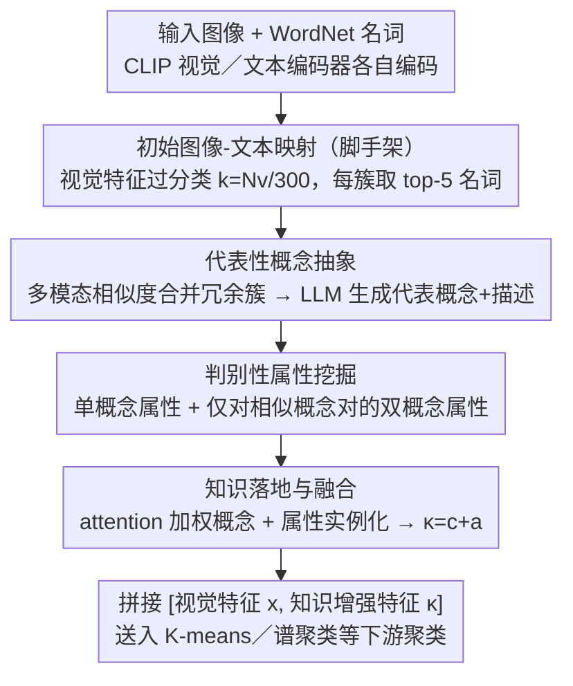

# KEC: Hierarchical Textual Knowledge for Enhanced Image Clustering

**会议**: CVPR 2026  
**arXiv**: [2604.11144](https://arxiv.org/abs/2604.11144)  
**代码**: 无  
**领域**: 多模态VLM  
**关键词**: 图像聚类, 文本知识, 大语言模型, CLIP, 判别性属性

## 一句话总结
KEC 利用 LLM 构建层级化的概念-属性结构化文本知识来引导图像聚类，在 20 个数据集上无需训练即超越零样本 CLIP 14 个数据集，证明了判别性属性比简单类名更有效。

## 研究背景与动机

**领域现状**：图像聚类从几何先验→深度表示学习→视觉语言模型辅助不断发展。CLIP 等 VLM 使文本知识注入聚类成为可能。

**现有痛点**：现有方法要么用 VLM 逐图生成描述（计算昂贵），要么从 WordNet 选取浅层名词（语义冗余、粒度不一）。朴素引入文本知识甚至可能损害聚类性能。

**核心矛盾**：视觉相似但语义不同的类别（如柯基 vs 柴犬）仅靠类名无法区分，需要判别性属性（如「柯基的腿更短更粗」），但获取这些属性需要专业知识且难以自动化。

**核心 idea**：用 LLM 从冗余名词中蒸馏抽象概念，再自动提取概念内和概念间的判别性属性，构建层级知识用于特征增强。

## 方法详解

### 整体框架
KEC 要解决的是「无训练图像聚类如何引入文本知识却不被噪声反噬」。它不让任何图像进 LLM，而是先在 CLIP 视觉特征上做「过分类」k-means（簇数 $k=N_v/300$ 远大于真实类别数），为每个簇挑出 top-5 个最相近的 WordNet 名词，得到一批原始但冗余的候选词；再让 LLM 把语义重叠的簇合并、蒸馏成少量干净的**代表概念**，并为容易混淆的**概念对**自动写出判别性属性；最后用 CLIP 文本编码器把概念与属性都编码成向量，对每张图像做 attention 加权与属性实例化，得到「知识增强特征」$\kappa$，与原始视觉特征 $x$ **拼接**后送进 K-means、谱聚类等现成聚类器。整条链路里 LLM 只做文本侧的知识构建，视觉侧始终是 CLIP，所以零训练、低成本。

### 关键设计

**1. 代表性概念抽象：把冗余名词蒸馏成有区分度的概念**

过分类阶段会产出远多于真实类别的视觉簇，每个簇又各自配上 top-5 名词，于是 car / automobile / vehicle 这类语义重叠的词会散落在不同簇里，直接拿来当聚类锚点只会稀释类别之间的区分度。KEC 先为每对簇算一个**多模态相似度** $R_{i,j}=\alpha R^{\text{vis}}_{i,j}+(1-\alpha)R^{\text{text}}_{i,j}$（视觉中心相似度与文本中心相似度的加权和），按阈值 $\beta$ 建邻接图、取连通分量把高度相似的簇合并、并起它们的名词集合；再交给 LLM 为每个合并集合生成一个能覆盖全部名词的**代表概念**及其文字描述。这一步本质是用 LLM 的常识把「名词噪声」收敛成「概念信号」，让后续的属性提取站在一组互不重叠的概念之上，而不是在近义词堆里打转。

**2. 判别性属性挖掘：用对比信息撑开视觉相似的类别**

光有概念名仍然区分不了「柯基 vs 柴犬」这种视觉相近的类别，人类区分它们靠的是腿长、毛发、耳朵形状这类判别性属性。KEC 让 LLM 分两路生成属性：**单概念属性**直接描述某个概念最具区分度的典型特征；**双概念属性**则把两个相似概念摆在一起、让 LLM 写出它们的差异点（如「柯基 vs 柴犬 → 柯基的腿更短更粗」）。为避免对所有概念对都两两枚举（开销大且多数明显不相似），KEC 先按概念间相似度排序、只取累积相似度超过阈值 $\beta$ 的若干近邻概念组成概念对，再对这些「真正容易混淆」的对挖属性。后者带来的「对比性」信息正是区分近似类别的关键，CLIP 的注意力图也印证了这些属性描述能把模型的注意力引到对应区域上。

**3. 知识落地与融合：把全局知识落到每一张图上**

前两步产出的是一套全局的概念-属性知识，还需要落到具体图像才有用。对一张图像 $x_i$，KEC 先把它和每个概念表示 $\zeta_q=\phi_q+\psi_q$（概念名特征+描述特征）算相似度并 softmax，得到一组 attention 权重 $\omega_{i,q}$；对属性则做「实例化」——把每条属性特征 $\xi_{q,l}$ 与图像特征逐元素相乘 $\hat{\xi}=x_i\odot\xi_{q,l}$ 再按概念取平均得 $\bar{\xi}^i_q$，让属性带上这张图自身的视觉上下文。最终用同一组 attention 权重把概念特征与属性特征聚合，相加得到知识增强特征：

$$c_i=\sum_q \omega_{i,q}\,\zeta_q,\qquad a_i=\sum_q \omega_{i,q}\,\bar{\xi}^i_q,\qquad \kappa_i = c_i + a_i$$

聚类时把视觉特征与知识增强特征**拼接** $[x_i,\kappa_i]$ 送进 K-means 等算法（训练型方法如 TAC 则把两者当互补视图联合优化）。因为 attention 权重与属性实例化都逐图计算，视觉接近但属性命中不同的两张图会拿到不同的增强向量，从而在特征空间里被推开——这正是朴素地给所有图像贴同一批名词做不到的。

### 一个例子：区分柯基与柴犬
一批狗图进来，过分类把柯基、柴犬散到若干视觉簇，每簇配上 dog / corgi / shiba 等近义名词；概念抽象按多模态相似度合并这些簇、归并成「柯基」「柴犬」两个干净概念；属性挖掘判断这对概念足够相似，于是写出「腿长（柯基更短更粗）」等差异属性；落地阶段，一张柯基图与「柯基」概念的 attention 权重高，「腿短粗」属性经逐元素实例化后得分突出，拼出的知识增强特征 $\kappa$ 明显偏向柯基一侧。与视觉特征拼接后，它与真正的柴犬图像在特征空间被拉开，下游聚类不再把两者混进同一簇。

### 损失函数 / 训练策略
KEC 本身无训练，直接生成增强特征送入现有聚类算法（K-means、谱聚类等）。

## 实验关键数据

### 主实验

| 对比 | 指标 | KEC (无训练) | 有训练方法 | 说明 |
|------|------|-------------|-----------|------|
| 20 数据集平均 | NMI | 优 | 低 3% | KEC 无训练超越有训练方法 |
| vs CLIP zero-shot | Acc | 14/20 数据集胜出 | - | - |

### 消融实验

| 配置 | NMI | 说明 |
|------|-----|------|
| KEC (完整) | 最优 | 概念+属性+融合 |
| 朴素文本知识 | 下降甚至负面 | 证明结构化知识必要 |
| 仅概念无属性 | 中等 | 属性贡献显著 |
| 仅单概念属性 | 次优 | 概念对属性进一步提升 |

### 关键发现
- 朴素引入文本知识（如直接用名词）在某些数据集上反而损害性能，证明了结构化知识的必要性
- 概念对的判别性属性比单概念属性贡献更大，说明"对比性"信息对区分相似类别至关重要
- KEC 对下游聚类算法的选择不敏感，兼容性好

## 亮点与洞察
- **LLM 作为知识源**：不需要图像输入 LLM，仅通过文本交互就能获取足够的判别性知识，成本极低
- **结构化 > 朴素**：证明了"知识质量"比"知识数量"更重要

## 局限与展望
- 依赖 CLIP 的文本-图像对齐质量
- LLM 生成的属性可能有偏差
- 未在细粒度数据集上与专门的细粒度方法对比

## 相关工作与启发
- **vs SIC/TAC**: 用浅层名词或 WordNet 直接标注，语义冗余严重
- **vs VLM captioning**: 逐图生成描述计算量大且不可扩展

## 评分
- 新颖性: ⭐⭐⭐⭐ 层级知识构建思路清晰
- 实验充分度: ⭐⭐⭐⭐⭐ 20 个数据集评估非常全面
- 写作质量: ⭐⭐⭐⭐ 动机和方法描述清楚
- 价值: ⭐⭐⭐⭐ 无训练即超越有训练方法，实用性强

<!-- RELATED:START -->

## 相关论文

- [\[AAAI 2026\] Harnessing Textual Semantic Priors for Knowledge Transfer and Refinement in CLIP-Driven Continual Learning](../../AAAI2026/multimodal_vlm/harnessing_textual_semantic_priors_for_knowledge_transfer_and_refinement_in_clip.md)
- [\[CVPR 2026\] Air-Know: Arbiter-Calibrated Knowledge-Internalizing Robust Network for Composed Image Retrieval](air-know_arbiter-calibrated_knowledge-internalizing_robust_network_for_composed_.md)
- [\[CVPR 2026\] Mimic Human Cognition, Master Multi-Image Reasoning: A Meta-Action Framework for Enhanced Visual Understanding](mimic_human_cognition_master_multi-image_reasoning_a_meta-action_framework_for_e.md)
- [\[CVPR 2026\] Proxy3D: Efficient 3D Representations for Vision-Language Models via Semantic Clustering and Alignment](proxy3d_efficient_3d_representations_for_vision-language_models_via_semantic_clu.md)
- [\[CVPR 2026\] TTL: Test-time Textual Learning for OOD Detection with Pretrained Vision-Language Models](ttl_test-time_textual_learning_for_ood_detection_with_pretrained_vision-language.md)

<!-- RELATED:END -->
