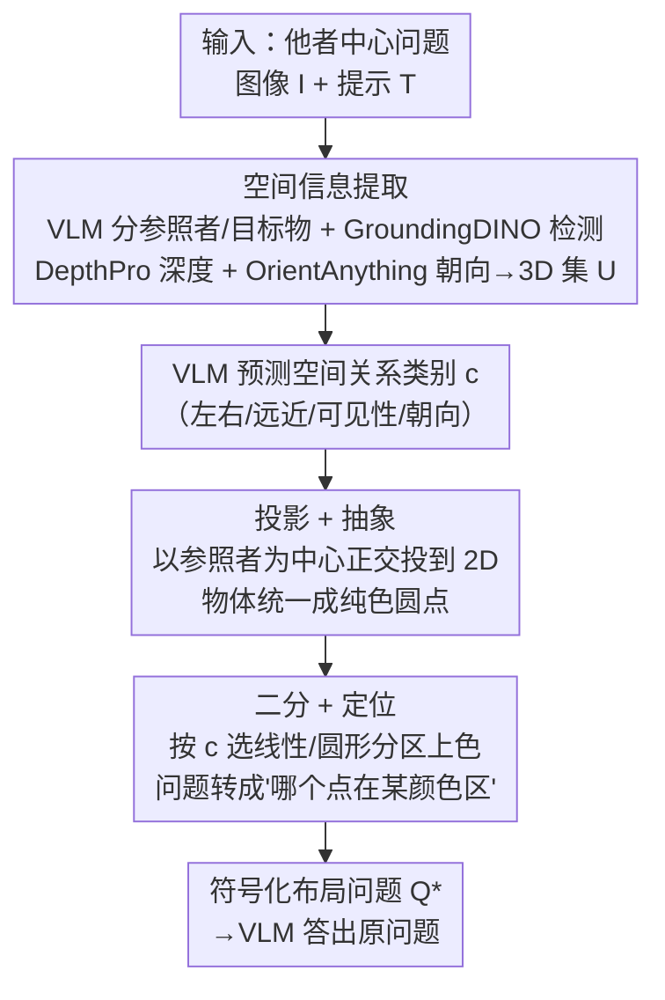

# Keep it SymPL: Symbolic Projective Layout for Allocentric Spatial Reasoning in Vision-Language Models

**会议**: CVPR 2026  
**论文**: [CVF Open Access](https://openaccess.thecvf.com/content/CVPR2026/html/Jang_Keep_it_SymPL_Symbolic_Projective_Layout_for_Allocentric_Spatial_Reasoning_CVPR_2026_paper.html)  
**代码**: https://airlabkhu.github.io/SymPL/ (项目页)  
**领域**: 多模态VLM / 空间推理  
**关键词**: 他者中心空间推理、视角变换、符号化布局、免训练、VLM 提示重构

## 一句话总结
SymPL 发现 VLM 做"从场景里某个物体的视角"出发的他者中心（allocentric）空间推理很差，于是免训练地把这类问题先抽取 3D 信息、再用投影/抽象/二分/定位四个因子改写成一张"哪个彩色圆点落在黄色区域"的符号化布局问题，把 VLM 不擅长的视角变换转成它天生擅长的"颜色区域定位"，在他者中心与自我中心任务上都大幅涨点。

## 研究背景与动机

**领域现状**：VLM 在自我中心（egocentric，从观察者/相机视角）空间推理上已有不少进展（SpatialVLM、SpatialRGPT、SpatialBot 等靠 3D 标注数据微调），但空间推理整体仍是短板。

**现有痛点**：一旦问题变成**他者中心**（从场景中某个物体的视角去判断左右/远近/朝向/可见性），VLM 性能急剧下降——很多基线甚至低于随机猜测。根因是训练数据有强烈的自我中心偏置，模型一遇到视角变换就懵。

**核心矛盾**：现有解法都不理想——从零在他者中心数据上训练，受限于这类数据稀缺、算力高，不可扩展；微调预训练 VLM 又泛化差、会灾难性遗忘；通用推理辅助（CoT、视觉提示 SoM/SCAFFOLD）不直接处理视角变换，收益有限；最接近的 APC 把他者中心查询转成自我中心查询，但仍然"没充分用上 VLM 自身的推理能力"。

**本文目标**：不额外训练，把他者中心推理问题**改写成 VLM 本来就擅长的形式**，从而最大化预训练 VLM 的内在能力。

**切入角度**：作者先做了一项分析——到底哪些因素和 VLM 的答题准确率正相关？由此提炼出四个让空间推理对 VLM 更友好的因子：① **投影 Projection**：把空间关系正交投到 2D 平面后更好处理；② **抽象 Abstraction**：把复杂场景简化成最少的抽象符号、减少干扰；③ **二分 Bipartition**：把推理空间做最小划分时关系更直观；④ **定位 Localization**：问"物体是否落在某个颜色区域内"比问方向/距离更准。

**核心 idea**：用这四个因子把他者中心问题重构成"符号化布局问题"（一张抽象彩色圆点图 + "哪个点在黄色区域"的问句），让 VLM 在它擅长的颜色定位任务上间接答出原始的视角相关问题。

## 方法详解

### 整体框架

给定一个他者中心问题 $Q$（图像 $I$ + 文本提示 $T$），SymPL 分两个阶段把它改写成符号化布局问题 $Q^*$，再把 $Q^*$ 喂给 VLM（实验中所有推理都用 Qwen2.5-VL）间接得到答案。第一阶段**空间信息提取**：识别出参照视角物体（reference viewer）和目标物体，用现成基础模型估出每个物体的 3D 坐标和参照者的朝向向量。第二阶段**问题重构**：先让 VLM 预测要推理的空间关系类别 $c$（左右/远近/可见性/朝向…），再依次施加投影、抽象、二分、定位四个因子，生成一张抽象彩色圆点图和一个"哪个点在某颜色区"的问句。下面这张图给出这条流水线：

### 关键设计

**1. 空间信息提取：用现成基础模型把图像变成可投影的 3D 坐标**

要做视角变换，先得知道每个物体在 3D 里的位置和参照者朝哪。作者用两步推理先分清角色：第一步让 VLM 从提示 $T$ 抽出所有物体名列表，第二步再从中识别出"参照视角物体" $o_r$（他者中心问题里通常显式给出；自我中心问题则把"相机"指定为参照者），构成物体集 $O=\{o_r, o_i\}$。接着估 3D 坐标：用 GroundingDINO 检测每个物体的框 $B$、用 DepthPro 估整图深度图 $D$；对每个物体，把它框内像素反投影到 3D，取**中位数**作为该物体 3D 位置 $p_j=(x_j,y_j,z_j)$（过程中挑深度值密度最高的区域选内点、剔除背景外点以减少非物体区域）。当 $x,y$ 坐标与深度 $z$ 的尺度差超过预设阈值时还做尺度校正，避免空间关系失真。参照者的朝向向量 $v_r$ 则把其框裁出来送进 OrientAnything 估计。最终得到 3D 信息集 $U=\{v_r, p_r, p_i\}$。这一步是后续所有几何改写的地基，但也是误差主要来源（见错误分析）。

**2. 投影 + 抽象：把 3D 关系搬到正交 2D 平面、再把物体统一成纯色圆点**

针对"VLM 处理斜视角下的 3D 关系很吃力"的痛点，投影步选一个**以参照者为中心、与空间关系所在平面正交**的外部视点：左右/远近/可见性/朝向这类平面内关系选俯视图（top view），上下这类高度关系选正视图（front view）；然后把每个物体的 3D 坐标 $p_j$ 投到 2D 坐标 $d_j$，并**把参照者朝向固定为 2D 平面里的"上方"、参照者位置固定在图像中心**，这样他者中心视角就被一致地映射成直观的 2D 空间关系。抽象步则把每个物体在投影坐标 $d_j$ 处画成一个**抹掉所有形状特征的纯色圆点**，仅靠颜色区分——因为换视角重建容易让物体形状失真、干扰 VLM 识别，统一成圆点反而让识别更稳定；每个物体名也被重写成"颜色-形状"组合的抽象符号名。消融显示，用抽象符号比直接在原图上贴分割掩码效果更好，正交投影视点的选择也至关重要（视点越偏离正确平面，上下类准确率越低）。

**3. 二分 + 定位：按关系类别选分区形状、把"方向/距离"问题降成"颜色区域定位"**

最后两步把抽象图变成一道 VLM 极擅长的定位题。二分步按预测类别 $c$ 决定分区边界形状：方向类（左右、可见性）用**线性分区**——左右用竖直分割线分两边、可见性（前后）用水平分割线分前后；距离类（远近、朝向）用**圆形分区**——远近以关注物体为圆心画圆边界、朝向以参照者朝向轴上一点为圆心，让距离差在图上一眼可辨。定位步给两个分区填上**与圆点颜色不同**的颜色（如左区涂黄、右区涂黑），于是语言里的"左"就被视觉化成"黄色"；原本"位于左侧"这种相对空间关系，就被降维成"哪个点落在黄色区域内"这种 VLM 能可靠回答的定位问题，得到最终符号化布局问题 $Q^*$。消融表明：有分区就比没分区好，但**分区数多少几乎不影响**；而颜色区域数一多准确率就暴跌，证实"二分 + 双色"是最优配置。

## 实验关键数据

### 主实验

他者中心 COMFORT# 与 3DSRBench（部分类别，% 准确率，越高越好）：

| 方法 | COMFORT# 左右 | 远近 | 可见性 | 朝向 | 3DSRBench 左右 | 可见性 | 朝向 |
|------|------|------|------|------|------|------|------|
| Random | 48.75 | 48.67 | 47.27 | 52.33 | 50.72 | 50.00 | 47.69 |
| Qwen2.5-VL | 48.17 | 72.33 | 51.17 | 51.33 | 36.25 | 48.40 | 65.03 |
| GPT-5 | 49.83 | 84.25 | 54.22 | 49.83 | 37.82 | 63.37 | 64.45 |
| APC-Vis（他者中心 SOTA） | 43.75 | 54.08 | 49.77 | 30.92 | 61.75 | 71.37 | 64.60 |
| **SymPL（本文）** | **69.00** | **97.33** | **91.41** | **91.50** | **79.94** | **75.00** | 70.95 |

大量基线 VLM 在他者中心任务上徘徊在随机水平甚至更低，连 GPT-5 也只在"远近"一类领先、其他类很差；SymPL 在几乎所有类别都大幅领先（3DSRBench 朝向类略低于 Gemini-2.5-Flash 的 72.25，排第二）。

把 SymPL 套到**自我中心** COCOSPATIAL 上同样有效：左右 89.83%、上下 94.33%，均超最佳基线，说明符号化布局对自我中心问题也能涨点。

### 消融实验

四因子逐步叠加（5 个通用 VLM 平均，COMFORT# 各类，括号为标准差）：

| 配置 | 左右 | 远近 | 可见性 | 朝向 |
|------|------|------|------|------|
| Setting 1（原始） | 46.60 | 63.80 | 52.00 | 52.80 |
| +投影 | 89.20 | 64.80 | 51.20 | 52.00 |
| +抽象 | 96.40 | 81.00 | 90.80 | 100.00 |
| +二分 | 97.00 | 91.00 | 84.60 | 100.00 |
| **+定位（完整）** | **100.00** | **100.00** | **100.00** | **100.00** |

视觉错觉（COMFORT VI）与多视角一致性（COMFORT Multi）下，SymPL 也都拿到各类最高：错觉场景左右 95.38%、前后/远近 100%；多视角左右 76.00、远近 96.50、可见性 86.00、朝向 74.00，均明显超 CoT/SoM/SCAFFOLD/APC。

### 关键发现
- **四因子协同**：逐步叠加时准确率持续上升，到完整版（Setting 5）五个 VLM 在四类上一致达到 100%，且标准差降到 0，说明四因子是互补而非冗余。
- **每个因子各有最优区间**：投影视点越偏离正确平面越差；抽象成符号比贴分割掩码好；分区"有比没有好、但数量无所谓"；颜色区域数一多准确率暴跌，故"二分 + 双色"最优。
- **误差几乎全来自前端基础模型**：在 3DSRBench 上人工分析 100 例，最常见错误是参照者**朝向向量估错**，其次是物体检测、3D 坐标、物体名识别错误；而符号化布局问题本身的推理几乎不出错——瓶颈在感知前端而非推理。

## 亮点与洞察
- **最"啊哈"的一点是问题降维**：把 VLM 不擅长的"从他者视角判断方向/距离"硬问题，转成它天生擅长的"哪个彩色点在黄色区域"的定位题——不是教模型变强，而是把问题改写成模型已经会的形式。
- **四因子是先做实证分析才提炼出来的**，每个都对应 VLM 一个可测量的偏好（正交投影、符号抽象、最小分区、颜色定位），不是拍脑袋设计，消融逐一验证了各自贡献。
- **免训练且即插即用**：完全靠现成基础模型（GroundingDINO/DepthPro/OrientAnything）+ 提示重构，不动 VLM 参数，自我中心问题上同样涨点，迁移成本低。
- 这种"把模型短板问题改写成长板问题"的思路可迁移到其他 VLM 弱项（如计数、遮挡关系），关键是先找到该任务上和准确率正相关的可操作因子。

## 局限与展望
- **强依赖前端基础模型**：整条流水线的误差几乎都来自朝向估计/检测/深度（朝向向量误差最突出），换更弱的检测或深度模型可能整体崩盘。
- **流程偏重、组件多**：需串联检测、深度、朝向三个外部模型 + 多步 VLM 调用，实时性与工程复杂度是隐性代价（论文未给端到端延迟，⚠️ 以原文为准）。
- 四因子在合成 COMFORT# 上完整版能到 100%，但真实 3DSRBench 上仍有差距，说明真实场景的 3D 估计噪声是主要瓶颈。
- 可改进方向：用更鲁棒/可微的 3D 与朝向估计、或对朝向误差做不确定性建模，把误差最大的环节补强。

## 相关工作与启发
- **vs APC（他者中心 SOTA）**：APC 把他者中心查询"转成自我中心查询"再让 VLM 答，但仍没充分用上 VLM 内在推理、且对相机视角易误判（在自我中心 COCOSPATIAL 上明显掉点）；SymPL 不做视角对换，而是把问题重写成颜色定位题，他者/自我中心都稳。
- **vs 视觉提示 SoM/SCAFFOLD**：它们在原图上贴掩码或撒点引导注意力，但不直接处理视角变换、对他者中心收益有限；SymPL 重建出一张正交投影的抽象图，从根上消除了视角难度。
- **vs SpatialVLM/SpatialRGPT 等微调路线**：这些靠 3D 标注数据微调、只擅长自我中心且泛化受限；SymPL 免训练、对两种视角都适用。

## 评分
- 新颖性: ⭐⭐⭐⭐⭐ "把视角难题重写成颜色定位题"+ 先实证提炼四因子，是少见且干净的新视角。
- 实验充分度: ⭐⭐⭐⭐⭐ 五个 benchmark（含视觉错觉、多视角一致性）、四组基线、四因子逐项消融 + 误差分析。
- 写作质量: ⭐⭐⭐⭐ 方法叙述清楚、图示丰富，但四因子在不同分区/视点下的细则较密，需对照图反复读。
- 价值: ⭐⭐⭐⭐ 给 VLM 空间推理短板提供了一条免训练、可迁移的思路，瓶颈诚实地指向感知前端。

<!-- RELATED:START -->

## 相关论文

- [\[CVPR 2026\] Hierarchical Process Reward Models are Symbolic Vision Learners](hierarchical_process_reward_models_are_symbolic_vision_learners.md)
- [\[CVPR 2026\] HOG-Layout: Hierarchical 3D Scene Generation, Optimization and Editing via Vision-Language Models](hog_layout_hierarchical_3d_scene_generation_optimization_and_editing.md)
- [\[CVPR 2026\] SpatiaLQA: A Benchmark for Evaluating Spatial Logical Reasoning in Vision-Language Models](spatialqa_a_benchmark_for_evaluating_spatial_logical_reasoning_in_vision-languag.md)
- [\[CVPR 2026\] Hear you are: Teaching LLMs Spatial Reasoning with Vision and Spatial Sound](hear_you_are_teaching_llms_spatial_reasoning_with_vision_and_spatial_sound.md)
- [\[CVPR 2026\] HandVQA: Diagnosing and Improving Fine-Grained Spatial Reasoning about Hands in Vision-Language Models](handvqa_diagnosing_and_improving_fine-grained_spatial_reasoning_about_hands_in_v.md)

<!-- RELATED:END -->
