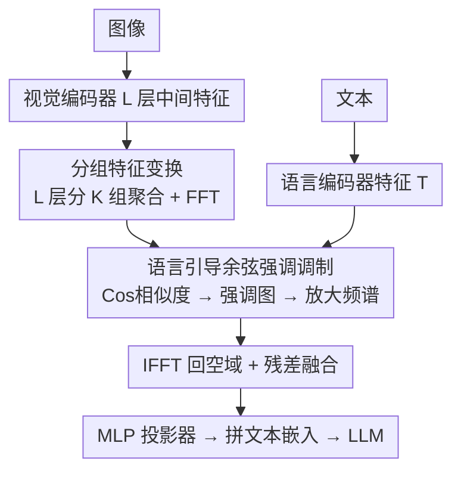

# Language-guided Frequency Modulation for Large Vision-Language Models

**会议**: CVPR 2026  
**论文**: [CVF Open Access](https://openaccess.thecvf.com/content/CVPR2026/html/Ouyang_Language-guided_Frequency_Modulation_for_Large_Vision-Language_Models_CVPR_2026_paper.html)  
**代码**: 待确认  
**领域**: 多模态VLM  
**关键词**: 大视觉语言模型, 频域调制, 语言引导, 傅里叶变换, 视觉细化

## 一句话总结
本文提出即插即用的 LFM：把 LVLM 喂给 LLM 之前的视觉细化从空间域搬到**频域**，用文本特征算出「强调图」选择性增强关键频带（高频对应局部细节、低频对应全局语境），不引入任何额外训练参数（只留一个轻量 MLP 投影器），在 GQA/MMB/MathVista 等多基准上稳定提升各种 LVLM。

## 研究背景与动机
**领域现状**：LVLM 普遍在把视觉特征送进 LLM 之前做一道「视觉细化」当作视觉-语言之间的桥，常见做法是线性投影、Q-former、Dense Connector，或引入注意力机制把视觉/语言 token 关联压缩——但这些操作几乎全在**空间域**进行。

**现有痛点**：不同的视觉-语言任务对视觉表征的需求差异很大——有的（如「画面里有几个球员」）要的是高层全局语境，有的（如「日历上的年份」）要的是细粒度局部细节。可空间域处理是隐式地同时学全局与局部，**没有一个显式机制去区分高频局部细节和低频全局语境**，于是难以对视觉表征做细粒度控制，也难和语言的层级结构对齐。

**核心矛盾**：语言本身是层级化的（「a yellow cup with patterns」里 cup 是整体物体、patterns/color 是修饰局部），而在频域里高频天然映射局部细节、低频天然映射全局形状/区域——这两套层级本可以一一对应，但空间域处理把它们糊在一起，错失了这种对齐。

**本文目标**：① 给视觉细化引入一个能**显式区分频带**的机制；② 让这种区分**受语言引导**、按任务需求选择性增强；③ 做到即插即用、几乎零额外参数与开销。

**切入角度**：作者发现频域提供了天然的语言层级↔频率层级映射，且频域里的逐点相乘（按卷积定理等价于空间域的动态卷积）能以全局操作、低冗余计算的方式调制整张图。

**核心 idea**：用「语言引导的频域调制」替代「空间域隐式细化」——把视觉特征 FFT 到频域，用文本算强调图选择性放大关键频带，再 IFFT 回空间域喂给 LLM。

## 方法详解

### 整体框架
LFM 接在视觉/语言编码器之后、LLM 之前。视觉编码器逐层抽出中间特征，LFM 先把这 $L$ 层分成 $K$ 组、每组聚合后 FFT 到频域；再用语言特征 $T$ 和每组频谱算余弦相似度得到「强调图」，对频谱做选择性放大；放大后的频谱 IFFT 回空间域、与原始层特征残差融合；最后所有组拼接过一个 MLP 投影器映射到 LLM 的语言空间，连同文本嵌入一起送进 LLM 做下游预测。除了那个 MLP 投影器，频域相关的全部步骤**不引入任何额外参数、不需要训练**。

### 关键设计

**1. 频域调制原理：把视觉细化搬进频域，等价于一把语言条件化的动态卷积核**

这是全文的立论基石，针对「空间域分不开高/低频」的痛点。对单通道特征图 $X(h,w)$ 做傅里叶变换 $\hat{X}(u,v)=\frac{1}{\sqrt{HW}}\sum_{h,w}X(h,w)e^{-2j\pi(\frac{h}{H}u+\frac{w}{W}v)}$，频域里高/低频分量是显式、可直接操控的。作者引入一个由频谱和语言特征共同动态生成的滤波器 $M(u,v)=f(\hat{X}(u,v),T)$，对频谱逐点相乘 $\hat{X}'(u,v)=\hat{X}(u,v)\odot M(u,v)$。关键在于：按卷积-乘法定理，频域逐点相乘等价于空间域里 $X'(h,w)=X(h,w)*\mathcal{F}^{-1}\{M(u,v)\}$，即**等于在空间域施加了一把动态卷积核，而这把核由语言条件化**。这既给出全局/局部信息的清晰平衡方式，又让每个频带都能按语言需求被选择性增强或抑制，可解释性更好。

**2. 分组特征变换：让不同深度的视觉层各管一段频谱**

图 2 显示视觉编码器不同层强调的信号不同（浅层偏局部、深层偏全局），单看最后一层会浪费这种层级差异。LFM 把 $L$ 层特征划成 $K$ 组（默认 $K{=}3$，每组层数约 $\lfloor L/3\rfloor$），组内按层求均值聚合 $V^{group}_k=\frac{1}{N_k}\sum_{j}\hat{V}_{l^j_k}$，再对每组聚合特征做 FFT 得频谱 $F_k=\mathrm{FFT}(V^{group}_k)$。分组既保证「广泛参与各视觉层」，又把计算开销压住。消融显示 3 组最优——比 No-Group（只用最后一层）显著更好，组数再增益处递减。

**3. 语言引导的余弦强调调制：用文本算强调图，零参数地选择性增强**

有了每组频谱，怎么让语言来「指方向」？LFM 计算频谱 $F_k$ 与语言特征 $T$ 的余弦相似度构成强调图 $S_k=\mathrm{Cos}(F_k,T)\in\mathbb{C}^{P^2}$，再对频谱按 $\hat{F}^p_k=F^p_k\cdot(1+\alpha_k S^p_k)$ 选择性放大（$p$ 为 patch 索引，$\alpha_k$ 为调制系数）。任务偏全局时强调图会聚向中心低频、偏局部时聚向边缘高频（图 1）。随后 IFFT 回空间域并与组内原始层特征残差融合 $V^f_k=\frac{1}{N_k}\sum_j V_{l^j_k}+\beta\cdot\mathrm{Re}(\mathrm{IFFT}(\hat{F}_k))$，各组拼接后过 MLP 投影器 $V^F=\mathrm{MLP}(\mathrm{Concat}[V^f_1,...,V^f_K])$ 进 LLM。除 MLP 外整条调制零额外参数。消融显示：频域的余弦调制（MMStar +2.18 / MMB +3.18）明显优于空间域调制与跨注意力，且 $\alpha_k$ 取**递减**策略（浅组系数大、深组小）最佳。

### 损失函数 / 训练策略
LFM 不改原 LVLM 的训练目标，沿用标准两阶段：预训练阶段冻结视觉/语言编码器和 LLM、只训 LFM 里随机初始化的 MLP（1 epoch，batch 24/GPU，lr 5e-4；非 CLIP 编码器则放开语言编码器以对齐特征空间）；指令微调阶段全参数优化（1 epoch，batch 64，lr 1e-5）。训练数据用 LLaVA-1.5（558K 预训练对 + 665K 对话）/ Mini-Gemini（1.2M+1.5M）/ InternVL-1.2 SFT（1.2M），默认 LLaVA-1.5 预训练 + InternVL 指令微调。

## 实验关键数据

> 指标说明：表中 SQAI(ScienceQA-IMG)、MMB(MMBench)、MMEp(MME 感知)、MM-Vet、MMMUv、Math(MathVista)、GQA、MMStar 均为视觉问答/推理基准，数值越高越好；MME 为 sum 分（千分量级），其余多为百分制。Res. 为输入分辨率，PT/IT 为预训练/指令微调数据量。

### 主实验
| 方法 | LLM | SQAI | MMB | MMEp | MM-Vet | MathVista | GQA |
|------|-----|------|-----|------|---------|-----------|-----|
| LLaVA-v1.5 | Vicuna-13B | 71.6 | 67.7 | 1531 | 36.1 | 27.6 | 63.3 |
| Dense Connector | Vicuna-13B | 77.1 | 74.4 | 1579 | 47.8 | 36.5 | 64.6 |
| **LFM** | Vicuna-13B (1.2M+1.5M) | **80.7** | **79.9** | **1648** | **50.2** | **38.7** | 65.7 |
| **LFM** | Yi-34B(LoRA) | 83.9 | 81.1 | 1669 | 43.2 | 40.4 | 65.1 |

在相同 LLaVA 框架下，LFM 跨 2.7B→34B 的多种 LLM 骨干稳定超过线性投影与 Dense Connector；接到 InternVL2.5、Qwen2.5-VL 等 SoTA LVLM 上（表 3）同样在 1B→8B 全规模、MME/MMB/MathVista 各基准一致提升，例如 LFM(w/ Qwen2.5-VL-7B) 把 MMVet 推到 69.8、MathVista 69.8。

### 消融实验
| 交互策略 | 免训练 | MMStar | MMB |
|------|--------|--------|-----|
| 无交互（baseline） | ✓ | 55.36 | 78.49 |
| 空间域·跨注意力（有参数） | ✗ | 56.58 (+1.18) | 80.02 (+1.53) |
| 空间域·余弦调制 | ✓ | 55.76 (+0.40) | 79.79 (+1.50) |
| 频域·点积调制 | ✓ | 54.93 | 80.33 (+1.84) |
| **频域·余弦调制（LFM）** | ✓ | **57.54 (+2.18)** | **81.67 (+3.18)** |

| 设计选择 | 结论 |
|------|------|
| 分组数 $K$ | $K{=}3$ 最优（优于 No-Group 单层与更多组） |
| $\alpha_k$ 策略 | 递减 > 常数 > 递增（baseline 0.25，步长 0.03） |

### 关键发现
- **频域 > 空间域**：把同样的余弦/点积调制从空间域搬到频域，MMStar 从 +0.40 提到 +2.18、MMB 从 +1.50 提到 +3.18——证明显式的频带区分才是涨点关键，而非交互机制本身。
- **零参数也能赢有参数**：频域余弦调制（免训练、无额外参数）反超引入可训练参数的跨注意力（56.58 vs 57.54 on MMStar），说明增益来自「频域对齐」这个结构先验而非堆参数。
- **分组与系数都有甜点**：3 组最优、$\alpha_k$ 递减最优（浅层局部信号给大系数、深层全局给小系数），与「不同深度层各管一段频谱」的设计自洽。
- **广泛兼容**：从 CLIP-L 到 SigLIP-SO、从 LLaVA 到 MGM 双分支高分辨率框架、从 Vicuna 到 Yi-34B/Qwen2.5-VL，LFM 都能即插即用地涨点。

## 亮点与洞察
- **「语言层级 ↔ 频率层级」的对齐视角**：把「高频=局部、低频=全局」和「语言从全局语义到局部修饰」的层级显式对上，是个很漂亮、可解释的切入点，比空间域隐式学习更有结构。
- **卷积定理用得巧**：频域逐点相乘 = 空间域语言条件化动态卷积核，这个等价性既给了理论解释又解释了为何低开销（频域全局操作省掉空间域冗余卷积）。
- **零参数即插即用**：除一个 MLP 投影器外不加任何可训练参数，却能稳定提升各种 LVLM——这种「用结构先验换性能」的思路可迁到其他需要细粒度视觉控制的多模态任务。

## 局限与展望
- **依赖语言特征质量**：强调图完全由文本特征与频谱的余弦相似度生成，若语言编码器对任务意图刻画不准，调制方向可能跑偏。
- **分组/系数为人工设定**：$K{=}3$、$\alpha_k$ 递减、步长 0.03 都是经验最优，缺少自适应机制，换数据集/编码器时这些超参的最优值是否漂移未充分讨论。
- **强调图构造细节存疑**：⚠️ 强调图 $S_k$ 由频谱与语言特征的余弦相似度得到、且记为复数 $\mathbb{C}^{P^2}$，文中对维度对齐（$F_k\in\mathbb{C}^{P^2\times D}$ 与 $T\in\mathbb{R}^D$）的具体广播方式表述较略，以原文公式为准。
- **改进思路**：可把分组边界与 $\alpha_k$ 做成按 token 或按任务难度自适应、引入可学习的频带掩码替代固定余弦强调，进一步提升对不同频率需求任务的针对性。

## 相关工作与启发
- **vs 线性投影 / Q-former / MLP 投影（LLaVA、BLIP-2）**：它们在空间域连接视觉与 LLM、隐式学全局+局部；LFM 在频域显式区分频带并由语言引导，且几乎零额外参数。
- **vs Dense Connector**：DC 同样想充分利用视觉编码器多层特征，但仍是空间域聚合；LFM 把多层分组后搬到频域调制，主实验在同框架下全面超过 DC（如 Vicuna-13B 上 MMB 79.9 vs 74.4）。
- **vs 视觉 prompt / 注意力压缩（CPT、RedCircle、API、Flamingo/BLIP-2 的注意力桥）**：这些靠视觉标记或额外可训练注意力引导关注；LFM 用频域余弦强调图免参数地实现选择性增强，消融里反超有参数的跨注意力。

## 评分
- 新颖性: ⭐⭐⭐⭐⭐ 把视觉细化搬到频域、用语言层级对齐频率层级，是 LVLM 视觉桥接里少见且自洽的新视角
- 实验充分度: ⭐⭐⭐⭐ 跨编码器/分辨率/数据规模/2.7B→34B LLM 广泛验证，但缺与最新强连接器的更多正面对比
- 写作质量: ⭐⭐⭐⭐ 动机与卷积定理论证清晰，强调图维度对齐等少数公式细节偏简略
- 价值: ⭐⭐⭐⭐⭐ 即插即用、几乎零参数、稳定涨点，对各类 LVLM 落地友好

<!-- RELATED:START -->

## 相关论文

- [\[CVPR 2026\] Ego: Embedding-Guided Personalization of Vision-Language Models](ego_embedding-guided_personalization_of_vision-language_models.md)
- [\[CVPR 2026\] Diffusion Guided Chain-of-Vision for Large Autoregressive Vision Models](diffusion_guided_chain-of-vision_for_large_autoregressive_vision_models.md)
- [\[CVPR 2026\] FlashCache: Frequency-Domain-Guided Outlier-KV-Aware Multimodal KV Cache Compression](flashcache_frequency_kv_cache_compression.md)
- [\[CVPR 2026\] OmniZip: Audio-Guided Dynamic Token Compression for Fast Omnimodal Large Language Models](omnizip_audio-guided_dynamic_token_compression_for_fast_omnimodal_large_language.md)
- [\[ACL 2026\] Text-Guided Multi-Scale Frequency Representation Adaptation](../../ACL2026/multimodal_vlm/text-guided_multi-scale_frequency_representation_adaptation.md)

<!-- RELATED:END -->
