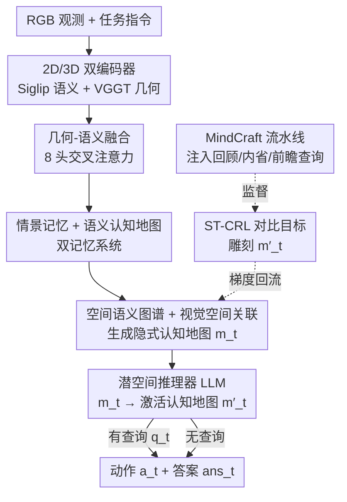

# LASAR: Towards Spatio-temporal Reasoning with Latent Cognitive Map

**会议**: CVPR 2026  
**论文**: [CVF Open Access](https://openaccess.thecvf.com/content/CVPR2026/html/Tang_LASAR_Towards_Spatio-temporal_Reasoning_with_Latent_Cognitive_Map_CVPR_2026_paper.html)  
**代码**: 无  
**领域**: 多模态VLM / 具身智能  
**关键词**: 具身导航, 认知地图, 时空推理, 对比学习, VLN

## 一句话总结
LASAR 给具身智能体配了一套"双记忆"系统——逐帧的情景记忆 + 一张可查询的隐式认知地图，再用对比目标 ST-CRL 把地图"雕刻"成能编码拓扑/距离/方位关系的高层空间表征，从而在导航（VLN-CE）与零样本空间推理（VSI-Bench）上同时涨点 2%–3.5%。

## 研究背景与动机

**领域现状**：具身 AI 大致分两端——动作导向的视觉语言导航（VLN，看指令走到目标）和推理导向的具身问答（EQA，回答关于环境的问题）。前者靠在海量视觉-语言-动作对上做模仿学习，后者靠大模型的语言先验 + 思维链。

**现有痛点**：作者指出两端共享一个根本缺陷——**缺乏一个迫使模型把细粒度空间关系（拓扑、距离、方位）编码进表征的学习信号**。VLN 的模仿学习容易"过拟合专家轨迹的表面统计偏差"，看似会走其实没理解空间；EQA 的语言先验式推理"脱离了 grounded world model"，在复杂空间任务上失败。两者都只擅长局部空间感知，却在长程、碎片化经验上的空间关系上栽跟头。

**核心矛盾**：智能体接收的是一串以自我为中心（egocentric）、碎片化的 `{观测, 动作}` 流，如何从这种局部视角流里构建出**全局一致**的高层空间表征，是一直没解决的难题。

**本文目标**：学一张**认知地图（cognitive map）**，把原始经验流转换成一个可查询的世界模型，为时空推理提供结构化的高层空间逻辑底座。

**切入角度**：把动作（VLN）和推理（EQA）统一起来——在导航过程中**并发地**注入认知问答，用这些问答作为高层监督信号去塑造空间表征，而不是只靠模仿动作或只靠语言推理。

**核心 idea**：用一个"情景记忆 + 语义认知地图"的双记忆架构承载经验，再用对比目标 ST-CRL（以并发认知查询为监督）把这张地图雕成 reasoning-aware 的隐式空间表征。

## 方法详解

### 整体框架
LASAR（LAtent SpAtial Reasoner）是一个基于 LLM 的具身智能体。输入是每一步的 RGB 观测和任务指令，输出是导航动作 $a_t$ 以及（若当前步带有认知查询 $q_t$）一个文本答案 $ans_t$。整条管线分三段：**前端感知**（双编码器 + 几何-语义融合）→ **双记忆**（情景记忆 + 由语义图谱生成的隐式认知地图）→ **LLM 推理头**（统一词表，同时吐动作 token 和答案文本）。训练侧由 MindCraft 流水线在 VLN-CE 轨迹里注入认知查询，为核心对比目标 ST-CRL 提供监督。

### 关键设计

**1. 双记忆系统：情景记忆负责"证据"，认知地图负责"索引"**

针对"从碎片化 egocentric 流里建不出全局一致表征"的痛点，LASAR 维护两套互补记忆。**情景记忆** $M_{epi,t}=(F'_{vis,0},\dots,F'_{vis,t})$ 是所有过往几何感知视觉特征的时序序列，保留高保真、未压缩的原始观测，作为推理时核对事实的"证据"。其中每帧特征先由冻结的 Siglip（2D 语义 $F_{vis}$）与 VGGT（从 2D 推 3D 的几何特征 $F_{geo}$）双流编码，再经 8 头交叉注意力残差融合成几何感知表征：$F'_{vis,t}=F_{vis,t}+\text{CrossAttn}(F_{vis,t},F_{geo,t},F_{geo,t})$。**语义记忆**则把情景记忆蒸馏成一个低维的隐式认知地图向量 $m_t$，给 LLM 一个"我在哪、周围有什么"的低成本全局概览，充当"认知索引"。两者抽象层级不同、互补，LLM 先用 $m_t$ 定位相关时空区域，再回 $M_{epi,t}$ 里抠细节核实——这种分层正是鲁棒推理的关键。

**2. 空间语义图谱 + 视觉空间关联：把经验"查"成一张认知地图**

认知地图不是显式 3D 几何图，而是实时生成的单向量隐式表征。其底座是一个**可学习的码本** $E_{world}=\{e_1,\dots,e_{N_w}\}$（论文称 Spatial Semantic Atlas，$N_w=512$），存的是带语义和空间线索的世界原语（如"台灯在沙发旁""水槽在厨房里"）。生成流程：先用注意力池化把整段情景记忆 $M_{epi,t}$ 汇成一个上下文向量 $z_t$，再以 $z_t$ 为 query 对图谱做交叉注意力——$m_t=\text{CrossAttn}(z_t,E_{world},E_{world})$。这样地图就是"用当前经验去检索通用世界原语"的结果，既泛化又紧凑。相比 SLAM 那种显式几何地图，这里完全在隐空间里做关系建模，天然适配 LLM 推理。

**3. ST-CRL 时空上下文表征学习：用认知查询当监督，把隐空间雕出空间逻辑**

这是论文的核心创新。痛点是：仅靠共现统计学不出"细粒度关系"。ST-CRL 的巧妙在于**不直接约束 $m_t$，而是约束 LLM 经查询条件化后的输出 $m'_t$**（称 Activated Cognitive Map）。具体做法：往 LLM 词表加一个 `[MAP]` 特殊 token，前向时把它的 embedding 确定性替换成 $m_t$，再从最后一层 `[MAP]` 位置取出隐状态作为 $m'_t$——这就是"透过查询这个镜头看到的地图"。以 $m'_t$ 为 anchor 做 InfoNCE 对比：$\mathcal{L}_{crl}=\text{InfoNCE}(m'_t,m'_p,N_t)$。正样本是语义等价、答案相同的另一段经验；负样本精心设计成三类硬负——**空间硬负**（查询等价但答案不同，指向不同空间状态）、**语义硬负**（同一区域 id 但不同查询/答案）、**无关干扰**（区域 id 和查询模板都不同）。由于约束打在 $m'_t$ 上，梯度会沿 LLM 回流去更新产生 $m_t$ 的图谱 $E_{world}$，从而逼着地图朝"对下游推理最优"的结构演化。区域 id 是模拟器提供的特权信息，仅训练期用、推理期不可见。

**4. MindCraft 任务与数据：在导航中并发注入三类认知查询**

为给 ST-CRL 提供监督信号，作者定义了 MindCraft 任务：在标准导航之上叠一个**在线并发查询**机制——策略 $\pi(H_t,\mathcal{T},q_t)\to(a_t,ans_t)$ 任意步既要出动作，遇到查询还要出答案。查询按认知层级分三类：**回顾型（Retrospective）**探测对过去观测的记忆（物体属性回忆、时序关系回忆）；**内省型（Introspective）**探测对当前状态的理解（自定位、局部空间关系）；**前瞻型（Prospective）**探测预测/规划能力（拓扑邻接预测、未来地标预测）。数据集基于 VLN-CE（含 Matterport3D 高保真环境和专家轨迹）用程序化流水线生成，把"边走边问答"这一维度注入经典导航任务。

### 损失函数 / 训练策略
总目标把主任务损失与三个辅助损失逐时刻平均后再加单条 episode 级损失：

$$\mathcal{L}_{total}=\frac{1}{T}\sum_{t=1}^{T}\big(\mathcal{L}_{MindCraft,t}+\lambda_c\,\mathbb{I}(q_t\neq\varnothing)\mathcal{L}_{crl,t}+\lambda_s\mathcal{L}_{sem,t}\big)+\lambda_r\mathcal{L}_{epi}$$

其中 $\mathcal{L}_{MindCraft,t}=\mathcal{L}_{action,t}+\lambda_{qa}\mathbb{I}(q_t\neq\varnothing)\mathcal{L}_{QA,t}$（模仿学习动作损失 + 查询回答损失）。两个辅助损失：**语义图谱学习** $\mathcal{L}_{sem}$ 用向量量化把最近原语 $e_j$ 拉向 $F'_{vis,t}$，并加熵正则避免码本坍缩（让原语使用分布趋于均匀）；**情景判别性** $\mathcal{L}_{epi}=\text{InfoNCE}(\cdot)$ 在特征级把同一 episode 的表征拉近、不同 episode 推远，逼编码器产出"能辨别具体行程"的特征。超参：$\lambda_{qa}=1.0$，$\lambda_c=0.1$（$\tau=0.07$，32 负样本=8 空间+8 语义+16 无关），$\lambda_s=0.2$，$\lambda_r=0.1$。LLM 主干用 Qwen2-7B，AdamW（lr=$1\times10^{-4}$）训 2 epoch，8×A100。

## 实验关键数据

### 主实验
在 MindCraft-Test（双载推理）、R2R/RxR（下游导航）、VSI-Bench（零样本空间推理）三类设置上对比。LASAR 全模型相对各类基线均有提升：

| 设置 / 指标 | 基线最强 | LASAR | 说明 |
|--------|------|------|------|
| MindCraft QA-Acc ↑ | 60.6 (IL+QA) | **65.3** | +4.7，整体查询准确率 |
| MindCraft GCA ↑ | 63.2 (IL+QA) | **70.4** | +7.2，导航成功轨迹上的问答准确率 |
| MindCraft CMC ↑ | 70.1 (IL+QA) | **75.8** | +5.7，认知地图自洽性（同事实不同问法答案一致度） |
| MindCraft SR@WA ↓ | 57.3 (IL+QA) | **35.2** | 推理出错时的导航成功率，越低说明地图越稳 |
| R2R val-unseen SR ↑ | 54.8 (NaVILA) | **57.0** | +2.2 |
| R2R val-unseen SPL ↑ | 49.0 (NaVILA) | **53.9** | +4.9，路径质量更优 |
| RxR val-unseen SR ↑ | 49.3 (NaVILA) | **52.1** | +2.8 |
| VSI-Bench Avg ↑ | 45.4 (Gemini-1.5 Pro) | **48.9** | 零样本，从未训练，超过大模型 |

> 注：CMC（Cognitive Map Consistency）= 同一空间事实用不同措辞提问时答案的一致度；SR@WA = 至少一个查询答错的轨迹上的导航成功率（反映推理失败是否拖累导航）；VSI-Bench 上 ACC 用于选择题、MRA 用于数值题，Avg 为总分。

### 消融实验

| 配置 | QA-Acc ↑ | GCA ↑ | CMC ↑ | SR@WA ↓ | 说明 |
|------|---------|------|------|--------|------|
| LASAR (Ours) | 65.3 | 70.4 | 75.8 | 35.2 | 完整模型 |
| w/o. Geo | 63.8 (−1.5) | 62.1 (−8.3) | 66.3 (−9.5) | 40.4 (+5.2) | 去掉 VGGT 几何特征 |
| w/o. Sem | 62.1 (−3.2) | 65.4 (−5.0) | 58.2 (−17.6) | 45.7 (+10.5) | 去掉语义认知地图 |
| w/o. Aux | 63.5 (−1.8) | 67.0 (−3.4) | 72.9 (−2.9) | 36.8 (+1.6) | 去掉 $\mathcal{L}_{sem}$ 与 $\mathcal{L}_{epi}$ |

此外，从 Table 1 看，ST-CRL 的增量可由两条基线隔离：LASAR (IL) 只训模仿（VSI-Bench Avg 37.8）；LASAR (IL+QA) 加 naive 查询训练但无 ST-CRL（44.8）；完整 LASAR 达 48.9。

### 关键发现
- **语义认知地图贡献最大**：去掉 Sem（w/o. Sem）后 CMC 暴跌 17.6 个点、SR@WA 恶化 10.5 个点，说明这张隐式地图正是空间一致性的来源。
- **几何特征对 grounding 关键**：去掉 VGGT 几何流后 GCA、CMC 各掉 8–9.5 点，印证 3D 结构先验对"答得对又走得对"很重要。
- **ST-CRL 防过拟合查询格式**：IL+QA 在 MindCraft 内涨点但 VSI-Bench 仅 44.8，疑似过拟合查询模板；加 ST-CRL 后零样本 48.9，说明学到的是更本质、可迁移的空间概念，而非表面模式。

## 亮点与洞察
- **"在动作里并发塞推理查询"是个聪明的监督设计**：以往 VLN/EQA 分家，本文用 MindCraft 把认知问答注入导航轨迹，等于给"走路"这件事配了一套强制理解空间的考题，让监督信号直接打在高层空间关系上。
- **约束 $m'_t$ 而非 $m_t$ 让梯度借 LLM 回流**：用 `[MAP]` token 把地图喂进 LLM、再从同位置取激活向量做对比 anchor，这个"透过查询看地图"的技巧很巧——它把"地图该长什么样"的判据交给下游推理本身决定，而不是人手设计。
- **三类硬负样本的构造可迁移**：空间硬负/语义硬负/无关干扰这套基于区域 id 和查询模板的负采样范式，对任何"需要区分细粒度空间关系"的对比学习任务都有借鉴价值。

## 局限与展望
- **强依赖模拟器特权信息**：负采样和查询生成靠 VLN-CE/Matterport3D 提供的 region id、专家轨迹等特权标注，迁到真实机器人或无标注环境时这套监督如何获得是问题。
- **认知地图是单向量、低维**：$m_t$ 把整个空间压成一个向量，复杂大场景下表达力可能受限，论文也未充分讨论容量上限。
- **诸多细节甩到 Supp.（缓存里多处 `Supp. ??`）**：⚠️ 训练数据构建、查询生成模块、计算开销分析等关键实现都在附录，正文无法独立复现。
- **提升幅度温和**：导航侧 SR/SPL 提升多在 2%–5% 区间，零样本 Avg 比次优大模型高约 3.5，属稳健但非颠覆性。

## 相关工作与启发
- **vs 显式记忆（SLAM 系）**：SLAM 建精确 3D 几何图，本文走隐式认知地图路线，把空间关系编码进可学习码本 + 单向量，牺牲几何精度换取与 LLM 推理的天然适配和泛化。
- **vs 隐式记忆（RNN/Transformer 状态向量）**：传统隐式记忆把历史压成状态向量但缺乏显式的"空间语义结构"；本文用图谱 + 对比目标显式雕刻关系结构，CMC 这类自洽性指标专门验证了这一点。
- **vs 自监督时空表征（SSL 对比/预测）**：egocentric 视频的 SSL 监督来自原始传感数据、对智能体高层认知状态不可知；ST-CRL 用高层认知查询当监督，直接面向长程空间推理塑形表征。

## 评分
- 新颖性: ⭐⭐⭐⭐⭐ 双记忆 + 隐式认知地图 + 用并发认知查询雕刻隐空间，把 VLN/EQA 统一的切入点新颖
- 实验充分度: ⭐⭐⭐⭐ 覆盖三类设置 + 消融到位，但关键实现散落附录、提升幅度温和
- 写作质量: ⭐⭐⭐⭐ 动机和方法链条讲得清楚，图文对照好；缓存里大量 `Supp. ??` 影响自洽
- 价值: ⭐⭐⭐⭐ 给具身时空推理提供了可迁移的"认知地图 + 对比监督"范式，零样本泛化有说服力

<!-- RELATED:START -->

## 相关论文

- [\[CVPR 2026\] R4: Retrieval-Augmented Reasoning for Vision-Language Models in 4D Spatio-Temporal Space](r4_retrieval-augmented_reasoning_for_vision-language_models_in_4d_spatio-tempora.md)
- [\[CVPR 2026\] VideoFusion: A Spatio-Temporal Collaborative Network for Multi-modal Video Fusion](videofusion_a_spatio-temporal_collaborative_network_for_multi-modal_video_fusion.md)
- [\[CVPR 2026\] Flat-Pack Bench: Evaluating Spatio-Temporal Understanding in Large Vision-Language Models through Furniture Assembly](flat-pack_bench_evaluating_spatio-temporal_understanding_in_large_vision-languag.md)
- [\[CVPR 2026\] Reasoning Palette: Modulating Reasoning via Latent Contextualization for Controllable Exploration for (V)LMs](reasoning_palette_modulating_reasoning_via_latent_contextualization_for_controll.md)
- [\[CVPR 2026\] EgoProx: Evaluating MLLMs on Egocentric 3D Proximity Reasoning Across a Cognitive Hierarchy](egoprox_evaluating_mllms_on_egocentric_3d_proximity_reasoning_across_a_cognitive.md)

<!-- RELATED:END -->
