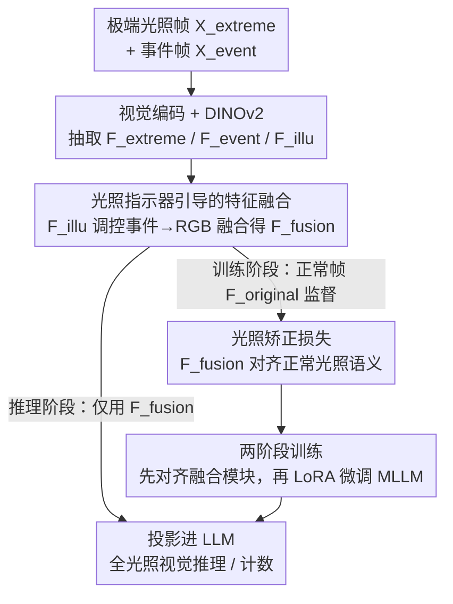

# Learning to See through Illumination Extremes with Event Streaming in Multimodal Large Language Models

**会议**: CVPR 2026  
**论文**: [CVF Open Access](https://openaccess.thecvf.com/content/CVPR2026/html/Zhang_Learning_to_See_through_Illumination_Extremes_with_Event_Streaming_in_CVPR_2026_paper.html)  
**代码**: 待确认  
**领域**: 多模态VLM  
**关键词**: 事件相机, 极端光照, 多模态大模型, 自适应融合, 特征对齐

## 一句话总结
针对多模态大模型在过曝/极暗场景下 RGB 信息不可逆退化、产生幻觉的问题，Event-MLLM 引入事件流作为互补模态，用一个从 DINOv2 分支学到的「光照指示器」自适应调控事件-RGB 融合，再用「光照矫正损失」把融合特征对齐到正常光照语义，使模型在 0.05×–20× 的极端亮度下仍能稳定推理与计数。

## 研究背景与动机

**领域现状**：多模态大模型（MLLM）把强视觉编码器接到大语言模型上，已经能做开放问答、细粒度视觉推理等一大类任务，但绝大多数模型隐含假设输入是「理想光照」下的清晰 RGB 图像。

**现有痛点**：一旦遇到过曝或近乎全黑这类极端光照，RGB 图像会发生**不可逆**的结构与语义信息丢失，模型不仅看不清关键细节，还会编造出根本不存在的物体（幻觉），在计数、定位等任务上崩盘。现有缓解手段大多是「事后补救」：要么先用图像增强 pipeline 预增强（容易引入伪纹理、扭曲语义），要么把 MLLM 当控制器去调外部增强工具（间接改善但不增强模型自身鲁棒性），要么用专门的低光编码器/质量评估模块去检测曝光问题（无法保证内容级理解一致）。

**核心矛盾**：这些方法本质上都是「reactive」——试图**恢复**已经退化的信息，而不是在 MLLM 推理过程中**主动防止**信息丢失。而 RGB 传感器在饱和或欠曝时，物理上已经丢掉了信息，恢复无从谈起。

**切入角度**：事件相机异步工作、微秒级时间分辨率、动态范围超过 120 dB，记录的是亮度**变化**而非绝对强度，因此在 RGB 传感器饱和/失效时仍能保留丰富的结构线索。低层视觉（去噪、去模糊、HDR 重建）早已证明 RGB+事件融合能恢复细节，但这套范式还从未被引入 MLLM 做推理与指令跟随。

**核心 idea**：把事件流引入 MLLM，让模型学会「在什么光照下、该多大程度依赖事件信息」——用一个可学习的光照指示器动态加权事件-RGB 融合，并用一个特征空间的矫正损失把融合特征拉向正常光照的语义，从而把极端光照下丢失的结构「蒸馏」回来。

## 方法详解

### 整体框架
Event-MLLM 接收双视觉输入流：一张退化的极端光照帧 $X_{extreme}$ 和对应的事件帧 $X_{event}$。原始视觉编码器 $E_{vision}$ 从两者分别抽取高层语义特征 $F_{extreme}$、$F_{event}$；一个冻结的 DINOv2 编码器处理 $X_{extreme}$ 得到刻画光照退化模式的特征 $F_{illu}$（即光照指示器）。训练阶段额外引入一张正常光照帧 $X_{original}$，由 $E_{vision}$ 抽出 $F_{original}$ 作为「监督锚点」。三类特征送入若干可学习 MLP，在光照指示器引导下融合成统一视觉表征 $F_{fusion}$，并被 $F_{original}$ 通过光照矫正损失监督，使融合特征逼近正常光照下的语义。$F_{fusion}$ 经投影层映射进 LLM 语言空间，做端到端指令跟随微调。**推理时不需要正常光照帧**：模型只用 $X_{extreme}$ 和 $X_{event}$ 即可自适应融合出 $F_{fusion}$ 完成全光照推理。整套训练分两阶段：先训融合模块做特征对齐，再用 LoRA 微调整个 MLLM。

### 关键设计

**1. 光照指示器引导的自适应特征融合：用可学习信号决定「何时依赖事件」**

痛点在于：光照退化在空间和时间上都是不均匀的，固定权重的事件-RGB 融合无法因地制宜。作者不用任何手工固定权重，而是从 DINOv2 分支学出一个光照指示器 $F_{illu} = F_A(E_{DINOv2}(X_{extreme}))$，它编码全局光照退化模式，直接调控事件特征该以多大力度注入退化的 RGB 特征。具体融合分两步拼接：先把光照指示器 $F_{illu}$ 与事件特征 $F_{event}$ 拼接——这一步把鲁棒的事件信息与具体光照条件绑定，让模型在指示器标示的不利光照下，有针对性地从事件里抽取互补信息；再把这个组合表征与极端 RGB 特征 $F_{extreme}$ 拼接，送入最终融合 MLP：

$$F_{fusion} = F_{fusion}(F_{extreme}, \text{Concat}[F_{illu}, F_{event}])$$

之所以选 DINOv2 做指示器来源，是因为它的自监督特征对光照退化模式敏感且与具体内容解耦，比起直接用主编码器特征更能纯粹地表达「曝光退化程度」。

**2. 光照矫正损失：把正常光照语义蒸馏进融合特征**

在没有干净参考图可用的推理场景下，怎么引导模型朝「信息丰富的语义」而非「冗余相关」去融合，是个难题。作者用训练时可得的正常光照帧提供监督：先用冻结的 $E_{vision}$ 抽出正常帧特征 $F_{original} = E_{vision}(X_{original})$，再让融合特征与它做 MSE 对齐：

$$\mathcal{L}_{IC} = \lVert F_{fusion} - F_{original} \rVert_2^2$$

最小化这个差异，等于强迫融合模块**重建出与正常光照场景语义一致的特征**。这样模型学到的是「主动从事件里补偿 RGB 退化」的能力，而非被动恢复像素。关键在于这是一种自监督能力：训练完成后，推理时不再需要 $X_{original}$，模型已能自主完成光照矫正，只凭极端光照帧和事件帧就能输出对齐到正常语义的融合表征。

**3. 两阶段训练策略：先对齐再指令微调**

如果把「特征融合」和「指令跟随」搅在一起一步到位地训，融合模块还没学会对齐语义、LLM 就被迫去拟合噪声特征，收敛困难。作者拆成两阶段：① **自适应特征融合阶段**只训融合模块里的可学习 MLP，用 $\mathcal{L}_{IC}$ 把正常光照语义蒸馏进 $F_{fusion}$，得到一个鲁棒且预对齐的视觉输入；② **指令跟随微调阶段**冻结/对齐好视觉特征后，用 LoRA 微调整个 Event-MLLM 做指令任务。消融（见 Table 3）显示，这种「先对齐特征、再微调」的解耦显著简化了模型收敛，比直接做像素级 pre-fusion 或特征级 post-fusion 都强很多。

### 损失函数 / 训练策略
核心训练目标是光照矫正损失 $\mathcal{L}_{IC}$（MSE）。第一阶段用 Adam 优化器、batch size 4、学习率 0.001 训 30 个 epoch 训练融合 MLP；第二阶段 LoRA 微调整个 MLLM 训 1 个 epoch。骨干用 Qwen-3B / Qwen-7B，硬件为 RTX 5090D 与 A800。⚠️ 部分超参以原文为准。

## 实验关键数据

数据集是作者自建的首个「正常帧 + 极端光照帧 + 事件帧」三元组指令跟随数据集，含 2,241 个样本、10,129 个问答对，每个样本设计 17 个亮度等级（0.05× 到 20×），从 4 个时空对齐的事件-RGB 配对数据集出发，用 GPT-4o + 人工核验生成细粒度描述。Benchmark 含两个任务：多选题（综合场景理解，可多个正确选项）和物体计数（精确枚举）。所有指标在 17 个亮度等级上取平均。

### 主实验

| 方法 | 类型 | 多选 Acc.↑ | 多选 F1↑ | 计数 Acc.↑ | 计数 MAE↓ |
|------|------|-----------|----------|-----------|-----------|
| LLaVA-7B | 通用 MLLM | 18.43 | 65.39 | 67.84 | 0.9957 |
| InternVL | 通用 MLLM | 31.50 | 75.46 | 72.56 | 0.8641 |
| EventGPT | 事件专用 | 3.16 | 73.60 | 67.41 | 1.0015 |
| Q-Instruct | 光照感知 | 15.86 | 65.09 | 66.87 | 0.9803 |
| Baseline-7B (Qwen) | 事件增强基线 | 44.71 | 81.95 | 72.73 | 0.5303 |
| **Ours-7B** | 事件增强 | **53.13** | **85.43** | **74.66** | **0.4557** |

多选任务上 Ours-7B 比次优的 Baseline-7B 高 8.42% Acc / 3.48% F1；计数任务 74.66% Acc 超过 Baseline-7B 的 72.73% 与 InternVL 的 72.56%。从 3B 到 7B，多选/计数 Acc 从 34.48%/71.08% 跃升到 53.13%/74.66%，说明方法可随规模放大。

### 消融实验

| 配置 (Qwen-7B) | 多选 Acc.↑ | 多选 F1↑ | 计数 Acc.↑ | 计数 MAE↓ |
|----------------|-----------|----------|-----------|-----------|
| Baseline（两组件都无） | 44.71 | 81.95 | 72.73 | 0.5303 |
| + 仅光照矫正（无 LoRA） | 51.90 | 84.83 | 74.23 | 0.4645 |
| Ours（光照矫正 + LoRA） | 53.13 | 85.43 | 74.66 | 0.4557 |

融合策略对比（Qwen-7B）：像素级 Pre-fusion 仅 14.85% 多选 Acc（最差，说明像素叠加产生非自然图像、自然图编码器抽不出正确特征）；特征级 Post-fusion 32.24%；本文两阶段方法 53.13%，证明「先对齐、再 LoRA」的价值。

### 关键发现
- 光照矫正模块和 LoRA 微调对两种骨干都带来**渐进式**增益，且 Qwen-7B 的提升幅度大于 Qwen-3B——大容量模型从额外模态和复杂对齐中获益更多。
- 像素级 pre-fusion 几乎拖垮性能，揭示「直接把事件和 RGB 在像素层叠加再喂模型」是错误路线，必须在特征/语义层融合。
- t-SNE 与余弦相似度分析显示：未矫正时视觉编码器特征在极端亮度下相似度从 0.98 掉到约 0.65；融合后不同亮度的特征会聚拢到正常光照特征附近，验证了语义对齐确实发生。

## 亮点与洞察
- **从「事后恢复」转向「推理时主动补偿」**：用事件流在融合阶段直接注入结构信息，绕开了 RGB 不可逆退化无法恢复的物理死结，这是相对图像增强/工具调用类方法最本质的范式差异。
- **光照指示器把「光照评估」和「内容编码」解耦**：用 DINOv2 自监督特征专门表达曝光退化、再去调控融合权重，避免了把光照判断和语义理解混在一个编码器里互相干扰，这个解耦思路可迁移到任何需要「条件自适应融合」的多模态场景。
- **正常光照帧只在训练时当锚、推理时丢掉**：把「需要干净参考」的监督转成一种可在推理时自主运行的能力，是该设计最巧妙的地方——既拿到了强监督，又不增加推理时的输入要求。

## 局限与展望
- 数据集的细粒度描述由 GPT-4o 生成（虽有人工核验），标注质量与多样性可能受生成模型偏好影响；⚠️ 数据规模 2,241 样本相对训练大模型仍偏小。
- 极端亮度通过对 RGB 做 17 档乘性调整模拟，与真实传感器在过曝/欠曝下的非线性响应、噪声特性可能有差距，真实极端场景下的泛化有待验证。
- 推理时必须有时空配对的事件相机输入，限制了在仅有普通 RGB 相机的部署场景中的适用性；事件相机本身的成本与可得性也是落地约束。
- 方法只验证到 7B 规模，更大模型与更多模态（如深度）的协同收益尚未探索。

## 相关工作与启发
- **vs 图像增强类（先增强再理解）**: 它们在像素层预增强 RGB，常引入伪纹理、扭曲语义；本文在特征层用事件信息补偿，不改像素、直接对齐语义，避免了增强伪影。
- **vs 工具调用类 MLLM（把模型当控制器调外部增强）**: 它们间接改善感知但不提升模型自身鲁棒性；本文把鲁棒性内化进融合模块与训练目标。
- **vs 事件专用 MLLM（EventGPT / EventVL）**: 它们只用事件流、不融合 RGB，在常规光照下反而吃亏（EventGPT 多选 Acc 仅 3.16%）；本文双分支动态融合，兼顾全光照。
- **vs 光照感知 MLLM（Q-Instruct）**: 它靠退化视觉条件的指令数据微调，但忽略了事件相机这一在极端光照下更可靠的模态；本文正是补上这块。

## 评分
- 新颖性: ⭐⭐⭐⭐⭐ 首个把事件流引入 MLLM 做极端光照推理，光照指示器 + 矫正损失的组合设计有原创性。
- 实验充分度: ⭐⭐⭐⭐ 两种规模骨干、三类基线、17 档亮度、消融与可视化齐全，但数据规模偏小、缺真实事件相机极端场景验证。
- 写作质量: ⭐⭐⭐⭐ 动机与方法叙述清晰，pipeline 图直观；部分符号与超参细节略简。
- 价值: ⭐⭐⭐⭐ 为 MLLM 在恶劣光照下的鲁棒感知提供了新范式与首个配套数据集/benchmark，落地受事件相机可得性约束。

<!-- RELATED:START -->

## 相关论文

- [\[CVPR 2026\] Octopus: History-Free Gradient Orthogonalization for Continual Learning in Multimodal Large Language Models](octopus_history-free_gradient_orthogonalization_for_continual_learning_in_multim.md)
- [\[CVPR 2026\] RE-VLM: Event-Augmented Vision-Language Model for Scene Understanding](re-vlm_event-augmented_vision-language_model_for_scene_understanding.md)
- [\[CVPR 2025\] EventGPT: Event Stream Understanding with Multimodal Large Language Models](../../CVPR2025/multimodal_vlm/eventgpt_event_stream_understanding_with_multimodal_large_language_models.md)
- [\[CVPR 2026\] ROSE: Rotate Your Large Language Model to See](rose_rotate_your_large_language_model_to_see.md)
- [\[CVPR 2026\] Streaming Video Instruction Tuning (Streamo)](streaming_video_instruction_tuning.md)

<!-- RELATED:END -->
