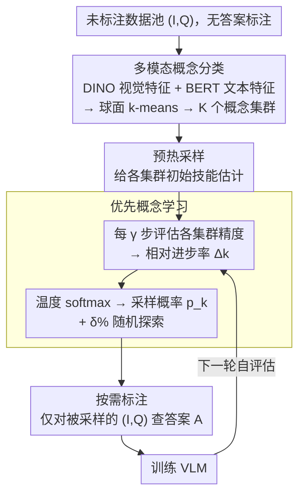

# Learning What Matters: Prioritized Concept Learning via Relative Error-driven Sample Selection

**会议**: CVPR 2026  
**arXiv**: [2506.01085](https://arxiv.org/abs/2506.01085)  
**代码**: [https://mylittlechange.github.io/PROGRESS_web/](https://mylittlechange.github.io/PROGRESS_web/)  
**领域**: 多模态VLM  
**关键词**: 数据高效学习, 指令微调, 课程学习, VLM训练, 样本选择

## 一句话总结
提出 PROGRESS 框架，通过追踪 VLM 在自动发现的多模态概念集群上的学习进度来动态选择最有信息量的训练样本，仅用 16-20% 的标注数据就达到全数据 99-100% 的性能，且总训练时间更短。

## 研究背景与动机
**领域现状**：VLM 的指令微调（instruction tuning）依赖大规模高质量标注数据和大量算力，成本越来越高。

**现有痛点**：(a) 静态选择方法（CLIP-Score、EL2N、Perplexity等）一次选完数据后无法适应模型的学习进展；(b) 梯度方法（ICONS）计算量巨大（上百 GPU 小时），违背高效训练初衷；(c) COINCIDE 需要额外训好的辅助 VLM + 全部数据的标注 + 人工检查激活。

**核心矛盾**：大量训练样本是冗余或无信息的，但静态方法无法在训练过程中识别这一点。

**本文目标** 能否让 VLM 根据自身学习状态动态判断"下一步应该学什么"，并且只在需要时获取标注？

**切入角度**：受课程学习和自步学习启发——模型应该学习那些"还没掌握但正在快速进步"的技能，不浪费预算在已掌握或太难的样本上。

**核心idea**：追踪学习进度的相对变化率 $\Delta_k$，优先采样来自学习进步最快的概念集群。

## 方法详解

### 整体框架
PROGRESS 想解决的是"在不预先标注整个数据池的前提下，让 VLM 自己决定下一步该学哪些样本"。整条流水线分两步走：先把未标注的数据池按语义切成若干概念集群，再让模型在训练过程中周期性地给自己打分，看哪些集群"正在快速进步"，就从那里多采样、并只对采到的样本去查标注。和"一次性选完数据"的静态方法不同，PROGRESS 的采样分布随着模型学习状态不断变化，相当于把课程学习的"由易到难"交给模型自身的进步信号来决定。训练时这套"评估→算进步率→采样→标注→训练"会随着每隔 $\gamma$ 步的自评估反复回环，直到用满标注预算。

### 关键设计

**1. 多模态概念分类：在没有标注的情况下先把数据切成有语义的能力簇**

要做"按概念优先级学习"，前提是先知道数据里有哪些概念，而此时整个池子还没有标注。PROGRESS 的做法是对每个图文对 $(I,Q)$ 分别抽 DINO 视觉特征和 BERT 文本特征，拼接归一化后做球面 k-means，得到 $K$ 个概念集群——全程不碰标注、不需要额外训练好的辅助模型、也不需要人工去看激活。之所以用双模态拼接而不是单模态，是因为图像和文本联合刻画出来的簇更纯净，自然对应到"物体定位""OCR""编程""多语言"这类可解释的能力，后面按集群追踪进度才有意义。

**2. 优先概念学习：用"相对进步率"而不是绝对难度来决定采样权重**

静态选择方法的根本短板是选完就固定，无法感知模型已经学到哪一步。PROGRESS 每隔 $\gamma$ 步就在各集群上评估一次当前精度 $\text{Acc}_k^{(t)}$，并不看精度的绝对高低，而是看它相对上一次评估涨了多少：

$$\Delta_k = \frac{\text{Acc}_k^{(t)} - \text{Acc}_k^{(t-\gamma)}}{\text{Acc}_k^{(t-\gamma)} + \epsilon}$$

$\Delta_k$ 越大，说明这个集群"还没掌握但正在快速进步"，正是边际收益最高的学习目标；已经学透的集群（涨幅趋零）和暂时啃不动的集群都会被自动降权。再用一个带温度的 softmax 把进步率转成采样概率：

$$p_k = \frac{\exp(\Delta_k/\tau)}{\sum_j \exp(\Delta_j/\tau)}$$

温度 $\tau$ 在这里是信息量与多样性之间的旋钮：$\tau$ 偏小时采样高度集中在进步最快的少数簇（信息量大但容易钻牛角尖），偏大时逼近均匀采样（多样但退化成随机）。这一步把"学什么"和"什么时候学"都交给了模型自己的反馈信号，省掉了外部难度排序。

**3. 按需标注：标注预算只花在真正被采到的样本上**

数据池初始完全没有标注，只有当某个 $(I,Q)$ 被采样器选中时，才去查询它的答案 $A$。这一点直接拉开了和 COINCIDE 这类方法的距离——后者需要先把全部数据标注好（外加一个训练好的辅助 VLM 和人工检查激活），而 PROGRESS 把标注成本压到只覆盖实际用于训练的那 16-20% 样本，是"高效训练"目标里最实打实的一块省钱。

### 训练策略
启动阶段先用一个简单采样器选少量样本做预热，目的是给各集群一个可靠的初始技能估计，否则第一次算 $\Delta_k$ 时分母噪声太大。正式采样时保留一个探索机制：固定按 $\delta\%$ 的比例随机采样，确保低进步集群不会被彻底饿死。进度目标既可以用精度也可以用 loss，两者在主实验里表现接近。

## 实验关键数据

### 主实验（LLaVA-v1.5-7B，LLaVA-665K，20% 采样）

| 方法 | 需要辅助VLM? | VQAv2 | GQA | TextVQA | POPE | MMBench | 相对得分 |
|------|------------|-------|-----|---------|------|---------|---------|
| 全数据微调 | - | 79.1 | 63.0 | 58.2 | 86.4 | 66.1 | 100% |
| Random | ✗ | 75.7 | 58.9 | 55.3 | 84.7 | 62.2 | 95.0% |
| COINCIDE | ✓ | 76.5 | 59.8 | 55.6 | 86.1 | 63.1 | 97.8% |
| **PROGRESS (Acc)** | **✗** | **75.2** | **58.8** | **55.1** | **85.9** | **61.1** | **98.4%** |
| **PROGRESS (Loss)** | **✗** | **75.7** | **58.6** | **55.1** | **86.3** | **62.5** | **98.4%** |

### 跨架构/跨规模泛化

| 模型 | 数据比例 | 相对全数据性能 |
|------|---------|-------------|
| LLaVA-v1.5-7B | 20% | 98-99% |
| LLaVA-v1.5-13B | 20% | 类似 |
| Qwen2-VL | 16% | 99-100% |

### 关键发现
- PROGRESS 用 20% 数据超越需要辅助VLM+全量标注的 COINCIDE（97.8% vs 98.4%）
- 总训练时间（含自评估开销）仍比全数据训练更短
- 学习进度曲线展示了有趣的课程效应：模型先学简单概念（单物体识别），后学复杂概念（OCR、推理）
- 温度 $\tau$ 的选择至关重要：太低导致模式崩溃（只学一个集群），太高等价于随机

## 亮点与洞察
- **不需要辅助模型、不需要全量标注、不需要梯度计算**，三个"不需要"使 PROGRESS 对学术实验室特别友好
- 学习进度驱动的采样兼具课程学习和主动学习的优点：自动决定"学什么"和"什么时候学"
- 温度-softmax 采样平衡信息量和多样性的设计简洁优雅
- 可视化揭示的概念学习顺序为理解 VLM 训练动态提供了新视角

## 局限与展望
- 聚类数 K 需要预设，不同数据集可能需要不同的 K
- 自评估的频率 $\gamma$ 是额外超参数
- 进度信号基于训练集上的表现，可能与验证集表现不完全一致
- 当前仅验证了指令微调阶段，预训练阶段的效果未知

## 相关工作与启发
- **vs COINCIDE**: COINCIDE 需要训练好的辅助 VLM + 全量标注 + 人工检查激活；PROGRESS 完全自给自足
- **vs ICONS**: ICONS 用梯度信息选样本，需要上百GPU小时；PROGRESS 用模型精度变化率，几乎零额外成本
- **vs 课程学习**: 经典课程学习用外部难度排序；PROGRESS 用模型自身的学习反馈驱动课程
- 进度驱动的采样策略可推广到 LLM 预训练的数据混合控制

## 评分
- 新颖性: ⭐⭐⭐⭐ 进度驱动的动态采样是有效的新范式
- 实验充分度: ⭐⭐⭐⭐⭐ 多数据集+多架构+多规模+详尽消融+可视化分析
- 写作质量: ⭐⭐⭐⭐ 对比图清晰，与先前方法的优劣对比直观
- 价值: ⭐⭐⭐⭐⭐ 对资源受限的研究者极为实用，可直接降低训练成本

<!-- RELATED:START -->

## 相关论文

- [\[ICLR 2026\] SpectralGCD: Spectral Concept Selection and Cross-modal Representation Learning for Generalized Category Discovery](../../ICLR2026/multimodal_vlm/spectralgcd_spectral_concept_selection_and_cross-modal_representation_learning_f.md)
- [\[CVPR 2026\] No Hard Negatives Required: Concept Centric Learning Leads to Compositionality without Degrading Zero-shot Capabilities of Contrastive Models](no_hard_negatives_required_concept_centric_learning_leads_to_compositionality_wi.md)
- [\[CVPR 2026\] Concept-wise Attention for Fine-grained Concept Bottleneck Models](coat_cbm_concept_wise_attention.md)
- [\[CVPR 2026\] LFPC: Learning to Focus and Precise Cropping for MLLMs](lfpc_learning_to_focus_and_precise_cropping_for_mllms.md)
- [\[CVPR 2026\] ApET: Approximation-Error Guided Token Compression for Efficient VLMs](apet_approximation-error_guided_token_compression_for_efficient_vlms.md)

<!-- RELATED:END -->
