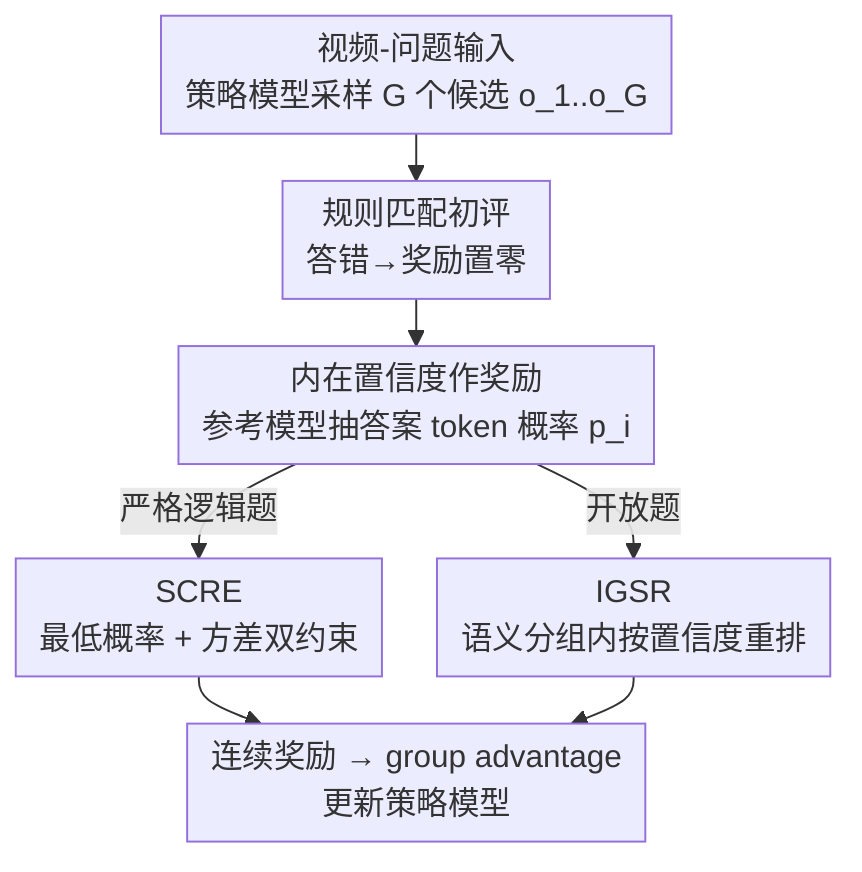

# Let VLMs Grade Their Own Thoughts: A Self-Quantification Approach to Reasoning-Aware Reward Modeling

**会议**: CVPR 2026  
**论文**: [CVF Open Access](https://openaccess.thecvf.com/content/CVPR2026/html/Xi_Let_VLMs_Grade_Their_Own_Thoughts_A_Self-Quantification_Approach_to_CVPR_2026_paper.html)  
**代码**: 待确认  
**领域**: 多模态VLM  
**关键词**: 视频理解, 强化学习, 奖励建模, 自评估置信度, 推理链对齐

## 一句话总结
Video-RAISE 主张让视频 VLM 用自己生成答案时的「内在置信度（答案 token 概率）」给自己的推理链打分，从而把 GRPO 那种稀疏的 0/1 文本匹配奖励变成连续、细粒度的学习信号；针对严格逻辑题和开放题分别设计 SCRE 与 IGSR 两套奖励，在六个视频理解 benchmark 上达到 SOTA 并把推理链一致性做到约 90%。

## 研究背景与动机

**领域现状**：用强化学习（尤其是 GRPO）做后训练来激发基础模型的推理能力，已经从 LLM 成功扩展到多模态。视频理解里的代表如 Video-R1（强制时序逻辑）、GRPO-Care（让推理对齐高质量 rationale）。

**现有痛点**：这些方法有一条共同主线——都依赖**外部、人定义的约束**来引导模型：要么强制正确的时序顺序，要么奖励与预设推理步骤的对齐。它们本质上锚定在一个假设上：「模型要达到最优表现，就得模仿人类的认知模式」。

**核心矛盾**：作者认为这种**强制对齐恰恰是瓶颈**。模型内在的推理路径可能和人类认知不同，硬把它掰向人类范式，会阻止模型发现更有效的、非人类式的推理策略，甚至损害性能。此外，GRPO 这类基于文本正误的奖励是稀疏的 0/1 信号——两个推理质量明显不同的回答只要最终答案都对，就拿一样的奖励，学习信号太弱（见原文 Figure 2：两个质量不同的 D 答案，GRPO 给 0.76 和 0.52 区分度很差）。

**切入角度**：与其从外部对齐，不如转向**内在自评估**，让模型自己发现最优推理路径。作者假设：高质量的推理路径会让模型在生成最终答案时表现出更高的置信度，于是用答案 token 的概率来量化这种置信度，转成 RL 奖励。

**核心 idea**：把模型的内在置信度变成连续奖励信号；并认识到不同题型需要不同评价标准——严格逻辑题用 SCRE，开放题用 IGSR——对 VLM 推理过程做更细粒度的优化，整套方法名为 Video-RAISE（Reasoning Alignment through Intrinsic Self-Evaluation）。

## 方法详解

### 整体框架
对每个「视频-问题」输入，策略模型先采样一组候选回答 $o_1,\dots,o_G$。和 GRPO 一样，先用基于规则的文本匹配做初评：匹配失败（答错）的回答奖励直接置零。其余回答则用一个参考模型计算其 token 序列的生成概率，并抽出**答案片段**（`<answer>...</answer>` 内）的概率。这个概率根据题型送入 SCRE 或 IGSR：严格逻辑题走 SCRE，开放题走 IGSR，产出连续、细粒度的奖励 $\tilde r_i$。最后用这些奖励算 group relative advantage，更新策略模型。参考模型是未做 SFT 的 base Qwen2.5-VL，训练中用 EMA 更新。

### 关键设计

**1. 内在置信度作为连续奖励：用答案 token 概率代替稀疏 0/1**

核心假设是「模型内在置信度（答案概率）是其推理质量的代理」。作者做了一个关键分析来验证：直接看**整段序列**的平均置信度是模糊信号——正确（蓝）和错误（橙）答案的分布大量重叠，无法区分。但放大到**答案 token 级**就出现清晰得多的模式：正确答案的置信度尖锐地集中在 1.0；错误答案则呈现明显的**双极化**——一个在 0.0 附近的高峰（因不确定而瞎猜），一个在 1.0 附近的显著峰（推理有缺陷但内部自洽，于是「自信地答错」）。这一发现说明真正的信号在 token 级，也直接催生了「按题型施加不同策略」的核心设计：严格逻辑题对瞎猜（0.0 峰）极敏感、要求完美一致，用 SCRE；开放题的难点是从一堆高质量高置信答案里再做精排，用 IGSR。把这个细粒度置信度转成连续奖励，比 GRPO 的二元正误能提供强得多的学习信号。

**2. SCRE（序列置信度严格评估）：抓住答案序列的「置信度瓶颈」**

针对要求严格正确、单个错误 token 就能让整个答案失效的任务。给定视频-问题对，先用策略模型采 $G$ 个候选，再用参考模型 $\pi_{ref}$ 算 token 级概率 $p_{i,j} = \pi_{ref}(o_{i,j} \mid q, o_{i,<j})$，并定位 `<answer>` 片段抽出答案概率 $p_i$。作者认为简单求平均会掩盖单个低置信（很可能错）token 的影响，因此用**带位置衰减权重的概率连乘**作为奖励，对任意单个低概率极其敏感：

$$r_i = \prod_{j=1}^{|p_i|} p_{i,j}^{w_j}, \quad w_j = e^{-\eta j}$$

其中 $w_j$ 是位置衰减因子（$\eta>0$），给靠前的 token 更大权重，促使模型从一开始就生成结构良好的输出。最后再乘一个**方差惩罚**，抑制置信度忽高忽低的回答：

$$\tilde r_i = r_i \cdot e^{-\lambda \sigma^2}, \quad \sigma^2 = \frac{1}{|p_i|}\sum_{j=1}^{|p_i|}(p_{i,j} - \text{mean}(p_i))^2$$

这样 SCRE 同时惩罚「最低概率」和「置信度波动」，正好针对错误答案分布里的 0.0 峰（瞎猜）做严格过滤。

**3. IGSR（组内分数重排）：在语义相近的高质量候选间按置信度精排**

针对答案允许多样表达的开放题——此时 SCRE 那种逐 token 严格匹配会误伤「语义对但措辞不同」的正确回答。IGSR 基于两条原则：① 在一组语义等价的候选里，给置信度更高的回答奖励加成；② 引入跨组奖励约束，利用不同准确度组之间的关系设置奖励上界，从而平衡语义准确性、生成置信度与内容多样性。具体先用文本准确度（如 ROUGE-L）$r(t)$ 把候选按固定区间 $\tau$ 分组 $g = \text{Group}(r(t), \tau)$，同组视为语义相近。由于同组内平均置信度差异小、难区分，作者用**平均负对数概率**放大差异：$e_i = \frac{1}{|p_i|}\sum_j -\log(p_{i,j}+\delta)$（$\delta$ 防 $\log 0$，$e_i$ 越小越自信）。再对组 $k$ 取组内候选奖励的中位数 $r^{\{k\}}_{(m)}$ 作代表，按候选相对置信度算调整加成 $a_i$，其中含一个跨组奖励间隔项 $r^{\{k+1\}}_{(m)} - r^{\{k\}}_{(m)}$ 和一个随组变大而收缩加成的稳定惩罚 $\partial(1 - 1/(|g^{\{k\}}|+1))$。$\tau$ 身兼二职：既是分组区间，又是加成的最小阈值——幅度小于 $\tau$ 的调整被当作噪声滤掉。最终用几何平均得到重排奖励：

$$\tilde r_i = \sqrt{r^{\{k\}}_{(m)} \cdot \big(r^{\{k\}}_{(m)} + a_i \cdot \mathbb{1}(a_i \geq \tau)\big)}$$

几何平均保证调整与组的基线奖励成比例、平滑过渡，使 IGSR 在组内重排的同时维持组间奖励的稳定分离。⚠️ 部分符号（$\partial$、跨组项下标）以原文公式为准。

### 损失函数 / 训练策略
整体沿用 GRPO 的 group relative advantage 框架，只替换其中的奖励函数为 SCRE/IGSR 产出的连续奖励。参考模型用未 SFT 的 base Qwen2.5-VL，训练中以 EMA 更新；策略模型与参考模型均有强性能。消融显示策略模型和参考模型都能作奖励源、各有优势，加 KL 惩罚（系数 0.04）反而略掉点。

## 实验关键数据

在六个主流视频理解 benchmark（VSI-Bench、VideoMMMU、MMVU、MVBench、TempCompass、VideoMME）上评测，骨干为 Qwen2.5-VL-7B，按 16/32/64 帧分别评估，遵循前人设置（MMVU 用多选子集、VideoMME 不用字幕）。

### 主实验（32 帧，部分代表性结果）

| 方法 | 发表 | VSI-Bench | VideoMMMU | MMVU | MVBench | TempCompass | VideoMME |
|------|------|-----------|-----------|------|---------|-------------|----------|
| GPT-4o | 专有 | 34.0 | 61.2 | 75.4 | - | - | 71.9 |
| Video-R1-7B | NeurIPS25 | 35.8 | 52.3 | 63.8 | 63.9 | 73.2 | 59.3 |
| CARE-7B | arXiv25 | 35.8 | 50.4 | 65.8 | 65.1 | 73.5 | 59.6 |
| **Video-RAISE-7B** | - | **36.6** | **53.0** | **65.9** | **65.9** | **75.1** | **60.7** |

16 帧设置下优势更明显（帧少更考验时序理解）：VideoMMMU 达 52.8%，比前 SOTA Video-R1 高 3.0 点；TempCompass 比 Video-UTR-7B 高 15.0 点。VideoMMMU 上甚至超过专有模型路线的 VideoTree（47.8）一大截。

### 消融 / 推理链一致性分析

| 方法 | VideoMMMU Answer | VideoMMMU Match | VSI-Bench Match | TempCompass Match |
|------|------------------|-----------------|-----------------|-------------------|
| Qwen2.5-VL | 46.9 | 46.7 | 17.2 | 87.8 |
| Qwen2.5-VL-SFT | 47.4 | 87.8 | 41.2 | 93.5 |
| Qwen2.5-VL-GRPO | 40.4 | 34.0 | 41.4 | 43.7 |
| **Ours: Video-RAISE** | **55.3** | **87.9** | **84.9** | **95.9** |

这里 **Answer** 指把推理链（`<think>` 内容）+问题喂给纯文本 LLM 后新答案的正确率，**Match** 指新答案与原 VLM 答案的一致性（推理链是否真的支撑了原答案）。Video-RAISE 在所有 benchmark 上把 Match 做到接近 90%，是 Qwen2.5-VL-Instruct 的两倍，甚至超过 SFT。

### 关键发现
- **GRPO 会让推理链退化**：GRPO 的 Match 在 VideoMMMU 仅 34.0%、TempCompass 仅 43.7%，多个 benchmark 上 Answer 甚至低于基线——说明只奖励最终答案正误会让推理过程「言行不一」。
- **SFT 一致性不泛化**：SFT 在分布内（VideoMMMU）Match 高达 87.8%，但到 OOD 的 VSI-Bench 骤降到 41.2%；Video-RAISE 在 VSI-Bench 仍有 84.9%。
- **置信度与一致性正相关**：用答案生成中的最低概率作置信度代理，发现它与推理链一致性正相关；在 SFT 一致性接近 Video-RAISE 的 TempCompass/VideoMME 上，SFT 的最低答案概率也高达 0.98，印证了「高置信对应高一致」的核心假设。
- 奖励源消融：策略模型与参考模型都能用作奖励源、各有千秋；加 KL 惩罚反而略降点。

## 亮点与洞察
- **答案 token 级置信度的双极化发现**：把「序列级模糊重叠」细化到「答案 token 级清晰双极」（0.0 瞎猜峰 + 1.0 自信答错峰），这个观察既是动机也是分流 SCRE/IGSR 的依据，是全文最「啊哈」的地方——它解释了为什么平均置信度没用、为什么要按题型分治。
- **连乘+位置衰减把「木桶短板」放大**：SCRE 用带衰减权重的概率连乘而非平均，让单个低置信 token 直接拖垮整体奖励，巧妙地把「答案序列里最薄弱的一环」变成主导信号，这个 trick 可迁移到任何需要「整体严格正确」的序列评估。
- **推理链一致性当作显式评测指标**：用「把推理链喂给纯文本 LLM 复算」来度量 Answer/Match，定量揭示了 GRPO 的言行不一问题，是评估推理质量（而非只看准确率）的可复用范式。

## 局限与展望
- 方法依赖「置信度=推理质量」这一假设，但错误答案里存在「自信答错」的 1.0 峰，置信度并非完美代理；在模型系统性偏见或对抗输入下，自评估可能被误导。
- IGSR 的奖励公式涉及多个超参（分组区间 $\tau$、衰减 $\eta$、方差系数 $\lambda$、稳定惩罚 $\partial$），调参复杂度较高，原文未充分给出敏感性分析。
- 实验只在 Qwen2.5-VL-7B 单一骨干上验证，方法对其他规模/家族 VLM 的可迁移性、以及对参考模型质量的依赖程度仍待考察。
- 题型分流（严格逻辑 vs 开放）需要预先判定问题类型，自动化判定的鲁棒性与误分类影响未详述。

## 相关工作与启发
- **vs GRPO**: GRPO 只看最终答案二元正误，奖励稀疏；本文用答案概率构造连续奖励，对推理质量做细粒度区分，并避免 GRPO 带来的推理链退化。
- **vs Video-R1**: Video-R1 用外部人定义的时序逻辑奖励；本文不引入任何手工时序约束，改用模型内在置信度自评，少了任务特定的奖励工程。
- **vs GRPO-Care**: 它加一致性感知 bonus、让推理对齐预设 rationale（仍是外部对齐）；本文让模型按自己的置信度发现推理路径，反而把一致性做得更高（~90%）。
- **vs SFT**: SFT 在分布内一致性强但 OOD 泛化差；本文的 RL 内在自评在 OOD benchmark 上一致性更稳。

## 评分
- 新颖性: ⭐⭐⭐⭐⭐ 「让 VLM 用自身置信度给推理链打分」的视角新颖，双极化发现 + 题型分治的 SCRE/IGSR 设计有原创性。
- 实验充分度: ⭐⭐⭐⭐ 六 benchmark、多帧率、推理链一致性专项分析与奖励源消融较扎实；但单骨干、超参敏感性分析偏少。
- 写作质量: ⭐⭐⭐⭐ 动机-发现-设计链条清晰，图示直观；IGSR 公式符号较密、可读性略有门槛。
- 价值: ⭐⭐⭐⭐ 为视频 VLM 的 RL 后训练提供了「免外部奖励工程」的新范式，并把推理链言行一致性提到可用水平。

<!-- RELATED:START -->

## 相关论文

- [\[ACL 2026\] VAUQ: Vision-Aware Uncertainty Quantification for LVLM Self-Evaluation](../../ACL2026/multimodal_vlm/vauq_vision-aware_uncertainty_quantification_for_lvlm_self-evaluation.md)
- [\[CVPR 2026\] Grounded 3D-Aware Spatial Vision-Language Modeling](grounded_3d-aware_spatial_vision-language_modeling.md)
- [\[CVPR 2026\] PDCR: Perception-Decomposed Confidence Reward for Vision-Language Reasoning](pdcr_perception-decomposed_confidence_reward_for_vision-language_reasoning.md)
- [\[CVPR 2026\] Decouple to Generalize: Context-First Self-Evolving Learning for Data-Scarce Vision-Language Reasoning](decouple_to_generalize_context-first_self-evolving_learning_for_data-scarce_visi.md)
- [\[CVPR 2026\] Vocabulary Scaling Law: Tuning Open-vocabulary Predictors for Their Openness](vocabulary_scaling_law_tuning_open-vocabulary_predictors_for_their_openness.md)

<!-- RELATED:END -->
