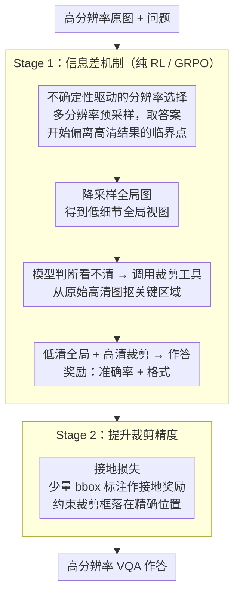

# LFPC: Learning to Focus and Precise Cropping for MLLMs

**会议**: CVPR 2026  
**arXiv**: [2603.27494](https://arxiv.org/abs/2603.27494)  
**代码**: [https://github.com/XuanPu-Z/LFPC](https://github.com/XuanPu-Z/LFPC)  
**领域**: 多模态VLM  
**关键词**: 多模态大语言模型, 强化学习, 裁剪工具, 信息差, 高分辨率VQA

## 一句话总结

LFPC 提出两阶段纯强化学习框架，通过"信息差"机制（降低全局图像分辨率迫使模型依赖高分辨率裁剪区域）和接地损失（提升裁剪精度），解决了现有 agent-based MLLM 中"先答后裁"的虚假工具调用问题，在高分辨率 VQA 上达到 SOTA。

## 研究背景与动机

MLLM 在复杂视觉场景中的细粒度感知仍是挑战。Agent-based 方法赋予模型"裁剪工具"来主动放大感兴趣区域，但现有训练策略存在关键问题。

**核心发现**：作者对 DeepEyes 等 RL-based 模型进行分析，发现一个令人担忧的行为模式——模型在执行裁剪前就已形成答案，裁剪只是用来"确认"预有结论。构建专用评测验证了这一假设：模型对裁剪区域内容的依赖性很弱。

**核心矛盾**：SFT+RL 方法受限于教师模型能力上限且生成轨迹成本高；纯 RL 方法虽不需要教师，但模型学到的是"走过场"的裁剪行为而非真正利用裁剪信息。

## 方法详解

### 整体框架

LFPC 要解决的是一个很反直觉的现象：给 MLLM 配上裁剪工具、用 RL 训练它"放大看细节"，模型却学会了"先把答案猜出来，再随便裁一块图装样子"。LFPC 的思路是不去改奖励函数，而是直接动输入——让模型手里的全局图像"看不清楚"，逼它不得不靠裁剪区域才能答对。整条流水线分两阶段、全程纯 RL（GRPO），不需要任何教师模型轨迹：Stage 1 用"信息差"把裁剪从可有可无变成答题必需，而信息差降到多少由"不确定性驱动的分辨率选择"逐样本标定；Stage 2 再用少量框标注把裁剪框摆到准确位置。输入一张高分辨率图和问题，模型先在被降采样过的全局视图上判断"看不清"，于是调用裁剪工具从原始高清图里抠出关键区域，最终结合两者作答。

### 关键设计

**1. 信息差机制（Information Gap）：让全局视图"不够用"，把裁剪逼成必需品**

这一条直接打在"先答后裁"的痛点上。以往做法是把高分辨率图整张喂进去，结果全局视图本身就够回答了，裁剪自然沦为走过场。LFPC 反其道而行：故意把输入的全局图像降采样到一个较低分辨率，制造一个低细节全局视图；而一旦模型决定裁剪，裁剪区域是从**原始高分辨率**图像里抠出来的、保留全部细节。这样低清全局和高清局部之间就拉开了一道"信息差"——问题的答案藏在只有裁剪才看得到的细节里，模型想答对就必须真的去用裁剪结果，而不是凭全局印象蒙。比如一张挂着多块路牌的高分辨率街景，问"最远那块牌子写的几号公路"，降采样后全局图里的牌子糊成一团，模型只能靠裁剪放大那块牌子才能读出字，裁剪从此有了实打实的作用。

**2. 不确定性驱动的分辨率选择：每张图该降到多糊，由模型自己说了算**

信息差要管用，降采样的"度"很关键：降太狠模型连图都看不懂、降太轻又起不到逼迫作用，而不同图像需要的细节粒度本就不同。LFPC 不用统一比例，而是让模型自己标定阈值——对同一个问题在一系列分辨率下分别采样答案，找到答案**开始与高分辨率结果不一致**的那个分辨率。这个临界点就是该样本的信息差边界：恰好低到全局视图答不出、又没低到完全无法理解画面。每张图按自己的阈值降采样，简单问题不会被过度削弱，复杂问题也能保证信息确实被抽走。

**3. 接地损失（Grounding Loss）：解决"裁得对不对"，把裁剪框摆准**

Stage 1 只保证了模型"愿意依赖裁剪"，但裁剪框的位置未必精准——可能框偏了、框大了。Stage 2 引入少量边界框标注作为接地奖励信号：奖励不光看模型是否调用了裁剪工具，还要看裁剪框是否落在与答案真正相关的精确位置上。这是一种成本很低的弱监督，只需少量标注，就能把"大致往那个方向裁"提升成"精确框住目标"，从而在 Stage 1 打好的依赖基础上再把裁剪精度顶上去。

### 损失函数 / 训练策略

全程纯 RL，基于 GRPO 算法，不依赖任何教师模型生成的轨迹。Stage 1 的奖励由准确率奖励 + 格式奖励组成（在信息差输入下，准确率奖励自然把模型推向"真正使用裁剪"）；Stage 2 在此基础上额外叠加接地奖励，用少量框标注约束裁剪位置。

## 实验关键数据

### 主实验

| 方法 | HR-Bench 4K | HR-Bench 8K | V* | 视觉Token |
|------|------------|------------|-----|-----------|
| DeepEyes | 74.0 | 68.0 | 85.9 | 16384 |
| LFPC (16K tokens) | **SOTA** | **SOTA** | **SOTA** | 16384 |
| LFPC (1K tokens) | 优于多数16K方法 | 优于多数16K方法 | 竞争力 | **1024** |

LFPC 在 16K 和 1K 两种视觉 token 预算下均达到 SOTA。

### 消融实验

| 配置 | 裁剪依赖度 | 性能 | 说明 |
|------|-----------|------|------|
| DeepEyes 基线 | 弱（先答后裁） | 基线 | 裁剪是虚假行为 |
| Stage 1 (信息差) | 强 | 显著提升 | 模型真正利用裁剪信息 |
| Stage 1 + Stage 2 (接地) | 强+精准 | SOTA | 裁剪位置更准确 |

### 关键发现

- "信息差"机制从根本上改变了模型对裁剪区域的依赖模式——从"确认性裁剪"变为"探索性裁剪"
- 1K token 预算下 LFPC 仍超过部分 16K token 方法，说明精准裁剪比大量 token 更重要
- 少量边界框标注（Stage 2）即可显著提升裁剪精度，标注成本很低

## 亮点与洞察

- **深刻的问题诊断**：发现 RL-based agent 的"先答后裁"问题，并构建专用评测验证。这种"先质疑再解决"的研究思路值得学习
- **信息差的巧妙设计**：通过控制输入信息量来引导模型行为，比修改奖励函数更直接有效。可迁移到任何 agent 工具使用场景
- **效率优势**：1K token 超过 16K token，证明"精准看什么"比"看多少"更关键

## 局限与展望

- 信息差机制的分辨率选择需要预采样，增加了预处理成本
- 当前仅支持单次裁剪，多步迭代裁剪可能进一步提升
- 接地损失的标注需求虽少但不为零
- 未来可探索多工具（裁剪+旋转+增强）的 agent 场景

## 相关工作与启发

- **vs DeepEyes**: 纯 RL 方法，但存在虚假裁剪问题，LFPC 通过信息差机制解决
- **vs SFT+RL 方法**: 需要教师模型生成轨迹，成本高且有能力上限，LFPC 完全不依赖教师
- **vs 注意力引导方法**: 通过注意力图分析重要区域，但缺乏显式的裁剪动作和信息利用保证

## 评分

- 新颖性: ⭐⭐⭐⭐⭐ 问题诊断深刻，信息差机制设计精巧
- 实验充分度: ⭐⭐⭐⭐ 多基准对比充分，但消融可以更详细
- 写作质量: ⭐⭐⭐⭐ 动机分析清晰，实验发现有说服力
- 价值: ⭐⭐⭐⭐⭐ 对 agent-based MLLM 的工具使用训练有重要启发

<!-- RELATED:START -->

## 相关论文

- [\[CVPR 2026\] Chart-FR1: Visual Focus-Driven Fine-Grained Reasoning on Dense Charts](chart-fr1_visual_focus-driven_fine-grained_reasoning_on_dense_charts.md)
- [\[CVPR 2026\] SPARROW: Learning Spatial Precision and Temporal Referential Consistency in Pixel-Grounded Video MLLMs](sparrow_learning_spatial_precision_and_temporal_referential_consistency_in_pixel.md)
- [\[CVPR 2026\] TempR1: Improving Temporal Understanding of MLLMs via Temporal-Aware Multi-Task Reinforcement Learning](tempr1_improving_temporal_understanding_of_mllms_via_temporal-aware_multi-task_r.md)
- [\[CVPR 2026\] R-4B: Incentivizing General-Purpose Auto-Thinking in MLLMs via Bi-Mode Annealing and Reinforce Learning](r-4b_incentivizing_general-purpose_auto-thinking_in_mllms_via_bi-mode_annealing_.md)
- [\[CVPR 2026\] Venus: Benchmarking and Empowering Multimodal Large Language Models for Aesthetic Guidance and Cropping](venus_benchmarking_and_empowering_multimodal_large_language_models_for_aesthetic.md)

<!-- RELATED:END -->
