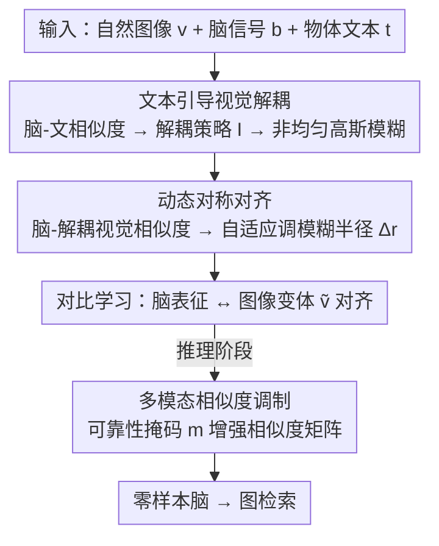

# Linguistic Priors for Visual Decoupling: Towards Symmetric Vision-Brain Alignment

**会议**: CVPR 2026  
**论文**: [CVF Open Access](https://openaccess.thecvf.com/content/CVPR2026/html/Liu_Linguistic_Priors_for_Visual_Decoupling_Towards_Symmetric_Vision-Brain_Alignment_CVPR_2026_paper.html)  
**代码**: https://github.com/TKQXX/BVSA  
**领域**: 多模态VLM / 脑视觉解码  
**关键词**: 脑视觉解码, 视觉-脑对齐, 语言先验, 视觉解耦, 对比学习

## 一句话总结
针对脑信号与自然图像之间的"语义信息不对称"，用物体级文本描述当语言先验去显式解耦图像中的前景物体与背景，把不对称的视觉-脑对齐变成语义对称对齐，在 THINGS-EEG / THINGS-MEG 零样本脑→图检索上刷新 SOTA。

## 研究背景与动机
**领域现状**：脑视觉解码（brain visual decoding）想从 EEG/MEG 这类脑信号里识别、重建人当时看到的视觉内容。主流做法是自监督对比学习——把图像和脑信号各自编码进同一个共享空间，最大化配对样本的相似度（如 NICE、ATM-S、UBP），从而建立视觉-脑对应关系。

**现有痛点**：这些方法直接对齐"整张图像"和"整段脑信号"，却忽略了二者携带的信息根本不对等。自然图像里既有任务相关的中心前景物体，也有大量任务无关的背景区域；而在 RSVP 范式采集的脑信号里，虽然被试被要求盯着图像中心的目标，记录到的信号却混着大量与任务无关的神经噪声（被试个体生理噪声、注意力波动）。

**核心矛盾**：图像端有"背景冗余"、脑信号端有"噪声污染"，这种双向的信息冗余使得直接对齐容易学到伪相关——模型可能基于背景或噪声建立对应，而不是真正聚焦目标物体，导致对齐出现语义偏置。

**本文目标**：把这种不对称对齐变成"语义对称对齐"，让模型在特征层面只对齐双方都真正承载的目标物体语义。

**切入角度**：作者借了认知神经科学的**双重编码理论（dual-coding theory）**——大脑里的具体概念同时通过视觉通道和语言通道表征，语言先验能够塑造和强化由视觉派生的语义表征。既然脑信号里的物体语义可以被语言"对照"，那就可以用文本来当裁判，判断脑信号里到底有多少清晰的物体语义。

**核心 idea**：引入物体导向的文本描述（如 "A photo of a [类别]"）作为语言先验，依据脑信号与文本的相似度动态地把图像中心物体从复杂场景里解耦出来，从而在视觉、脑两端都对齐到"目标物体"这一对称语义。

## 方法详解

### 整体框架
方法要解决的是"图像有背景冗余、脑信号有噪声"导致的对齐不对称。整体思路是：先用文本当语言先验评估脑信号里物体语义的清晰程度，据此把图像解耦成"中心清晰、外围模糊"的变体，再让脑表征去对齐这个解耦后的图像变体，最后在推理阶段用文本语义再增强一次检索相似度。输入是图像 $v$、脑信号 $b$、物体文本 $t$，输出是零样本脑→图检索结果。

视觉编码器 $G_V$ 用预训练 CLIP（实验中试了 RN50/RN101/ViT-B/16/ViT-B/32），脑编码器 $G_B$ 从头训练；基础训练目标是对称的视觉-脑对比损失 $\mathcal{L} = \mathcal{L}_{V\text{-}B} + \mathcal{L}_{B\text{-}V}$，其中 $\mathcal{L}_{V\text{-}B} = -\log \frac{\exp(\phi(\mathbf{h}_v,\mathbf{h}_b)/\tau)}{\sum_{j}\exp(\phi(\mathbf{h}_v,\mathbf{h}_{b_j})/\tau)}$，$\phi$ 为余弦相似度，$\tau$ 为温度。

### 关键设计

**1. 文本引导视觉解耦：用脑-文相似度决定"解耦多少中心区域"**

这是为了解决图像端"背景冗余"。作者不直接做硬分割（前景/背景二值切割），理由是人脑视觉处理并非二值——RSVP 范式让被试盯图像中心，而人眼中央凹分辨率最高、向外围递减。于是用文本描述 $t$ 当裁判：先算脑信号与文本的相似度 $s_{bt}=\phi(G_B(b),G_T(t))$，相似度越高说明脑信号里物体语义越清晰，就越该多保留中心、强解耦。具体把一个 batch 内的 $s_{bt}$ 近似当作正态分布 $\mathcal{N}(\mu,\delta^2)$，用不确定性量化估计均值 $\hat\mu$、无偏方差 $\hat\delta^2$，构造置信区间 $[\hat\mu - z_{\alpha/2}\hat\delta,\ \hat\mu + z_{\alpha/2}\hat\delta]$，按样本 $s_{bt}$ 落点定解耦策略：

$$\mathbb{I}=\begin{cases}1, & s_{bt}<\hat\mu - z_{\alpha/2}\hat\delta \\ -1, & s_{bt}>\hat\mu + z_{\alpha/2}\hat\delta \\ 0, & \text{otherwise}\end{cases}$$

然后用**非均匀高斯模糊**合成图像变体 $\tilde v = \mathbf{W}\odot v + (\mathbf{1}-\mathbf{W})\odot\mathcal{G}(v,\sigma)$，其中空间权重矩阵随到中心距离衰减且受 $\mathbb{I}$ 调制：$\mathbf{W}(i,j)=(0.5-\mathbb{I}\cdot c)\cdot\exp\!\big(-\frac{\lambda\|(i,j)-(i_0,j_0)\|_2}{D}\big)$，$(i_0,j_0)$ 是图像中心，$D$ 是最大距离，$c\in[0,0.5]$ 调节中心模糊程度。$\mathbb{I}=-1$ 时中心更锐、外围更糊，等于在特征层面把中心物体"解耦"出来。

**2. 动态对称对齐：再用脑-视觉相似度微调模糊半径，补上脑信号端的缺口**

光解耦图像还不够——脑信号本身可能没编码完整的视觉细节。这一步进一步评估脑信号对"已解耦视觉特征"$G_V(\tilde v)$ 的承载程度：算 $s_{bv}=\phi(G_B(b),G_V(\tilde v))$，同样近似正态分布并建置信区间。对落在区间外的离群样本，通过增减模糊（$\Delta r$）来动态调整最终模糊半径 $r$，使脑信号与解耦视觉物体之间的信息差距被自适应缩小，从而得到更鲁棒的对称匹配。它和设计 1 是一对：设计 1 从"图像该糊多少"的角度解耦，设计 2 从"脑信号能撑住多少视觉细节"的角度回调，两端一起把对齐推向对称。

**3. 多模态相似度调制：推理时用可靠的脑-文语义放大检索相似度**

训练好的框架在推理时还能再榨一层文本红利。给一个 batch 的脑表征 $\mathbf{H}_b$、图像表征 $\mathbf{H}_v$、文本表征 $\mathbf{H}_t$，先算视觉相似度矩阵 $\mathbf{M}_{bv}=\mathbf{H}_b\mathbf{H}_v^\top$ 和语义相似度矩阵 $\mathbf{M}_{bt}=\mathbf{H}_b\mathbf{H}_t^\top$。取 $\mathbf{M}_{bt}$ 对角得到每个脑-文对的语义分 $s_{bt}=\mathrm{diag}(\mathbf{M}_{bt})$，估其置信区间下界 $s_{th}=\hat\mu_{bt}-z_{\alpha/2}\hat\delta_{bt}$，构造二值可靠性掩码 $m_i=\mathbb{1}[s_{bt}^{(i)}\ge s_{th}]$。最后做语义增强：$\mathbf{M}_{\text{enhanced}}=\mathbf{M}_{bv}+\mathbf{m}\mathbf{m}^\top\odot\mathbf{M}_{bv}\odot\mathbf{M}_{bt}$。核心是：当某个脑响应被判为语义可靠（$m_i=1$）时，就按语义一致性放大它与对应图像的视觉相似度——等于"放大可靠样本、压制噪声样本"，提升从脑信号里抓关键视觉语义的能力。

> ⚠️ 缓存为 OCR 文本，公式 (1)(3)(4)(5) 等存在符号断裂，已按上下文复原；具体下标与常数请以原文为准。

### 损失函数 / 训练策略
基础目标是对称视觉-脑对比损失 $\mathcal{L}=\mathcal{L}_{V\text{-}B}+\mathcal{L}_{B\text{-}V}$；脑/图像特征投影到同一共享空间（维度由图像编码器决定）。优化器 AdamW，batch size 1024，学习率 $1\times10^{-4}$，权重衰减 $1\times10^{-4}$，温度参数像 CLIP 一样作为可学习缩放因子直接优化；超参 $c=0.5$、显著性水平 10%；训练 50 epoch，单张 RTX 3080。

## 实验关键数据

### 主实验
THINGS-EEG（10 被试）/ THINGS-MEG（4 被试）200-way 零样本脑→图检索，指标为 Top-1 / Top-5 检索准确率（%，越高越好）。

| 设置 | 数据集 | 指标 | 本文 | 之前SOTA(UBP) | 提升 |
|--------|------|------|------|----------|------|
| Intra-subject | THINGS-EEG | Top-1 / Top-5 | 58.2 / 89.1 | 50.9 / 79.7 | +7.3 / +9.4 |
| Inter-subject | THINGS-EEG | Top-1 / Top-5 | 15.8 / 39.4 | 12.4 / 33.4 | +3.4 / +6.0 |
| Intra-subject | THINGS-MEG | Top-1 / Top-5 | 32.5 / 62.9 | 26.7 / 55.2 | +5.8 / +7.7 |
| Inter-subject | THINGS-MEG | Top-1 / Top-5 | 5.4 / 13.6 | 2.2 / 10.4 ⚠️ | +3.2 / +3.2 |

> 注：intra-subject 为单被试自训自测，inter-subject 为留一被试跨被试泛化（难度高很多，故绝对值低）。两种设置不可直接横向比大小。

### 消融实验
THINGS-EEG 上逐步加模块（平均 Top-1 / Top-5）：

| 配置 | Top-1 / Top-5 | 说明 |
|------|---------|------|
| Vanilla | 43.6 / 77.0 | 纯对比学习基线 |
| + Decouple | 54.9 / 87.7 | 加文本引导视觉解耦（+11.3 Top-1） |
| + Dynamic | 55.6 / 87.5 | 再加动态对称对齐 |
| + Enhancement (Full) | 58.2 / 89.1 | 再加多模态相似度调制 |

中心模糊系数 $c$ 的敏感性（THINGS-EEG，平均）：

| $c$ | Top-1 / Top-5 |
|------|---------|
| 0.1 | 56.2 / 86.5 |
| 0.2 | 56.8 / 88.1 |
| 0.3 | 56.7 / 88.3 |
| 0.5（默认） | 58.2 / 89.1 |

### 关键发现
- 贡献最大的是**文本引导视觉解耦**：从 Vanilla 的 43.6 一步跳到 54.9（Top-1 +11.3），说明"先解耦再对齐"才是性能主来源，后两个模块各再叠 0.7 / 2.6。
- 在 EEG（时间分辨率高）上提升幅度比 MEG 更显著；跨被试（inter-subject）场景绝对值虽低，但相对 UBP 仍稳定领先，说明语言先验带来的对称对齐有跨被试泛化价值。
- 对超参 $c$ 不敏感（0.1→0.5 间 Top-1 仅 56.2→58.2 浮动），方法鲁棒。

## 亮点与洞察
- **用"信息不对称"重新定义脑视觉解码问题**：以往都在拼编码器/对比损失，本文指出真正的瓶颈是图像背景冗余 + 脑信号噪声造成的双向不对称，视角很新。
- **拿文本当"裁判"而非"输入"**：文本不是直接喂进模型对齐，而是用脑-文相似度去间接决定图像该解耦多少——这种"语言先验调制视觉处理"的用法可迁移到任何需要按样本可信度自适应处理的跨模态任务。
- **软解耦优于硬分割**：非均匀高斯模糊（中心锐、外围糊）显式模拟了人眼中央凹特性，比二值前/背景分割更贴合脑认知，这个 trick 在任何"中心注意"范式数据上都值得借鉴。

## 局限与展望
- 方法强依赖 RSVP "盯中心物体"范式与物体导向文本描述，对非中心注意、多物体或场景级刺激是否成立未验证。
- 跨被试绝对准确率仍很低（MEG inter-subject Top-1 仅 5.4%），离实用 BCI 还有距离。
- 解耦策略 $\mathbb{I}$ 只分三档（$-1/0/1$），且依赖 batch 内正态假设估计置信区间，batch 较小或分布偏态时估计可能不稳，可考虑更平滑的连续解耦权重。
- ⚠️ 多处公式来自 OCR 文本，复现时需对照官方代码（已开源 BVSA）核对权重矩阵与增强公式细节。

## 相关工作与启发
- **vs UBP**: UBP 用不确定性感知的"模糊先验"缩小脑-图表征系统性差异，但仍是直接对齐；本文同样借不确定性量化，却把它用来按脑-文相似度做置信区间判定、再驱动文本引导的视觉解耦，把"模糊"从启发式正则升级为语义可控的对称对齐手段，全面超越 UBP。
- **vs NICE / ATM-S**: 它们走纯视觉-脑对比学习/自适应脑编码器，忽略信息不对称；本文显式引入语言通道做语义对称化，是动机上的根本区别。
- **vs BraVL**: BraVL 也用脑/视觉/语言三模态 + 互信息正则，但文本作为对齐的第三方目标；本文的文本是"调制器"，用来动态决定视觉解耦强度，定位完全不同。

## 评分
- 新颖性: ⭐⭐⭐⭐⭐ 把脑视觉解码重述为"信息不对称"并用语言先验做对称化，视角和机制都新
- 实验充分度: ⭐⭐⭐⭐ 两数据集 + intra/inter 双设置 + 逐模块消融 + 超参分析，但仅检索任务、未做重建可视化定量
- 写作质量: ⭐⭐⭐⭐ 动机链清晰、图示到位，公式偏密
- 价值: ⭐⭐⭐⭐ 刷新 SOTA 且语言先验调制思路可迁移，但跨被试绝对精度离实用尚远

<!-- RELATED:START -->

## 相关论文

- [\[AAAI 2026\] Recursive Visual Imagination and Adaptive Linguistic Grounding for Vision Language Navigation](../../AAAI2026/multimodal_vlm/recursive_visual_imagination_and_adaptive_linguistic_grounding_for_vision_langua.md)
- [\[AAAI 2026\] Aligning the True Semantics: Constrained Decoupling and Distribution Sampling for Cross-Modal Alignment](../../AAAI2026/multimodal_vlm/aligning_the_true_semantics_constrained_decoupling_and_distr.md)
- [\[CVPR 2026\] EgoMind: Activating Spatial Cognition through Linguistic Reasoning in MLLMs](egomind_activating_spatial_cognition_through_linguistic_reasoning_in_mllms.md)
- [\[CVPR 2026\] β-CLIP: Text-Conditioned Contrastive Learning for Multi-Granular Vision-Language Alignment](b-clip_text-conditioned_contrastive_learning_for_multi-granular_vision-language_.md)
- [\[CVPR 2026\] Boosting Visual Reprogramming for CLIP with Dual Granularity Alignment](boosting_visual_reprogramming_for_clip_with_dual_granularity_alignment.md)

<!-- RELATED:END -->
