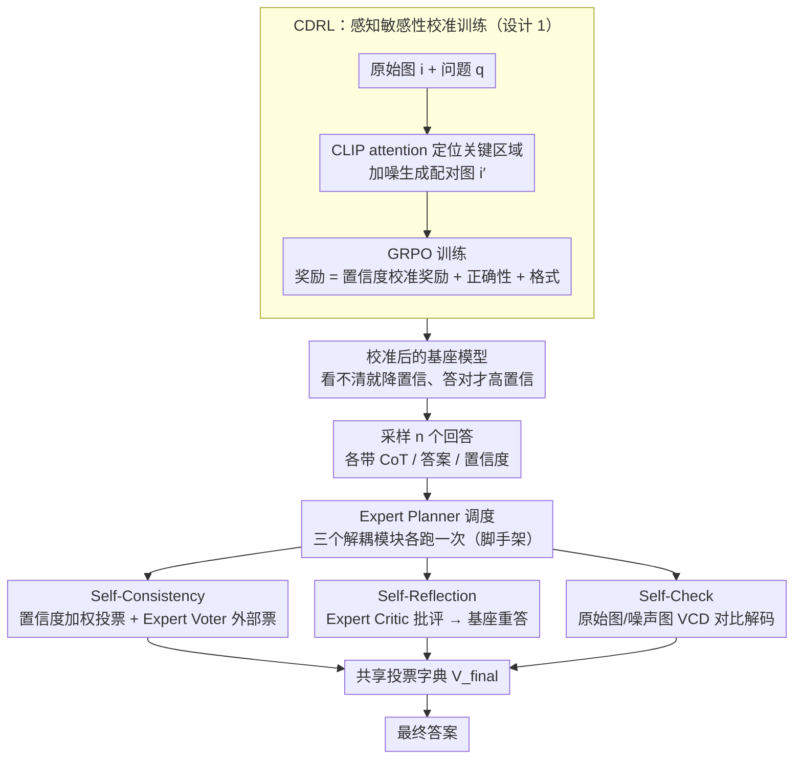

# Linking Perception, Confidence and Accuracy in MLLMs

**会议**: CVPR 2026  
**arXiv**: [2603.12149](https://arxiv.org/abs/2603.12149)  
**代码**: [https://github.com/anotherbricki/CA-TTS](https://github.com/anotherbricki/CA-TTS)  
**领域**: 多模态VLM  
**关键词**: 多模态大模型, 置信度校准, 强化学习, 测试时缩放, 视觉感知

## 一句话总结
揭示 MLLM 的严重置信度失校准问题（视觉输入退化时准确率暴跌但置信度不变），提出 CDRL（基于原始-噪声图像对的置信度驱动 RL）进行感知敏感性训练，并利用校准后的置信度实现自适应测试时缩放（CA-TTS），在四个基准上平均提升 8.8%。

## 研究背景与动机
近年来 MLLM 研究主要聚焦于增强视觉感知能力以提升准确率，但一个关键问题被忽视了：**模型知道自己什么时候不知道吗？**

作者设计了一个探测实验：对关键视觉证据逐步添加噪声，同时观察模型的置信度和准确率变化。结果发现：置信度几乎保持不变，但准确率大幅下降。这暴露了 MLLM 的严重置信度失校准——即使视觉感知严重退化，模型仍维持高置信度。

现有 LLM 的置信度校准方法在 token 粒度上操作，但 MLLM 的视觉感知是全局性的（贯穿整个响应），存在粒度不匹配。LLM 校准方法也未考虑视觉组件对校准的影响。

核心 idea：(1) 用原始-噪声图像对训练 RL，通过置信度差异奖励增强感知敏感性，同时用准确性-置信度对齐奖励实现校准；(2) 校准后的置信度天然可作为测试时缩放的路由信号——这是一个"免费午餐"，因为校准本身就带来了 TTS 能力。

## 方法详解

### 整体框架
这篇论文要解决的是 MLLM「看不清也照样自信」的失校准问题，并把校准后的置信度变成推理时的调度信号。整体分两阶段：训练时用 CDRL 把模型练得「对视觉退化敏感、答对时才高置信」；推理时用 CA-TTS 把这套校准好的置信度当路由信号，自适应调度三个解耦的验证模块。具体地，CDRL 先用 GRPO 在「原始图—噪声图」配对上训练，让置信度随视觉证据的好坏而升降；推理阶段，基座模型先采样多个回答，再由 Self-Consistency、Self-Reflection、Self-Check 三个模块各自产出一份投票，最后汇总成答案，全程由一个 Expert Model 分别扮演 Planner / Voter / Critic 来协调。

### 关键设计

**1. Confidence-Driven Reinforcement Learning（CDRL）：用图像对教模型「看不清就别自信」**

探测实验暴露的痛点是模型对视觉退化「钝感」——证据被破坏了置信度却纹丝不动，于是先得让置信度对视觉证据敏感起来。CDRL 的做法是用 CLIP 的 attention map 找到关键视觉区域，对其加噪生成配对图 $(i, i')$，让同一个问题在「清晰图」和「关键证据被毁的图」上各跑一遍。置信度用全序列的 Negative Mean Log-Probability 度量：$C = \frac{1}{T}\sum_{t=1}^T \text{Conf}_{\text{token}_t}$，其中 $\text{Conf}_{\text{token}} = -\frac{1}{k}\sum_{i=1}^k \log p_{(i)}$，值越低代表越确定。奖励则拆成两项：

$$R_{\text{Conf},j} = \underbrace{\alpha \tanh(\beta \cdot \Delta C)}_{\text{Perception Term}} + \underbrace{(2 \cdot R_{\text{Output},j} - 1) \cdot C_j^{norm}}_{\text{Calibration Term}}$$

Perception Term 奖励原始图与噪声图之间的置信度落差 $\Delta C = C_j - C_j'$，落差越大说明模型越「看得出图被毁了」，逼它对视觉退化敏感；Calibration Term 则把置信度和对错挂钩——答对时奖励高置信（$+C_j$）、答错时惩罚高置信（$-C_j$），从而把 accuracy 和 confidence 对齐。两项一起，模型既学会「看不清就降置信」，又学会「只有真答对才敢高置信」。

**2. Self-Consistency：让「确信的正确回答」投出更重的票**

校准好置信度后，最直接的用法是把它当投票权重。采样 $n$ 个回答后，内部投票按各自置信度加权累加：$V_{internal}[k] = \sum_{i=1}^n C_i \cdot \mathbb{I}(A_i = k)$，于是高置信的回答天然贡献更大权重，这是普通多数投票做不到的。在此之上再引入 Expert Model 当 Voter，对候选选项给出一份独立的外部置信度 $C_{expert}$，与内部投票归一化后相加：$V_{final}[k] = V_{internal}^{norm}[k] + \tau_1 \cdot c_k$。一内一外两个来源互相印证，比单纯数票更稳。

**3. Self-Reflection：用外部批评把低置信的预测掰回来**

如果某个预测置信度偏低，往往意味着模型自己也没把握，这种情况靠它反复采样意义不大，更该引入外部视角。这里让 Expert Model 扮演 Critic，针对问题生成一段批评 $Crit = M_{expert}^{Critic}(i, q, P_{critique})$，再把批评喂回基座模型重新作答 $(CoT_{reflect}, A_{reflect}) = M_{base}(i, q, Crit)$。反思出的答案以权重 $\tau_2$ 加入最终投票，相当于给低置信场景配了一条「被点醒后再想一遍」的纠错通道。

**4. Self-Check：从视觉层面拆穿「虚假自信」**

前三步都在文本/答案层面验证，这一步补上视觉层面的核验。它复用 CDRL 里的噪声图，用 Visual Contrastive Decoding（VCD）把原始图和噪声图的输出对比解码：$\log P_{VCD}(y|i,q) = (1+\alpha) \cdot \log P_\theta(y|i,q) - \alpha \cdot \log P_\theta(y|i',q)$。直觉是：真正依赖图像证据的推理在清晰图上 logit 高、在噪声图上会塌掉，两者之差能放大「真实视觉信号」、压掉那些在噪声图上依然出现的「虚假自信」。对比解码出的答案以权重 $\tau_3$ 汇入投票，成为第三份独立证据。

值得一提的是，后三个模块完全解耦、顺序无关，各自只贡献一份带权投票，因此可以任意增删或重排而不破坏框架。

### 一个完整示例

> ⚠️ 以下数字为示意，用于说明投票如何汇总，非原文给定。

给一道几何题配一张图，基座模型采样 5 个回答，其中 3 个选 A（置信度分别 0.9 / 0.8 / 0.7）、2 个选 B（0.4 / 0.3）。**Self-Consistency** 先算内部加权票：A 得 $0.9+0.8+0.7=2.4$，B 得 $0.4+0.3=0.7$；Expert Voter 独立判断后给 A 加一份外部票，A 进一步领先。**Self-Reflection** 注意到 B 那两个回答置信度低，触发 Critic 生成批评、让基座重答，结果倒向 A，又给 A 添一份 $\tau_2$ 权重的票。**Self-Check** 把图加噪后跑 VCD，发现选 A 的 logit 在清晰图上高、噪声图上塌掉（说明 A 真的看了图），而 B 在两张图上差不多（说明 B 是「闭眼蒙」），于是再投 A 一份 $\tau_3$ 票。三路证据叠加，最终稳稳输出 A——关键在于：如果模型没经过 CDRL 校准，B 的两个回答可能也是 0.9 高置信，上述每一步都会被带偏。

### 损失函数 / 训练策略
GRPO 训练，总奖励 $r_j = R_{\text{Conf},j} + R_{\text{Output},j} + R_{\text{Format},j}$（置信度 + 答案正确性 + 格式）。基座模型 Qwen2.5-VL-7B-Instruct，8×H100 全参数微调，训练集 1936 样本；Expert Model 为 Gemini-2.5-Pro，推理时三个权重取 $\tau_1=\tau_2=\tau_3=0.5$。

## 实验关键数据

### 主实验

| 方法 | Math-Vista | Math-Vision | MMStar | MMMU |
|------|-----------|------------|--------|------|
| Pass@1 (base) | 64.7 | 23.0 | 60.2 | 48.8 |
| Majority Voting | 69.8 | 30.1 | 69.0 | 57.5 |
| VL-Rethinker | 74.1 | 30.7 | 63.4 | 55.6 |
| We-Think | 73.3 | 29.7 | 65.1 | 55.7 |
| **Ours (CDRL+CA-TTS)** | **79.5** | **42.4** | **71.3** | **66.3** |

### 消融实验

| 配置 | Math-Vision ALL | 说明 |
|------|----------------|------|
| Training-Free (Pass@1) | 22.96 | 基线 |
| CDRL only | 26.38 | 校准后模型状态更好 |
| CA-TTS only | 37.99 | TTS 框架显著提升 |
| CDRL + CA-TTS | **42.35** | 二者协同，最佳 |

### 关键发现
- CDRL 训练后模型对视觉扰动的置信度下降幅度提升 4-8 倍（如 Noised: -0.32 → -1.39），真正"知道自己不知道"
- CA-TTS 的缩放斜率 $\beta_1 = 3.65$ 是 Majority Voting（1.64）的 2.2 倍、DeepConf（1.19）的 3.1 倍——校准后的置信度使 TTS 更高效
- 即使用 Qwen2.5-VL-7B 自身作为 Expert，也比 Majority Voting 提升显著，不依赖超强 Expert
- 在 MMMU 上 66.3% vs VL-Rethinker 55.6%，提升 10.7 个百分点

## 亮点与洞察
- "模型知道自己不知道吗"的探测实验非常直观有力地揭示了 MLLM 的核心缺陷
- CDRL 的双项奖励设计优雅：Perception Term 用图像对增强敏感性，Calibration Term 将置信度与准确性对齐
- "校准后的置信度是免费午餐"——训练时的校准直接转化为推理时 TTS 的能力，无需额外成本
- CA-TTS 的三个模块完全解耦、顺序无关，都只贡献投票，架构灵活且鲁棒

## 局限与展望
- CA-TTS 依赖 Expert Model（如 Gemini-2.5-Pro），引入了外部 API 成本和延迟
- 训练数据仅 1936 样本，扩大规模可能进一步提升校准质量
- Self-Check 的 VCD 需要对噪声图像额外推理，增加了推理开销
- 三个模块的投票权重 $\tau_1 = \tau_2 = \tau_3 = 0.5$ 为固定值，自适应权重可能更优

## 相关工作与启发
- DeepConf 用置信度做 TTS，但仅用于数学推理且未做校准训练，本文补上了训练环节
- VCD 原用于缓解幻觉，本文将其整合到 TTS 框架中作为视觉自检模块
- 与 ToT 等树搜索方法相比，CA-TTS 的解耦多阶段验证更鲁棒，避免了单点故障

## 评分
- 新颖性: ⭐⭐⭐⭐⭐ 首次系统研究 MLLM 的视觉感知-置信度校准问题，CDRL+CA-TTS 框架原创性强
- 实验充分度: ⭐⭐⭐⭐⭐ 四个基准、多消融、缩放曲线分析、敏感性实验、case study 均完善
- 写作质量: ⭐⭐⭐⭐ 探测实验引入方式引人入胜，框架描述清晰
- 价值: ⭐⭐⭐⭐⭐ 揭示了 MLLM 的基础性问题并提供系统性解决方案，8.8% 平均提升意义重大

## 关键术语
- **NMLP (Negative Mean Log-Probability)**: 全序列级别的置信度度量，值越低表示越确定
- **Perceptual Bluntness**: 模型对视觉输入退化不敏感的现象
- **VCD (Visual Contrastive Decoding)**: 对比原始和噪声图像的 logit 差异进行解码
- **Free Lunch**: 校准训练免费获得的 TTS 能力提升

<!-- RELATED:START -->

## 相关论文

- [\[CVPR 2026\] CodePercept: Code-Grounded Visual STEM Perception for MLLMs](codepercept_code-grounded_visual_stem_perception_for_mllms.md)
- [\[CVPR 2026\] CropVLM: Learning to Zoom for Fine-Grained Vision-Language Perception](cropvlm_learning_to_zoom_for_fine_grained_vision_language_perception.md)
- [\[CVPR 2026\] LFPC: Learning to Focus and Precise Cropping for MLLMs](lfpc_learning_to_focus_and_precise_cropping_for_mllms.md)
- [\[NeurIPS 2025\] Struct2D: A Perception-Guided Framework for Spatial Reasoning in MLLMs](../../NeurIPS2025/multimodal_vlm/struct2d_a_perception-guided_framework_for_spatial_reasoning_in_mllms.md)
- [\[ACL 2026\] VL-Calibration: Decoupled Confidence Calibration for Large Vision-Language Models Reasoning](../../ACL2026/multimodal_vlm/vl-calibration_decoupled_confidence_calibration_for_large_vision-language_models.md)

<!-- RELATED:END -->
