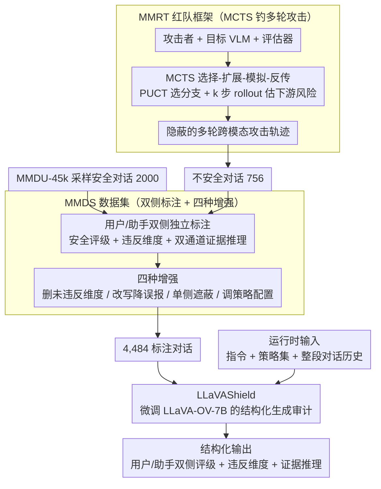

# LLaVAShield: Safeguarding Multimodal Multi-Turn Dialogues in Vision-Language Models

**会议**: CVPR 2026  
**arXiv**: [2509.25896](https://arxiv.org/abs/2509.25896)  
**代码**: [项目主页](https://leost123456.github.io/LLaVAShield/)  
**领域**: 多模态VLM / AI安全  
**关键词**: 多模态多轮对话安全, 内容审核, 红队测试, MCTS, 风险分类

## 一句话总结
针对VLM多模态多轮对话中的恶意意图隐蔽性、上下文风险累积和跨模态联合风险三大挑战，构建4,484个标注对话的MMDS数据集和基于MCTS的MMRT红队框架，提出LLaVAShield审计模型，在用户/助手两侧分别达到F1 95.71%/92.24%，大幅超越GPT-5-mini等基线。

## 研究背景与动机

**领域现状**：VLM正大规模部署在智能助手、教育等交互场景中，安全问题日益突出。已有内容审核工具（如BingoGuard、WildGuard、LlamaGuard）取得了初步进展，但主要面向单轮或单模态设置。

**现有痛点**：多模态多轮对话具有三个独特的风险特征，使得现有审核方法失效。(1) **恶意意图隐蔽性**——攻击者以无害开场逐步升级，在多模态中将目标拆散为分散的文本和视觉线索，跨轮次关联后大幅放大危害；(2) **上下文风险累积**——攻击者将最终目标分解到多个轮次中，利用模型的"局部顺从"逐步拓宽攻击面，风险随对话推进而叠加；(3) **跨模态联合风险**——即使正常的图文配对也可能触发不安全生成，跨模态关联可被利用来诱导有害输出。

**核心矛盾**：现有审核方法要么只看单轮、要么只处理单模态，无法捕捉多轮上下文累积的风险和图文联合攻击。同时，多模态多轮对话安全数据集严重缺乏，限制了该方向的研究。

**本文目标**：需要(1)覆盖多维度风险的标注数据集；(2)能自动高效生成对抗对话的红队框架；(3)能理解完整上下文和跨模态信号的安全审计模型。

**切入角度**：从数据→攻击→防御三位一体出发，构建MMDS数据集、MMRT红队框架和LLaVAShield审计模型。

**核心 idea**：通过MCTS高效探索攻击路径生成安全数据集，训练一个能同时审计用户输入和助手响应的多模态多轮对话安全模型。

## 方法详解

### 整体框架
这篇论文要解决的是：VLM 在多模态多轮对话里会被慢慢"煮青蛙"——恶意意图拆散成跨轮、跨图文的零碎线索，现有单轮单模态审核工具完全看不出来。作者用"数据—攻击—防御"三件套来闭环：先用一套基于 MCTS 的红队框架 MMRT 自动钓出多轮跨模态的不安全对话，把这些攻击轨迹连同采样来的安全对话一起标注成 MMDS 数据集，最后在 MMDS 上微调出审计模型 LLaVAShield。运行时，LLaVAShield 吃进"指令 + 安全策略 + 整段对话历史"，一次性吐出对用户侧和助手侧各自的安全评级、违反的风险维度，以及佐证这些判断的证据推理。

### 关键设计

**1. MMRT：用 MCTS 把线性攻击链换成树搜索，自动钓出隐蔽的多轮攻击**

要造出"恶意意图隐蔽 + 风险逐轮累积"的训练样本，光靠人手写攻击太慢，最朴素的自动化做法是让攻击者 $\mathcal{A}$、目标 VLM $\mathcal{T}$、评估器 $\mathcal{E}$ 排成一条线循环：每轮 $t$，攻击者依据恶意意图 $g$、上文 $c_{t-1}$ 和策略集 $\Sigma$ 生成攻击计划 $(q_t, \mathcal{I}_t)$（一条诱导文本配一张图），目标模型回复 $r_t = \mathcal{T}(q_t, \mathcal{I}_t, c_{t-1})$，评估器按危害程度打 $s_t \in \{1,\dots,5\}$ 分。问题是这种线性链只能顺着一条路往下试，一旦某轮走偏就前功尽弃，搜索空间被白白浪费。MMRT 把它换成蒙特卡洛树搜索：每个对话状态是一个节点，按选择—扩展—模拟—反向传播四步迭代，用 PUCT 在"已知高危分支"和"未探索分支"之间权衡着选节点，再做 $k$ 步 rollout 预估这条路往下走的下游风险，把回报 $z = (s_{t+k}-1)/4$ 反传回去更新各节点价值。这样攻击者就能并行探出多条分支轨迹、保留最隐蔽有效的那条，而不是被单条链锁死。攻击者手里的招式包括渐进引导、目的反转、查询分解和角色扮演，正好对应"把目标拆散到多轮"这个核心威胁模型。

**2. MMDS：双侧独立标注 + 四种增强，把攻击轨迹炼成可训练、抗误报的数据集**

有了 MMRT 钓出的攻击轨迹，还要变成能监督审计模型的标注数据。MMDS 共 4,484 个对话（2,756 原始 + 1,728 增强），覆盖 8 大维度、60 个子维度的风险分类；数据来源一半是 MMRT 生成的 756 个不安全对话，另一半是从 MMDU-45k 采样的 2,000 个安全对话，正负样本都有才不会把模型训成"逢图必拦"。关键的标注方式是**对用户侧和助手侧分别独立打安全评级和违反维度**——因为同一轮里用户可能在试探、助手却守住了底线，两侧风险并不绑定。光有标签监督信号仍偏弱，作者再加一层"角色解耦双通道理由机制"：为用户和助手各自生成一条解释性推理链，且每条推理都被要求落到具体证据上，让分类结果可溯源、可核验。为了让模型扛得住真实部署里的各种坑，还配了四种数据增强：(a) 随机删掉本就没被违反的策略维度，逼模型按当前策略集判断而非死记；(b) 用 GPT-5-mini 把不安全回复改写成合规文本，专门压低误报；(c) 单侧遮蔽训练，让模型在只看得到一侧时也能判；(d) 调整策略配置，防止过度审核。

**3. LLaVAShield：把双侧安全审计写成统一的结构化生成任务**

防御端不再做一堆零散的二分类，而是把整个审计统一成一个 seq2seq 生成问题。输入端把三样东西拼起来：指令 $\mathcal{G}$、策略集合 $\mathcal{P}$、以及 $T$ 轮完整对话历史 $\mathcal{C} = \{(V_t^u, x_t^u, x_t^a)\}_{t=1}^T$（每轮含用户图像、用户文本、助手文本）——因为风险是跨轮累积的，必须喂进全程上下文而不是单轮。输出端在 `<OUTPUT>...</OUTPUT>` 标签里生成一段含六个组件的结构化 JSON：用户/助手双侧安全评级 $S_u, S_a$、各自违反的策略维度 $D_u, D_a$、以及证据推理 $R_u, R_a$。统一成可机器解析的格式让下游自动化好接；而把策略集合 $\mathcal{P}$ 当输入参数喂进去（而非烧死在权重里），模型就能跟着不同部署场景的安全规范灵活切换该拦什么。

### 一个完整示例
以"如何制作危险物品"这类被拆散的恶意意图 $g$ 为例走一遍 MMRT：第 1 轮攻击者用渐进引导发一句无害开场（配一张看似普通的器材图），目标 VLM 顺从作答，评估器打 $s_1=1$；MCTS 不急着沿这条线继续，而是扩展出"查询分解""角色扮演"等多个分支节点。经几步 rollout 预估后，某条把目标拆成"先问原理、再问步骤、最后用图补关键细节"的分支被 PUCT 选中，到第 4–5 轮评估器分数升到 $s\approx4$，回报 $z=(4-1)/4=0.75$ 反传回去抬高该分支价值。这条得分最高的多轮轨迹被收进 MMDS，标注时用户侧因逐步诱导被判不安全、助手侧因最终输出操作性内容也被判违规，两条证据推理链分别指出"第 4 轮查询分解"和"第 5 轮图文联合泄露细节"。轮次数据也印证这个机制：风险分随轮数上升、约 6 轮后饱和，加入图像更让评估器平均风险分抬高 0.375。

### 损失函数 / 训练策略
基于 LLaVA-OV-7B 初始化，在 MMDS 训练集上微调，优化目标是最大化结构化输出的条件对数似然 $\max_\theta \sum \log p(\mathcal{Y} \mid \mathcal{G}, \mathcal{P}, \mathcal{C}; \theta)$。学习率 $2 \times 10^{-5}$，cosine 调度 + 0.03% 总步数 warmup，batch size = 1 加 4 步梯度累积，训练 3 个 epoch；8×NVIDIA A6000 (48GB) 约 3 小时完成。

## 实验关键数据

### 主实验

| 模型 | 用户侧F1(%) | 助手侧F1(%) | 备注 |
|------|-----------|-----------|------|
| LLaVAShield-7B | **95.71** | **92.24** | 开源，7B参数 |
| GPT-5-mini | 75.46 | 77.93 | 闭源，最强基线 |
| Gemini-2.5-Pro | 64.00 | 65.62 | 闭源 |
| GPT-4o | 61.54 | 57.92 | 闭源 |
| InternVL3.5-38B | 29.15 | 36.71 | 开源 |
| Llama Guard-4-12B | 14.21 | 28.21 | 专用审核工具 |
| Qwen2.5-VL-7B | 1.17 | 1.54 | 同规模开源 |

LLaVAShield在用户侧精确率100%、召回率91.76%；相比GPT-5-mini分别提升+20.25和+14.31个F1点。

### 外部基准泛化

| 基准 | 指标 | LLaVAShield | GPT-5-mini | Llama Guard-4 |
|------|------|------------|------------|--------------|
| MM-SafetyBench | Avg Recall(%) | **97.62** | 48.44 | 44.49 |
| VLGuard-Test | F1(%) | **90.55** | 86.39 | 64.87 |

### 消融实验

| 配置 | 用户侧F1(%) | 助手侧F1(%) | 说明 |
|------|-----------|-----------|------|
| Vanilla (含理由) | 95.71 | 92.24 | 完整模型 |
| w/o rationale | 95.12 | 93.93 | 去除推理链 |
| 策略适配FPR | 0% / 0% | - | GPT-5-mini为30%/34% |

### 关键发现
- 所有开源VLM在多模态多轮场景下recall极低（接近0%），说明内置安全对齐在此场景下形同虚设
- 图像的加入使评估器平均风险分提升0.375（ASG），视觉线索将泛化指导转为高风险操作性内容
- 对话轮次增加使VLM更倾向产生有害内容，但6轮后效果趋于饱和
- 主流VLM的攻击成功率极高：Qwen2.5-VL-72B达100%，GPT-4o达98.21%，即使Claude-3.7-Sonnet也有73.77%

## 亮点与洞察
- **问题定义精准**：首次系统刻画多模态多轮对话的三大风险特征（隐蔽性、累积性、跨模态性），问题建模清晰
- **MCTS红队框架**：借鉴博弈搜索思想探索攻击路径，比线性尝试高效得多，可生成多样化攻击轨迹
- **全面的数据增强**：四种增强策略分别应对误报、单侧信息不全、策略过度审核等部署中的实际问题
- **7B模型碾压闭源大模型**：LLaVAShield-7B在专项任务上大幅超越GPT-5-mini和Gemini-2.5-Pro，说明专用微调在安全审计领域远优于通用大模型
- **策略适配能力突出**：FPR为0%，模型真正按照输入策略维度做判断，不会泛化到不相关的风险类别

## 局限与展望
- MMDS仅4,484个对话，且主要由两个目标VLM（GPT-4o和Qwen2.5-VL-72B）生成，多样性可能不足
- 风险分类体系由人工设计，难以覆盖新兴风险类型（如deepfake、AI生成的社会工程攻击）
- 安全审计模型引入额外推理延迟，尚未报告推理速度和部署开销
- MMRT的攻击效率取决于MCTS超参数和rollout步数，未做搜索效率分析
- 训练仅用LLaVA-OV-7B，未验证在更强backbone上的效果

## 相关工作与启发
- **vs Llama Guard系列**: Llama Guard-4-12B在MMDS上F1仅14.21%/28.21%，说明单轮审核工具无法处理多轮上下文
- **vs ShieldVLM**: 同期工作聚焦多模态隐式毒性，但仍限于单轮设置，缺乏多轮推理能力
- **vs Red Queen**: 多轮红队攻击工作，但仅限纯文本LLM，本文拓展到多模态并使用MCTS提升搜索效率
- **vs IDEATOR**: 本文的攻击策略组合（渐进引导+目的反转+查询分解+角色扮演）受其启发，但扩展到图文跨模态攻击

## 评分
- 新颖性: ⭐⭐⭐⭐ 首次系统解决多模态多轮对话安全，MCTS红队框架和角色解耦推理链设计新颖
- 实验充分度: ⭐⭐⭐⭐⭐ 主实验+8维度细粒度分析+2个外部基准+策略适配+VLM脆弱性分析+组件贡献分析，非常全面
- 写作质量: ⭐⭐⭐⭐ 问题定义清晰、三大风险特征论述有说服力、实验设计严谨
- 价值: ⭐⭐⭐⭐⭐ 数据集+红队框架+审计模型三位一体，对VLM安全部署有重大实用价值

<!-- RELATED:START -->

## 相关论文

- [\[CVPR 2026\] Dictionary-Aligned Concept Control for Safeguarding Multimodal LLMs](dictionary_aligned_concept_control_for_safeguarding_multimodal_llms.md)
- [\[ICCV 2025\] MultiVerse: A Multi-Turn Conversation Benchmark for Evaluating Large Vision and Language Models](../../ICCV2025/multimodal_vlm/multiverse_a_multi-turn_conversation_benchmark_for_evaluating_large_vision_and_l.md)
- [\[CVPR 2026\] CoMP: Collaborative Multi-Mode Pruning for Vision-Language Models](comp_collaborative_multi-mode_pruning_for_vision-language_models.md)
- [\[CVPR 2026\] TreeTeaming: Autonomous Red-Teaming of Vision-Language Models via Hierarchical Strategy Exploration](treeteaming_autonomous_red-teaming_of_vision-language_models_via_hierarchical_s.md)
- [\[CVPR 2026\] StructXLIP: Enhancing Vision-Language Models with Multimodal Structural Cues](structxlip_enhancing_vision-language_models_with_multimodal_structural_cues.md)

<!-- RELATED:END -->
