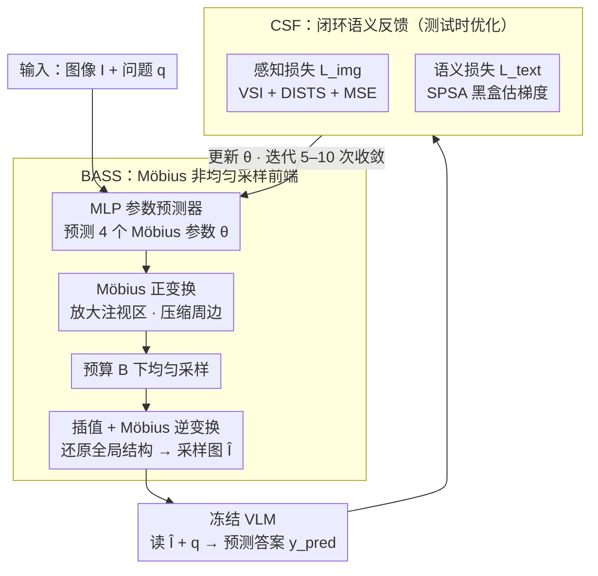

# LLMind: Bio-inspired Training-free Adaptive Visual Representations for Vision-Language Models

**会议**: CVPR 2026  
**arXiv**: [2603.14882](https://arxiv.org/abs/2603.14882)  
**代码**: [https://empactlab.github.io/LLMind-CVPR-2026/](https://empactlab.github.io/LLMind-CVPR-2026/)  
**领域**: 多模态VLM  
**关键词**: 仿生视觉采样, Möbius变换, 训练免调, 像素预算, VQA

## 一句话总结
受人眼中央凹编码和皮层放大机制启发，提出无需训练的自适应采样框架 LLMind，通过 Möbius 变换实现非均匀像素分配，并利用闭环语义反馈在测试时优化采样参数，在仅使用 1%-5% 像素的紧张预算下大幅超越均匀采样。

## 研究背景与动机

**领域现状**：当前 VLM（如 Qwen、LLaVA）在处理视觉输入时对所有像素区域分配相同的精度，即使是语义无关的背景区域也占用等量计算资源。动态 token 化虽然在一定程度上缓解了冗余，但仍需全分辨率输入，不适用于边缘设备。

**现有痛点**：均匀下采样既不反映人类视觉的资源分配方式，也在高分辨率图像中强制丢弃全局关键细节——语义重要区域和无关背景被一视同仁。

**核心矛盾**：高效性和推理准确性之间存在根本矛盾——在有限像素预算下，均匀采样无法聚焦于任务关键区域。

**本文目标**：能否借鉴生物视觉的中央凹注视策略，让 VLM 在极低像素预算下依旧获得高准确率？

**切入角度**：人眼通过中央凹高分辨率采样 + 周边低分辨率上下文 + 快速眼跳的机制，以最小代价获取最大信息。作者将此映射为 Möbius 变换参数化的非均匀采样。

**核心 idea**：用 Möbius 变换模拟皮层放大，将任务相关区域放大采样，同时通过 SPSA 梯度估计实现黑盒 VLM 的闭环语义反馈优化。

## 方法详解

### 整体框架
这篇论文要解决的是一个很尖锐的问题：当像素预算被压到全图的 1%–5% 时，怎么让冻结的 VLM 还答得对。整条 pipeline 围绕"把有限的像素花在刀刃上"展开——给定图像 $I$ 和问题 $q$，先由一个轻量 MLP 预测出一组 Möbius 变换参数 $\theta$，BASS 模块据此做一次非均匀采样，把任务相关区域放大、无关背景压缩，得到只占预算 $B$ 的小图 $\hat{I}$，送进冻结 VLM 拿回答。关键在于 $\theta$ 不是一次定死的：CSF 模块会拿 VLM 的回答和图像质量去算损失，在测试时反过来迭代调整 $\theta$，让下一轮采样更聚焦。整个过程不动 VLM 一个参数，只在推理时优化采样这一层。

### 关键设计

**1. BASS：用 Möbius 变换把"中央凹放大"做成可逆的非均匀采样**

均匀下采样的毛病在于对所有像素一视同仁，语义关键区域和空背景拿到同样的精度，预算一紧就把细节冲掉了。BASS 的做法是借皮层放大的思路做空间重映射：先把图像像素经北极立体投影打到复平面上，施加 Möbius 变换 $z = (aw+b)/(cw+d)$，让注视区域在变换后的平面上被拉大、周边被压缩；然后在这个被扭曲过的平面上做常规均匀采样，再把采样点反变换回原图坐标——等效于在原图上做了一次非均匀采样，注视区采到的像素密、边缘区稀。选 Möbius 变换而不是简单裁剪的原因是它是保角映射：放大局部的同时不撕裂全局几何，场景的整体结构和上下文都还在，这正是裁剪做不到的。

**2. MLP 参数预测器：把"该放大哪里"压成 4 个可微分的实数**

整个 Möbius 变换只由四个实数参数 $\theta \in \mathbb{R}^4$ 决定，所以问题就归约成"给定图像和问题，预测这四个数"。论文用一个轻量 MLP 来出这组参数，并把它嵌进一条端到端可微的采样链路：

$$\hat{I} = \mathcal{M}_\theta^{-1}\big(\mathcal{I}(\mathcal{S}_B(\mathcal{M}_\theta(I)))\big)$$

其中 $\mathcal{M}_\theta$ 是正向 Möbius 重映射、$\mathcal{S}_B$ 是预算 $B$ 下的均匀采样、$\mathcal{I}$ 是插值、$\mathcal{M}_\theta^{-1}$ 反变换回原空间。因为这条链路对 $\theta$ 可微，采样策略才能被后面的损失梯度推着走，而不需要离散地枚举注视点。

**3. 闭环语义反馈（CSF）：让 VLM 的回答好不好反过来调采样**

前两步只解决了"怎么采"，但"采得对不对"得让下游任务说了算。CSF 在测试时加了一条闭环：一边用感知损失保证采出来的图本身不崩，

$$\mathcal{L}_{img} = \alpha \cdot \mathcal{L}_{VSI} + \beta \cdot \mathcal{L}_{DISTS} + \gamma \cdot \mathcal{L}_{MSE}$$

一边用语义损失盯住任务效果——把 VLM 的预测答案和参考答案都过 Sentence Transformer 编码，用余弦相似度衡量它们对不对得上：$\mathcal{L}_{text} = 1 - \cos(E(y_{pred}), E(y_{gt}))$。麻烦在于很多 VLM 是黑盒（甚至闭源 API），$\mathcal{L}_{text}$ 对 $\theta$ 的梯度没法反传。论文用 SPSA（同时扰动随机逼近）绕过去：对 $\theta$ 同时加一个随机扰动 $\delta\Delta$ 做正负两次前向，用差分估出梯度

$$\nabla_\theta \mathcal{L}_{text} \approx \frac{\mathcal{L}(\theta+\delta\Delta) - \mathcal{L}(\theta-\delta\Delta)}{2\delta}$$

这样只靠"喂图、读回答"两次调用就能估出方向，完全不碰模型内部，白盒黑盒一视同仁。CSF 也是消融里被验证为性能增益的主要来源——去掉这条闭环、只留静态中央凹采样，效果反而掉到均匀采样之下。

### 一个完整示例：5% 预算下一张 VQA 图怎么收敛
以一张 VQAv2 图配问题"墙上的钟显示几点"为例，预算 5%：第 0 轮 MLP 先给出一组 $\theta$，BASS 据此采样，但注视点可能偏到画面中央的桌子上，VLM 答错，$\mathcal{L}_{text}$ 偏高。CSF 对 $\theta$ 做一次 SPSA 正负扰动、估出梯度，把注视区往墙面方向挪；第 1–2 轮采样逐步把钟面放大、背景进一步压缩，VLM 这次读到了清晰的钟面、答对，$\mathcal{L}_{text}$ 降下来。整张图只跑约 5–10 次前向迭代就收敛，全程没碰 VLM 权重，变的只有那 4 个采样参数。

### 训练策略
完全无需训练，所有优化都在测试时靠上述少量迭代完成。一个额外的小技巧是自适应问题选择：对那些被答错的问题做指数加权，让优化预算优先花在难例上，从而加快整体收敛。

## 实验关键数据

### 主实验

| 数据集 | 模型 | 像素预算 | 均匀采样 | LLMind | 提升 |
|--------|------|----------|---------|--------|------|
| VQAv2 | Qwen2.5-VL | 5% | 59.94 | 73.54 | +22.68% |
| VQAv2 | SmolVLM | 5% | 59.06 | 76.46 | +29.46% |
| Seed-Bench | Qwen2.5-VL | 5% | - | - | +38%(avg) |
| A-OKVQA | Qwen2.5-VL | 5% | - | - | +37%(avg) |

### 极端低预算下保留率

| 像素预算 | VQAv2/Qwen2.5-VL 保留率 | 说明 |
|----------|------------------------|------|
| 1% | 63.31% | 仅 1% 像素 |
| 3% | 75.17% | 保留大部分性能 |
| 5% | 84.56% | 接近全分辨率 |

### 消融实验
- 静态中央凹采样反而劣于均匀采样（缺乏自适应）
- 向日葵采样和径向采样同样表现不佳
- CSF 闭环反馈是性能增益的关键驱动力
- region-guided VQA 中，1% 像素下 LLMind 甚至超越全分辨率准确率

### 对比方法细节
- Static Foveated、Sunflower Inspired、Radial Sampling 均劣于均匀采样，证明静态中央凹编码无法应对多样化任务
- 自适应问题选择策略的指数加权使优化聚焦于难例，加速收敛

## 亮点
- 首次将神经科学的中央凹编码和皮层放大机制系统地引入 VLM 视觉表征研究
- 完全 training-free、plug-and-play，兼容白盒和黑盒 VLM（包括闭源 API）
- 极端 1% 像素预算下仍保留 82% 全分辨率性能，实用价值显著
- Möbius 变换的保角特性保证了全局结构不被破坏
- 在 SmolVLM 上 5% 预算保留率高达 95.56%，几乎无损

## 局限与展望
- 测试时优化需要多次前向传播（每张图像约需 5-10 次迭代），增加推理延迟
- SPSA 梯度估计在高维参数空间中可能收敛较慢，且对扰动大小 $\delta$ 敏感
- 当前依赖少量 ground-truth 答案进行 CSF 优化，在完全零标注场景的适用性需进一步验证
- 对多注视点场景（如复杂图表中多个关键区域）的处理尚待探索
- 单一 Möbius 变换可能无法同时放大图像中多个分散的语义关键区域
- 在 region-guided VQA 中性能超越全分辨率的现象值得更深入的理论解释

<!-- RELATED:START -->

## 相关论文

- [\[CVPR 2026\] ZOO-Prune: Training-Free Token Pruning via Zeroth-Order Gradient Estimation in Vision-Language Models](zoo-prune_training-free_token_pruning_via_zeroth-order_gradient_estimation_in_vi.md)
- [\[CVPR 2026\] AdaptVision: Efficient Vision-Language Models via Adaptive Visual Acquisition](adaptvision_efficient_vision-language_models_via_adaptive_visual_acquisition.md)
- [\[CVPR 2026\] Proxy3D: Efficient 3D Representations for Vision-Language Models via Semantic Clustering and Alignment](proxy3d_efficient_3d_representations_for_vision-language_models_via_semantic_clu.md)
- [\[CVPR 2026\] TUNA: Taming Unified Visual Representations for Native Unified Multimodal Models](tuna_taming_unified_visual_representations_for_native_unified_multimodal_models.md)
- [\[CVPR 2026\] PAS: A Training-Free Stabilizer for Temporal Encoding in Video LLMs](pas_a_training-free_stabilizer_for_temporal_encoding_in_video_llms.md)

<!-- RELATED:END -->
