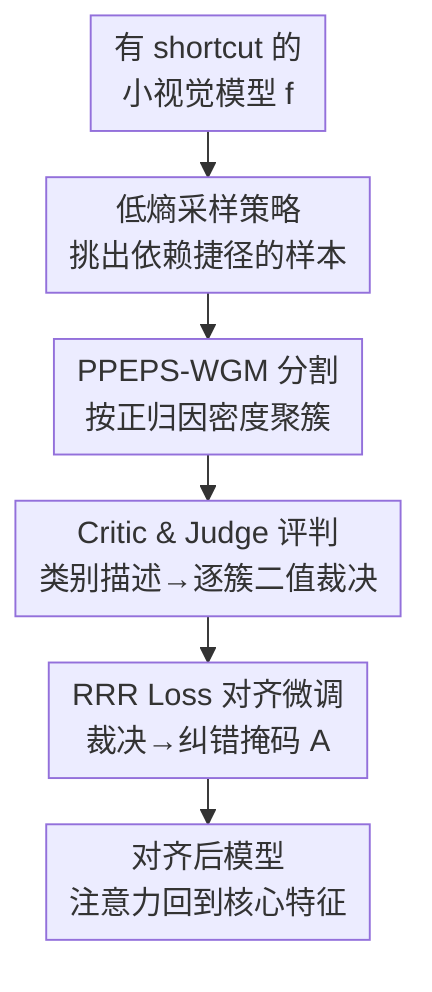

# LVLM-Aided Alignment of Task-Specific Vision Models

**会议**: CVPR 2026  
**arXiv**: [2512.21985](https://arxiv.org/abs/2512.21985)  
**代码**: https://github.com/alexanderkoebler/LVLM-VA (有)  
**领域**: 多模态VLM / 可解释AI / 模型对齐  
**关键词**: 虚假相关, shortcut 缓解, LVLM 批判, XAI, 最差组准确率

## 一句话总结
用一个大视觉语言模型（LVLM）当"翻译官"，把小型专用视觉模型的解释图翻成自然语言、再把人类类别级描述翻成逐样本的纠错掩码，从而在**不需要逐图精细标注**的情况下让小模型摆脱对虚假特征（shortcut）的依赖，在合成与真实医学数据上显著提升最差组准确率。

## 研究背景与动机

**领域现状**：在医疗、制造等高风险领域，小型专用视觉模型仍然不可替代——算力需求低、又有大量成熟 XAI 方法能解释它的决策。但这些解释常常暴露出模型其实没按人类领域知识做判断，而是抓住了数据里的虚假相关（如 X 光片角落的医院标签、皮肤病变旁的彩色绷带）当捷径。

**现有痛点**：要纠正这种 shortcut，传统做法是用人类对解释图的批判来微调模型（RRR 类方法），但它们都要求**逐张图片在图像空间里精细标注**哪块区域是虚假的。对于医生这种高度专业、时间宝贵的专家，这种逐实例反馈成本高得不现实。另一类非人类中心的方法（DFR / SUBG / JTT）虽不需逐实例反馈，却需要每张图标注"是否含虚假特征"的组标签，且只追求各组准确率拉平、不真正对齐人类知识、缺乏可解释性。

**核心矛盾**：人类领域知识天然是**类别级**的（"判断恶性皮损要看病变本身，绷带无关"），而纠正模型需要的监督信号是**实例级**的（这张图哪几个像素该被惩罚）。两者之间缺一座桥，导致要么标注成本爆炸，要么放弃对齐。

**本文目标**：① 把类别级人类描述自动放大成逐实例纠错信号；② 全程不要求精细反馈、也不要求组标签；③ 提供一个双向接口，既能把模型行为讲给专家听，也能把专家知识注回模型。

**切入角度**：作者观察到现代 LVLM 具备很强的图文双向翻译与泛化能力，正好可以充当类别级知识与实例级解释之间的"翻译官"。

**核心 idea**：让 LVLM 做双向翻译器——把模型解释图翻译成自然语言以暴露 shortcut，再把人类类别级规范翻译成逐图的虚假区域裁决，最后用裁决生成的掩码经 RRR loss 把模型"掰正"。

## 方法详解

### 整体框架
LVLM-VA 把"纠正一个有 shortcut 的视觉模型"拆成**检测**和**对齐**两步。检测阶段：先用低熵采样从训练集里挑出最可能依赖 shortcut 的样本，对它们用 DeepLIFT SHAP 生成像素归因图，再用 PPEPS-WGM 把归因图按"正预测效应密度"聚成若干簇；这些簇连同原图、类别标签和人类类别描述一起喂给 LVLM-Critic，由它做思维链推理判断每个簇是否覆盖了相关区域，再由 LLM-Judge 把 Critic 的自由文本压成每簇一个二值裁决 $R_j$。对齐阶段：把二值裁决组装成纠错掩码 $A$（只标出被判为虚假的簇），用 Right for the Right Reasons（RRR）损失微调原模型，惩罚它在虚假区域上的梯度，把注意力逼回真正的核心特征。整个 Critic & Judge 评判同时也是一个双向接口——专家既能通过类别描述和 Judge 的少样本示例往里注入知识，也能反过来读 Critic 的自然语言论证来评估模型。

### 关键设计

**1. 低熵采样策略：只把昂贵的 LVLM 花在真正有捷径的样本上**

每个样本都跑一遍 LVLM 在大数据集上算力开销过大。作者基于"捷径比鲁棒核心特征更容易学"这一假设，推断模型在依赖 shortcut 的训练样本上输出熵更低，于是把对齐集 $D_{\text{align}}$ 定义为原模型 $f$ 输出熵**最低**的 $N$ 个训练样本。这一步完全无监督、不需要任何组标签，却能把含虚假特征的样本浓度大幅拉高：在膝关节数据上，低熵采样得到的对齐集里 56% 含虚假特征，而随机采样只有 25%、高熵采样仅 2%——等于用一招把后续昂贵的 Critic & Judge 评判效率提了一倍多

**2. PPEPS-WGM 正预测效应概率分割：分"效应落在哪"而非"图里画了什么"**

要让 LVLM 准确指出 shortcut，得先把解释图切成可判断的区块。直接用 SAM 按图像内容分割会把虚假特征和相邻的核心结构（如医院标签和膝盖骨）糊进同一块，反而盖住了 shortcut。作者改成"模型中心"的分割：用 DeepLIFT SHAP 得到逐像素归因 $\Phi_i(x)$，只取正部分 $\Phi_i^+(x)=\max\{\Phi_i(x),0\}$ 并归一化成像素上的概率质量函数 $p_i(x)=\Phi_i^+(x)/Z^+(x)$，表示"一单位正预测效应落在像素 $i$ 的概率"。然后在像素**空间坐标** $z_i\in[0,1]^2$ 上拟合一个加权高斯混合，权重 $w_i=M\cdot p_i(x)$ 由正效应质量决定，目标是加权极大似然

$$\mathcal{L}(\Theta)=\sum_{i=1}^{M}w_i\log\Big(\sum_{j=1}^{J}\pi_j\,\mathcal{N}(z_i\mid\mu_j,\Sigma_j)\Big)$$

最优时混合权重 $\pi_j=\sum_i p_i(x)r_{ij}=S_j$ 恰好等于第 $j$ 簇捕获的"正效应份额"，最后按响应度 $c_i=\arg\max_j r_{ij}$ 把每个像素硬分配到一簇。这样聚出来的簇是按"哪里在驱动模型预测"组织的，能把空间上分离的高正归因（即潜在 shortcut）从核心特征里干净地剥出来。消融显示它和 SAM 的裁决准确率同为 0.87，但 ΔWGA 从 SAM 的 0.11 提到 0.16，差距正来自它不会把虚假特征和核心结构混进一簇

**3. Critic & Judge 双 LVLM 评判：把类别级描述放大成逐簇裁决**

分好簇后，需要有人逐簇判断"这块该不该信"。作者用一对 LVLM：**Critic $g$** 拿到原图、分割后的解释图 $C$、原图叠加分割的图、真值标签 $y$ 以及人类写的类别描述 $\mathcal{V}_k$，被一段思维链提示引导走六步——看原图、定位属于真值类别 $y$ 的区域、判断每个簇覆盖了原图哪些部分、综合两者、说明该簇是否覆盖相关区域、最后给裁决；类别描述 $\mathcal{V}_k$ 就是把"恶性皮损要看病变本身"这种类别级知识注进推理的钩子。**Judge $h$**（可与 $g$ 同一模型）再把 Critic 的自由文本压成每簇一个二值裁决 $R_j$，它用一段含"Critic 评估—人类二值判断"示例对的少样本提示来对齐输出，专家通过编辑这些示例就能影响最终裁决。正是这一对组件把昂贵的逐实例标注换成了"写几句类别描述"，用户研究里参与者与 LVLM 选出的虚假簇一致率达 88%、与 Critic 论证一致率 87%，和整个对齐集上 87% 的裁决准确率吻合

**4. RRR 损失对齐微调：把二值裁决变成"惩罚错误关注"的梯度约束**

有了逐簇裁决还得真正改动模型。作者把裁决组装成纠错掩码 $A=\sum_{j=1}^{J}R_j\cdot\mathbf{1}[C=j]$——只有被判为虚假的簇才进掩码，然后套用 Ross 等人的 RRR 损失：

$$L=\sum_{n}\sum_{k}-y_{nk}\log(\hat{y}_{nk})+\lambda\sum_{n}\sum_{i}\Big(A_{ni}\frac{\partial}{\partial x_{ni}}\sum_k\log(\hat{y}_{nk})\Big)^2+\gamma\sum_i\theta_i^2$$

第一项"right answers"是交叉熵保证分类正确；第二项"right reasons"在掩码 $A$ 标记的虚假区域上压低输入梯度，逼模型不靠这些区域做判断；第三项是可选的参数正则。微调时把对齐样本 $x_a$ 按固定比例混进每个训练 batch、必要时对 $x_a$ 过采样，以防灾难性遗忘已学到的核心特征。这一步的关键在于：它把"人类原本要逐图手画的专家掩码"完全自动化成了 Critic & Judge 的产物，既保留 RRR 的纠错能力又抹掉了它最贵的人力成本

### 损失函数 / 训练策略
对齐损失即上文 RRR：交叉熵（right answers）+ $\lambda$ 加权的虚假区域梯度惩罚（right reasons）+ 可选 $\gamma$ 参数正则。$\lambda$ 是核心超参——合成 DecoyMNIST 上随 $\lambda$ 增大对齐度和准确率同升，到 $\lambda=10^5$ 两者都逼近用真值掩码的上界，但再大交叉熵被淹没、准确率骤降；真实医学数据上取 $\lambda=1$。每个 epoch 按训练样本数 / batch 内训练样本占比定迭代数，对齐样本不足时过采样。

## 实验关键数据

### 主实验
三套数据、两类 shortcut 设定：合成 DecoyMNIST（数字角落灰块、训练集灰度随类别变、测试集随机）用两层 MLP；真实 ISIC 皮损（绷带）与膝关节 X 光（医院标签 L/R）用 ResNet50。评价指标为最差组准确率变化 ΔWGA 与平均/总体组准确率变化 ΔAGA（均为相对原模型、7 个随机种子均值）。

| 数据集 | 指标 | LVLM-VA | 对比基线表现 | 结论 |
|--------|------|---------|--------------|------|
| 膝关节 X 光 | ΔWGA | 显著↑（如 $0.16\pm0.06$，p<0.05） | SUBG 更高但牺牲总体准确率；DFR 无效 | 唯一在保总体准确率下提 WGA |
| 膝关节 X 光 | ΔAGA | 维持（不下降） | SUBG 显著掉总体准确率 | — |
| 皮损 ISIC | ΔWGA | 显著↑ | JTT 略升但不稳定；DFR 无效 | 唯一在保总体准确率下提 WGA |
| DecoyMNIST | 对齐度 $\mu_{Align}$ / 准确率 | 逼近真值掩码上界（$\lambda=10^5$） | 不对齐为下界 | 注意力从灰块完整转回数字 |

其中对齐度 $\mu_{Align}=1-\frac{1}{N_t}\sum_n\frac{\sum_i A_{n,i}^{(GT)}|\Phi_i|}{\sum_i|\Phi_i|}$ 衡量落在真值虚假区域外（即落在数字上）的归因质量占比。

### 消融实验
| 配置 | 关键指标（膝关节） | 说明 |
|------|------|------|
| 完整 LVLM-VA（PPEPS-WGM） | 裁决准确率 0.87 / ΔWGA $0.16\pm0.06$ | 完整模型 |
| 分割换成 SAM | 裁决准确率 0.87 / ΔWGA $0.11\pm0.04$ | 准确率持平但 ΔWGA 掉 0.05，SAM 把虚假特征和膝盖混进一簇 |
| Critic/Judge 用 GPT-4o（默认） | 裁决准确率 0.87 / ΔWGA $0.16\pm0.06$ | 主实验所用，成本 \$2.50/百万 token |
| Critic/Judge 用 GPT-5 | 裁决准确率 1.00 / ΔWGA $0.20\pm0.09$ | 更强模型裁决全对、效果最好且更便宜（\$1.25） |
| Critic/Judge 用 GPT-4o-mini | 裁决准确率 0.42 / ΔWGA $0.09\pm0.02$ | 弱模型裁决准确率腰斩、效果明显下滑 |
| 采样：低熵 / 随机 / 高熵 | 对齐集虚假特征占比 56% / 25% / 2% | 低熵采样把含 shortcut 样本浓度提一倍多 |

### 关键发现
- **分割方式是 shortcut 缓解的关键瓶颈**：PPEPS-WGM 和 SAM 裁决准确率一样（0.87），但 SAM 常把虚假特征和核心结构糊进一簇，导致 ΔWGA 从 0.16 跌到 0.11——"按效应分"明显优于"按内容分"。
- **方法随 LVLM 进步自动变强又变便宜**：从 GPT-4o-mini→GPT-4o→GPT-5，裁决准确率 0.42→0.87→1.00、ΔWGA 0.09→0.16→0.20，且更强的 GPT-5 单价反而更低。
- **用户研究三项一致率 86–88%**，与对齐集上 87% 的裁决准确率吻合，说明 LVLM 的判断确实贴合人类专家直觉。
- **SUBG 在膝关节上 WGA 甚至超过本文，但以大幅牺牲总体准确率为代价**，多数应用不可接受；LVLM-VA 是唯一两数据集都"提 WGA 且不掉总体"的方法。

## 亮点与洞察
- **"双向翻译器"是核心洞察**：把 LVLM 定位成类别级知识与实例级解释之间的桥，一头把解释图说成人话、一头把人话变成裁决掩码，绕开了"专家逐图标注"这个最贵的环节——这套思路可迁移到任何"人类知识是高层、监督信号需底层"的对齐场景。
- **PPEPS-WGM 把 Shapley 归因当概率测度来分割**很巧妙：正归因归一化成 PMF、用加权 GMM 在空间坐标上聚类，混合权重恰好等于"该簇捕获的正效应份额"，理论上自洽且专门为"找 shortcut"服务，而非沿用现成的内容分割。
- **低熵采样是个低成本高回报的 trick**：基于"捷径易学→低熵"的假设，无监督地把含 shortcut 样本筛出来，直接把 LVLM 调用预算的有效性翻倍，可复用于任何需要稀缺人/模型反馈的主动采样场景。
- **复用成熟 RRR loss 而非另造轮子**：创新点集中在"如何自动产掩码"，对齐机制沿用已验证的 RRR，工程上稳妥。

## 局限与展望
- **依赖类别级人类描述**：作者承认有些核心特征专家是凭直觉学会的、难以形式化成文字描述，此时方法的注入钩子会失效。
- **核心/虚假特征未必可分**：当二者在空间上纠缠、或本身界限模糊时，PPEPS-WGM 的"按空间聚簇"会力不从心；论文靠"在膝关节描述虚假特征、在 ISIC 描述核心特征"的差异化策略缓解，但这要求人能至少清楚描述其一。
- **效果强依赖 LVLM 质量**：GPT-4o-mini 裁决准确率仅 0.42 时 ΔWGA 几乎减半，弱模型场景下方法收益有限（⚠️ ΔWGA 等具体数值多来自论文图表 Fig.5/8/9，正文未逐一给出表格数字，以原文为准）。
- **可改进方向**：把"空间坐标聚类"扩展到含语义特征 $z_i$ 的混合表示，处理空间不可分的 shortcut；或引入 Critic 的不确定性来决定是否需要回退到人类裁决。

## 相关工作与启发
- **vs 逐实例 RRR / 解释纠正方法（Ross et al. [27], Schramowski [29]）**：它们用人类逐图在图像空间手画的精细掩码做监督，本文用 Critic & Judge 从类别级描述自动生成等价掩码，纠错机制相同但抹掉了最贵的逐实例人力。
- **vs 组准确率均衡类（DFR [14] / SUBG [12] / JTT [23]）**：它们不需逐实例反馈但要每图的虚假特征组标签、且只拉平各组准确率不追求可解释对齐；本文连组标签都不要，还能给出自然语言论证，实验中也是唯一"提 WGA 不掉总体"的方法。
- **vs 用 LVLM 解释模型决策（Gu et al. [8]）**：他们只把 LVLM 当单向解释器、不回注人类反馈；本文强调双向接口，既翻译模型行为也注入专家知识。
- **vs SAM 预分割辅助 LVLM 定位（Yang et al. [37]）**：他们按图像内容分割提升 LVLM 空间定位，本文改成按模型正归因分割（PPEPS-WGM），专门服务于 shortcut 检测，消融证明在 ΔWGA 上更优。

## 评分
- 新颖性: ⭐⭐⭐⭐ "LVLM 当双向翻译器 + PPEPS-WGM 按效应分割"组合新颖，对齐机制 RRR 是复用
- 实验充分度: ⭐⭐⭐⭐ 合成+两真实医学数据、对比四类基线、含 LVLM 选型/采样/分割消融与 18 人用户研究，但主结果多以图呈现、缺逐数字大表
- 写作质量: ⭐⭐⭐⭐ 问题设定与公式清晰，PPEPS-WGM 推导严谨；部分关键数字埋在图里
- 价值: ⭐⭐⭐⭐⭐ 直击高风险领域"专家反馈太贵"痛点，把类别级知识自动放大成实例监督，落地价值高

<!-- RELATED:START -->

## 相关论文

- [\[CVPR 2026\] DeepAlign: Mitigating Modality Conflict through Modality-Specific Alignment](deepalign_mitigating_modality_conflict_through_modality-specific_alignment.md)
- [\[CVPR 2026\] CrossHOI-Bench: A Unified Benchmark for HOI Evaluation across Vision-Language Models and HOI-Specific Methods](crosshoi-bench_a_unified_benchmark_for_hoi_evaluation_across_vision-language_mod.md)
- [\[CVPR 2026\] Understanding Task Transfer in Vision-Language Models](understanding_task_transfer_in_vision-language_models.md)
- [\[CVPR 2026\] CADFS: A Big CAD Program Dataset and Framework for Computer-Aided Design with Large Language Models](cadfs_a_big_cad_program_dataset_and_framework_for_computer-aided_design_with_lar.md)
- [\[CVPR 2026\] AXG-Reasoner: Error Detection and Explanation in Long Task Videos with Vision-Language Models](axg-reasoner_error_detection_and_explanation_in_long_task_videos_with_vision-lan.md)

<!-- RELATED:END -->
