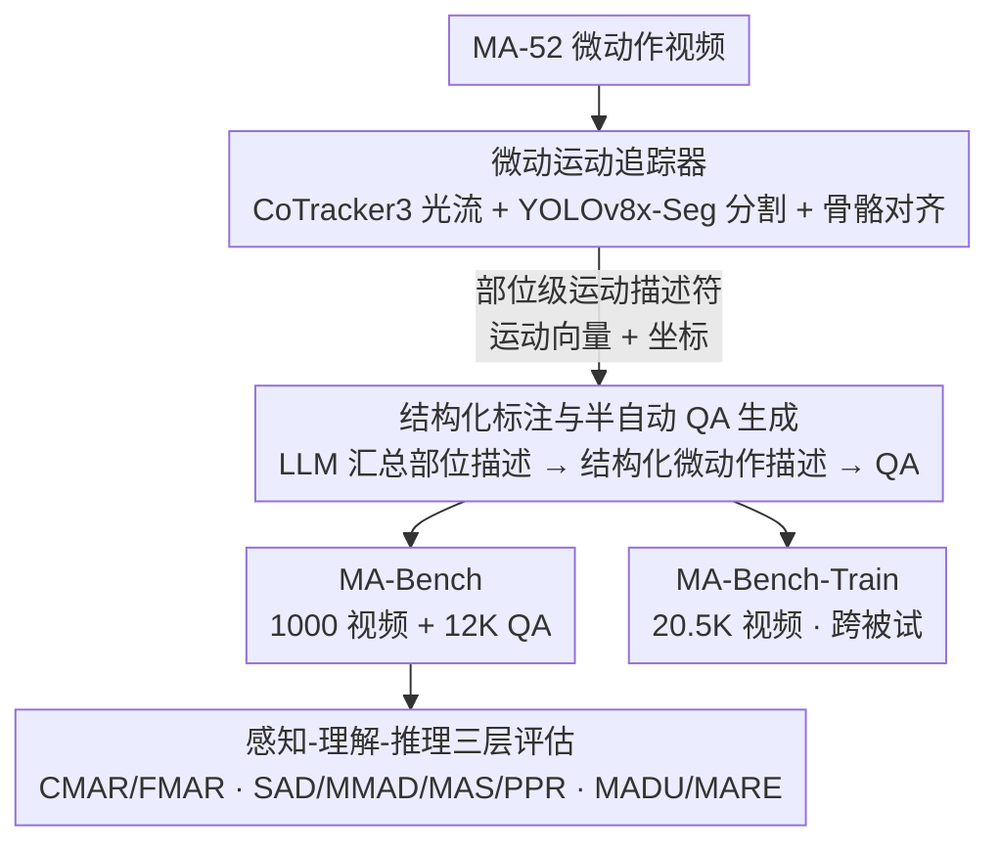

# MA-Bench: Towards Fine-grained Micro-Action Understanding

**会议**: CVPR 2026  
**arXiv**: [2603.26586](https://arxiv.org/abs/2603.26586)  
**代码**: [https://MA-Bench.github.io](https://MA-Bench.github.io)  
**领域**: 视频理解 / 多模态VLM  
**关键词**: 微动作理解, 细粒度动作识别, 多模态大模型评估, 情感分析, 视频问答

## 一句话总结

提出 MA-Bench 微动作理解基准，包含 1000 个视频和 12000 个结构化 QA 对，通过"感知-理解-推理"三层评估架构系统测试 23 个 MLLM 的细粒度微动作理解能力，并构建 20.5K 训练语料 MA-Bench-Train 用于模型微调提升。

## 研究背景与动机

1. **领域现状**：微动作（Micro-Action）是人体因情绪变化产生的自发性细微运动，在人际交互和情感状态分析中至关重要。现有微动作数据集如 iMiGUE、SMG、MA-52 等主要服务于传统分类模型。
2. **现有痛点**：MLLM 在视频理解领域快速发展，但在微动作理解方面完全未被探索——缺乏专门的评估基准。现有视频理解基准（如 MVBench、Video-MME）关注日常活动、长视频等场景，不涉及细粒度微动作。
3. **核心矛盾**：微动作极其微妙（平均时长仅2.12秒，涉及手指、头部等局部运动），现有MLLM是否具备捕捉这种细粒度运动的能力完全未知。
4. **本文目标** (1) 构建专门评估MLLM微动作理解能力的基准；(2) 设计从感知到推理的多层次评估体系；(3) 提供训练数据支持模型改进。
5. **切入角度**：从Micro-Action-52数据集出发，利用光流和骨骼信息构建运动描述符，再通过MLLM生成结构化标注。
6. **核心 idea**：构建首个面向MLLM的微动作理解基准，揭示当前模型在捕捉运动细粒度和身体部位动态方面的重大不足。

## 方法详解

### 整体框架

MA-Bench 要解决的事很具体：微动作（平均时长 2.12 秒、藏在手指/头部等局部）太微妙，直接把视频丢给 MLLM 标注容易漏掉细节，所以基准本身需要一套能"先精确检测、再语言化"的构建管线。整条管线从 Micro-Action-52 数据集出发，分三步串起来——先用一个微动运动追踪器从视频里逐部位提取运动描述符（运动向量 + 坐标），再把这些结构化的运动信息连同提示一起喂给 LLM，先汇总成部位级描述、再综合成结构化微动作描述，并由 LLM 半自动改写成 QA，最后把 QA 按"感知-理解-推理"三层组织起来。产出两份数据：1000 视频 + 12000 QA 的评估集 MA-Bench，以及 20.5K 视频的训练集 MA-Bench-Train。

### 关键设计

**1. 微动运动追踪器：用部位级运动信号替代"让模型自己看视频"**

微动作的难点在于运动散落在多个身体部位且幅度极小，若只给 MLLM 一段全局视频，它很难注意到指尖或头部那一点位移。追踪器因此把视频拆到部位粒度：先用 CoTracker3 抽出带四个方向分量的稠密光流捕捉像素级的运动幅度与方向，再用 YOLOv8x-Seg 分割出以人为中心的区域，最后把分割后的光流与骨骼数据对齐，为头、上肢、下肢、躯干等每个部位生成同时含运动向量与空间坐标的运动描述符。这一步是后续标注质量的地基：先把"哪个部位、朝哪动、动多少"检测准了，语言化时才不会凭空遗漏。

**2. 结构化标注与半自动 QA 生成：把数字描述符落成可评测的文本与题目**

运动描述符虽精确，但本身是一堆向量与坐标，既不可读也不能直接当评测题，需要一步"语言化 + 出题"。作者先 prompt LLM（如 DeepSeek-v3.2、DeepSeek-R1）把每个部位的运动模式总结成部位级描述，再让 LLM 把这些部位描述综合成一份带细粒度运动细节的结构化微动作描述；这份描述既直接作为 MA-Bench-Train 的监督信号，也由 LLM 进一步改写成多选或二元 QA——每道题刻意瞄准一个独立的感知或推理维度，从而半自动地批量生成 MA-Bench。正因为出题建立在已检测准的描述符之上，QA 才能问到部位级的细节而不是泛泛的全局动作。

**3. 感知-理解-推理三层评估架构：把"会不会"拆成由浅入深的三问**

只做动作分类无法看清 MLLM 到底理解到哪一层，所以 MA-Bench 的 QA 被组织成递进的三层、对应三类问题。感知层（CMAR/FMAR）问"做了什么"，考粗粒度与细粒度的动作识别；理解层（SAD/MAS/MMAD/PPR）问"怎么做的"，考空间时序关系与部位间动态，统一用 YES/NO 闭合格式；推理层（MADU/MARE）问"为什么这样判断"，要求模型生成详细的运动描述与推理链。这样一份成绩单能区分出模型是卡在看不见运动、还是看得见却串不起语义推理。

**4. MA-Bench-Train 训练语料：揭示缺陷之后顺手给一条改进路径**

基准光暴露问题还不够，作者从 MA-52 的 166 名参与者中提取 20.5K 视频、配上同款结构化微动作描述构成训练集，用来验证"喂结构化标注能不能把微动作理解补上来"。关键约束是跨被试设计——训练集与评估集的参与者不重叠，这是行为分析领域的标准做法，避免模型靠记住具体人脸/姿态作弊，保证评估公平。

### 损失函数 / 训练策略

评估按题型分两套：闭合题（CMAR/FMAR 及各关系理解任务）用准确率；开放题（MADU/MARE）用 VLM-as-a-judge 打 1–5 分，从 L1 描述质量、L2 运动细节、L3 推理连贯性三个层次分别评判。微调侧用 Qwen3-VL-8B 在 MA-Bench-Train 上做标准指令微调。

## 实验关键数据

### 主实验

| 模型 | CMAR | FMAR | SAD | MMAD | MAS | PPR | AVG |
|------|------|------|-----|------|-----|-----|-----|
| Random | 14.7 | 20.0 | 50.0 | 50.0 | 50.0 | 50.0 | 39.05 |
| GPT-4o | 20.50 | 30.70 | 51.30 | 62.35 | 49.25 | 55.10 | 44.87 |
| Gemini-2.5-Flash | 43.00 | 31.40 | 56.55 | 60.50 | 55.50 | 57.25 | 50.70 |
| InternVideo2-Chat-8B | 22.90 | 28.10 | 57.60 | 58.95 | 55.80 | 49.00 | 45.39 |

### 消融实验

| 配置 | 关键发现 | 说明 |
|------|---------|------|
| Qwen3-VL-8B (原始) | 基线水平 | 微动作理解能力有限 |
| Qwen3-VL-8B + MA-Bench-Train | MARE/MADU提升明显 | 结构化标注微调有效 |
| 闭合题 vs 开放题 | 闭合题普遍接近随机 | MLLM难以区分细粒度动作类别 |
| 专有 vs 开源 | Gemini-2.5-Flash最佳(50.70%) | 专有模型在感知层优势明显 |

### 关键发现

- **MLLM在微动作识别上接近随机猜测**：CMAR任务（7类粗分类）上GPT-4o仅20.50%（随机14.7%），说明当前模型几乎无法区分身体部位级的运动
- **理解层表现好于感知层**：YES/NO格式的关系理解任务（SAD等）模型表现相对好于分类任务，暗示模型具备一定的局部判断能力但缺乏整体分类能力
- **开放题得分极低**：MARE推理解释任务中，大多数模型L3得分低于1/5，说明模型无法生成连贯的微动作推理链
- **Gemini-2.5-Flash意外领先**：在CMAR上达到43.00%，远超GPT-4o的20.50%，可能受益于其更强的时序建模能力

## 亮点与洞察

- **运动描述符驱动的标注策略**非常巧妙：不直接让MLLM看视频标注（容易遗漏细节），而是先通过光流+骨骼提取精确运动信息，再将结构化数据输入MLLM生成自然语言描述。这种"先精确检测再语言化"的方法保证了标注质量
- **三层递进评估设计**可迁移到其他细粒度视频理解任务（如微表情、手势语言等），提供了一个通用的评估范式
- **跨被试设计**在训练集和测试集之间保持参与者不重叠，是行为分析领域的标准做法，确保了评估的泛化性

## 局限与展望

- MA-Bench视频均来自心理访谈场景，场景多样性有限（坐姿为主），不包含站立、行走等场景的微动作
- 12000 QA对虽然数量不少，但52个动作类别的长尾分布可能导致少数类别评估不充分
- 开放题评估采用VLM-as-a-judge，评估器本身可能对微动作描述的判断不够准确
- **改进方向**：(1) 扩展到多场景（如社交互动、课堂、面试）；(2) 引入音频模态辅助微动作理解；(3) 设计专门的微动作引导模块嵌入VLM架构

## 相关工作与启发

- **vs MotionBench**: MotionBench关注一般性的细粒度运动理解（5385视频），MA-Bench专注微动作领域（1000视频+12K QA），更聚焦但数据质量更高且标注更结构化
- **vs FAVOR-Bench**: FAVOR-Bench侧重动作描述的详细程度，MA-Bench加入了推理和关系理解层次，评估维度更丰富
- **vs Micro-Action-52**: MA-52是传统分类数据集，MA-Bench将其升级为MLLM评估基准，是对同一领域的范式转变

## 评分

- 新颖性: ⭐⭐⭐⭐ 首个面向MLLM的微动作理解基准，三层评估设计有新意，但构建思路较为标准
- 实验充分度: ⭐⭐⭐⭐ 23个模型评估覆盖面广，但缺少不同帧采样策略、时序建模等更深入的分析
- 写作质量: ⭐⭐⭐⭐ 结构清晰，任务定义明确，图表设计良好
- 价值: ⭐⭐⭐⭐ 揭示了MLLM在细粒度微动作上的能力缺陷，对情感计算和人机交互领域有实际推动

<!-- RELATED:START -->

## 相关论文

- [\[CVPR 2026\] SketchVL: Policy Optimization via Fine-Grained Credit Assignment for Chart Understanding and More](sketchvl_policy_optimization_via_fine-grained_credit_assignment_for_chart_unders.md)
- [\[CVPR 2026\] See What I Mean: Aligning Vision and Language Representations for Video Fine-grained Object Understanding](see_what_i_mean_aligning_vision_and_language_representations_for_video_fine-grai.md)
- [\[CVPR 2026\] HanDyVQA: A Video QA Benchmark for Fine-Grained Hand-Object Interaction Dynamics](handyvqa_a_video_qa_benchmark_for_fine-grained_hand-object_interaction_dynamics.md)
- [\[CVPR 2026\] Hugging Visual Prompt and Segmentation Tokens: Consistency Learning for Fine-Grained Visual Understanding in MLLMs](hugging_visual_prompt_and_segmentation_tokens_consistency_learning_for_fine-grai.md)
- [\[CVPR 2026\] CropVLM: Learning to Zoom for Fine-Grained Vision-Language Perception](cropvlm_learning_to_zoom_for_fine_grained_vision_language_perception.md)

<!-- RELATED:END -->
