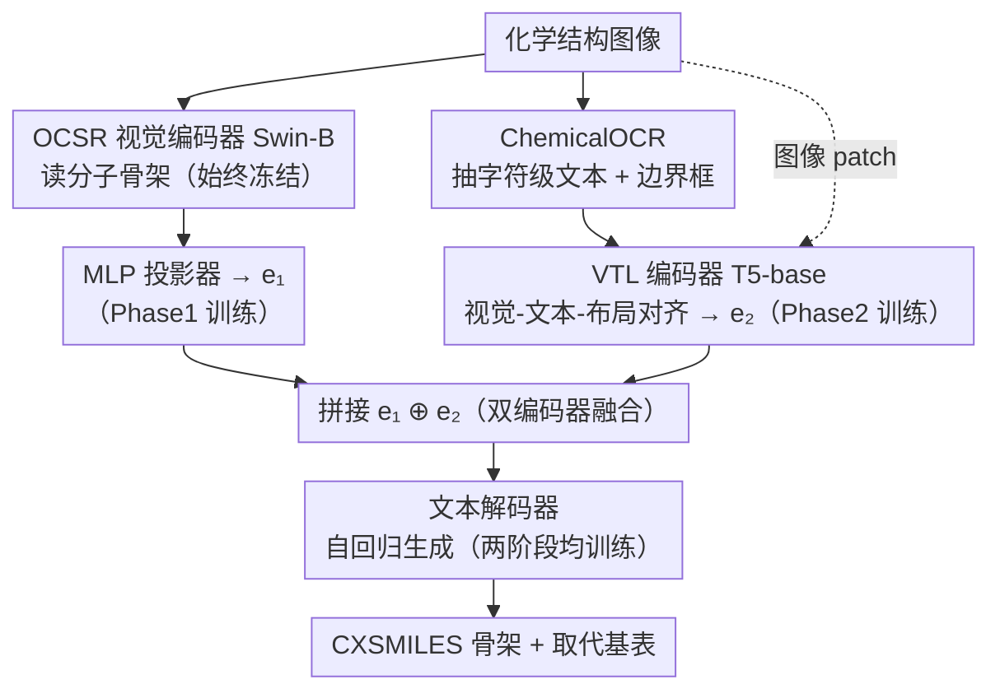

# MarkushGrapher-2: End-to-end Multimodal Recognition of Chemical Structures

**会议**: CVPR 2026  
**arXiv**: [2603.28550](https://arxiv.org/abs/2603.28550)  
**代码**: [https://github.com/DS4SD/MarkushGrapher](https://github.com/DS4SD/MarkushGrapher)  
**领域**: 多模态VLM / 文档理解  
**关键词**: 化学结构识别、Markush结构、多模态编码、专利文档分析、OCR

## 一句话总结

MarkushGrapher-2 提出了一个端到端多模态化学结构识别模型，通过专用化学 OCR 模块联合编码图像、文本和布局信息，结合两阶段训练策略（先适配 OCSR 特征再融合多模态编码），在 Markush 结构识别上大幅超越现有方法（M2S 准确率 56% vs 38%），同时保持分子结构识别的竞争力。

## 研究背景与动机

1. **领域现状**：从文档中自动提取化学结构是大规模化学文献分析的基础。现有方法分别处理图像中的分子结构（OCSR）或文本中的化学命名实体，但对于结合图像和文本的多模态描述——Markush 结构——仍然处理不力。

2. **现有痛点**：Markush 结构在专利分析中至关重要（用于先行技术搜索、自由运营评估等），但当前仅被 MARPAT 和 DWPIM 两个人工标注的专有数据库收录。前代 MarkushGrapher-1 需要预标注 OCR 输出作为输入（无法端到端处理），且视觉识别精度有提升空间。通用 VLM（GPT-5、DeepSeek-OCR）在 Markush 识别上表现很差（M2S 上 GPT-5 仅 3%）。

3. **核心矛盾**：Markush 结构的图像风格在不同专利局和出版年份间差异巨大，文本描述缺乏标准化且包含条件/递归描述，同时缺乏大规模真实世界训练数据。

4. **本文目标** 构建统一的端到端模型，同时识别标准分子和多模态 Markush 结构。

5. **切入角度**：利用双编码器（OCSR 视觉编码器 + VTL 多模态编码器）互补融合，配合专用化学 OCR 模块和两阶段训练策略。

6. **核心 idea**：双编码管线融合视觉结构特征和多模态文本-布局特征，端到端识别化学 Markush 结构。

## 方法详解

### 整体框架

这篇论文要做的是从一张化学结构图里端到端读出 Markush 结构：既要给出骨架的图形描述（CXSMILES），又要给出取代基表（哪些分子片段可以替换骨架上的可变基团）。难点在于 Markush 结构是图文混合的——分子骨架是画出来的，可变基团（R1、R2 等）的定义却是文字写的，单靠视觉或单靠文本都识别不全。

为此模型用编码器-解码器架构，但前端铺了两条互补的编码管线。一条是纯视觉路线：图像送进冻结的 OCSR 视觉编码器（取自 MolScribe 的 Swin-B ViT），经 MLP 投影器得到视觉嵌入 $e_1$，专门捕获分子骨架。另一条是多模态路线：图像先过 ChemicalOCR 抽出字符级文本和边界框，再连同图像送进 VTL 编码器（T5-base），得到融合了文本与布局的嵌入 $e_2$，专门捕获 Markush 的文字描述。最后把 $e_1$ 与 $e_2$ 拼接，交给文本解码器自回归地生成 CXSMILES 和取代基表。这套架构靠两阶段训练策略才真正融合起来：先让解码器适配视觉特征，再引入多模态编码器补上文字这块缺失信息（下图节点上的 Phase1 / Phase2 标注即对应这两步）。

### 关键设计

**1. ChemicalOCR 模块：把"看不懂化学符号"的通用 OCR 换成领域专用 OCR**

前代 MarkushGrapher-1 需要外部预先标好的 OCR 输出才能跑，无法端到端；而 Markush 识别里那些括号、下标、指标恰恰是判断可变基团的关键文字线索，OCR 一旦读错，下游全盘皆错。问题是现成的 PaddleOCR、EasyOCR 在化学图像上几乎不可用——它们会把化学键当成减号或等号，也认不出化学缩写，F1 只有 7.7 / 10.2，而本文的 ChemicalOCR 能到 87.2。做法是拿 256M 参数的轻量 VLM Smoldocling 来微调：先在 235k 张合成化学结构上预训练（OCR 标注由程序自动生成），再在 7k 张手工标注的 IP5 专利文档结构上精调。它输出的文本和边界框，正好为 VTL 编码器补上了文本和布局这两个模态。

**2. 双编码器融合（OCSR + VTL）：让两个各有所长又各有短板的编码器互补**

Markush 结构同时含视觉信息（分子骨架）和文本信息（可变基团定义），任何单一编码器都顾此失彼。OCSR 视觉编码器擅长读分子骨架，却完全处理不了 Markush 的文字特征；VTL 编码器走 UDOP 那套范式，把空间上重合的视觉 token 和文本 token 对齐融合，擅长 Markush 文字特征，分子骨架反而读不准。消融数据把这种互补关系说得很直白：只用视觉管线时 USPTO SMILES 能到 89.1%、但 M2S 只有 8%；只用多模态管线时 M2S 上到 39%、USPTO 却掉到 46%。把两路投影后拼接送进同一个文本解码器，融合模型才同时拿住了两端。

**3. 两阶段训练策略：先让解码器熟悉视觉特征，再引入多模态编码器补缺**

如果一上来就把两个编码器和解码器一锅端地联合训练（Fusion only），M2S 准确率只有 44%。本文改成两步走。Phase 1（适配）冻结视觉编码器，只训投影器和文本解码器去做标准 SMILES 预测（243k 真实样本，3 epochs），目的是让解码器先适配 OCSR 的视觉特征空间。Phase 2（融合）再把视觉编码器和投影器一起冻住，引入 ChemicalOCR 和 VTL 编码器，端到端训练 VTL 编码器与文本解码器去预测 CXSMILES + 取代基表（235k 合成 + 145k 真实，2 epochs）。冻结 OCSR 这一支是为了保护已经学好的视觉特征不被破坏，让 VTL 专心去学 Markush 文字特征这块缺失的信息——这样分阶段后 M2S 从 44% 提到 50%（+6%）。

### 一个完整示例

设想一张专利里的 Markush 图：苯环骨架上挂着一个标着 "R1" 的可变位点，图旁的文字写着 "R1 = methyl or ethyl"。视觉管线里，Swin-B 把苯环这部分结构编码成 $e_1$，但它对 "R1" 这个标签和旁边那行文字几乎无能为力。多模态管线里，ChemicalOCR 先把图上的 "R1"、文字描述以及它们各自的边界框抠出来，VTL 编码器据此把 "R1" 这个视觉标记和文字定义在空间上对齐，编成 $e_2$。$e_1$ 和 $e_2$ 拼起来后，解码器一边照着 $e_1$ 写出苯环骨架的 CXSMILES，一边照着 $e_2$ 在取代基表里填上 "R1 → 甲基 / 乙基"。可以看到：缺了 OCR 这一步，"R1" 和那行文字就丢了，骨架虽然认得出、取代基表却是空的——这正对应消融里"无 OCR 输入"时 M2S 从 56% 暴跌到 4% 的现象。

### 损失函数 / 训练策略

模型整体用标准的自回归交叉熵损失：Phase 1 监督 SMILES 预测，Phase 2 监督 CXSMILES + 取代基表预测。总参数 831M，其中 744M 可训练，训练在 NVIDIA A100 GPU 上进行。

## 实验关键数据

### 主实验

| 方法 | M2S (CXSMILES A) | USPTO-M A | WildMol-M A | IP5-M A |
|------|-------------------|-----------|-------------|---------|
| MolParser-Base (图像) | 39 | 30 | 38.1 | 47.7 |
| MolScribe (图像) | 21 | 7 | 28.1 | 22.3 |
| GPT-5 (多模态) | 3 | — | — | — |
| DeepSeek-OCR | 0 | 0 | 1.9 | 0.0 |
| MarkushGrapher-1 | 38 | 32 | — | — |
| **MarkushGrapher-2** | **56** | **55** | **48.0** | **53.7** |

### 消融实验

| 配置 | M2S A | M2S A_InChIKey | USPTO-M A | IP5-M A |
|------|-------|----------------|-----------|---------|
| 无 OCR 输入 | 4 | 39 | 3 | 15.4 |
| 有 OCR 输入 | 56 | 80 | 55 | 53.7 |
| 单阶段训练 (Fusion only) | 44 | 53 | — | — |
| 两阶段训练 (Adapt + Fusion) | 50 | 68 | — | — |

### 关键发现

- OCR 模块是最关键组件：没有 OCR 的话 M2S 准确率从 56% 暴跌到 4%，因为括号和索引等文本信息对 Markush 特征预测至关重要
- ChemicalOCR 大幅超越通用 OCR：在 IP5-M 上 F1=86.5 vs PaddleOCR 的 1.9 和 EasyOCR 的 18.4
- 通用 VLM 在 Markush 识别上完全失败：GPT-5 仅 3%，DeepSeek-OCR 为 0%
- 两阶段训练比单阶段在 M2S 骨架准确率上提升 15%（53%→68%）
- 在标准分子识别（OCSR）上也保持竞争力：UOB 上达 96.6%（最佳），WildMol 上 68.4%

## 亮点与洞察

- **双编码互补设计**：分别利用视觉编码器的分子骨架识别能力和 VTL 编码器的多模态融合能力，是一种通用的多模态架构设计模式。可迁移到其他需要同时处理结构化视觉和文本信息的任务（如表格理解、电路图分析）。
- **USPTO-MOL-M 数据生成管线**：从 USPTO MOL 文件自动提取真实 Markush 训练数据，解决了标注数据稀缺问题。这种利用已有结构化数据自动生成训练样本的思路值得借鉴。
- **领域特化 OCR**：通用 OCR 在化学图像上完全不可用，但仅需 7k 手工标注+235k 合成数据即可训练出高精度的领域 OCR。说明领域适配在 OCR 中依然很重要。

## 局限与展望

- **整体准确率仍不高**：M2S 上 56%、IP5-M 上 53.7%，离实用化还有距离，特别是取代基表预测（M2S 表准确率仅 22%）
- **训练数据仍以合成为主**：235k 合成 + 145k 真实，合成数据的分布可能与真实专利文档有差距
- **OCR 错误级联**：OCR 模块的错误会直接影响下游 Markush 识别，级联误差可能在复杂结构中放大
- **仅支持 2D 结构**：未处理 3D 分子构象信息
- **推理效率未讨论**：831M 参数模型的推理速度是否满足大规模专利扫描的需求

## 相关工作与启发

- **vs MarkushGrapher-1**：前代需要预标注 OCR 输入，本文实现端到端处理；准确率从 38% 提升到 56%
- **vs MolParser**：MolParser 仅处理图像模态且只支持有限的 Markush 特征，本文联合处理图文且更全面
- **vs GPT-5/DeepSeek-OCR**：通用 VLM 在此任务上完全失败，说明化学结构识别仍需领域特化方法

## 评分

- 新颖性: ⭐⭐⭐⭐ 双编码融合+两阶段训练+专用OCR的组合设计新颖，但各组件技术本身不算全新
- 实验充分度: ⭐⭐⭐⭐⭐ 多个基准、多种基线对比、详尽消融实验，还发布了新基准IP5-M
- 写作质量: ⭐⭐⭐⭐ 论文结构清晰，对化学背景解释充分，但部分内容较冗长
- 价值: ⭐⭐⭐⭐ 填补了端到端Markush识别的空白，对化学信息学和专利分析有重要实用价值

<!-- RELATED:START -->

## 相关论文

- [\[CVPR 2025\] MarkushGrapher: Joint Visual and Textual Recognition of Markush Structures](../../CVPR2025/multimodal_vlm/markushgrapher_joint_visual_and_textual_recognition_of_markush_structures.md)
- [\[ACL 2026\] E2E-GMNER: End-to-End Generative Grounded Multimodal Named Entity Recognition](../../ACL2026/multimodal_vlm/e2e-gmner_end-to-end_generative_grounded_multimodal_named_entity_recognition.md)
- [\[AAAI 2026\] SpeakerLM: End-to-End Versatile Speaker Diarization and Recognition with Multimodal Large Language Models](../../AAAI2026/multimodal_vlm/speakerlm_end-to-end_versatile_speaker_diarization_and_recognition_with_multimod.md)
- [\[ICLR 2026\] WebDS: An End-to-End Benchmark for Web-based Data Science](../../ICLR2026/multimodal_vlm/webds_an_end-to-end_benchmark_for_web-based_data_science.md)
- [\[CVPR 2026\] RetFormer: Multimodal Retrieval for Enhancing Image Recognition](retformer_multimodal_retrieval_for_enhancing_image_recognition.md)

<!-- RELATED:END -->
